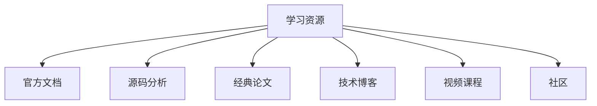
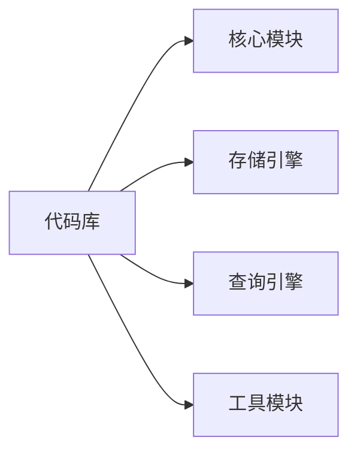

# 学习资源

## 学习目标
- 获取 sample_db 的最佳学习资源
- 建立系统化的学习路径

## 核心资源

## 官方文档

| 资源 | 链接 | 说明 |
|------|------|------|
| 官方文档 | [链接] | 完整参考手册 |
| 快速入门 | [链接] | 入门指南 |
| 教程 | [链接] | 分步学习 |
| API 文档 | [链接] | 开发者接口 |

## 经典论文

- [论文 1]：[标题] — 核心设计论文
- [论文 2]：[标题] — 优化技术
- [论文 3]：[标题] — 分布式实现

## 源码分析

## 推荐书籍

| 书名 | 作者 | 说明 |
|------|------|------|
| [书名 1] | [作者] | 数据库基础 |
| [书名 2] | [作者] | 源码分析 |
| [书名 3] | [作者] | 性能调优 |

## 要点总结

- 官方文档是首要参考资源
- 源码分析和论文阅读有助于深入理解

## 思考题

1. 哪些资源对理解数据库内核最有帮助？
2. 如何建立自己的学习路径？