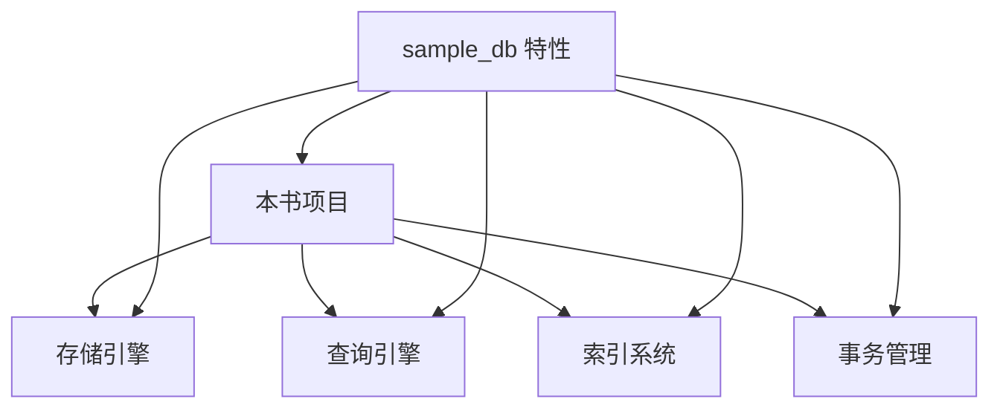
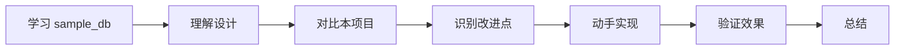

# 项目关联

## 学习目标
- 理解 sample_db 与本书项目的关系
- 掌握如何将所学应用到项目中

## 核心概念

- **对标分析**：对比本项目与 sample_db 的架构差异
- **可借鉴点**：学习中可复用的设计思路
- **待改进点**：项目中可参考改进的方向

## 与本项目的关联

## 可借鉴的设计

| sample_db 特性 | 本项目对应 | 改进方向 |
|----------------|------------|----------|
| Buffer Pool | 缓存实现 | 改进淘汰算法 |
| WAL 日志 | 日志系统 | 增加检查点 |
| MVCC | 并发控制 | 完善版本链 |
| 优化器 | 查询引擎 | 引入代价模型 |

## 学习与实践路径

## 预期收获

- 对数据库架构有更体系化的理解
- 能够将行业最佳实践应用到本项目
- 提升系统设计和性能优化能力

## 要点总结

- 学习成熟产品是提升项目质量的有效途径
- 理论与实践结合，边学边改

## 思考题

1. 本项目中最值得优先改进的模块是什么？
2. 如何评估改进效果？