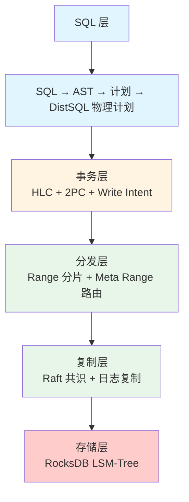
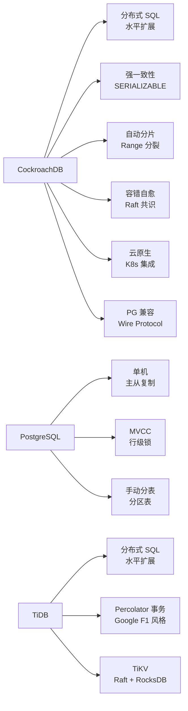

# CockroachDB 项目概览

## 学习目标

- 了解 CockroachDB 的项目定位、历史脉络与社区生态
- 掌握 CockroachDB 作为分布式关系型数据库的核心设计理念
- 建立对 CockroachDB 五层架构的整体认知框架

## 项目定位

> CockroachDB 是一个开源的分布式 SQL 数据库，专为云原生应用设计。它结合了 NoSQL 的横向扩展能力与 SQL 的事务一致性。

**基本信息**：

- 开发方：Cockroach Labs（由前 Google 工程师 Spencer Kimball、Peter Mattis 和 Ben Darnell 于 2015 年创立）
- 首次发布：2017 年（v1.0）
- 开源协议：BSL（Business Source License，后改为 BSL + Cockroach Community License）
- 最新版本：v25.x（截至 2026 年）
- GitHub Stars：约 30k（[cockroachdb/cockroach](https://github.com/cockroachdb/cockroach)）
- 官方网站：[https://www.cockroachlabs.com](https://www.cockroachlabs.com)

## 核心设计理念

CockroachDB 的设计哲学可以概括为五点：**分布式 SQL**、**强一致性**、**自动分片**、**容错自愈**、**云原生**。

第一，**分布式 SQL**。CockroachDB 是"分布式 SQL"数据库，不是单机数据库。数据自动分片分布在多个节点上，查询可以跨节点并行执行。它兼容 PostgreSQL Wire Protocol 和 SQL 方言，让用户可以用标准 SQL 操作分布式数据。

第二，**强一致性**。CockroachDB 提供完整的事务 ACID 保证，默认隔离级别是 SERIALIZABLE。这是通过混合逻辑时钟（HLC）+ 两阶段提交（2PC）+ 写冲突检测（Write Intent）实现的，而非传统的锁机制。

第三，**自动分片与再平衡**。数据自动按主键范围分片为 Range（约 512MB），节点增减时自动再平衡。Range 分片对应用透明，无需手动管理。

第四，**容错自愈**。每个 Range 有 3 或 5 个副本，通过 Raft 共识协议保证一致性。节点故障时，Raft 自动选举新 Leader，缺失副本自动补全。

第五，**云原生**。多可用区部署、跨区域复制、自动故障转移，适合 Kubernetes 编排。

## 五层架构

### 1. SQL 层

- 接收客户端 SQL 请求
- 解析为 AST，绑定，生成逻辑计划
- 优化器生成分布式物理计划（DistSQL）
- 兼容 PostgreSQL Wire Protocol

### 2. 事务层

- 混合逻辑时钟（HLC）提供全局时间戳
- 两阶段提交（2PC）协调跨节点事务
- Write Intent 实现写冲突检测（无锁 MVCC）

### 3. 分发层

- 数据按主键范围分片为 Range（约 512MB）
- 两层 Meta Range 路由（Meta1 → Meta2 → 目标 Range）
- Range 超过阈值自动分裂

### 4. 复制层

- 每个 Range 是一个 Raft 组
- 默认 3 副本，Leader 处理读写，Follower 被动复制
- Raft 日志保证状态机一致性

### 5. 存储层

- 基于 RocksDB（LSM-Tree 结构）
- 每个节点本地存储该节点负责的 Range 数据
- Block Cache 和 MemTable 实现内存缓存

## 核心优势与差异化特性

## 适用场景

| 场景 | 是否推荐 | 说明 |
|------|---------|------|
| 多区域分布式应用 | 推荐 | 跨数据中心部署，低延迟多区域读写 |
| SaaS 多租户系统 | 推荐 | 自动分片，无需手动管理分库分表 |
| 高可用关键业务 | 推荐 | Raft 共识，自动故障转移 |
| 水平扩展 OLTP | 推荐 | 自动 Range 分裂，节点增减透明 |
| 单机小应用 | 不推荐 | 功能过剩，SQLite/DuckDB 更轻量 |
| 实时分析查询 | 有限 | 主要为 OLTP 优化，分析查询性能一般 |
| 强一致缓存 | 不推荐 | 分布式事务开销大，Redis 更适合 |

## 要点总结

- CockroachDB 是分布式 SQL 数据库，不是单机数据库
- 五层架构：SQL → 事务 → 分发 → 复制 → 存储
- 自动 Range 分片（约 512MB），节点增减自动再平衡
- Raft 共识协议保证数据一致性，3 或 5 副本
- 兼容 PostgreSQL Wire Protocol，低迁移成本
- 适合多区域部署、高可用 OLTP、水平扩展场景

## 思考题

1. CockroachDB 的分布式 SQL 架构与 TiDB 相比有何异同？两者都基于 Raft 和 RocksDB，但在事务模型上有何差异？
2. CockroachDB 的自动 Range 分片与手动分库分表（如 ShardingSphere）相比，对应用开发有何影响？
3. CockroachDB 的分布式事务开销相比单机 PostgreSQL 有多大？在什么场景下这个开销可以接受？
4. CockroachDB 的 BSL 许可证与 PostgreSQL 的宽松许可证相比，对商业使用有何限制？