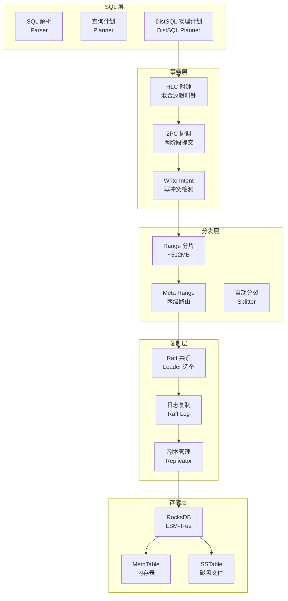
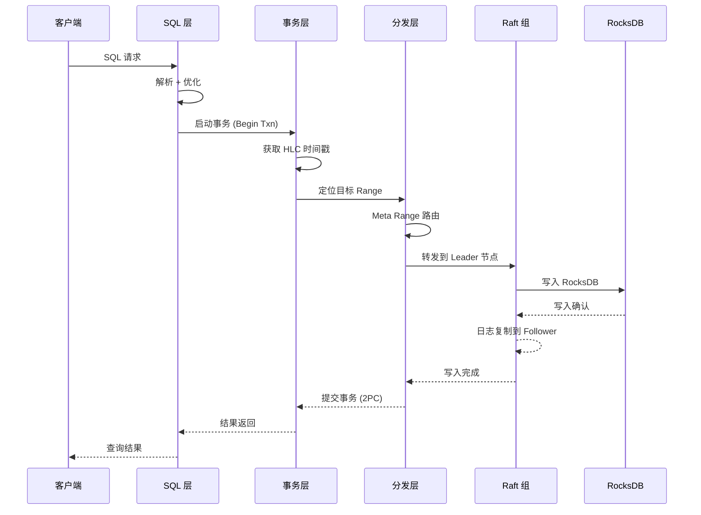

# CockroachDB 架构总览

## 学习目标

- 掌握 CockroachDB 的五层架构设计及其交互方式
- 理解分布式 SQL 数据库与单机数据库在架构上的根本差异
- 对比 CockroachDB 与 PostgreSQL/TiDB 的架构设计

## 五层架构

CockroachDB 的架构分为五层，从用户 SQL 到磁盘存储，每一层解决分布式数据库的一个核心问题。



### 1. SQL 层

**职责**：接收 SQL 请求，生成分布式执行计划。

- **SQL 解析**：将 SQL 文本解析为 AST（抽象语法树）
- **查询计划**：生成逻辑查询计划，应用优化规则
- **DistSQL 计划**：将逻辑计划分解为跨节点执行的物理计划

```
SQL 输入: SELECT * FROM users WHERE age > 30;

SQL 层输出:
  - 逻辑计划: TableScan(users) → Filter(age > 30) → Projection(*)
  - DistSQL 物理计划: 跨 3 个节点的并行 Scan
```

### 2. 事务层

**职责**：提供分布式事务的 ACID 保证。

- **HLC 时钟**：混合逻辑时钟，提供全局一致的 timestamp
- **2PC 协调**：两阶段提交，协调跨节点事务的原子提交
- **Write Intent**：写冲突检测机制，替代传统行级锁

### 3. 分发层

**职责**：数据分片和路由。

- **Range 分片**：数据按主键范围分片，每个约 512MB
- **Meta Range 路由**：两级元数据路由（Meta1 → Meta2 → Range）
- **自动分裂**：Range 超过阈值（默认 512MB）自动分裂

### 4. 复制层

**职责**：数据副本的一致性和高可用。

- **Raft 共识**：每个 Range 是一个 Raft 组，3 或 5 副本
- **Leader 选举**：Raft Leader 处理读写，Follower 被动复制
- **日志复制**：Raft 日志确保所有副本状态一致

### 5. 存储层

**职责**：本地持久化存储。

- **RocksDB**：Facebook 开源的 LSM-Tree 存储引擎
- **MemTable**：内存中的写缓冲区
- **SSTable**：磁盘上的有序数据文件

## 请求处理流程



## 分布式 SQL 架构

### 与单机数据库的架构对比

| 维度 | CockroachDB | PostgreSQL | DuckDB |
|------|------------|------------|--------|
| 部署模型 | 分布式多节点 | 单机主从 | 嵌入式单机 |
| SQL 层 | PG 兼容语法 | 原生 SQL | SQL 标准 |
| 存储引擎 | RocksDB (LSM) | 堆表 + BTree | 列式存储 |
| 事务模型 | 分布式 2PC + HLC | MVCC + 行锁 | Append-Only MVCC |
| 分片机制 | 自动 Range 分裂 | 手动分区表 | 无 |
| 一致性协议 | Raft 共识 | 流复制 | 无 |
| 扩展方式 | 水平扩展（加节点） | 垂直扩展（加硬件） | 单机限制 |

### 与 TiDB 的架构对比

| 维度 | CockroachDB | TiDB |
|------|------------|------|
| SQL 层 | PG 兼容 | MySQL 兼容 |
| 事务模型 | HLC + 2PC + Write Intent | Percolator + PD 时钟 |
| 共识协议 | Raft（每个 Range 独立 Raft 组） | Raft（TiKV 每个 Region 独立 Raft 组） |
| 存储引擎 | RocksDB（单 RocksDB 实例） | RocksDB（每个 TiKV 实例一个 RocksDB） |
| 分片粒度 | ~512MB | ~96MB |
| 许可证 | BSL | Apache 2.0 |

## 要点总结

- CockroachDB 的五层架构分别解决分布式数据库的一个核心问题：SQL 解析、事务一致性、数据分片、副本复制、本地存储
- 最大的架构差异是分布式 SQL 执行引擎（DistSQL），将查询计划分解到多个节点并行执行
- 每个 Range 是一个独立的 Raft 组，这带来了弹性扩展和高可用，但也增加了协调开销
- 底层 RocksDB 提供高效的 LSM-Tree 存储，但写放大（Write Amplification）是主要性能瓶颈
- 架构复杂度远高于单机数据库，但在分布式场景下提供了无与伦比的弹性

## 思考题

1. CockroachDB 的架构中，SQL 层和存储层之间隔了事务层、分发层、复制层三层，这会带来多大的延迟开销？相比单机 PostgreSQL 的延迟差距有多大？
2. 每个 Range 独立 Raft 组的架构设计（Multi-Raft）相比单 Raft 组的架构，在可扩展性和一致性之间如何权衡？
3. CockroachDB 的 DistSQL 执行计划与 Apache Spark 的物理计划有何异同？两者都是分布式执行，但设计目标有何不同？
4. 如果 RocksDB 的写放大问题在 CockroachDB 中被放大（因为 Raft 日志写入 + 状态机写入），CockroachDB 如何缓解这个问题？