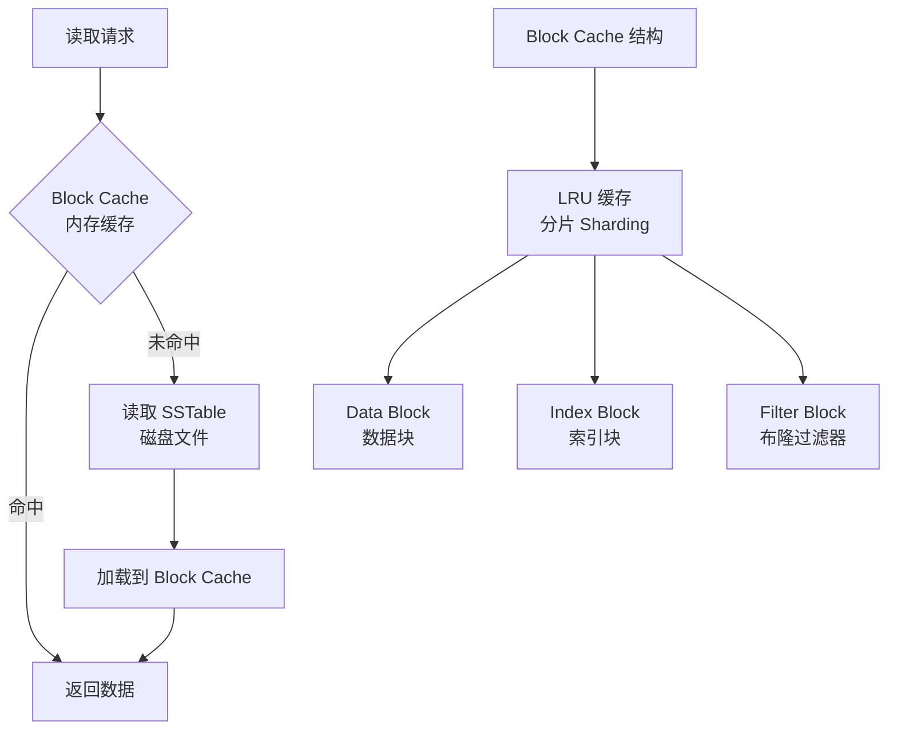
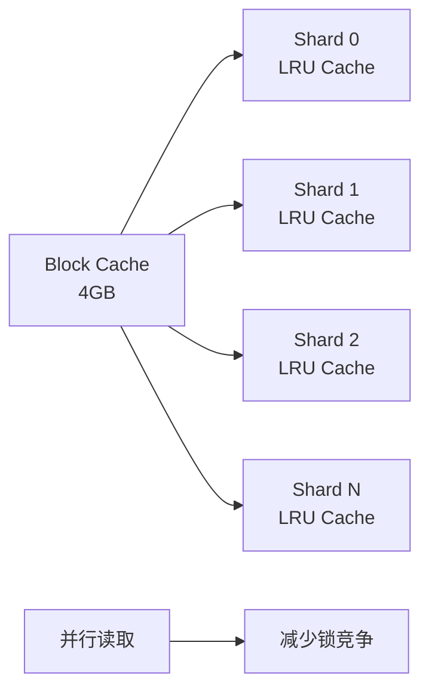
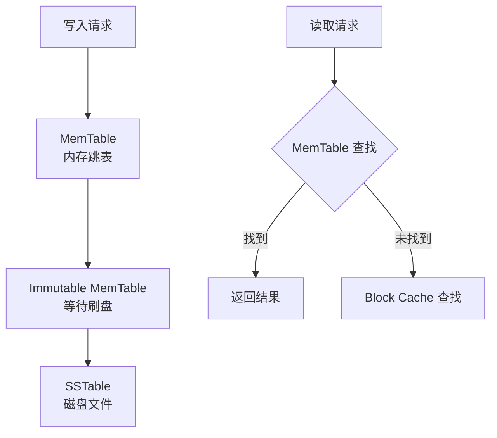

# CockroachDB Buffer Pool

## 学习目标

- 掌握 CockroachDB 的 Buffer Pool 设计：RocksDB Block Cache
- 理解 RocksDB LSM-Tree 的缓存机制与 PostgreSQL Buffer Pool 的差异
- 对比 Block Cache 与 PostgreSQL 的 Shared Buffers

## RocksDB Block Cache

CockroachDB 不实现独立的 Buffer Pool，而是依赖 RocksDB 的 Block Cache。

### Block Cache 架构



### Block Cache 配置

CockroachDB 通过启动参数配置 Block Cache 大小：

```bash
cockroach start --cache=4GB  # Block Cache 总大小
```

**配置建议**：

- **总内存的 25%**：推荐将 Block Cache 设置为系统总内存的 25%
- **最小 256MB**：确保缓存足够大，避免频繁磁盘读取
- **最大 80%**：避免占用过多内存，影响其他组件

### Block Cache 实现

RocksDB 的 Block Cache 使用 LRU（Least Recently Used）策略：

```c
// RocksDB Block Cache 伪代码
typedef struct block_cache_t {
    lru_cache_t *cache;          // LRU 缓存
    size_t capacity;             // 缓存容量
    size_t num_shards;           // 分片数（减少锁竞争）
} block_cache_t;

// 查找 Block
block_t *block_cache_lookup(block_cache_t *cache, block_id_t block_id) {
    // 1. 计算 shard（分片）
    shard_id_t shard_id = hash(block_id) % cache->num_shards;

    // 2. 在 shard 中查找
    block_t *block = lru_cache_get(cache->shards[shard_id], block_id);

    if (block) {
        return block;  // 命中
    }

    // 3. 未命中，从磁盘加载
    block = read_block_from_sstable(block_id);

    // 4. 插入缓存
    lru_cache_insert(cache->shards[shard_id], block_id, block);

    return block;
}
```

### Block Cache 分片

为了减少锁竞争，RocksDB 将 Block Cache 分片：



**分片数**：默认 64 个分片，每个分片独立 LRU 列表和锁。

## 与 PostgreSQL Buffer Pool 的对比

| 维度 | CockroachDB (RocksDB Block Cache) | PostgreSQL (Shared Buffers) |
|------|-----------------------------------|----------------------------|
| 缓存粒度 | Block（4KB-64KB） | Page（8KB） |
| 缓存对象 | SSTable Block | 堆表页面 + 索引页面 |
| 置换策略 | LRU | Clock-Sweep |
| 锁机制 | 分片锁（Shard Lock） | Buffer 描述符锁 |
| 预读 | SSTable 顺序读取 | 顺序扫描预读 |
| 脏页刷盘 | SSTable Compaction | BgWriter + Checkpoint |

### Block Cache 的优势

1. **LSM-Tree 友好**：SSTable 是只读的，缓存失效简单
2. **分片锁**：并行读取性能好
3. **压缩支持**：Block 可以压缩存储

### Block Cache 的劣势

1. **缓存粒度不灵活**：Block 大小固定，无法按需调整
2. **无脏页管理**：LSM-Tree 的写入在 MemTable，不在 Block Cache
3. **无预读优化**：依赖 RocksDB 的 SSTable 预读

## MemTable（写缓冲区）

除了 Block Cache（读缓存），RocksDB 还有 MemTable（写缓冲区）：



### MemTable 配置

```bash
cockroach start --store=path=/data,size=100GB
```

**配置建议**：

- **MemTable 大小**：默认 64MB，可通过 `--store` 调整
- **MemTable 数量**：默认 2 个（1 个 Active + 1 个 Immutable）

## 要点总结

- CockroachDB 不实现独立的 Buffer Pool，依赖 RocksDB Block Cache
- Block Cache 是 LRU 缓存，分片设计减少锁竞争
- Block Cache 只缓存 SSTable Block，MemTable 是写缓冲区
- 相比 PostgreSQL Buffer Pool，Block Cache 更简单但功能有限
- Block Cache 缓存粒度固定，无脏页管理，依赖 LSM-Tree 的 Compaction

## 思考题

1. RocksDB Block Cache 的 LRU 策略与 PostgreSQL 的 Clock-Sweep 相比，在缓存命中率上有何差异？
2. Block Cache 的分片设计（Sharding）如何影响并行读取的性能？分片数如何选择？
3. MemTable 和 Block Cache 的分工如何影响读写性能？如果 MemTable 太小会有什么问题？
4. CockroachDB 的 Block Cache 配置（总内存 25%）与 PostgreSQL 的 Shared Buffers（总内存 25%）相比，哪个更高效？