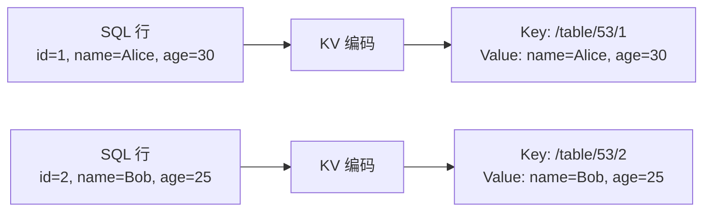
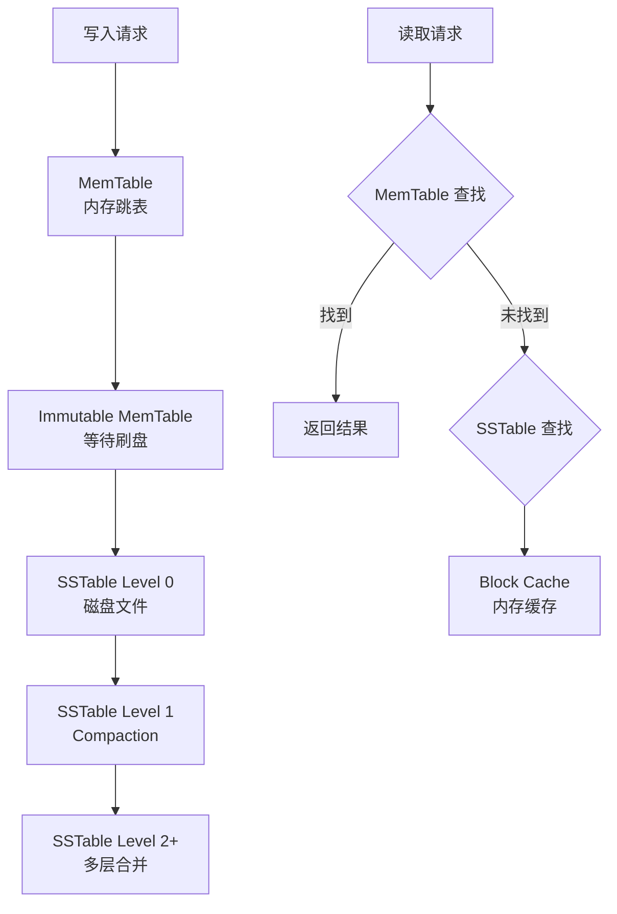
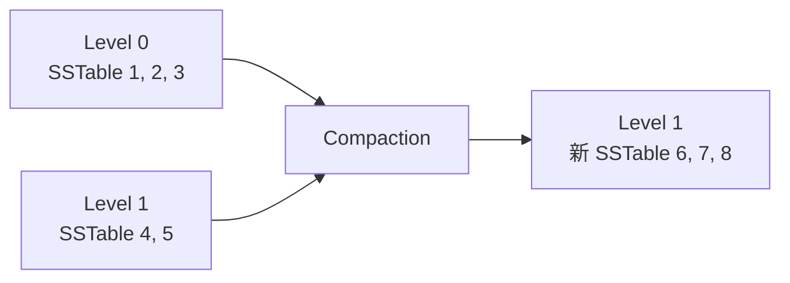
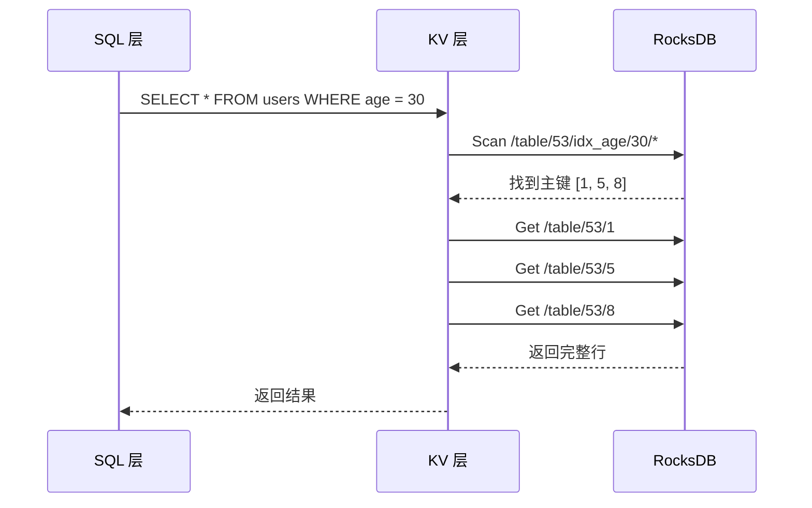

# CockroachDB 堆表存储

## 学习目标

- 掌握 CockroachDB 的表存储方式：RocksDB KV 存储引擎
- 理解 SQL 表到 KV 映射的编码方案
- 对比 CockroachDB 的 KV 存储与 PostgreSQL 的堆表存储

## SQL 表到 KV 映射

CockroachDB 将 SQL 表映射为 KV 对，存储在 RocksDB 中。

### 表结构示例

```sql
CREATE TABLE users (
    id INT PRIMARY KEY,
    name VARCHAR(100),
    age INT
);
```

### KV 编码方案



**KV 编码规则**：

- **Key**：`/table/<table_id>/<primary_key>`
- **Value**：非主键列的值（序列化）

### 复合主键编码

```sql
CREATE TABLE orders (
    user_id INT,
    order_id INT,
    amount DECIMAL,
    PRIMARY KEY (user_id, order_id)
);
```

**KV 编码**：

- Key：`/table/54/<user_id>/<order_id>`
- Value：`amount`

**示例**：

```
Key: /table/54/1/100
Value: amount=99.99

Key: /table/54/1/101
Value: amount=149.99

Key: /table/54/2/200
Value: amount=199.99
```

### KV 存储的优势

1. **统一存储**：所有表使用统一的 KV 接口
2. **自动排序**：KV 按主键排序，支持范围查询
3. **分布式友好**：KV 容易分片和复制

### KV 存储的劣势

1. **编码开销**：SQL → KV 转换需要序列化/反序列化
2. **无列式存储**：所有列打包在一个 Value，无法列式压缩
3. **更新开销**：更新单列需要读取整个 Value

## RocksDB 存储引擎

RocksDB 是 LSM-Tree（Log-Structured Merge-Tree）存储引擎：



### LSM-Tree 结构

RocksDB 使用多层 LSM-Tree：

- **MemTable**：内存写缓冲区（SkipList）
- **Immutable MemTable**：等待刷盘的 MemTable
- **SSTable Level 0**：直接从 MemTable 刷盘，可能有重叠
- **SSTable Level 1+**：Compaction 合并后的有序文件，无重叠

### SSTable 文件结构

```
SSTable 文件结构：
┌─────────────────────────────────┐
│ Data Block 1                    │
├─────────────────────────────────┤
│ Data Block 2                    │
├─────────────────────────────────┤
│ ...                             │
├─────────────────────────────────┤
│ Data Block N                    │
├─────────────────────────────────┤
│ Meta Block（Filter、Index）     │
├─────────────────────────────────┤
│ Index Block                     │
├─────────────────────────────────┤
│ Footer                          │
└─────────────────────────────────┘
```

### Compaction（压缩合并）

LSM-Tree 通过 Compaction 合并多层 SSTable：



**Compaction 策略**：

- **Leveled Compaction**：Level 0 → Level 1 → Level 2（默认）
- **Tiered Compaction**：多层合并，适合写入密集场景

## 与 PostgreSQL 堆表的对比

| 维度 | CockroachDB (RocksDB KV) | PostgreSQL (堆表) |
|------|--------------------------|------------------|
| 存储模型 | KV 对（Key-Value） | 堆表（Tuple） |
| 主键存储 | Key 编码 | BTree 索引 + 堆表 |
| 更新操作 | 写入新版本（LSM-Tree） | 原地更新（MVCC） |
| 删除操作 | Tombstone 标记 | 标记删除（VACUUM） |
| 事务版本 | MVCC Value 编码 | Heap Tuple Header |
| 压缩 | SSTable 压缩（Snappy/Zstd） | TOAST 大字段压缩 |
| 空间回收 | Compaction 自动回收 | VACUUM 手动回收 |

### RocksDB KV 的优势

1. **写入性能**：LSM-Tree 的顺序写入，适合高并发写入
2. **压缩效率**：SSTable 压缩率高，节省存储空间
3. **分布式友好**：KV 容易分片和复制

### PostgreSQL 堆表的优势

1. **读取性能**：堆表原地读取，无 LSM-Tree 的多层查找
2. **更新性能**：原地更新，无 Compaction 开销
3. **事务效率**：MVCC 在 Tuple Header 中，无需编码

## Secondary Index（二级索引）

CockroachDB 的二级索引也是 KV 对：

```sql
CREATE INDEX idx_age ON users (age);
```

**KV 编码**：

- Key：`/table/53/idx_age/<age>/<primary_key>`
- Value：`NULL`（覆盖索引存储主键）

**示例**：

```
Key: /table/53/idx_age/25/2
Value: NULL

Key: /table/53/idx_age/30/1
Value: NULL
```

**索引查找流程**：



## 要点总结

- CockroachDB 将 SQL 表编码为 KV 对，存储在 RocksDB LSM-Tree
- KV Key 编码：`/table/<table_id>/<primary_key>`
- LSM-Tree 结构：MemTable → Immutable MemTable → SSTable Level 0/1/2+
- Compaction 自动合并 SSTable，回收删除数据的空间
- 相比 PostgreSQL 堆表，写入性能更好但读取性能略差
- 二级索引也是 KV 对，索引查找需要二次读取（Index Scan + Table Lookup）

## 思考题

1. CockroachDB 的 KV 编码方案相比 PostgreSQL 的堆表存储，在主键查询和范围查询上的性能差异如何？
2. LSM-Tree 的 Compaction 过程会占用大量 CPU 和磁盘 I/O，如何避免 Compaction 对在线业务的影响？
3. 如果一个表有 10 个二级索引，更新一行数据需要写入多少个 KV 对？相比 PostgreSQL 的 BTree 索引更新有何差异？
4. CockroachDB 的 KV 存储如何实现 MVCC？Value 中如何存储事务版本信息？