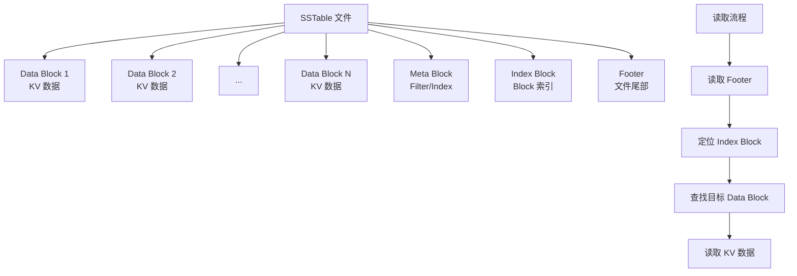
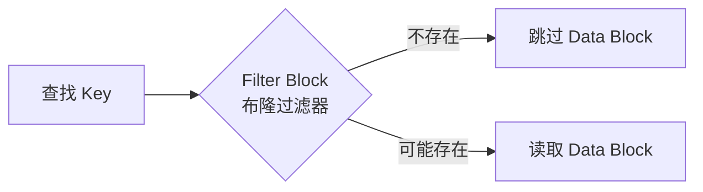
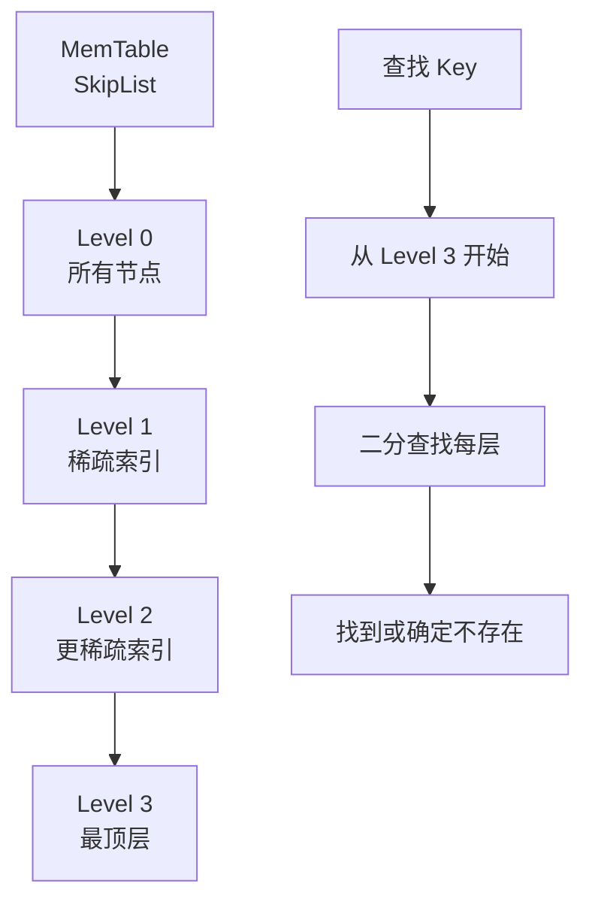
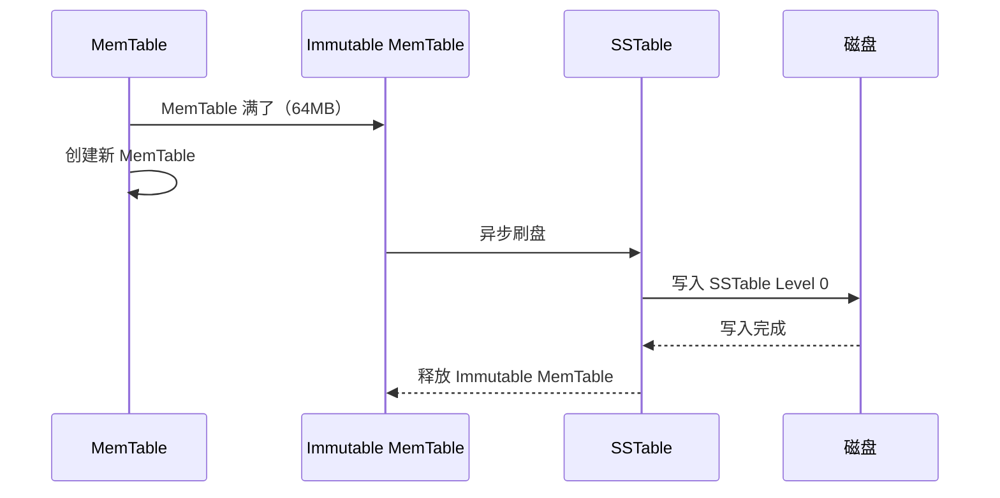
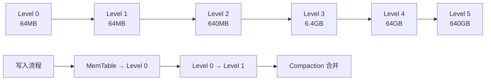
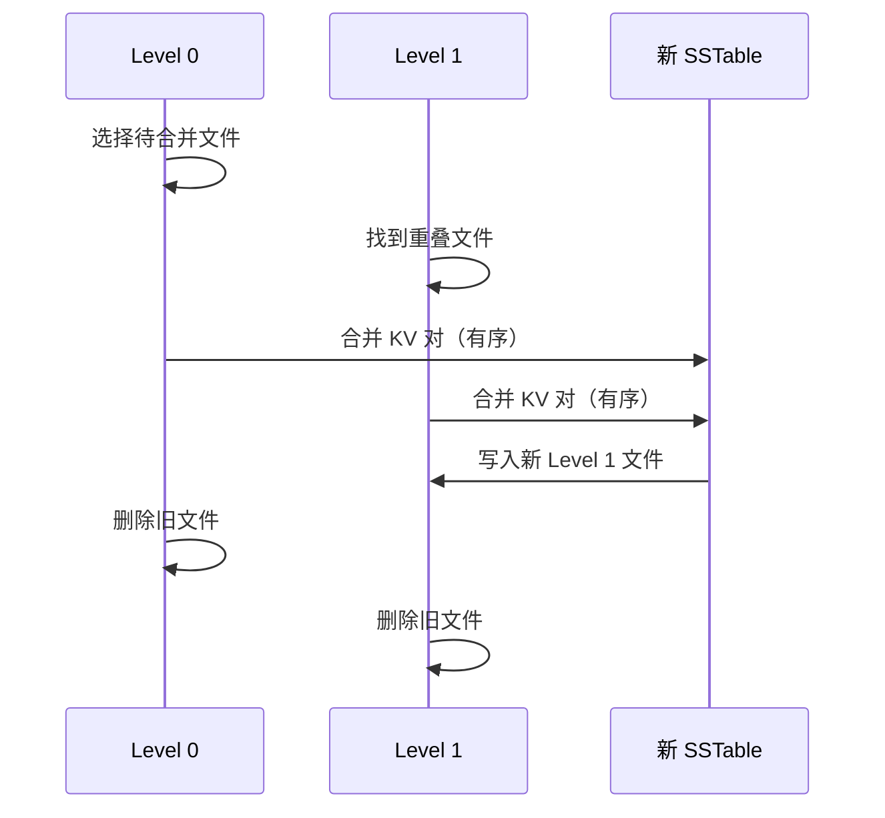

# CockroachDB 页面布局

## 学习目标

- 掌握 RocksDB 的 SSTable 文件结构和 Block 布局
- 理解 MemTable 和 SSTable 的写入和读取流程
- 对比 RocksDB 的 SSTable 与 PostgreSQL 的页面结构

## SSTable 文件结构

SSTable（Sorted String Table）是 RocksDB 的磁盘文件格式。

### SSTable 整体结构



### Data Block 结构

每个 Data Block 包含多个 KV 对：

```
Data Block 结构：
┌────────────────────────────────────┐
│ Record 1 (Key1, Value1)           │
├────────────────────────────────────┤
│ Record 2 (Key2, Value2)           │
├────────────────────────────────────┤
│ ...                                │
├────────────────────────────────────┤
│ Record N (KeyN, ValueN)           │
├────────────────────────────────────┤
│ Restart Points（重启点）           │
├────────────────────────────────────┤
│ Trailer                            │
└────────────────────────────────────┘
```

**Restart Points（重启点）**：

- 每 16 个 Record 设置一个重启点，用于前缀压缩
- 重启点存储完整 Key，非重启点存储 Key 前缀差

### Index Block 结构

Index Block 存储每个 Data Block 的元数据：

```
Index Block 结构：
┌────────────────────────────────────┐
│ (Block 1 最大 Key, Block 1 偏移)  │
├────────────────────────────────────┤
│ (Block 2 最大 Key, Block 2 偏移)  │
├────────────────────────────────────┤
│ ...                                │
├────────────────────────────────────┤
│ (Block N 最大 Key, Block N 偏移)  │
└────────────────────────────────────┘
```

**查找流程**：

1. 二分查找 Index Block，定位目标 Data Block
2. 读取目标 Data Block 到 Block Cache
3. 在 Data Block 内二分查找 KV 对

### Filter Block（布隆过滤器）

Filter Block 存储每个 Data Block 的布隆过滤器：



**布隆过滤器优势**：

- 减少磁盘读取次数（Filter Block 在内存）
- 快速判断 Key 是否不存在

## MemTable 结构

MemTable 是内存中的写缓冲区，使用 SkipList（跳表）：



**SkipList 优势**：

- O(log N) 查找复杂度
- O(log N) 插入复杂度
- 无锁并发读取（CAS 原子操作）

### MemTable 刷盘流程



**刷盘触发条件**：

- MemTable 大小达到阈值（默认 64MB）
- 后台 Flush 线程定期检查

## LSM-Tree 多层结构

LSM-Tree 使用多层结构，每层大小指数增长：



**层级大小倍数**：

- Level 0 → Level 1：1 倍（大小相同）
- Level 1 → Level 2：10 倍
- Level 2 → Level 3：10 倍

### Compaction 合并流程



**Compaction 策略**：

- **Leveled Compaction**：Level 0 → Level 1，有序合并
- **Tiered Compaction**：多层合并，减少写放大

## 与 PostgreSQL 页面的对比

| 维度 | RocksDB (SSTable) | PostgreSQL (Heap Page) |
|------|-------------------|----------------------|
| 文件大小 | 动态（64MB - 256MB） | 固定 8KB |
| 页面内容 | KV 对 + 前缀压缩 | Tuple + ItemPointer |
| 索引方式 | Index Block + 布隆过滤器 | BTree 索引 |
| 更新方式 | 写入新 SSTable | 原地更新 |
| 空间回收 | Compaction 合并 | VACUUM 清理 |
| 读取性能 | 多层查找（L0/L1/L2） | 单次堆表读取 |

### SSTable 的优势

1. **写入性能**：顺序写入，适合高并发写入
2. **压缩效率**：前缀压缩 + Block 压缩
3. **布隆过滤器**：快速判断 Key 不存在

### PostgreSQL 页面的优势

1. **读取性能**：单次页面读取，无多层查找
2. **原地更新**：更新无需写入新文件
3. **固定大小**：8KB 页面管理简单

## 要点总结

- SSTable 是 RocksDB 的磁盘文件，包含 Data Block、Index Block、Filter Block、Footer
- Data Block 存储 KV 对，使用前缀压缩和重启点优化
- MemTable 是内存 SkipList，写满后刷盘为 SSTable Level 0
- LSM-Tree 多层结构（Level 0/1/2/3/4/5），每层大小指数增长
- Compaction 合并多层 SSTable，回收删除数据的空间
- 相比 PostgreSQL 固定 8KB 页面，SSTable 更适合写入密集场景

## 思考题

1. RocksDB 的 SSTable 前缀压缩如何影响范围查询的性能？前缀压缩率如何选择？
2. MemTable 的 SkipList 结构相比 BTree 有何优势和劣势？为什么 RocksDB 选择 SkipList？
3. LSM-Tree 的多层结构（Level 0/1/2/3/4/5）如何平衡写入放大和读取性能？
4. Compaction 过程中的磁盘 I/O 峰值如何影响在线业务？如何通过配置缓解？