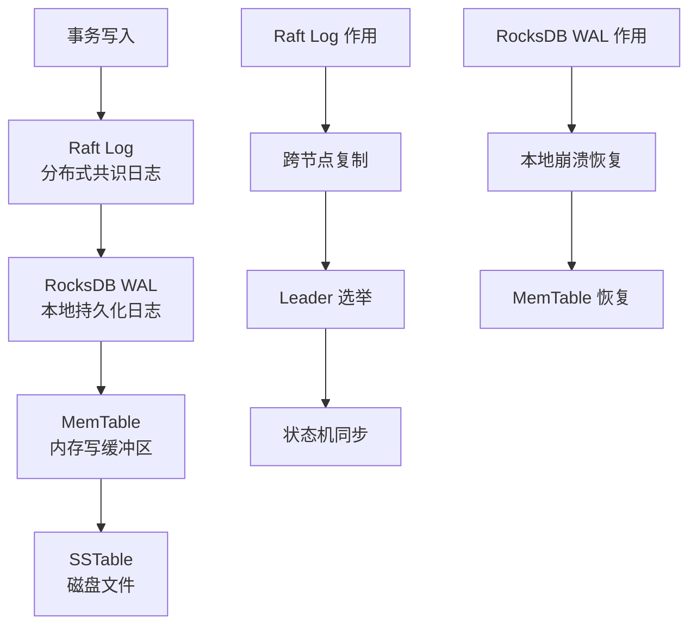
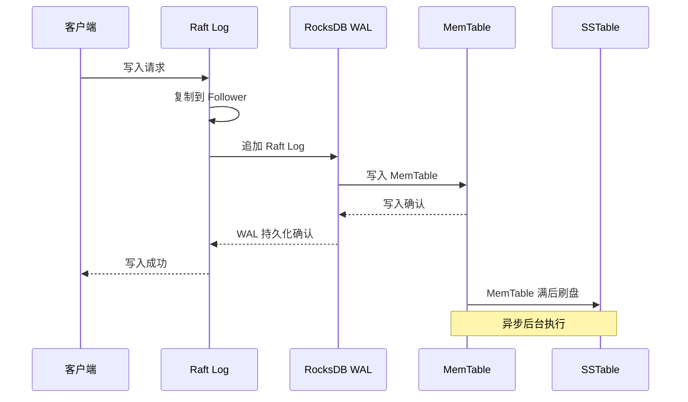
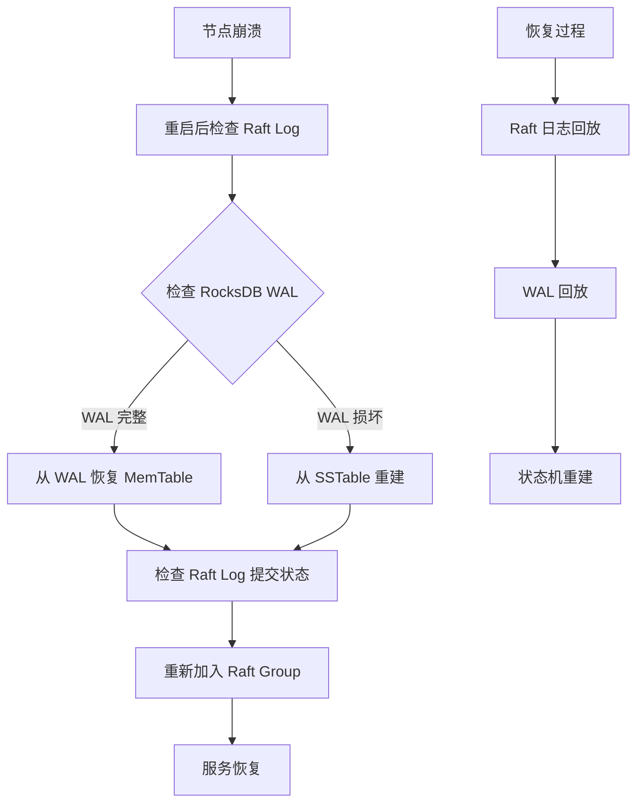
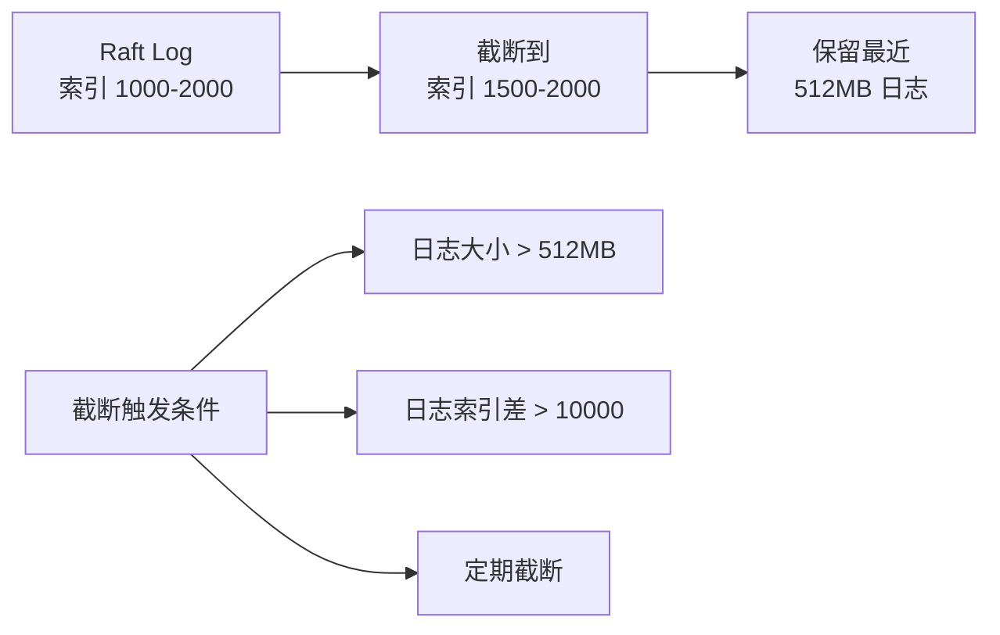

# CockroachDB WAL 日志

## 学习目标

- 掌握 CockroachDB 的 WAL 日志结构：Raft Log + RocksDB WAL
- 理解 Raft 日志复制和 RocksDB WAL 的双层日志机制
- 对比 CockroachDB 的双层 WAL 与 PostgreSQL 的单层 WAL

## 双层日志架构

CockroachDB 使用双层日志：



### 第一层：Raft Log

Raft Log 负责跨节点复制：

```
Raft Log Entry 结构：
┌────────────────────────────────────────────┐
│ Term: 3                                    │
├────────────────────────────────────────────┤
│ Index: 1024                                │
├────────────────────────────────────────────┤
│ Type: EntryNormal                          │
├────────────────────────────────────────────┤
│ Data: [RocksDB 写入操作的序列化数据]        │
└────────────────────────────────────────────┘
```

**Raft Log 字段**：

- **Term**：Leader 任期号
- **Index**：日志索引（单调递增）
- **Type**：日志类型（Normal/ConfChange/Snapshot）
- **Data**：RocksDB 写入操作

### 第二层：RocksDB WAL

RocksDB WAL 负责本地崩溃恢复：

```
RocksDB WAL Record 结构：
┌────────────────────────────────────────────┐
│ Sequence Number: 50000                     │
├────────────────────────────────────────────┤
│ WriteBatch:                                │
│   - Put /table/53/1 → "Alice,30"          │
│   - Put /table/53/2 → "Bob,25"            │
│   - Delete /table/53/3                    │
├────────────────────────────────────────────┤
│ CRC32 Checksum                             │
└────────────────────────────────────────────┘
```

**RocksDB WAL 字段**：

- **Sequence Number**：全局递增序号
- **WriteBatch**：批量写入操作（Put/Delete/Merge）
- **CRC32**：数据完整性校验

## 写入流程



### 写入确认

CockroachDB 的写入确认流程：

1. 客户端发送写入请求到 Raft Leader
2. Raft Leader 将日志追加到 Raft Log
3. Raft Leader 将日志复制到 Follower
4. Follower 写入 RocksDB WAL
5. Follower 确认日志复制完成
6. Raft Leader 确认写入成功

## 崩溃恢复



### Raft Log 恢复

1. 读取 Raft Log 的最后提交位置
2. 重新执行未提交的日志（Raft 保证幂等性）
3. 追赶 Follower 的日志进度

### RocksDB WAL 恢复

1. 读取 WAL 文件，获取最后一次 Checkpoint
2. 回放 WAL 中的 WriteBatch
3. 重建 MemTable

## 与 PostgreSQL WAL 的对比

| 维度 | CockroachDB | PostgreSQL |
|------|------------|------------|
| 日志层次 | Raft Log + RocksDB WAL（双层） | WAL（单层） |
| 日志内容 | KV 操作（Put/Delete） | 页面级修改（Page Image） |
| 复制方式 | Raft 共识复制 | 流复制（LSN 同步） |
| 恢复粒度 | 日志 + SSTable Compaction | WAL 重放 + Checkpoint |
| 日志大小 | Raft Log 定期截断 | WAL 循环使用 |

### CockroachDB WAL 的优势

1. **分布式一致性**：Raft Log 保证跨节点一致性
2. **写放大缓解**：RocksDB WAL 只记录 KV 操作，而非页面级修改
3. **自动截断**：Raft Log 定期截断，不会无限增长

### PostgreSQL WAL 的优势

1. **单层设计**：架构简单，恢复流程短
2. **页面级恢复**：崩溃恢复速度快
3. **复制效率高**：流复制延迟低

## 日志大小管理

### Raft Log 截断



### RocksDB WAL 管理

- **WAL 文件数**：默认 1 个（当前 WAL）
- **WAL 回收**：MemTable 刷盘后，WAL 自动清理
- **WAL 归档**：配置 `wal_ttl_seconds` 和 `wal_size_limit_mb`

## 要点总结

- CockroachDB 使用双层 WAL：Raft Log（分布式共识）+ RocksDB WAL（本地持久化）
- 写入流程：Raft Log 复制 → RocksDB WAL 持久化 → MemTable → SSTable
- 崩溃恢复：Raft Log 回放 + RocksDB WAL 回放
- Raft Log 负责跨节点一致性，RocksDB WAL 负责本地崩溃恢复
- Raft Log 定期截断，RocksDB WAL 在 MemTable 刷盘后清理

## 思考题

1. CockroachDB 的双层 WAL（Raft Log + RocksDB WAL）是否引入写放大？相比 PostgreSQL 的单层 WAL，写入开销高出多少？
2. 如果 Raft Log 和 RocksDB WAL 同时损坏，如何恢复数据？RocksDB SSTable 是否包含足够的信息？
3. CockroachDB 的 Raft Log 截断策略如何确保不会丢失未复制的日志？
4. 在单节点部署（无复制）场景下，CockroachDB 是否仍然使用 Raft Log？能否简化？