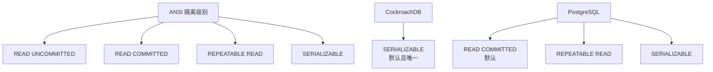
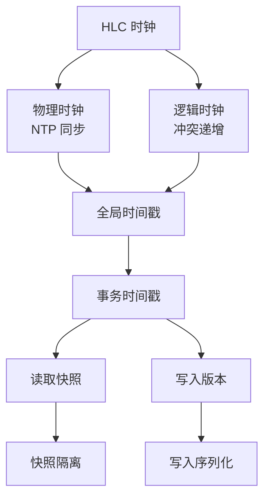
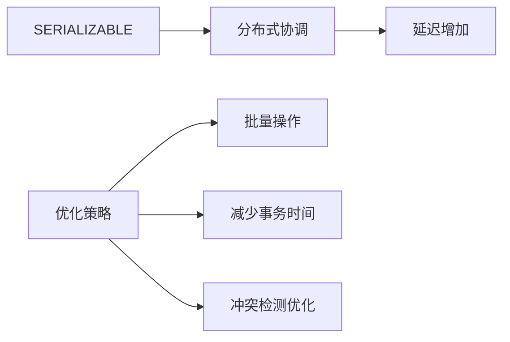

# CockroachDB 隔离级别

## 学习目标

- 掌握 CockroachDB 的隔离级别：SERIALIZABLE（默认）
- 理解 HLC 时钟如何保证 SERIALIZABLE 隔离
- 对比 CockroachDB 与 PostgreSQL 的隔离级别差异

## 隔离级别概述

CockroachDB 默认使用 SERIALIZABLE 隔离级别，这是最强的隔离级别。



### SERIALIZABLE 隔离级别

SERIALIZABLE 保证：

- **可序列化**：事务执行结果等同于某种串行执行顺序
- **无幻读**：同一事务的两次查询结果一致
- **无不可重复读**：同一事务的两次读取结果一致
- **无脏读**：不会读取到未提交的数据

## HLC 时钟与隔离级别

CockroachDB 通过 HLC（混合逻辑时钟）实现 SERIALIZABLE 隔离。



### HLC 时间戳分配

```
HLC 时间戳结构：
┌────────────────────────────────────┐
│ Physical Time: 2026-07-20 10:00:00 │
│ Logical Time: 000000001            │
└────────────────────────────────────┘

事务开始时获取 HLC 时间戳：
- Transaction 1: TS = 10:00:00.000001
- Transaction 2: TS = 10:00:00.000002
- Transaction 3: TS = 10:00:00.000003
```

**时间戳排序**：

- 物理时间递增
- 逻辑时间在同一物理时间下递增
- 时间戳全局唯一且单调递增

### 快照读取

```sql
-- 事务开始时获取快照时间戳
BEGIN;
-- TS = 10:00:00.000001

-- 读取数据：只读取 TS <= TS(事务) 的版本
SELECT * FROM users WHERE id = 1;
-- 只读取 TS <= 10:00:00.000001 的版本

-- 如果其他事务在 TS=10:00:00.000002 提交了新版本
-- 当前事务不会读取到（快照隔离）
COMMIT;
```

## 与 PostgreSQL 隔离级别的对比

| 维度 | CockroachDB | PostgreSQL |
|------|------------|------------|
| 默认隔离级别 | SERIALIZABLE | READ COMMITTED |
| 支持级别 | SERIALIZABLE | READ COMMITTED, REPEATABLE READ, SERIALIZABLE |
| 幻读防护 | 无幻读（快照） | REPEATABLE READ 以上无幻读 |
| 性能开销 | 分布式开销大 | 单机开销小 |
| 并发控制 | Write Intent + HLC | MVCC + 行锁 |

### READ COMMITTED（PostgreSQL 默认）

```
PostgreSQL READ COMMITTED：
┌─────────────────────────────────┐
│ 事务 1: BEGIN;
│ SELECT * FROM users; -- 看到版本 1
│
│ 事务 2: UPDATE users SET age=31 WHERE id=1;
│ COMMIT; -- 提交版本 2
│
│ 事务 1: SELECT * FROM users; -- 看到版本 2（幻读）
└─────────────────────────────────┘
```

### SERIALIZABLE（CockroachDB 默认）

```
CockroachDB SERIALIZABLE：
┌─────────────────────────────────┐
│ 事务 1: BEGIN;
│ TS = 10:00:00.000001
│ SELECT * FROM users; -- 看到版本 1
│
│ 事务 2: UPDATE users SET age=31 WHERE id=1;
│ TS = 10:00:00.000002
│ COMMIT;
│
│ 事务 1: SELECT * FROM users; -- 仍然看到版本 1（快照）
│ COMMIT;
└─────────────────────────────────┘
```

## 性能权衡

### SERIALIZABLE 的开销



**开销来源**：

- HLC 时钟同步：NTP 偏移检测
- Write Intent 冲突检测：跨节点检查
- 2PC 提交流程：两阶段提交延迟

### READ COMMITTED 的性能优势

PostgreSQL 的 READ COMMITTED 在单机场景下性能更好：

- 无快照开销：每次读取最新版本
- 无幻读保护：并发度高
- 行级锁：冲突处理快

## 实际应用

### CockroachDB 事务示例

```sql
-- 默认 SERIALIZABLE
BEGIN;
UPDATE accounts SET balance = balance - 100 WHERE id = 1;
UPDATE accounts SET balance = balance + 100 WHERE id = 2;
COMMIT;

-- 显式设置隔离级别（CockroachDB 仅支持 SERIALIZABLE）
BEGIN TRANSACTION ISOLATION LEVEL SERIALIZABLE;
-- 操作...
COMMIT;
```

### 冲突处理示例

```sql
-- 事务 1
BEGIN;
UPDATE accounts SET balance = balance - 100 WHERE id = 1;
-- 持有 Intent (id=1)

-- 事务 2（并发）
BEGIN;
UPDATE accounts SET balance = balance - 50 WHERE id = 1;
-- 检测到 Intent 冲突，等待事务 1 提交或回滚

-- 事务 1 提交
COMMIT;

-- 事务 2 继续执行（或回滚重试）
COMMIT;
```

## 要点总结

- CockroachDB 默认且唯一支持 SERIALIZABLE 隔离级别
- HLC 时钟提供全局一致的时间戳，保证 SERIALIZABLE
- 快照读取：只读取 TS <= 事务 TS 的版本
- 与 PostgreSQL 的 READ COMMITTED 相比，SERIALIZABLE 开销更大但隔离性更强
- 分布式场景下，SERIALIZABLE 是必要的，避免分布式异常

## 思考题

1. CockroachDB 为什么只支持 SERIALIZABLE 隔离级别？在分布式场景下，READ COMMITTED 会带来哪些问题？
2. HLC 时钟的 NTP 偏移（默认 500ms）如何影响事务延迟？如果 NTP 偏移过大，是否会导致事务拒绝服务？
3. CockroachDB 的 SERIALIZABLE 与 PostgreSQL 的 SERIALIZABLE 相比，在实现机制上有何差异？
4. 如果应用场景对隔离性要求不高（如日志写入），是否应该选择 CockroachDB？还是选择 PostgreSQL 的 READ COMMITTED？