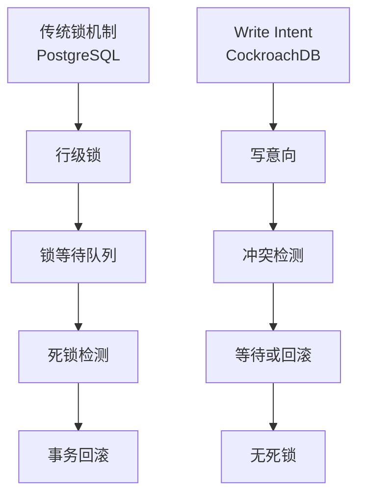
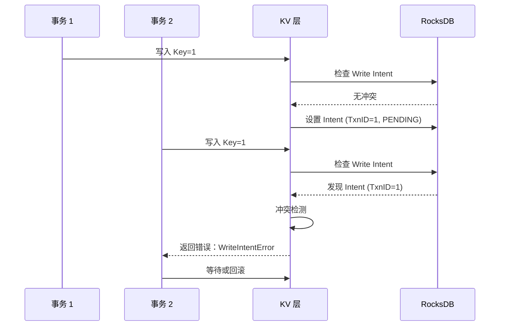
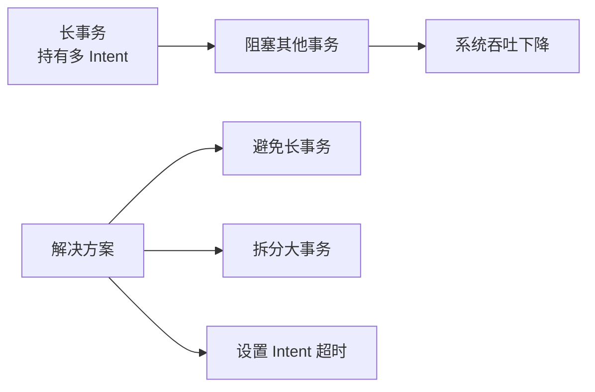

# CockroachDB 锁机制

## 学习目标

- 掌握 CockroachDB 的 Write Intent 冲突检测机制
- 理解 Write Intent 与传统行级锁的本质差异
- 对比 CockroachDB 的无锁设计与 PostgreSQL 的锁机制

## Write Intent vs 传统锁

CockroachDB 不使用传统意义上的锁，而是通过 Write Intent 实现冲突检测。



### 传统行级锁（PostgreSQL）

```
PostgreSQL 行锁流程：
┌─────────────────────────────────┐
│ 事务 1: UPDATE users SET age=31 WHERE id=1;
│   - 获取行锁 (id=1)
│   - 等待事务 2 释放锁
│   - 或死锁检测回滚
├─────────────────────────────────┤
│ 事务 2: UPDATE users SET age=32 WHERE id=1;
│   - 等待事务 1 释放锁
│   - 或死锁检测回滚
└─────────────────────────────────┘
```

### Write Intent（CockroachDB）

```
CockroachDB Write Intent 流程：
┌─────────────────────────────────┐
│ 事务 1: UPDATE users SET age=31 WHERE id=1;
│   - 设置 Write Intent (id=1, TxnID=1)
│   - Intent 状态: PENDING
├─────────────────────────────────┤
│ 事务 2: UPDATE users SET age=32 WHERE id=1;
│   - 检测到 Intent (TxnID=1)
│   - 等待事务 1 提交或回滚
│   - 或回滚事务 2
└─────────────────────────────────┘
```

## Write Intent 冲突检测

### 冲突检测流程



### 冲突解决策略

CockroachDB 提供多种冲突解决策略：

```go
// 冲突解决策略
type ConflictResolution struct {
    // 策略 1: 等待
    Wait          // 等待其他事务提交或回滚

    // 策略 2: 回滚
    AbortCurrent  // 回滚当前事务

    // 策略 3: 优先级抢占
    Push          // 高优先级事务强制 Abort 低优先级事务
}
```

**优先级规则**：

- 高优先级事务可以 Abort 低优先级事务
- 等待超时后自动回滚
- 用户可以显式设置事务优先级

## 无死锁设计

### 为什么 Write Intent 无死锁？

传统行级锁可能产生死锁：

```
死锁示例：
事务 1: 锁 A → 等待锁 B
事务 2: 锁 B → 等待锁 A
→ 死锁检测 → 回滚其中一个事务
```

Write Intent 不产生死锁：

```
Intent 示例：
事务 1: Intent A → Intent B（无锁等待）
事务 2: Intent B → 检测到 Intent A（等待事务 1）
→ 事务 2 等待事务 1 提交或回滚
→ 无死锁
```

**关键区别**：

- 传统锁：两阶段锁定（2PL），多个事务互相等待
- Write Intent：写入时立即检测冲突，不会形成循环等待

## 长事务问题

### Write Intent 的长事务陷阱



**Intent 超时配置**：

```sql
-- 设置事务超时（默认 30 秒）
SET TRANSACTION TIMEOUT = '60s';

-- 设置 Savepoint 保存点
BEGIN;
SAVEPOINT my_savepoint;
-- 执行部分操作
RELEASE SAVEPOINT my_savepoint;
COMMIT;
```

## 与 PostgreSQL 锁的对比

| 维度 | CockroachDB | PostgreSQL |
|------|------------|------------|
| 锁类型 | 无锁（Write Intent） | 行级锁 + 表级锁 |
| 死锁检测 | 无死锁 | 超时检测 + 回滚 |
| 冲突处理 | 等待或回滚 | 等待或回滚 |
| 分布式友好 | 是（无锁传播） | 否（锁传播困难） |
| 性能开销 | 冲突检测开销 | 锁管理开销 |
| 长事务影响 | 阻塞所有冲突事务 | 阻塞锁等待队列 |

### Write Intent 的优势

1. **无死锁**：避免复杂的死锁检测算法
2. **分布式友好**：无需跨节点锁传播
3. **实现简单**：利用 RocksDB 的原子操作

### PostgreSQL 行锁的优势

1. **精确控制**：行级锁粒度细
2. **并发度高**：无冲突时不阻塞
3. **锁升级**：行锁升级为表锁

## 实际应用

### 避免冲突的最佳实践

```sql
-- 1. 避免长事务
BEGIN;
UPDATE accounts SET balance = balance - 100 WHERE id = 1;
UPDATE accounts SET balance = balance + 100 WHERE id = 2;
COMMIT;  -- 快速提交

-- 2. 按一致顺序访问（减少冲突概率）
-- 所有事务按 id 升序访问
BEGIN;
UPDATE accounts SET balance = balance - 100 WHERE id = 1;
UPDATE accounts SET balance = balance + 100 WHERE id = 2;
COMMIT;

-- 3. 使用重试逻辑
BEGIN;
SAVEPOINT retry;
UPDATE accounts SET balance = balance - 100 WHERE id = 1;
-- 如果冲突，回到 retry 点重试
RELEASE SAVEPOINT retry;
COMMIT;
```

## 要点总结

- CockroachDB 不使用传统锁，而是通过 Write Intent 实现冲突检测
- Write Intent 写入时设置，读取时检测冲突，无锁等待队列
- 无死锁：不会形成循环等待，无需死锁检测
- 冲突解决：等待、回滚、优先级抢占
- 长事务问题：持有多 Intent 阻塞其他事务
- 最佳实践：避免长事务、按一致顺序访问、使用重试逻辑

## 思考题

1. Write Intent 的冲突检测在分布式场景下相比传统行级锁，是否真的无死锁？是否存在极端情况？
2. 如果一个长事务持有了大量 Intent，如何在不 Abort 该事务的情况下缓解阻塞问题？
3. CockroachDB 的无锁设计在高并发场景下（如秒杀活动）的性能如何？与传统数据库相比有何差异？
4. PostgreSQL 的行级锁如果要在分布式场景下实现，会遇到哪些困难？CockroachDB 的 Write Intent 如何解决这些问题？