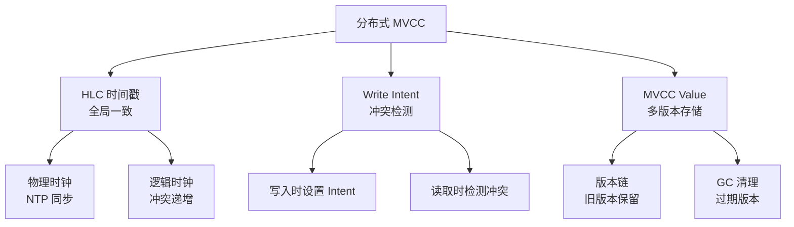
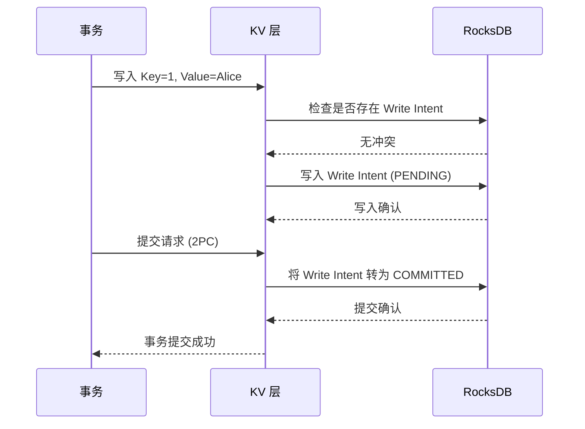
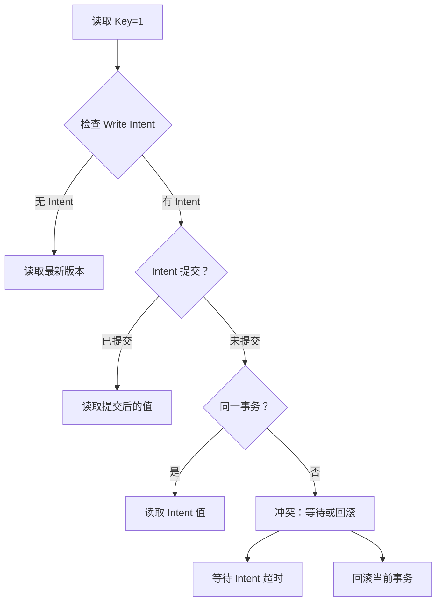
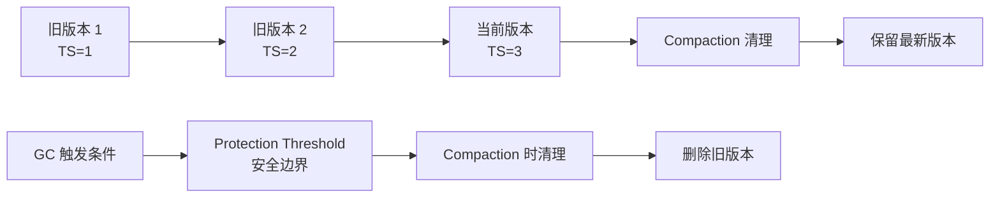

# CockroachDB MVCC

## 学习目标

- 掌握 CockroachDB 的分布式 MVCC 实现：Write Intent + 时间戳
- 理解 CockroachDB 的 MVCC 与 PostgreSQL 的 MVCC 差异
- 对比分布式 MVCC 和单机 MVCC 的设计权衡

## 分布式 MVCC 架构

CockroachDB 的 MVCC 基于 HLC（混合逻辑时钟）和 Write Intent。



### KV 版本存储

CockroachDB 的 MVCC 存储在 RocksDB KV 中：

```
Key: /table/53/1
Value: {name: "Alice", age: 30}
MVCC Timestamp: 2026-07-20T10:00:00.000000001Z
```

**多版本存储**：

```
Key: /table/53/1@TS=1
Value: {name: "Alice", age: 30}

Key: /table/53/1@TS=2
Value: {name: "Alice", age: 31}

Key: /table/53/1@TS=3
Value: {name: "Alice", age: 32}
```

每个版本通过时间戳区分，版本号越大越新。

## Write Intent 机制

Write Intent 是 CockroachDB 的核心设计，替代传统行级锁。

### Write Intent 结构

```go
// Write Intent 结构
type WriteIntent struct {
    TxnID       uuid.UUID   // 事务 ID
    Timestamp   hlc.Timestamp  // 写入时间戳
    Key         roachpb.Key // 写入的 Key
    Value       roachpb.Value // 写入的值
    Status      IntentStatus  // PENDING / COMMITTED / ABORTED
}
```

### Write Intent 写入流程



### Write Intent 冲突检测



**冲突解决策略**：

- **等待**：等待其他事务提交或回滚（默认）
- **回滚**：主动回滚当前事务（重试）
- **优先级**：高优先级事务可以 Abort 低优先级事务

## 与 PostgreSQL MVCC 的对比

| 维度 | CockroachDB | PostgreSQL |
|------|------------|------------|
| 版本标识 | HLC 时间戳 | xmin/xmax 事务 ID |
| 冲突检测 | Write Intent | 行级锁 |
| 锁机制 | 无锁（Intent 冲突检测） | 行锁 + 死锁检测 |
| 旧版本清理 | RocksDB Compaction | VACUUM |
| 分布式事务 | 2PC 协调 | 不支持 |
| 隔离级别 | SERIALIZABLE（默认） | READ COMMITTED（默认） |

### Write Intent 的优势

1. **无锁设计**：避免死锁和锁等待
2. **分布式友好**：无需跨节点锁传播
3. **冲突检测自然**：利用 RocksDB 的原子操作

### PostgreSQL 行锁的优势

1. **低退避成本**：无冲突时直接操作
2. **实时性**：锁等待时间短
3. **实现简单**：MVCC 在 Tuple Header 中

## MVCC 垃圾回收

CockroachDB 的旧版本清理通过 RocksDB Compaction 完成：



**GC 策略**：

- **Protection Threshold**：安全边界（当前时间 - GC TTL）
- **GC TTL**：默认 25 小时
- **Compaction 触发**：GC 在 Compaction 过程中执行

## 要点总结

- CockroachDB 的 MVCC 基于 HLC 时间戳和 Write Intent
- Write Intent 是分布式无锁冲突检测机制，替代传统行级锁
- 多版本通过时间戳区分，存储在 RocksDB KV 中
- 冲突检测：写入时设置 Intent，读取时检查冲突
- 旧版本清理通过 RocksDB Compaction 完成
- 相比 PostgreSQL 的 MVCC，CockroachDB 更复杂但在分布式场景下更高效

## 思考题

1. CockroachDB 的 Write Intent 机制相比 PostgreSQL 的行级锁，在高并发场景下的冲突率如何？哪个更适合 OLTP 应用？
2. 如果分布式事务的 Write Intent 冲突率很高，如何通过应用层优化减少冲突？
3. CockroachDB 的 MVCC GC（RocksDB Compaction）与 PostgreSQL 的 VACUUM 相比，哪个对在线业务的影响更小？
4. 单机存储引擎如果要实现类似的 Write Intent 机制，应该在哪里修改？