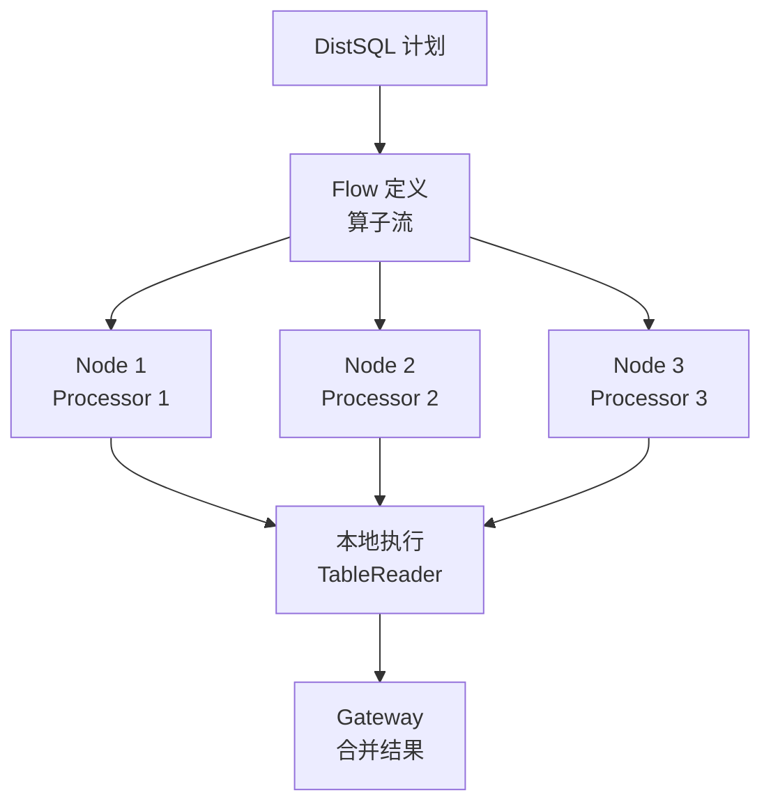
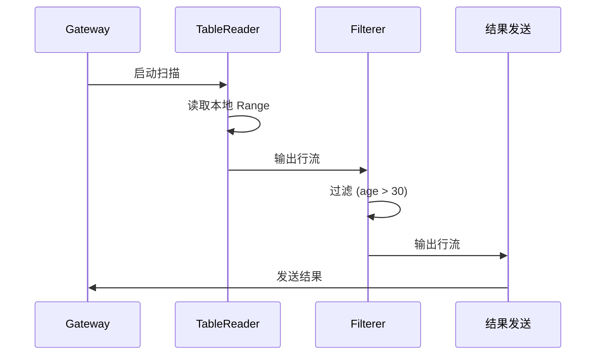
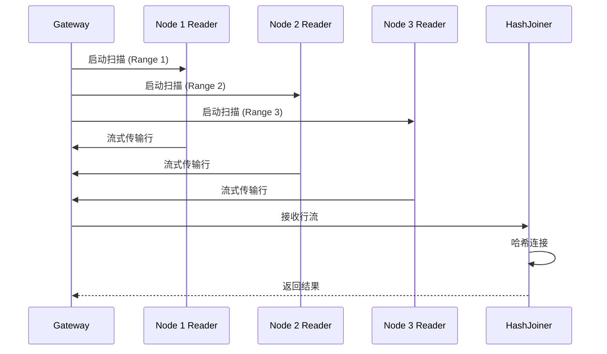
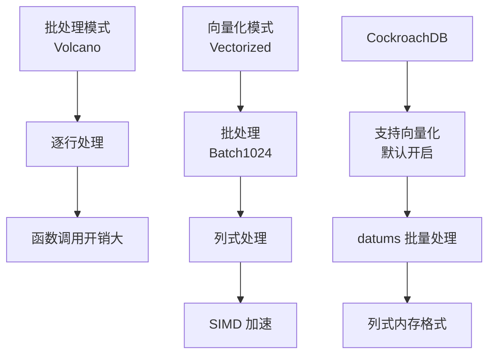

# CockroachDB 执行器

## 学习目标

- 掌握 CockroachDB 的 DistSQL 分布式执行引擎
- 理解 DistSQL 物理计划的执行流程
- 对比 CockroachDB 的分布式执行器与 PostgreSQL 的单机执行器

## DistSQL 执行引擎

CockroachDB 的 DistSQL 执行引擎将查询计划分解为跨节点并行执行的算子流。



### Flow（算子流）

Flow 是 DistSQL 的执行单元，包含多个 Processor：

```go
// Flow 结构
type Flow struct {
    FlowID     uuid.UUID        // Flow ID
    Processors []Processor      // Processor 列表
    Streams    []Stream         // 数据流连接
    Gateway    NodeID           // 网关节点
}
```

### Processor（处理器）

Processor 是 DistSQL 的执行算子：

```go
// Processor 接口
type Processor interface {
    Run(ctx context.Context) error          // 执行
    Input() chan Row                        // 输入流
    Output() chan Row                       // 输出流
    Stats() ProcessorStats                  // 统计信息
}
```

**Processor 类型**：

- **TableReader**：本地表扫描
- **IndexJoiner**：索引回表查询
- **HashJoiner**：哈希连接
- **MergeJoiner**：归并连接
- **Aggregator**：聚合
- **Sorter**：排序
- **Limiter**：限制
- **Filterer**：过滤

## 执行流程

### 单节点执行



### 多节点执行



## 向量化执行

CockroachDB 支持向量化执行（Vectorized Execution），提高处理效率。



### 向量化算子

```go
// 向量化算子接口
type VectorizedProcessor interface {
    Next(ctx context.Context) (Batch, error)  // 返回一批数据
    Init()                                    // 初始化
    Close()                                   // 关闭
}

// Batch（批处理数据）
type Batch struct {
    Length int          // 批大小
    Cols   []*Column    // 列数组
    Sel    []int        // 选择向量
}
```

**向量化优势**：

- 减少函数调用：批处理减少执行次数
- 缓存友好：列式内存访问模式
- SIMD 加速：支持 AVX2/AVX-512

## 与 PostgreSQL 执行器的对比

| 维度 | CockroachDB | PostgreSQL |
|------|------------|------------|
| 执行模型 | Volcano + 向量化 | Volcano（逐行） |
| 分布式执行 | DistSQL 跨节点 | 单机（不支持） |
| 批处理 | 支持（Batch 1024） | 不支持 |
| 向量化 | 支持（默认开启） | 不支持 |
| 并行度 | 跨节点并行 | 单节点并行 |
| 流式传输 | 支持（跨节点流） | 不支持 |

### CockroachDB 执行器的优势

1. **分布式执行**：跨节点并行
2. **向量化**：批处理 + SIMD 加速
3. **流式传输**：跨节点流式处理

### PostgreSQL 执行器的优势

1. **单机高效**：无分布式开销
2. **成熟稳定**：经过多年优化
3. **并行执行**：单节点并行

## 实际执行示例

### 简单查询执行

```sql
SELECT * FROM users WHERE age > 30;
```

**执行流程**：

```mermaid
graph TB
    A[Gateway] --> B[DistSQL 计划]
    B --> C[Node 1: TableReader<br/>Spans: [0, 10000)]
    B --> D[Node 2: TableReader<br/>Spans: [10000, 20000)]
    B --> E[Node 3: TableReader<br/>Spans: [20000, 30000)]

    C --> F[Filterer<br/>age > 30]
    D --> G[Filterer<br/>age > 30]
    E --> H[Filterer<br/>age > 30]

    F --> I[Gateway: UNION ALL]
    G --> I
    H --> I

    I --> J[最终结果]
```

## 要点总结

- CockroachDB 的 DistSQL 执行引擎将查询计划分解为跨节点并行执行的算子流
- Flow 是执行单元，包含多个 Processor 和 Stream
- 支持向量化执行（Batch 1024，列式处理）
- 相比 PostgreSQL 的 Volcano 逐行执行，CockroachDB 支持分布式执行和向量化
- 流式传输减少中间结果的内存占用

## 思考题

1. CockroachDB 的 DistSQL 执行引擎相比 PostgreSQL 的并行执行（Parallel SeqScan），在并行度上有何差异？
2. 向量化执行（Batch 1024）相比逐行执行，在 CPU 缓存命中率和函数调用开销上有何提升？
3. 如果查询结果需要跨节点传输，DistSQL 如何优化网络传输？是否支持数据压缩？
4. 本项目的执行器（如果有）是否应该支持向量化执行？在什么场景下向量化执行有意义？