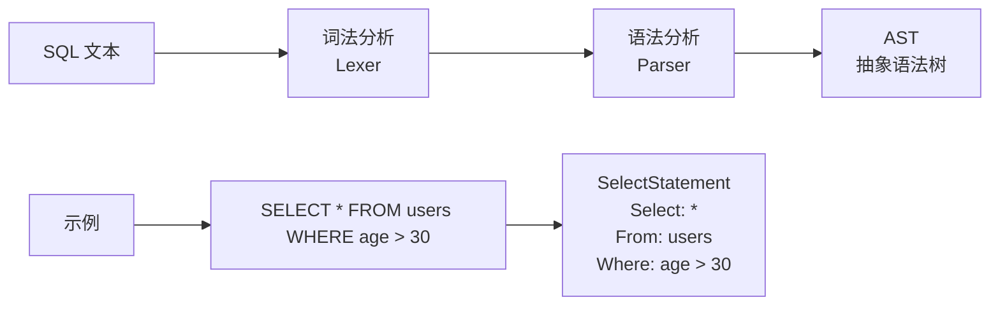
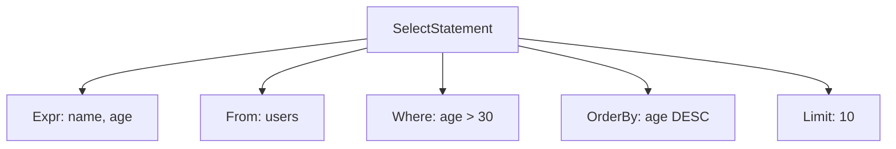

# CockroachDB SQL 解析器

## 学习目标

- 掌握 CockroachDB 的 SQL 解析器设计：兼容 PostgreSQL
- 理解 SQL 文本到 AST（抽象语法树）的转换流程
- 对比 CockroachDB 与 PostgreSQL 的解析器差异

## SQL 解析流程

CockroachDB 的 SQL 解析器兼容 PostgreSQL，将 SQL 文本转换为 AST。



### 解析器入口

CockroachDB 的解析器入口在 `pkg/sql/parser/parse.go`：

```go
// SQL 解析入口
func Parse(sql string) ([]Statement, error) {
    scanner := NewScanner(sql)
    parser := NewParser(scanner)
    return parser.Parse()
}

// Statement 结构
type Statement struct {
    AST  ast.Statement  // AST 节点
    SQL  string         // 原始 SQL 文本
}
```

## AST 结构

CockroachDB 的 AST 节点类型丰富，覆盖 SQL 标准。

### SELECT 语句 AST

```go
// SelectStatement AST
type SelectStatement struct {
    Expr      Expr       // SELECT 列表
    From      TableExpr  // FROM 子句
    Where     Expr       // WHERE 子句
    GroupBy   GroupBy    // GROUP BY 子句
    Having    Expr       // HAVING 子句
    OrderBy   OrderBy    // ORDER BY 子句
    Limit     Limit      // LIMIT 子句
}
```

**示例**：

```sql
SELECT name, age FROM users WHERE age > 30 ORDER BY age DESC LIMIT 10;
```

**AST 结构**：



### INSERT 语句 AST

```go
// InsertStatement AST
type InsertStatement struct {
    Table     TableExpr  // 表名
    Columns   []string   // 列名列表
    Values    [][]Expr   // 值列表
    Returning Expr       // RETURNING 子句
}
```

### UPDATE 语句 AST

```go
// UpdateStatement AST
type UpdateStatement struct {
    Table     TableExpr  // 表名
    Updates   []Update   // SET 列表
    Where     Expr       // WHERE 子句
    Returning Expr       // RETURNING 子句
}
```

## 与 PostgreSQL 解析器的对比

| 维度 | CockroachDB | PostgreSQL |
|------|------------|------------|
| 解析器实现 | Go（手写） | C（Bison/Yacc） |
| 兼容性 | PG 兼容（90%） | 原生 PG |
| AST 结构 | 独立设计 | PostgresParseNode |
| 错误提示 | 详细（位置提示） | 详细 |
| 扩展语法 | 支持（unique_rowid） | 支持（RETURNING） |

### 兼容性示例

**PostgreSQL 兼容**：

```sql
-- 标准语法（完全兼容）
SELECT * FROM users WHERE age > 30;

-- 事务语法（完全兼容）
BEGIN;
COMMIT;
ROLLBACK;

-- 窗口函数（完全兼容）
SELECT name, RANK() OVER (ORDER BY age) FROM users;
```

**CockroachDB 特有语法**：

```sql
-- unique_rowid() 替代 SERIAL
CREATE TABLE users (
    id INT DEFAULT unique_rowid(),
    name VARCHAR
);

-- SHOW RANGES（分布式特性）
SHOW RANGES FROM TABLE users;
```

## 解析器实现细节

### 词法分析（Lexer）

词法分析器将 SQL 文本分割为 Token：

```go
// Token 类型
type Token struct {
    Type    TokenType  // Token 类型
    Value   string     // Token 值
    Pos     int        // 位置
}

// TokenType 枚举
const (
    IDENT    TokenType = iota  // 标识符
    NUMBER                     // 数字
    STRING                     // 字符串
    SELECT                     // SELECT 关键字
    FROM                       // FROM 关键字
    WHERE                      // WHERE 关键字
    // ...
)
```

**示例**：

```
SQL: SELECT * FROM users WHERE age > 30

Tokens:
[SELECT, *, FROM, users, WHERE, age, >, 30]
```

### 语法分析（Parser）

语法分析器根据 Token 流构建 AST：

```go
// Parser 结构
type Parser struct {
    scanner *Scanner
    tokens  []Token
    pos     int
}

// 解析 SELECT 语句
func (p *Parser) parseSelect() *SelectStatement {
    stmt := &SelectStatement{}

    // 1. 解析 SELECT 列表
    p.expect(SELECT)
    stmt.Expr = p.parseExprList()

    // 2. 解析 FROM 子句
    if p.accept(FROM) {
        stmt.From = p.parseTableExpr()
    }

    // 3. 解析 WHERE 子句
    if p.accept(WHERE) {
        stmt.Where = p.parseExpr()
    }

    // 4. 解析 ORDER BY 子句
    if p.accept(ORDER) {
        p.expect(BY)
        stmt.OrderBy = p.parseOrderBy()
    }

    return stmt
}
```

## 要点总结

- CockroachDB 的 SQL 解析器兼容 PostgreSQL，使用 Go 手写实现
- 解析流程：SQL 文本 → Lexer（词法分析） → Parser（语法分析） → AST
- AST 节点类型丰富，覆盖 SELECT/INSERT/UPDATE/DELETE 等语句
- 与 PostgreSQL 解析器相比，CockroachDB 使用 Go 实现，更易扩展
- 兼容性约 90%，部分 PostgreSQL 语法不支持（如 SERIAL）

## 思考题

1. CockroachDB 的解析器为什么要兼容 PostgreSQL？而不是从头设计一套 SQL 方言？
2. Go 手写解析器相比 Bison/Yacc 生成的解析器，在维护性和性能上有何差异？
3. CockroachDB 的 AST 结构与 PostgreSQL 的 ParseTree 相比，哪个更易扩展？
4. 如果要在本项目中实现一个简易 SQL 解析器，应该参考 CockroachDB 还是 PostgreSQL 的设计？