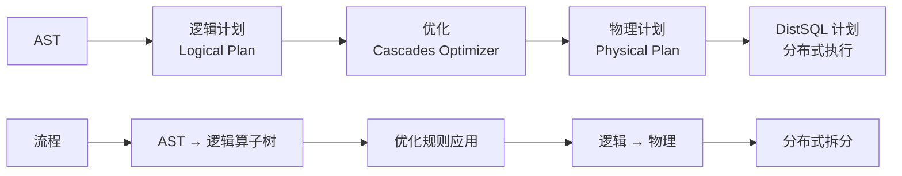
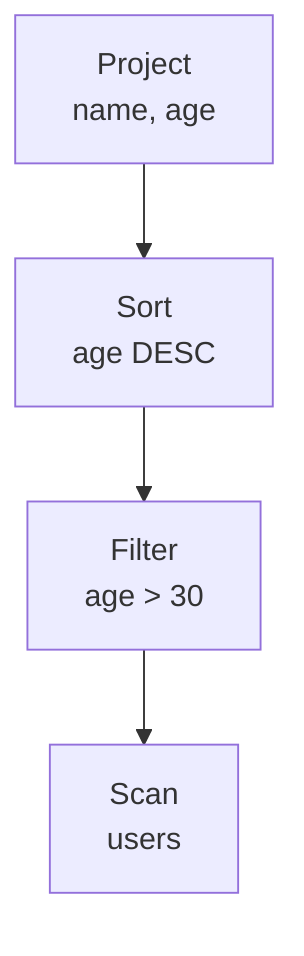
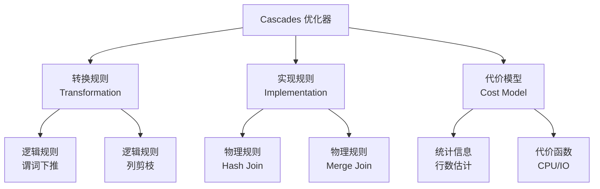
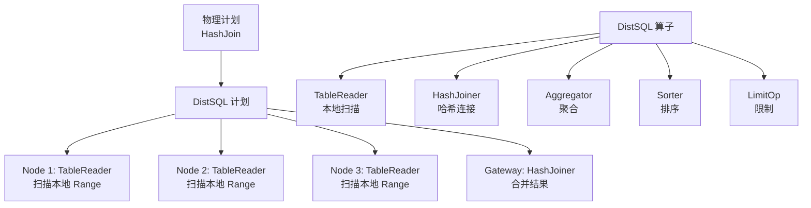

# CockroachDB 查询计划器

## 学习目标

- 掌握 CockroachDB 的查询计划器设计：Cascades 优化器
- 理解逻辑计划到物理计划的转换流程
- 对比 CockroachDB 的分布式查询计划器与 PostgreSQL 的优化器

## 查询计划流程

CockroachDB 的查询计划分为逻辑计划、优化和物理计划三个阶段。



### 逻辑计划

逻辑计划将 AST 转换为逻辑算子树：

```go
// 逻辑算子接口
type LogicalOperator interface {
    LogicalProps() *LogicalProps  // 逻辑属性（输出列、统计信息）
    Inputs() []LogicalOperator     // 子节点
    OutputCols() []ColumnID        // 输出列
}
```

**逻辑算子类型**：

- **Scan**：表扫描
- **Filter**：过滤
- **Project**：投影
- **Join**：连接
- **Aggregate**：聚合
- **Sort**：排序
- **Limit**：限制

**示例**：

```sql
SELECT name, age FROM users WHERE age > 30 ORDER BY age DESC;
```

**逻辑计划**：



## Cascades 优化器

CockroachDB 使用 Cascades 风格优化器（类似 Apache Calcite）。



### 转换规则

转换规则将逻辑算子转换为等价的逻辑形式：

```go
// 谓词下推规则
type PushFilterThroughJoin struct{}

func (r *PushFilterThroughJoin) Match(op LogicalOperator) bool {
    // 匹配 Filter → Join 模式
    _, ok := op.(*Filter)
    return ok
}

func (r *PushFilterThroughJoin) Transform(op LogicalOperator) []LogicalOperator {
    filter := op.(*Filter)
    join := filter.Input().(*Join)

    // 将 Filter 下推到 Join 的子节点
    return []LogicalOperator{
        &Join{
            Left:  &Filter{filter.Condition, join.Left},
            Right: join.Right,
            Type:  join.Type,
        },
    }
}
```

### 实现规则

实现规则将逻辑算子转换为物理算子：

```go
// Hash Join 实现规则
type HashJoinImpl struct{}

func (r *HashJoinImpl) Match(op LogicalOperator) bool {
    _, ok := op.(*Join)
    return ok
}

func (r *HashJoinImpl) Implement(op LogicalOperator) PhysicalOperator {
    join := op.(*Join)
    return &HashJoin{
        Left:  join.Left,
        Right: join.Right,
        Cond:  join.Condition,
    }
}
```

## DistSQL 物理计划

物理计划被分解为跨节点的 DistSQL 计划。



### DistSQL 算子

```go
// DistSQL 算子
type DistSQLProcessor interface {
    Run(ctx context.Context, flow *Flow) error  // 执行
    Input() chan Row                            // 输入流
    Output() chan Row                           // 输出流
}

// TableReader（本地扫描）
type TableReader struct {
    Table   string       // 表名
    Spans   []Span       // 扫描范围
    Filter  Expr         // 过滤条件
}

// HashJoiner（哈希连接）
type HashJoiner struct {
    Left     DistSQLProcessor
    Right    DistSQLProcessor
    Equality []Equality
}
```

## 与 PostgreSQL 优化器的对比

| 维度 | CockroachDB | PostgreSQL |
|------|------------|------------|
| 优化器 | Cascades 风格 | 自底向上动态规划 |
| 优化规则 | 规则集（Rules） | 硬编码策略 |
| 代价模型 | CPU + 网络 + 存储 | CPU + I/O |
| 分布式计划 | DistSQL | 不支持 |
| 连接算法 | Hash Join + Merge Join | Hash Join + Merge Join + Nest Loop |
| 统计信息 | 自动收集 | ANALYZE 手动收集 |

### CockroachDB 优化器的优势

1. **规则可扩展**：Cascades 规则集易于扩展
2. **分布式计划**：DistSQL 分解为跨节点执行
3. **自动统计**：统计信息自动收集

### PostgreSQL 优化器的优势

1. **成熟稳定**：经过多年优化
2. **精确代价**：I/O 模型精确
3. **连接顺序优化**：高效的多表连接

## 查询计划示例

### 简单查询

```sql
EXPLAIN SELECT * FROM users WHERE age > 30;
```

**输出**：

```
tree | field | description
------+-------+---------------------------------
      |       | distributed
      |       | vectorized
 scan |       |
      | table | users@primary
      | spans | FULL SCAN
      | filter | age > 30
```

### 连接查询

```sql
EXPLAIN (VERBOSE)
SELECT u.name, o.amount
FROM users u JOIN orders o ON u.id = o.user_id
WHERE u.age > 30;
```

**输出**：

```
tree | field | description
------+-------+---------------------------------
      |       | distributed
      |       | vectorized
 hash-join |       |
      | equality | (id) = (user_id)
      | strategy | HASH
 scan |       | (users)
      | table | users@primary
      | spans | FULL SCAN
      | filter | age > 30
 scan |       | (orders)
      | table | orders@primary
      | spans | FULL SCAN
```

## 要点总结

- CockroachDB 的查询计划流程：AST → 逻辑计划 → Cascades 优化 → 物理计划 → DistSQL 计划
- Cascades 优化器使用转换规则（Transform）和实现规则（Implement）
- DistSQL 将物理计划分解为跨节点并行执行的算子
- 相比 PostgreSQL 的优化器，CockroachDB 更规则化且支持分布式执行
- 优化规则包括谓词下推、列剪枝、连接顺序优化等

## 思考题

1. CockroachDB 的 Cascades 优化器相比 PostgreSQL 的自底向上优化器，在优化规则扩展性上有何优势？
2. DistSQL 物理计划如何将单节点计划分解为多节点计划？Range 分布如何影响分解策略？
3. 如果查询涉及大量数据跨节点传输，DistSQL 如何优化网络带宽？
4. 本项目的查询优化器（如果有）是否可以借鉴 Cascades 的规则化设计？