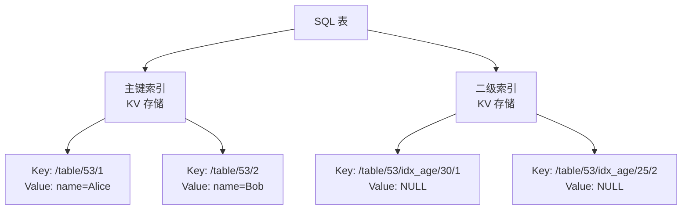
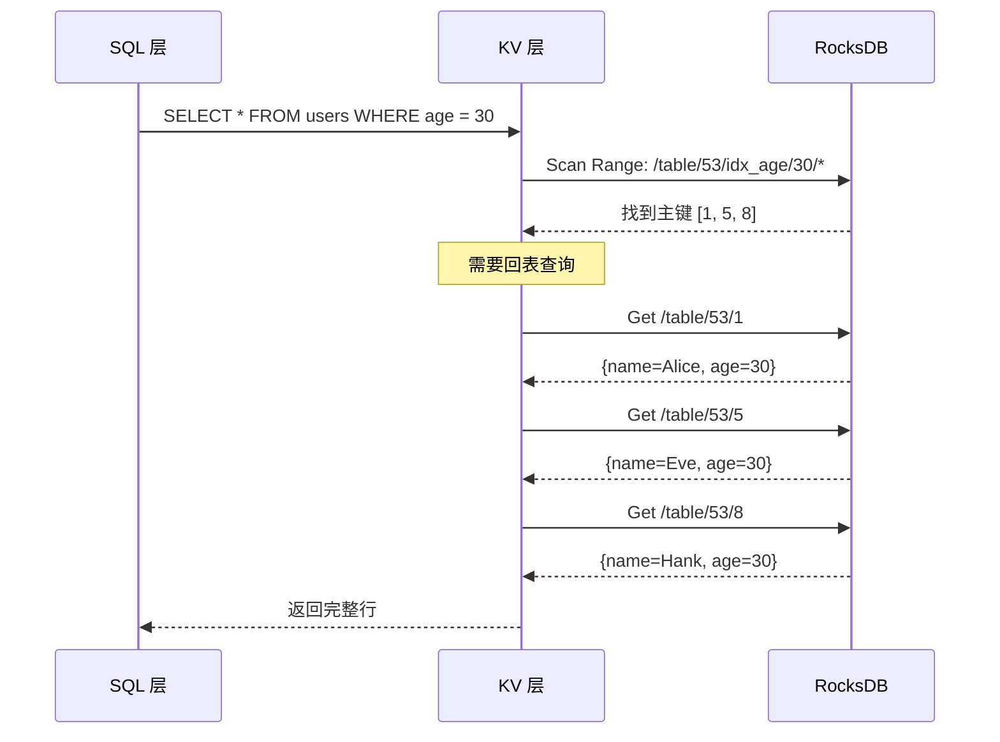

# CockroachDB 二级索引（BTree）

## 学习目标

- 掌握 CockroachDB 的二级索引设计：基于 RocksDB LSM-Tree 的 KV 索引
- 理解 CockroachDB 的索引实现与 PostgreSQL BTree 索引的差异
- 对比 CockroachDB 的索引和 PostgreSQL 的索引

## 二级索引架构

CockroachDB 的二级索引也是 KV 对，存储在 RocksDB 中。



### 索引 KV 编码

```sql
CREATE TABLE users (
    id INT PRIMARY KEY,
    name VARCHAR(100),
    age INT
);

CREATE INDEX idx_age ON users (age);
```

**索引 KV 编码**：

- **Key**：`/table/<table_id>/<index_id>/<index_key>/<primary_key>`
- **Value**：NULL（覆盖索引存储主键）

**示例**：

```
Key: /table/53/idx_age/25/2
Value: NULL

Key: /table/53/idx_age/30/1
Value: NULL

Key: /table/53/idx_age/35/3
Value: NULL
```

### 覆盖索引（Covering Index）

```sql
-- 创建覆盖索引
CREATE INDEX idx_age_cover ON users (age) STORING (name);
```

**KV 编码**：

```
Key: /table/53/idx_age_cover/25/2
Value: name=Bob

Key: /table/53/idx_age_cover/30/1
Value: name=Alice
```

**优势**：无需回表查询，直接返回索引中的值。

## 索引查找流程



### 索引回表优化

CockroachDB 支持索引回表查询优化：

```sql
-- 覆盖索引：无需回表
CREATE INDEX idx_age_cover ON users (age) STORING (name, email);

-- 查询只需索引字段
SELECT age, name FROM users WHERE age = 30;
-- 只扫描索引，无需回表
```

## 唯一索引

```sql
CREATE UNIQUE INDEX idx_email ON users (email);
```

**唯一索引 KV 编码**：

- Key：`/table/53/idx_email/alice@example.com/1`
- Value：NULL

**唯一性检查**：

1. 插入时检查是否存在相同 Key 的 KV 对
2. 如果存在，返回唯一约束冲突错误

## 索引类型对比

### CockroachDB 索引类型

| 索引类型 | 说明 | 编码方式 |
|----------|------|----------|
| 主键索引 | 表的主键 | Key: `/table/<id>/<pk>` |
| 二级索引 | 普通索引 | Key: `/table/<id>/<index_id>/<col>/<pk>` |
| 唯一索引 | 唯一约束 | Key: `/table/<id>/<unique_id>/<col>/<pk>` |
| 覆盖索引 | 包含额外列 | Key: 同上，Value 存额外列 |
| 倒排索引 | JSONB/GIN | Key: `/table/<id>/<invert_id>/<path>/<pk>` |

### 与 PostgreSQL BTree 索引对比

| 维度 | CockroachDB | PostgreSQL |
|------|------------|------------|
| 存储结构 | RocksDB LSM-Tree KV | BTree 页面 |
| 索引组织 | 独立 KV 表 | 索引页面 + 堆表 |
| 回表查询 | 二次 KV 读取 | 堆表页面读取 |
| 唯一性检查 | KV 存在性检查 | BTree 查找 |
| 并发控制 | Write Intent | 行锁 |
| 碎片化 | Compaction 回收 | BTree 页面分裂 |

### CockroachDB 索引的优势

1. **统一存储**：索引和表使用相同的 KV 接口
2. **自动维护**：Compaction 自动回收索引碎片
3. **分布式友好**：索引分布在多个节点

### PostgreSQL BTree 索引的优势

1. **读取效率高**：BTree 平衡树，查找路径短
2. **空间效率**：索引页面紧凑
3. **并发控制**：BTree 页面级锁

## 索引设计建议

### 索引选择策略

```sql
-- 1. 频繁查询列创建索引
CREATE INDEX idx_orders_user_id ON orders (user_id);

-- 2. 覆盖索引减少回表
CREATE INDEX idx_orders_user_status ON orders (user_id, status) STORING (amount);

-- 3. 复合索引顺序
CREATE INDEX idx_orders_user_date ON orders (user_id, created_at DESC);
```

**索引设计原则**：

- 选择性高的列优先
- 频繁查询的列创建索引
- 覆盖索引减少回表
- 监控索引使用率，删除无用索引

## 要点总结

- CockroachDB 的二级索引也是 KV 对，存储在 RocksDB 中
- 索引编码：`/table/<table_id>/<index_id>/<index_key>/<primary_key>`
- 覆盖索引（STORING）减少回表查询
- 唯一索引通过 KV 存在性检查实现
- 相比 PostgreSQL BTree 索引，CockroachDB 使用 LSM-Tree 存储
- 索引设计原则：选择性高、覆盖索引、监控使用率

## 思考题

1. CockroachDB 的二级索引存储在 RocksDB 中，相比 PostgreSQL 的 BTree 索引，写入性能差异有多大？
2. 如果一个表有 10 个二级索引，插入一行数据需要写入多少个 KV 对？相比 BTree 索引的写入开销如何？
3. CockroachDB 的覆盖索引（STORING）相比 PostgreSQL 的 Only Index Scan，在实现机制上有何差异？
4. 本项目的索引模块（如 PG BTree 实现）与 CockroachDB 的 KV 索引方案相比，哪个更适合单机场景？