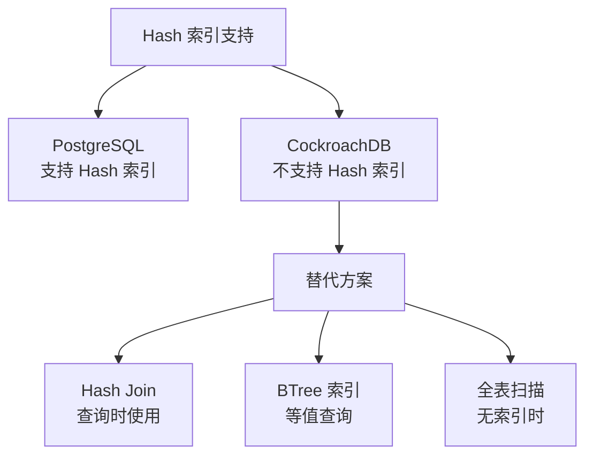
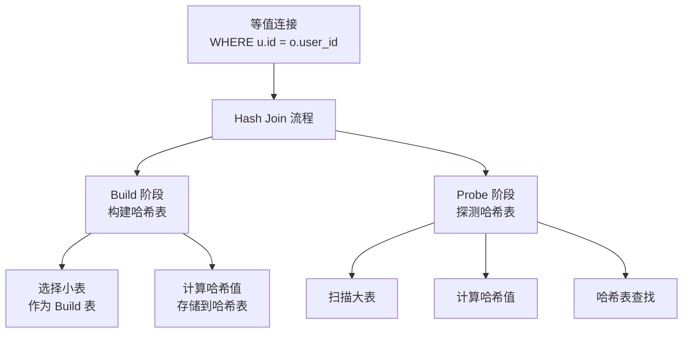
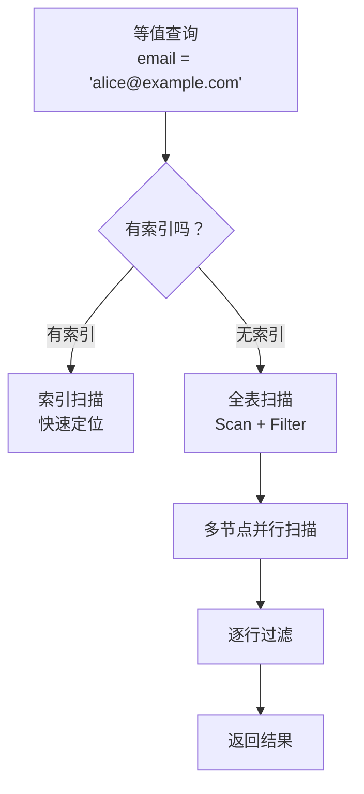

# CockroachDB Hash 索引

## 学习目标

- 掌握 CockroachDB 的 Hash 索引设计：无原生 Hash 索引
- 理解 CockroachDB 的 Hash Join 替代 Hash 索引
- 对比 CockroachDB 与 PostgreSQL 的 Hash 索引

## CockroachDB 的 Hash 索引

CockroachDB 不支持原生的 Hash 索引。这与 PostgreSQL 不同。



### 为什么不支持 Hash 索引？

1. **BTree 索引足够**：BTree 支持等值查询和范围查询
2. **KV 存储天然有序**：RocksDB 的 KV 存储按 Key 排序
3. **分布式场景**：Hash 索引在分布式场景下难以维护
4. **排序需求**：Hash 索引不支持排序，BTree 更通用

## Hash Join 替代 Hash 索引

CockroachDB 使用 Hash Join 算法处理等值连接。



### Hash Join 实现

```go
// Hash Join 实现
type HashJoin struct {
    Left     Processor
    Right    Processor
    Equality []Equality  // 等值条件
    hashTable map[uint64][]Row  // 哈希表
}

func (h *HashJoin) Run(ctx context.Context) error {
    // Build 阶段
    for row := range h.Left.Output() {
        hash := hashRow(row, h.Equality)  // 计算哈希
        h.hashTable[hash] = append(h.hashTable[hash], row)
    }

    // Probe 阶段
    for row := range h.Right.Output() {
        hash := hashRow(row, h.Equality)  // 计算哈希
        if matches, ok := h.hashTable[hash]; ok {
            for _, match := range matches {
                h.Output() <- joinRows(match, row)  // 输出结果
            }
        }
    }

    return nil
}
```

### Hash Join 优势

- **等值连接高效**：O(N) 复杂度
- **Build 表选择**：选择小表减少内存占用
- **分布式友好**：可以在多个节点并行执行

## 全表扫描替代

对于等值查询，如果没有索引，CockroachDB 使用全表扫描：

```sql
-- 无索引的等值查询
SELECT * FROM users WHERE email = 'alice@example.com';
-- 执行计划：FULL SCAN + Filter
```



### 全表扫描开销

```sql
-- 表大小对扫描性能的影响
-- 100 行：全表扫描无压力
-- 1,000,000 行：全表扫描需要几秒
-- 100,000,000 行：全表扫描需要几分钟
```

**建议**：频繁查询的等值条件应创建索引。

## 与 PostgreSQL Hash 索引对比

| 维度 | CockroachDB | PostgreSQL |
|------|------------|------------|
| Hash 索引 | 不支持 | 支持 |
| 等值查询优化 | BTree 索引 / 全表扫描 | Hash 索引 |
| Hash Join | 支持（查询时） | 支持（查询时） |
| 分布式场景 | 全表扫描跨节点并行 | 单机扫描 |
| 索引维护 | 无 Hash 索引维护 | Hash 索引维护 |

### PostgreSQL Hash 索引

PostgreSQL 的 Hash 索引用于等值查询：

```sql
-- PostgreSQL 创建 Hash 索引
CREATE INDEX idx_email_hash ON users USING hash (email);
```

**Hash 索引特点**：

- 只支持等值查询（`=`）
- 不支持范围查询（`<`, `>`, `BETWEEN`）
- 不支持排序
- 在简单等值查询中比 BTree 快

### CockroachDB 的替代方案

```sql
-- CockroachDB 使用 BTree 索引
CREATE INDEX idx_email ON users (email);

-- 等值查询效率足够
SELECT * FROM users WHERE email = 'alice@example.com';
```

**BTree 索引优势**：

- 支持等值查询和范围查询
- 支持排序
- 通用性更强

## 要点总结

- CockroachDB 不支持原生 Hash 索引
- 替代方案：BTree 索引（等值查询）、Hash Join（连接查询）、全表扫描（无索引）
- Hash Join 在查询时动态构建哈希表，处理等值连接
- 与 PostgreSQL 相比，CockroachDB 更依赖 BTree 索引
- 频繁查询的等值条件应创建 BTree 索引

## 思考题

1. CockroachDB 为什么不支持 Hash 索引？在分布式场景下，Hash 索引会遇到哪些问题？
2. 如果等值查询非常频繁（如用户登录检查 email 是否存在），CockroachDB 的 BTree 索引和 PostgreSQL 的 Hash 索引相比，性能差异有多大？
3. Hash Join 的 Build 表选择策略如何影响查询性能？应该如何选择 Build 表？
4. 在本项目中，如果要在现有的 BTree 索引基础上实现 Hash 索引，需要修改哪些模块？