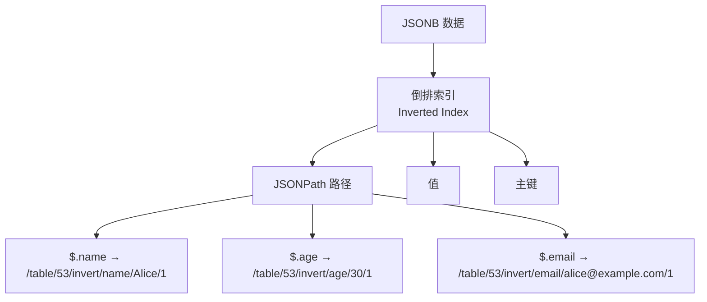
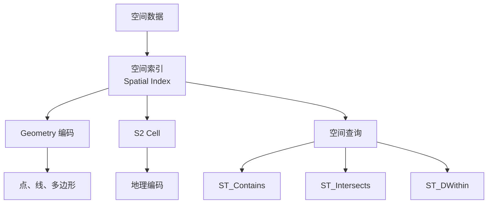

# CockroachDB 其他索引类型

## 学习目标

- 掌握 CockroachDB 支持的扩展索引类型：倒排索引、空间索引、全文索引
- 理解 CockroachDB 的索引扩展机制
- 对比 CockroachDB 与 PostgreSQL 的索引多样性

## 倒排索引（Inverted Index）

CockroachDB 支持倒排索引，用于 JSONB 和数组类型。



### 倒排索引创建

```sql
-- 创建 JSONB 列
CREATE TABLE users (
    id INT PRIMARY KEY,
    metadata JSONB
);

-- 创建倒排索引
CREATE INVERTED INDEX idx_metadata ON users (metadata);
```

### 倒排索引查询

```sql
-- JSONB 查询（利用倒排索引）
SELECT * FROM users
WHERE metadata @> '{"age": 30}';

-- 执行计划：Inverted Index Scan
```

### 倒排索引 KV 编码

```
Key: /table/53/invert_metadata/age/30/1
Value: NULL

Key: /table/53/invert_metadata/name/Alice/1
Value: NULL

Key: /table/53/invert_metadata/email/alice@example.com/1
Value: NULL
```

## 空间索引（Spatial Index）

CockroachDB 支持空间索引，用于地理空间数据。



### 空间索引创建

```sql
-- 创建空间表
CREATE TABLE locations (
    id INT PRIMARY KEY,
    name VARCHAR,
    geom GEOMETRY(Point, 4326)  -- WGS84 坐标
);

-- 创建空间索引
CREATE INDEX idx_locations_geom ON locations USING GIST (geom);
```

### 空间查询

```sql
-- 查询范围内的点
SELECT name FROM locations
WHERE ST_DWithin(geom, ST_MakePoint(116.4, 39.9), 1000);

-- 执行计划：Spatial Index Scan
```

## 全文索引（Full-Text Search）

CockroachDB 支持全文搜索。

```sql
-- 创建全文索引
CREATE INDEX idx_articles_text ON articles USING GIN (to_tsvector('english', content));

-- 全文搜索查询
SELECT title FROM articles
WHERE to_tsvector('english', content) @@ to_tsquery('cockroach & database');
```

### 全文索引限制

CockroachDB 的全文搜索功能有限：

- 不支持中文分词
- 不支持自定义分词器
- 推荐使用外部搜索引擎（Elasticsearch）

## 索引类型对比

### CockroachDB 支持的索引类型

| 索引类型 | 说明 | 使用场景 |
|----------|------|----------|
| 主键索引 | 表的主键 | 默认创建 |
| 二级索引 | 普通列索引 | 频繁查询列 |
| 唯一索引 | 唯一约束 | 邮箱、用户名等 |
| 覆盖索引 | 包含额外列 | 减少回表 |
| 倒排索引 | JSONB/数组 | 文档查询 |
| 空间索引 | 地理空间 | 位置查询 |
| 全文索引 | 文本搜索 | 全文搜索 |

### 与 PostgreSQL 索引类型对比

| 索引类型 | CockroachDB | PostgreSQL |
|----------|------------|------------|
| BTree | 支持 | 支持 |
| Hash | 不支持 | 支持 |
| GIN | 支持（倒排） | 支持 |
| GiST | 支持（空间） | 支持 |
| BRIN | 不支持 | 支持 |
| SP-GiST | 不支持 | 支持 |
| Bloom | 不支持 | 支持 |

### CockroachDB 不支持的索引

1. **Hash 索引**：等值查询使用 BTree
2. **BRIN 索引**：大表块范围索引
3. **SP-GiST 索引**：分区搜索树
4. **Bloom 索引**：布隆过滤器索引

## 索引设计建议

### 索引选择策略

```sql
-- 1. JSONB 频繁查询 → 倒排索引
CREATE INVERTED INDEX idx_meta ON users (metadata);

-- 2. 地理空间查询 → 空间索引
CREATE INDEX idx_loc_geom ON locations USING GIST (geom);

-- 3. 文本搜索 → 全文索引
CREATE INDEX idx_articles_text ON articles USING GIN (to_tsvector('english', content));
```

### 索引监控

```sql
-- 查看索引使用情况
SELECT * FROM crdb_internal.index_usage_statistics;

-- 查看未使用的索引
SELECT index_name, table_name
FROM crdb_internal.index_usage_statistics
WHERE total_reads = 0;
```

## 要点总结

- CockroachDB 支持倒排索引（JSONB/数组）、空间索引（GIST）、全文索引（GIN）
- 倒排索引 KV 编码：`/table/<id>/<invert_id>/<path>/<pk>`
- 空间索引使用 S2 Cell 编码地理空间数据
- 全文搜索功能有限，推荐使用外部搜索引擎
- 相比 PostgreSQL，CockroachDB 不支持 Hash、BRIN、SP-GiST、Bloom 索引
- 索引设计应考虑查询模式，监控索引使用率

## 思考题

1. CockroachDB 的倒排索引相比 PostgreSQL 的 GIN 索引，在实现机制上有何差异？KV 存储如何支持倒排索引？
2. 空间索引使用 S2 Cell 编码，相比 PostgreSQL 的 GiST 索引，在处理空间查询时有何优劣？
3. 如果应用需要中文全文搜索，应该使用 CockroachDB 的全文索引还是外部搜索引擎（Elasticsearch）？为什么？
4. 在本项目中，如果要实现 JSONB 的倒排索引，应该如何设计 KV 编码方案？