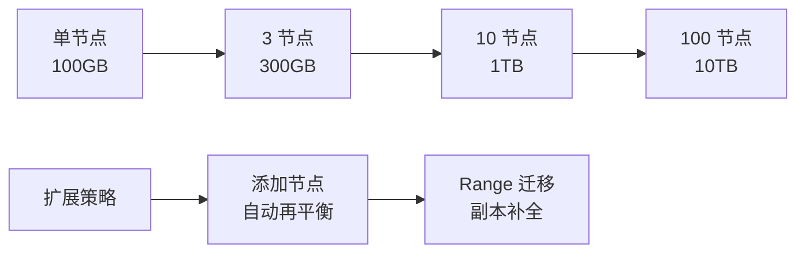
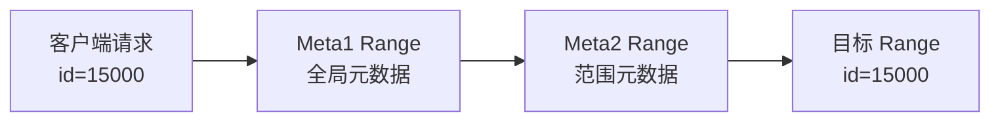
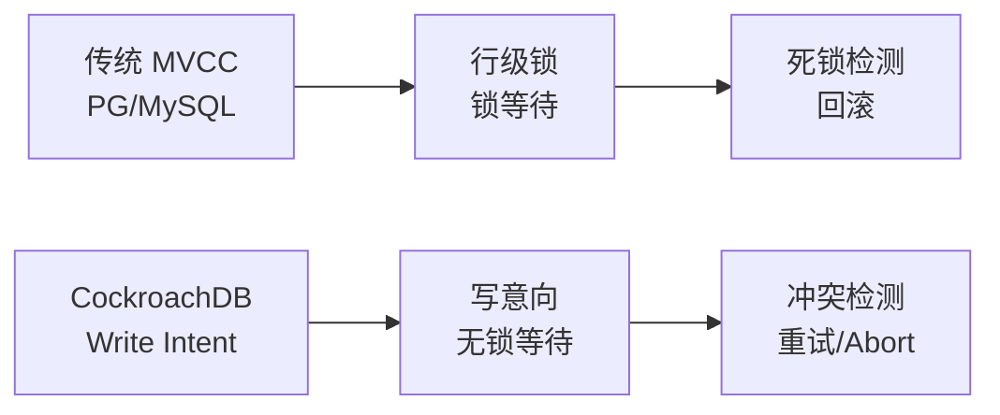
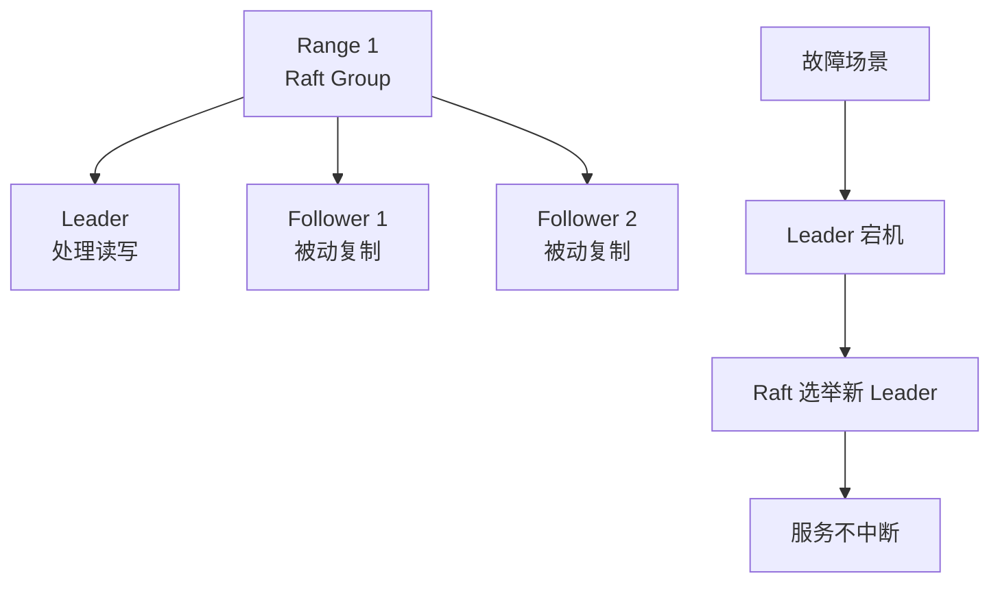
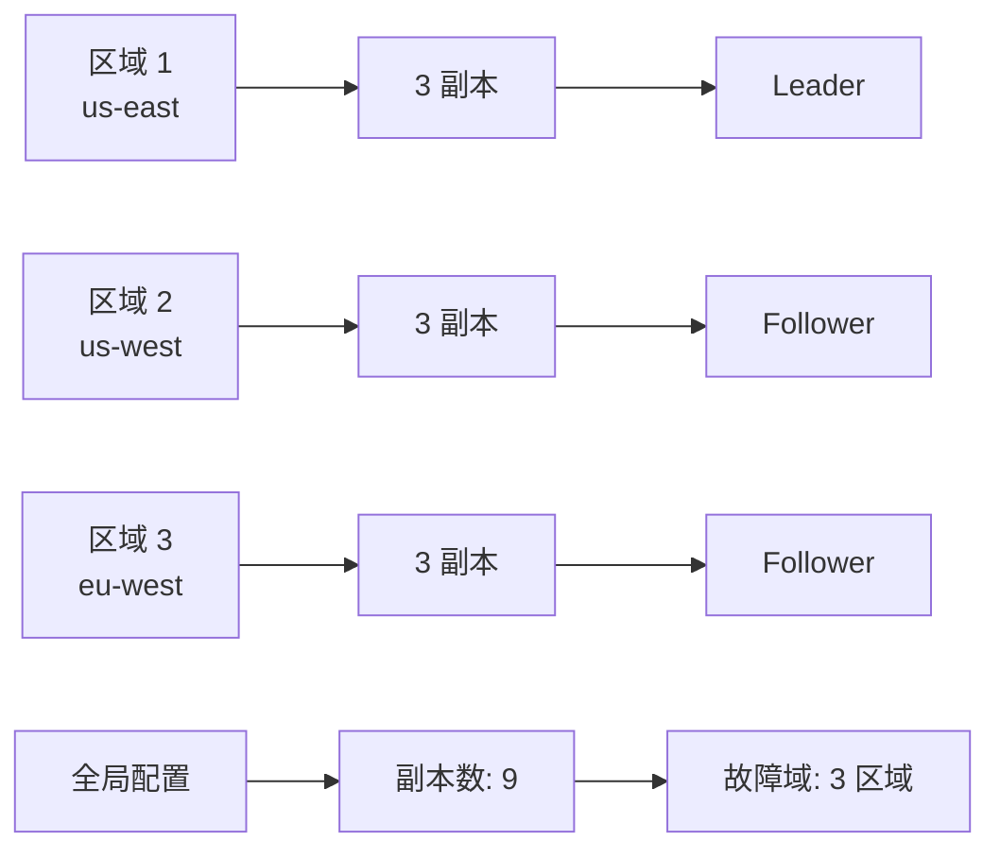

# CockroachDB 核心特性

## 学习目标

- 掌握 CockroachDB 的核心特性：分布式 SQL、自动分片、强一致性事务、容错自愈
- 理解 CockroachDB 与单机数据库（PG/MySQL）和分布式数据库（TiDB）的差异

## 分布式 SQL

### 水平扩展能力

CockroachDB 支持水平扩展，添加节点即可线性提升容量和吞吐：



### 兼容 PostgreSQL

- 使用 PostgreSQL Wire Protocol（客户端驱动无需修改）
- SQL 方言基本兼容 PG（约 90% 兼容）
- 支持 `BEGIN` / `COMMIT` / `SAVEPOINT` 等事务语法
- 支持 JSONB、数组、窗口函数等 PG 特性

### 限制

- 不支持 PG 的 `SERIAL` 自增序列（改用 `unique_rowid()` 或 `UUID`）
- 不支持 `RETURNING` 子句（v21.0 之前）
- 性能相比单机 PG 有 2-10 倍延迟增加

## 自动分片与再平衡

### Range 分片机制

数据按主键范围自动分片为 Range：

```sql
-- 创建表
CREATE TABLE users (
    id INT PRIMARY KEY,
    name VARCHAR,
    region VARCHAR
);

-- 数据分布
-- Range 1: id [0, 10000)
-- Range 2: id [10000, 25000)
-- Range 3: id [25000, 50000)
-- ...
```

**Range 分裂阈值**：默认 512MB，超过后自动分裂。

**自动再平衡**：节点增减时，Range 自动迁移到新节点或补全副本。

### 两层 Meta Range 路由



**查询流程**：

1. 从 Meta1 Range 找到 Meta2 Range
2. 从 Meta2 Range 找到目标 Range 所在节点
3. 直接访问目标 Range

## 强一致性事务

### 分布式事务 ACID

CockroachDB 提供完整的分布式事务 ACID 保证：

| ACID 特性 | 实现机制 |
|----------|----------|
| Atomicity | 2PC（两阶段提交）+ Write Intent |
| Consistency | SERIALIZABLE 隔离级别（默认） |
| Isolation | Write Intent + HLC 时钟 |
| Durability | Raft 日志 + RocksDB 持久化 |

### 混合逻辑时钟（HLC）

HLC（Hybrid Logical Clock）提供全局一致的 timestamp：

- 物理时钟：同步自 NTP
- 逻辑时钟：冲突检测时递增
- 最大偏移：默认 500ms，超过后事务延迟

### Write Intent（无锁 MVCC）



**Write Intent 机制**：

- 写入时在 KV 中存储 "Write Intent"（类似 PG 的 xmax）
- 读取时检测冲突：如果存在未提交 Intent，等待或回滚
- 不使用传统的行级锁，避免跨节点锁传播

## 容错自愈

### Raft 共识协议

每个 Range 是一个独立的 Raft 组：



**Raft 保证**：

- 强一致性：所有副本状态机一致
- Leader 选举：Leader 宕机后自动选举新 Leader（秒级）
- 日志复制：Leader 将操作日志复制到 Follower

### 多区域部署



**跨区域配置**：

- 副本分布在不同区域，避免单区域故障
- 支持区域感知的 Leader 偏好（降低跨区域延迟）

## 云原生集成

### Kubernetes 部署

CockroachDB 天然支持 Kubernetes：

- StatefulSet 管理节点
- Persistent Volume 持久化存储
- Service 负载均衡
- 自动滚动升级

### 监控与运维

- Prometheus + Grafana 监控
- CockroachDB 内置 Admin UI
- 自动健康检查和报警

## 要点总结

- 分布式 SQL 是核心特性，水平扩展 + PG 兼容
- 自动 Range 分片（~512MB），节点增减自动再平衡
- 强一致性事务：HLC 时钟 + 2PC + Write Intent
- Raft 共识协议保证容错自愈，Leader 故障秒级切换
- 云原生设计，K8s 部署和监控一体化
- 性能开销：分布式协调带来 2-10 倍延迟增加

## 思考题

1. CockroachDB 的 Write Intent 机制与 PostgreSQL 的 MVCC 行锁相比，在冲突检测和回滚机制上有何差异？
2. Range 分片的自动分裂阈值（~512MB）如何确定？这个阈值在大数据量和小数据量场景下是否需要调优？
3. CockroachDB 的 HLC 时钟依赖 NTP 同步，如果 NTP 偏移超过 500ms，对事务延迟有何影响？如何监控和预防？
4. 多区域部署时，跨区域 Raft 日志复制会带来多大的延迟开销？如何通过 Leader 偏好配置优化？