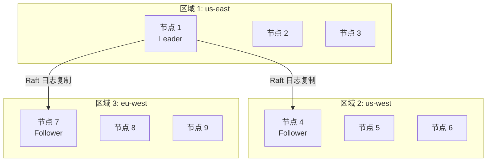
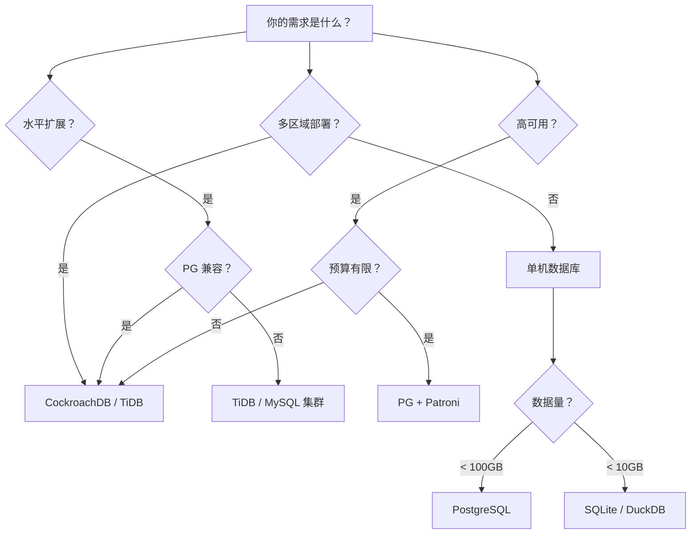

# CockroachDB 使用场景

## 学习目标

- 掌握 CockroachDB 的典型使用场景与设计定位的匹配关系
- 理解 CockroachDB 在多区域部署、SaaS 多租户、高可用系统中的具体用法
- 对比 CockroachDB 与 PostgreSQL/TiDB/MySQL 的场景选择策略

## 核心场景：多区域分布式应用

### 跨数据中心部署

CockroachDB 最大的优势是跨多个数据中心部署：



**优势**：

- 单区域故障不影响服务（Raft 自动选举新 Leader）
- 低延迟读：从就近区域读取（Follower Read）
- 数据一致性：跨区域强一致事务

### 多区域配置示例

```yaml
# 区域配置
regions:
  - name: us-east
    nodes: 3
  - name: us-west
    nodes: 3
  - name: eu-west
    nodes: 3

# 副本分布策略
replication:
  factor: 9  # 总副本数
  zones: [us-east, us-west, eu-west]
```

## SaaS 多租户系统

### 自动分片优势

传统 SaaS 多租户需要手动分库分表：

```sql
-- 传统方案：手动分表
CREATE TABLE tenant_1_orders (...);
CREATE TABLE tenant_2_orders (...);
CREATE TABLE tenant_100_orders (...);
```

**CockroachDB 方案**：

```sql
-- 自动按租户 ID 分片
CREATE TABLE orders (
    tenant_id INT,
    order_id INT,
    customer_id INT,
    amount DECIMAL,
    PRIMARY KEY (tenant_id, order_id)
);

-- 租户数据自动分布在不同的 Range
-- 无需手动管理分库分表
```

**优势**：

- 租户隔离：每个租户的数据集中在少数 Range
- 自动再平衡：租户数据量变化时自动迁移
- 透明扩展：添加节点即可扩容

### 租户数据隔离查询

```sql
-- 查询特定租户的订单（只扫描该租户的 Range）
SELECT * FROM orders WHERE tenant_id = 123;

-- 查询计划优化：Range Key 过滤
-- Range: tenant_id [123, 123] → 只扫描租户 123 的数据
```

## 高可用关键业务

### 金融支付系统

```mermaid
sequenceDiagram
    participant App AS 支付应用
    participant CRDB AS CockroachDB
    participant Raft AS Raft 日志

    App->>CRDB: BEGIN; UPDATE accounts SET balance = balance - 100 WHERE id = 1;
    CRDB->>CRDB: 检测 Write Intent 冲突
    CRDB->>Raft: Raft 日志复制到 Follower
    Raft-->>CRDB: 日志确认
    App->>CRDB: UPDATE accounts SET balance = balance + 100 WHERE id = 2;
    CRDB->>Raft: Raft 日志复制
    Raft-->>CRDB: 日志确认
    App->>CRDB: COMMIT; (2PC)
    CRDB-->>App: 事务提交成功
```

**优势**：

- 强一致性：确保转账不丢钱、不重复
- 容错自愈：节点故障自动切换
- 合规性：符合金融监管要求

### 订单库存系统

```sql
-- 订单创建 + 库存扣减（跨表事务）
BEGIN;

INSERT INTO orders (order_id, user_id, amount)
VALUES (123, 456, 100.00);

UPDATE inventory
SET stock = stock - 1
WHERE product_id = 789 AND stock > 0;

COMMIT;
```

**优势**：

- 跨表事务保证一致性
- 自动容错，无单点故障

## 对比其他数据库

### 与 PostgreSQL 对比

| 场景 | PostgreSQL | CockroachDB |
|------|------------|-------------|
| 单机应用 | 推荐（性能优） | 不推荐（开销大） |
| 多区域部署 | 需手动配置流复制 | 推荐（自动复制） |
| 高可用 | 需 Patroni/RepMgr | 推荐（内置 Raft） |
| 水平扩展 | 需手动分库分表 | 推荐（自动分片） |
| 复杂查询 | 推荐（优化器强） | 有限（分布式开销） |

### 与 TiDB 对比

| 场景 | TiDB | CockroachDB |
|------|------|-------------|
| MySQL 兼容 | 推荐 | 不适用 |
| PostgreSQL 兼容 | 不适用 | 推荐 |
| 大规模分析 | 推荐（TiFlash 列存） | 有限（无列存） |
| OLTP 事务 | 推荐 | 推荐 |
| 多区域部署 | 推荐 | 推荐 |
| 开源协议 | Apache 2.0 | BSL |

## 何时不应使用 CockroachDB

| 场景 | 原因 | 替代方案 |
|------|------|----------|
| 单机小应用 | 功能过剩，开销大 | PostgreSQL / SQLite |
| 实时分析查询 | 无列存，分析性能差 | DuckDB / ClickHouse |
| 图数据查询 | 无图索引 | Neo4j / JanusGraph |
| 时序数据 | 无时序优化 | TimescaleDB / InfluxDB |
| 超大规模数据（PB 级） | Range 分片开销 | Bigtable / Spanner |

## 场景选择决策树



## 要点总结

- CockroachDB 最适合多区域部署、SaaS 多租户、高可用 OLTP 场景
- 跨区域强一致事务是最大优势，但也带来延迟开销
- 自动 Range 分片简化了手动分库分表的运维负担
- 与 PG 相比，功能更强但性能开销更大，适合分布式场景
- 与 TiDB 相比，PG 兼容是关键差异点，MySQL 用户选择 TiDB

## 思考题

1. 在 SaaS 多租户场景中，CockroachDB 的自动 Range 分片相比手动分库分表，有哪些运维优势？性能上有何差异？
2. 多区域部署时，跨区域 Raft 日志复制的延迟开销如何通过 Follower Read 和 Leader 偏好配置优化？
3. CockroachDB 在金融支付场景中的强一致性保证，相比传统数据库（如 Oracle RAC）有何优势和劣势？
4. 如果你的应用是单机应用，未来可能扩展到分布式，是否应该一开始就选择 CockroachDB？为什么？