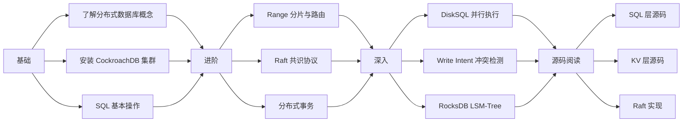

# CockroachDB 学习资源

## 学习目标

- 了解 CockroachDB 的官方文档结构、社区资源、推荐书籍
- 掌握 CockroachDB 源码阅读路径和关键入口点
- 建立系统化的 CockroachDB 学习路线图

## 官方文档

### 文档入口

- **CockroachDB 官网**：[https://www.cockroachlabs.com](https://www.cockroachlabs.com)
- **文档首页**：[https://www.cockroachlabs.com/docs/stable](https://www.cockroachlabs.com/docs/stable)
- **GitHub 仓库**：[https://github.com/cockroachdb/cockroach](https://github.com/cockroachdb/cockroach)
- **API 参考**：[https://www.cockroachlabs.com/docs/stable/sql-statements](https://www.cockroachlabs.com/docs/stable/sql-statements)

### 文档结构

```
docs/
├── stable/              # 稳定版文档
│   ├── install/         # 安装指南
│   ├── cluster/         # 集群管理
│   ├── sql/             # SQL 语法参考
│   ├── transactions/    # 事务指南
│   ├── performance/     # 性能调优
│   └── deploy/          # 部署指南
├── releases/            # 发布说明
└── advisory/            # 技术咨询
```

### 关键文档

- **SQL 语法参考**：CockroachDB 的 SQL 与 PostgreSQL 的差异对照
- **事务指南**：分布式事务的配置和使用最佳实践
- **性能调优**：Range 分片、索引设计、查询优化

## 推荐书籍

### 核心论文

- **《Spanner: Google's Globally-Distributed Database》**：CockroachDB 的架构灵感来源，描述了 TrueTime + 2PC + 分布式事务
- **《In Search of an Understandable Consensus Algorithm (Raft)》**：Raft 共识协议的设计论文，CockroachDB 的复制层基础
- **《Paxos Made Simple》**：Paxos 共识协议论文，与 Raft 对比理解
- **《The Design of the RocksDB Storage Engine》**：RocksDB 设计论文，CockroachDB 的存储层基础

### 参考书籍

- **《Designing Data-Intensive Applications》**（Martin Kleppmann）：分布式系统设计的必读书，覆盖分区、复制、事务、一致性模型
- **《Database Internals》**（Alex Petrov）：深入理解 LSM-Tree、B-Tree、分布式事务实现
- **《Distributed Systems》**（Maarten van Steen, Andrew S. Tanenbaum）：分布式系统理论基础

## 源码阅读路径

### 源码结构

```
pkg/
├── sql/                  # SQL 层
│   ├── parser/          # SQL 解析器
│   ├── planner/         # 查询计划器
│   ├── opt/             # 优化器（Cascades 风格）
│   ├── distsql/         # DistSQL 分布式执行
│   └── exec/            # 执行器
├── kv/                   # KV 存储层
│   ├── txn/             # 事务协调
│   ├── kvserver/        # KV 服务器
│   └── kvclient/        # KV 客户端
├── storage/              # 存储引擎
│   ├── engine/          # 引擎接口
│   └── rocksdb/         # RocksDB 适配
├── raft/                 # Raft 共识
│   ├── raftpb/          # Raft 协议消息
│   └── tracker/         # Raft 跟踪
├── roachpb/              # 核心协议消息
├── server/               # 服务器
├── cli/                  # CLI 工具
└── ccl/                  # 企业版功能
```

### 推荐阅读顺序

```
1. pkg/sql/parser/          # SQL 解析器入口
2. pkg/sql/planner/         # 查询计划器
3. pkg/sql/opt/             # 优化器（Cascades 风格）
4. pkg/sql/distsql/         # 分布式 SQL 执行
5. pkg/kv/txn/              # 事务协调
6. pkg/kv/kvserver/         # KV 服务器（Range 管理）
7. pkg/raft/                # Raft 共识
8. pkg/storage/engine/      # 存储引擎
```

### 关键源码入口

**SQL 解析器**：`pkg/sql/parser/parse.go`

```go
// SQL 解析入口
func Parse(sql string) ([]Statement, error) {
    scanner := NewScanner(sql)
    parser := NewParser(scanner)
    return parser.Parse()
}
```

**事务协调器**：`pkg/kv/txn/txn_coord_sender.go`

```go
// 事务协调入口
func (tc *TxnCoordSender) Send(ctx context.Context, ba *roachpb.BatchRequest) (*roachpb.BatchResponse, error) {
    // 1. 获取 HLC 时间戳
    // 2. 发送请求到目标 Range
    // 3. 处理 Write Intent 冲突
    // 4. 协调 2PC 提交流程
}
```

**Raft 实现**：`pkg/raft/raft.go`

```go
// Raft 核心循环
func (r *raft) Step(m pb.Message) error {
    switch m.Type {
    case pb.MsgHup:
        return r.campaign()  // 发起选举
    case pb.MsgVote:
        return r.handleVoteRequest(m)  // 处理投票
    case pb.MsgApp:
        return r.handleAppendEntries(m)  // 处理日志复制
    }
}
```

## 社区资源

### GitHub

- **CockroachDB 主仓库**：[https://github.com/cockroachdb/cockroach](https://github.com/cockroachdb/cockroach)
- **CockroachDB 社区文档**：[https://github.com/cockroachdb/docs](https://github.com/cockroachdb/docs)

### 社区

- **GitHub Issues**：Bug 报告和功能请求
- **CockroachDB Slack**：社区讨论（[https://cockroachlabs.com/community](https://cockroachlabs.com/community)）
- **Stack Overflow**：`cockroachdb` 标签

### 博客

- **CockroachDB 博客**：[https://www.cockroachlabs.com/blog](https://www.cockroachlabs.com/blog)（技术深度文章）

## 学习路线图



## 要点总结

- CockroachDB 官方文档是学习分布式 SQL 和集群管理的最佳入口
- 源码阅读推荐顺序：SQL 解析 → 查询计划 → 事务协调 → Range 管理 → Raft 共识
- 核心论文：Spanner、Raft、RocksDB，是理解 CockroachDB 设计的基础
- 社区以 GitHub Issues 和 Slack 为最活跃渠道
- 学习路线图：基础 → 进阶 → 深入 → 源码阅读

## 思考题

1. CockroachDB 的源码结构相比 PostgreSQL 的源码（`src/backend/`）有哪些差异？Go 语言实现比 C 实现有哪些优势和劣势？
2. CockroachDB 的 Raft 实现（`pkg/raft/`）与 etcd 的 Raft 实现（`etcd/raft/`）有何异同？哪个更适合作为学习参考？
3. 如果要在你的项目中实现分布式事务，CockroachDB 的 2PC + Write Intent 机制中哪些部分可以借鉴？哪些部分需要简化？
4. CockroachDB 的源码中，Go 语言的 goroutine 和 channel 如何用于分布式任务的并发和协调？