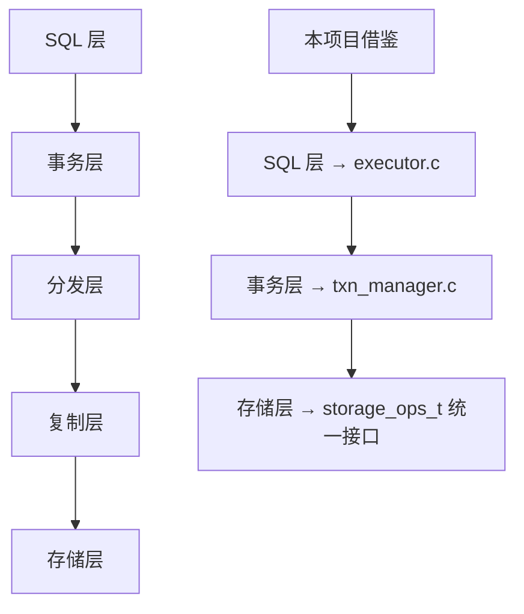

# 与本项目的关系

## 学习目标

- 理解 CockroachDB 的分布式设计思想如何指导本项目的存储引擎设计
- 掌握 CockroachDB 中可借鉴的关键技术点
- 明确本项目在学习 CockroachDB 时可以简化的部分

## 可借鉴的设计思想

### 1. 分层架构设计

CockroachDB 的五层架构（SQL → 事务 → 分发 → 复制 → 存储）提供了清晰的关注点分离：



**本项目应用**：

- **SQL 层**：`sql_executor.c` 负责解析和执行，与存储层解耦
- **事务层**：`txn_manager.c` 提供 MVCC 事务支持
- **存储层统一接口**：`storage_ops_t` 抽象层支持 KV/Vector/TimeSeries/Document 等多模态存储

### 2. Range 分片设计

CockroachDB 的 Range 分片（~512MB 自动分裂）提供了动态分片的参考：

```c
// 本项目可借鉴的 Range 分片结构
typedef struct range_descriptor_t {
    uint64_t range_id;          // Range ID
    key_range_t key_range;      // [start_key, end_key)
    uint64_t generation;        // 分裂代数
    replica_set_t replicas;     // 副本分布（分布式场景）
} range_descriptor_t;
```

**本项目应用**：

- **自动分裂**：当表数据量超过阈值时，按主键范围分裂
- **两层路由**：Meta Range 提供两级索引，加速 Range 定位
- **简化**：单机场景下无需 Raft 复制，Range 仅用于分片管理

### 3. HLC 混合逻辑时钟

CockroachDB 的 HLC（Hybrid Logical Clock）提供了分布式时钟的解决方案：

```c
// 本项目可借鉴的 HLC 实现
typedef struct hlc_timestamp_t {
    uint64_t physical_time;  // 物理时钟（NTP 同步）
    uint64_t logical_time;   // 逻辑时钟（冲突时递增）
} hlc_timestamp_t;

// HLC 比较
int hlc_compare(hlc_timestamp_t a, hlc_timestamp_t b) {
    if (a.physical_time != b.physical_time) {
        return a.physical_time < b.physical_time ? -1 : 1;
    }
    return a.logical_time < b.logical_time ? -1 : 1;
}
```

**本项目应用**：

- **分布式场景**：多节点事务需要全局一致的 timestamp
- **简化**：单机场景下可用单调递增的物理时钟（`clock_gettime`）
- **冲突检测**：通过 timestamp 判断事务先后顺序

### 4. Write Intent 机制

CockroachDB 的 Write Intent 提供了无锁 MVCC 的参考：

```c
// 本项目可借鉴的 Write Intent 结构
typedef struct write_intent_t {
    txn_id_t txn_id;          // 事务 ID
    hlc_timestamp_t timestamp; // HLC 时间戳
    key_t key;                // 写入的 Key
    value_t value;            // 写入的值
    intent_state_t state;     // PENDING / COMMITTED / ABORTED
} write_intent_t;

// 检测 Write Intent 冲突
bool check_write_intent_conflict(write_intent_t *intent, txn_id_t current_txn) {
    if (intent->state == PENDING && intent->txn_id != current_txn) {
        return true;  // 冲突
    }
    return false;
}
```

**本项目应用**：

- **无锁设计**：避免传统行级锁的开销
- **冲突检测**：读取时检查 Write Intent，而非加锁等待
- **简化**：单机场景下无需跨节点协调，直接本地检查

## 可简化的部分

### 1. Raft 共识协议

CockroachDB 的每个 Range 独立 Raft 组是高可用的核心，但单机场景无需 Raft：

**本项目简化**：

```c
// 单机场景：无需 Raft，直接写入本地存储
typedef struct replica_manager_t {
    // 分布式场景：Raft 状态机
    // raft_state_t raft_state;

    // 单机场景：简化为空
    void *unused;
} replica_manager_t;
```

### 2. DistSQL 分布式执行

CockroachDB 的 DistSQL 将查询计划分解到多个节点并行执行：

**本项目简化**：

```c
// 单机场景：无需 DistSQL，直接本地执行
typedef struct execution_plan_t {
    // 分布式场景：跨节点并行计划
    // distributed_plan_t dist_plan;

    // 单机场景：本地执行计划
    local_plan_t local_plan;
} execution_plan_t;
```

### 3. 两层 Meta Range 路由

CockroachDB 的 Meta Range 提供两级路由（Meta1 → Meta2 → Range）：

**本项目简化**：

```c
// 单机场景：内存中的 Range 路由表
typedef struct range_router_t {
    // 分布式场景：Meta Range 两级索引
    // meta_range_t meta1;
    // meta_range_t meta2;

    // 单机场景：直接内存哈希表
    hash_table_t range_map;  // key → range_descriptor_t
} range_router_t;
```

## 实际应用示例

### 1. Range 分片实现

```c
// engineering/src/db/storage/range_manager.c

typedef struct range_manager_t {
    range_descriptor_t *ranges;     // Range 数组
    size_t num_ranges;              // Range 数量
    uint64_t split_threshold;       // 分裂阈值（默认 512MB）
} range_manager_t;

// 自动分裂 Range
void range_auto_split(range_manager_t *mgr, range_id_t range_id) {
    range_descriptor_t *range = &mgr->ranges[range_id];

    // 检查是否超过阈值
    if (range->size < mgr->split_threshold) {
        return;
    }

    // 计算分裂点（中位数）
    key_t mid_key = find_median_key(range);

    // 创建新 Range
    range_descriptor_t new_range = {
        .range_id = mgr->num_ranges++,
        .key_range = {mid_key, range->key_range.end},
        .generation = range->generation + 1
    };

    // 更新旧 Range
    range->key_range.end = mid_key;
    range->generation++;

    // 添加新 Range
    mgr->ranges = realloc(mgr->ranges, sizeof(range_descriptor_t) * mgr->num_ranges);
    mgr->ranges[mgr->num_ranges - 1] = new_range;
}
```

### 2. HLC 时钟实现

```c
// engineering/src/db/transaction/hlc.c

#include <time.h>

typedef struct hlc_clock_t {
    uint64_t physical_time;  // 物理时钟（纳秒）
    uint64_t logical_time;   // 逻辑时钟
} hlc_clock_t;

// 获取 HLC 时间戳
hlc_timestamp_t hlc_now(hlc_clock_t *clock) {
    struct timespec ts;
    clock_gettime(CLOCK_REALTIME, &ts);

    uint64_t now_ns = ts.tv_sec * 1000000000ULL + ts.tv_nsec;

    if (now_ns > clock->physical_time) {
        clock->physical_time = now_ns;
        clock->logical_time = 0;
    } else {
        clock->logical_time++;
    }

    return (hlc_timestamp_t) {
        .physical_time = clock->physical_time,
        .logical_time = clock->logical_time
    };
}
```

### 3. Write Intent 冲突检测

```c
// engineering/src/db/transaction/write_intent.c

typedef struct intent_manager_t {
    hash_table_t intents;  // key → write_intent_t
} intent_manager_t;

// 检查 Write Intent 冲突
bool check_conflict(intent_manager_t *mgr, key_t key, txn_id_t txn_id) {
    write_intent_t *intent = hash_table_get(&mgr->intents, key);

    if (!intent) {
        return false;  // 无冲突
    }

    if (intent->state == PENDING && intent->txn_id != txn_id) {
        return true;  // 冲突：其他事务正在写入
    }

    return false;
}

// 设置 Write Intent
void set_write_intent(intent_manager_t *mgr, key_t key, write_intent_t intent) {
    hash_table_insert(&mgr->intents, key, intent);
}

// 清理 Write Intent（事务提交或回滚）
void clear_write_intent(intent_manager_t *mgr, key_t key) {
    hash_table_remove(&mgr->intents, key);
}
```

## 要点总结

- **可借鉴**：分层架构、Range 分片、HLC 时钟、Write Intent 无锁机制
- **可简化**：Raft 共识、DistSQL 分布式执行、Meta Range 两级路由
- **应用场景**：本项目的单机存储引擎可以复用 CockroachDB 的设计思想，但在分布式协调部分做简化
- **核心思想**：关注点分离 + 接口抽象 + 动态分片 + 无锁并发

## 思考题

1. 如果本项目要从单机存储引擎演进到分布式存储引擎，CockroachDB 的哪些设计是必不可少的？哪些可以逐步引入？
2. CockroachDB 的 Range 分片（~512MB）与 PostgreSQL 的分区表（手动定义范围）相比，在运维和性能上有何差异？
3. 本项目如果要实现 Write Intent 机制，如何在现有的 MVCC 实现基础上改造？需要修改哪些模块？
4. HLC 混合逻辑时钟在单机场景下是否必要？如果只用物理时钟会有什么问题？