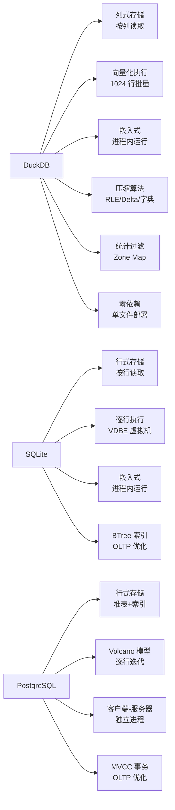

# DuckDB 项目概览

## 学习目标

- 了解 DuckDB 的项目定位、历史脉络与社区生态
- 掌握 DuckDB 作为嵌入式 OLAP 数据库的核心设计理念
- 建立对 DuckDB 全栈模块的整体认知框架，重点理解其与 OLTP 数据库（PostgreSQL/MySQL/SQLite）的根本差异

## 项目定位

> DuckDB 是一个面向**在线分析处理（OLAP）** 的嵌入式列式数据库，专为数据分析和科学计算场景设计。

**基本信息**：

- 开发方：荷兰 CWI（Centrum Wiskunde & Informatica）数据库研究组主导，Mark Raasveld、Hannes Mühleisen 等核心开发者
- 首次发布：2019 年（v0.1.0）
- 开源协议：MIT License
- 最新版本：v1.2.x（截至 2026 年；仍在快速迭代中）
- GitHub Stars：约 30k（[duckdb/duckdb](https://github.com/duckdb/duckdb)）
- 官方网站：[https://duckdb.org](https://duckdb.org)

## 核心设计理念

DuckDB 的设计哲学可以概括为四点：**嵌入式 OLAP**、**列式存储**、**向量化执行**、**零依赖部署**。

第一，**嵌入式 OLAP**。DuckDB 像 SQLite 一样嵌入在宿主进程内，无需独立安装数据库服务。但与 SQLite 面向 OLTP 不同，DuckDB 专门为分析型查询优化。用户只需一个 `.duckdb` 文件即可运行复杂的聚合查询，无需配置数据库集群。

第二，**列式存储**。DuckDB 按列而非按行存储数据。查询时只读取需要的列，大幅减少 I/O。列存天然适合分析查询的扫描-过滤-聚合模式，配合每列的统计信息（Zone Map）实现高效的谓词下推。

第三，**向量化执行引擎**。DuckDB 不采用传统 Volcano 模型的逐行 next() 调用，而是以 1024 行为一个向量（Vector）批量处理。批量处理减少了虚函数调用开销，并允许使用 SIMD 指令加速数据操作。这是 DuckDB 相对 SQLite 在分析场景下性能高出 10-100 倍的核心原因。

第四，**零依赖部署**。DuckDB 是单个二进制文件（C++ 编译），无外部依赖。支持 C/C++/Python/R/Java/Node.js 等多语言绑定，安装只需 `pip install duckdb` 或单文件下载。

## 核心优势与差异化特性

## 适用场景

| 场景 | 是否推荐 | 说明 |
|------|---------|------|
| 交互式数据分析 | 推荐 | Jupyter Notebook、数据探索、快速聚合 |
| ETL 数据管道 | 推荐 | 轻量级数据转换、CSV/Parquet 导入 |
| 嵌入式分析 | 推荐 | 移动端分析、IoT 设备统计、浏览器端（WASM） |
| 小规模数据科学 | 推荐 | 单机 GB-TB 级数据分析 |
| 高并发 OLTP | 不推荐 | 行级锁、无事务隔离、写性能有限 |
| 大规模多用户 | 不推荐 | 无连接池、无权限管理、单机限制 |

## 要点总结

- DuckDB 是嵌入式 OLAP 数据库，不是 OLTP 数据库——理解这一点是正确使用的关键
- 列式存储 + 向量化执行 + 压缩算法是性能三大支柱
- 与 SQLite 同属"嵌入式"，但分别面向 OLTP 和 OLAP 两个极端
- 不支持高并发写入、细粒度事务隔离、行级锁——OLAP 不需要这些
- 单文件存储、零依赖部署、多语言绑定使其成为数据科学工具的"标配"

## 思考题

1. DuckDB 为什么选择列式存储而非行式存储？列式存储在分析查询中具体节省了多少 I/O？
2. 向量化执行（1024 行批量）相比逐行执行（Volcano 模型）的性能优势来自哪些方面？
3. DuckDB 的嵌入式定位与 SQLite 有何本质不同？如果让 SQLite 处理 TPC-H 查询，预计性能差距有多大？
4. DuckDB 的零依赖设计对部署和分发带来了哪些好处？有哪些场景不适合嵌入式数据库？