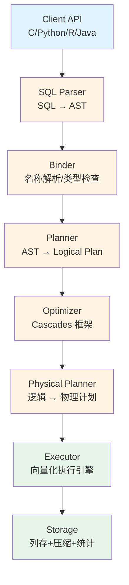
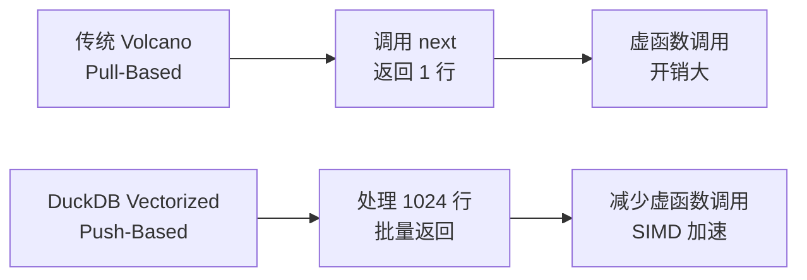

# DuckDB 架构总览

## 学习目标

- 掌握 DuckDB 的 8 层架构设计：Client API → SQL Parser → Binder → Planner → Optimizer → Physical Planner → Executor → Storage
- 理解列式存储、向量化执行、Push-Based 执行模型如何体现在架构设计中
- 对比 DuckDB 与 PostgreSQL/SQLite 的架构差异（Volcano vs Vectorized、Pull vs Push）

## 架构分层

DuckDB 的架构分为 8 层，从用户 API 到磁盘存储，每一层都针对 OLAP 工作负载优化。

### 1. Client API 层

DuckDB 提供多语言 API：

- **C API**：`duckdb.h` 头文件，所有其他语言的绑定都基于 C API
- **Python API**：`import duckdb`，返回 Pandas/Arrow DataFrame
- **R API**：`library(duckdb)`，集成 DBI 接口
- **Java API**：JDBC 驱动
- **Node.js API**：`duckdb` npm 包
- **WASM**：浏览器端运行 DuckDB（通过 WebAssembly 编译）

### 2. SQL Parser 层

**职责**：SQL 文本 → 抽象语法树（AST）

- 使用手写递归下降解析器（不依赖 YACC/Bison）
- 支持 SQL 标准语法 + PostgreSQL 兼容语法
- 生成 AST 节点（SelectNode、InsertNode、CreateNode 等）

### 3. Binder 层

**职责**：AST → 绑定后的逻辑计划

- **名称解析**：将表名/列名绑定到 Catalog 中的实际对象
- **类型检查**：检查表达式类型是否合法
- **列引用解析**：将 `SELECT a` 中的 `a` 绑定到具体的表列

### 4. Planner 层

**职责**：绑定后的 AST → 逻辑查询计划

- 生成逻辑算子树（LogicalGet、LogicalFilter、LogicalProjection、LogicalJoin 等）
- 逻辑算子与物理实现无关，只描述"做什么"

### 5. Optimizer 层

**职责**：逻辑计划 → 优化后的逻辑计划

DuckDB 使用**基于 Cascades 框架的优化器**：

- **规则优化**：谓词下推、列裁剪、子查询展开、Join 重排序
- **代价估算**：使用统计信息估算 Join 代价，选择最优 Join 顺序
- **物理选择**：为逻辑算子选择物理实现（如 Hash Join vs Merge Join）

### 6. Physical Planner 层

**职责**：优化后的逻辑计划 → 物理执行计划

- 生成物理算子（PhysicalTableScan、PhysicalHashJoin、PhysicalAggregate 等）
- 每个物理算子知道"如何执行"

### 7. Executor 层

**职责**：执行物理计划，返回结果

**核心创新：向量化执行引擎**

- **不采用 Volcano 模型**：没有 `next()` 逐行调用
- **向量化处理**：以 1024 行为一个 Vector，批量执行算子
- **Push-Based 执行模型**：数据从下游向上游推送，减少虚函数调用
- **SIMD 优化**：利用 AVX2/AVX-512 指令加速向量化操作

### 8. Storage 层

**职责**：列式存储、压缩、统计信息

- **列式存储**：每列独立文件/数据块
- **轻量压缩**：RLE、Delta、字典编码、FSST、Patas
- **统计信息**：每列维护 min/max/null_count，实现 Zone Map 过滤

## 与 PostgreSQL/SQLite 架构对比

| 维度 | DuckDB | PostgreSQL | SQLite |
|------|--------|------------|--------|
| 执行模型 | 向量化 + Push-Based | Volcano + Pull-Based | VDBE 字节码 |
| 批量大小 | 1024 行 | 1 行 | 1 行 |
| 存储模型 | 列式 | 行式（堆表） | 行式（BTree 表） |
| 优化器 | Cascades 框架 | System-R 风格 | 启发式规则 |
| 压缩 | 列压缩（RLE/Delta） | TOAST（大字段压缩） | 无（BTree 页面） |
| 事务隔离 | 有限 MVCC | 完整 MVCC | 5 级文件锁 |
| 适用场景 | OLAP 分析 | OLTP 事务 | OLTP 嵌入式 |

## 要点总结

- DuckDB 的架构每一层都为 OLAP 优化，与 OLTP 数据库（PG/SQLite）有根本差异
- 向量化执行引擎是性能核心，1024 行批量处理 + SIMD 指令 = 分析查询 10-100 倍加速
- Push-Based 执行模型减少虚函数调用，是向量化执行的配套设计
- 列式存储 + 压缩 + 统计信息 = I/O 大幅减少
- 架构简洁性（无独立 Buffer Pool、无复杂事务管理）换来 OLAP 专注优化

## 思考题

1. DuckDB 的向量化执行为何选择 1024 行作为批量大小？这个数字在 CPU 缓存、SIMD 寄存器、内存带宽之间如何权衡？
2. Push-Based 执行模型相比 Volcano 的 Pull-Based 模型，减少了哪些开销？为何传统数据库（PG/MySQL）一直沿用 Pull-Based？
3. DuckDB 的 Cascades 优化器相比 PostgreSQL 的 System-R 风格优化器，在 Join 重排序、物理选择上有何优势？
4. 列式存储架构下，为什么 DuckDB 不需要独立的 Buffer Pool？数据如何直接映射到内存？