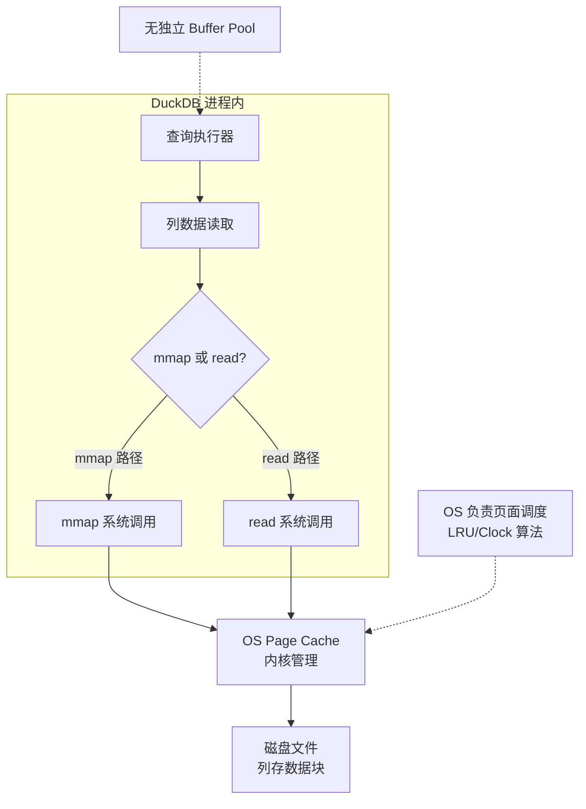
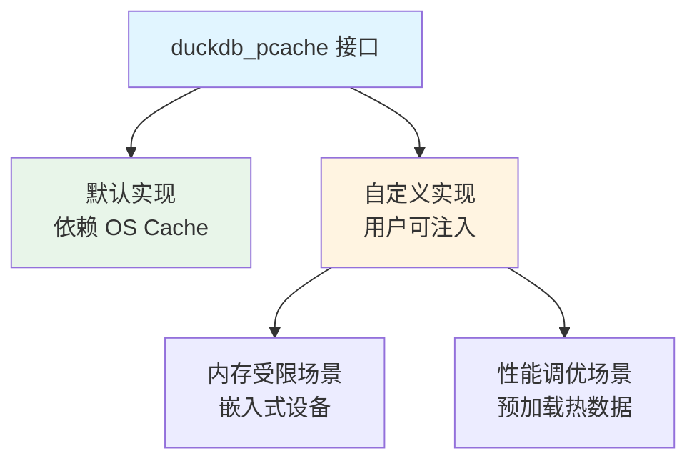
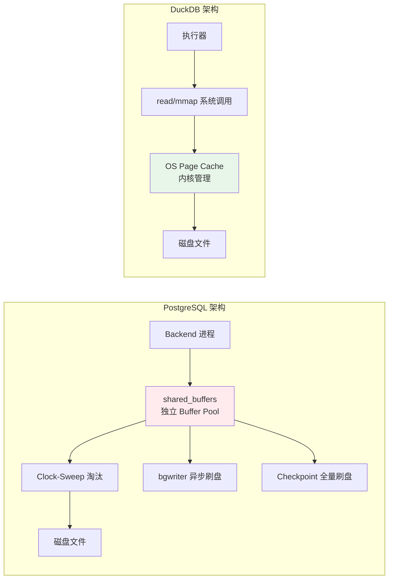
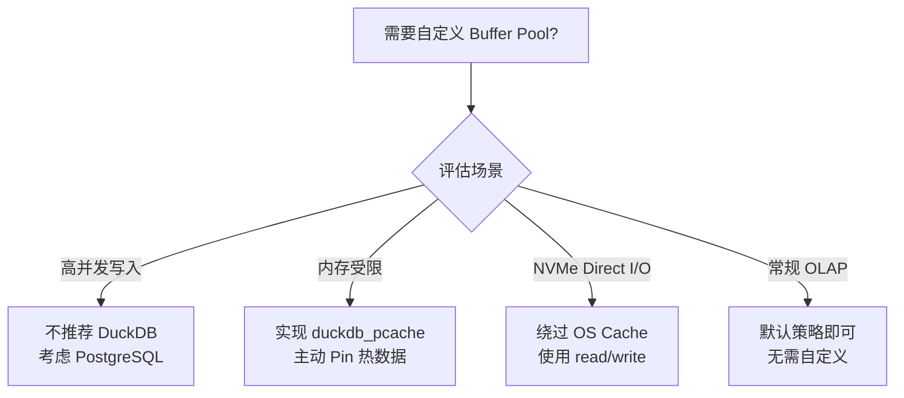
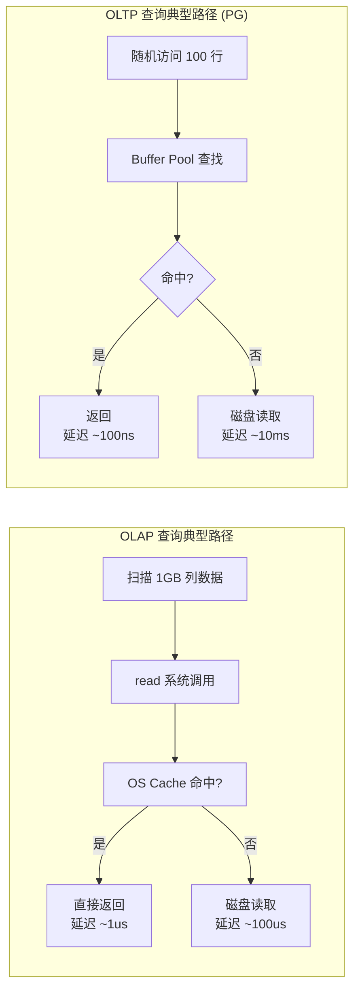

# Buffer Pool 实现

## 学习目标

- 理解 DuckDB 为何不实现独立 Buffer Pool，转而依赖 OS 页缓存
- 掌握 mmap 在列式存储中的应用优势与局限性
- 熟悉 DuckDB 的可插拔缓存接口设计与 sqlite3_pcache 兼容性

## 核心概念

- **OS Page Cache**：操作系统内核维护的文件缓存，DuckDB 直接利用而非自己实现
- **mmap（内存映射文件）**：将磁盘文件直接映射到进程地址空间，由 OS 负责页面调度
- **列存天然适合 mmap**：同一列数据连续存储，顺序扫描模式与 OS 预读机制完美匹配
- **duckdb_pcache 接口**：DuckDB 提供的可插拔缓存抽象层，兼容 SQLite 的 pcache 接口
- **无共享内存架构**：DuckDB 作为嵌入式数据库，进程内运行，无需跨进程共享缓存

## 架构设计

DuckDB 的设计哲学是"让操作系统做它擅长的事"。与 PostgreSQL 自己实现 Clock-Sweep Buffer Pool 不同，DuckDB 选择**完全信任 OS 页缓存**。



**关键决策**：DuckDB 认为现代 OS 的页缓存算法已经足够智能（Linux 的 LRU-2、Windows 的 Standby List），自己实现 Buffer Pool 只会增加复杂度，而不会带来明显的性能提升。

## 为何列存适合 mmap

列式存储的特点是：**同一列的数据连续存储**，查询时往往需要扫描整列或大范围区间。这种访问模式与 OS 的预读机制天然契合。

```mermaid
graph LR
    subgraph "行式存储 (PG)"
        A1[Page 0<br/>row1: col1,col2,col3]
        A2[Page 1<br/>row2: col1,col2,col3]
        A3[Page 2<br/>row3: col1,col2,col3]
    end

    subgraph "列式存储 (DuckDB)"
        B1[Column 1<br/>row1,row2,row3 连续]
        B2[Column 2<br/>row1,row2,row3 连续]
        B3[Column 3<br/>row1,row2,row3 连续]
    end

    Query[查询: SELECT SUM(col1)] -.读取整列.-> B1
    Query -.跳过.-> B2
    Query -.跳过.-> B3
```

**mmap 的优势**：

1. **预读优化**：OS 检测到顺序读取模式后，会自动预读后续页面到缓存
2. **零拷贝**：数据直接从 OS Cache 映射到用户空间，无需额外拷贝
3. **简化并发**：OS 页面锁由内核管理，无需应用层实现复杂的锁协议

**mmap 的局限**：

1. **随机写性能差**：不适合高并发写入场景（但 DuckDB 本身就是 OLAP，写入少）
2. **页面错误开销**：首次访问触发 Page Fault，有延迟
3. **进程崩溃风险**：mmap 的文件可能因进程异常写入而损坏

## DuckDB 的缓存策略

DuckDB 虽然不实现独立 Buffer Pool，但提供了**可插拔缓存接口**，允许用户自定义缓存行为：



**接口定义**（简化版）：

```c
typedef struct duckdb_pcache {
    void* (*Fetch)(duckdb_pcache* cache, uint64_t page_id, int* is_new);
    void (*Pin)(duckdb_pcache* cache, uint64_t page_id);
    void (*Unpin)(duckdb_pcache* cache, uint64_t page_id);
    void (*MarkDirty)(duckdb_pcache* cache, uint64_t page_id);
    void (*Flush)(duckdb_pcache* cache);
} duckdb_pcache;
```

这个接口设计与 SQLite 的 `sqlite3_pcache` 高度相似，方便从 SQLite 迁移用户。

## 与 PostgreSQL Buffer Pool 的对比



| 维度 | PostgreSQL Buffer Pool | DuckDB 无独立 Buffer Pool |
|------|------------------------|--------------------------|
| 缓存管理 | 应用层实现 Clock-Sweep | OS 内核实现 LRU-2/Standby |
| 共享内存 | 多进程共享 shared_buffers | 单进程内运行，无需共享 |
| 脏页刷盘 | bgwriter + checkpointer + backend 同步 | write/fsync 系统调用 |
| 页面大小 | 固定 8KB | 可变（由列数据块决定） |
| 大扫描保护 | ring buffer 隔离热点 | OS 自动平衡（不太需要） |
| 适用场景 | 高并发 OLTP，多进程共享 | 单进程 OLAP，分析查询 |

## 何时需要自定义 Buffer Pool

DuckDB 的默认策略在绝大多数场景下表现良好，但在以下情况可能需要自定义缓存：

1. **内存受限的嵌入式设备**：OS 可能激进地回收页面，需要应用层锁住热数据
2. **实时查询与后台加载并存**：需要区分优先级，避免后台加载挤占查询内存
3. **特定硬件优化**：NVMe SSD 的 Direct I/O 模式，绕过 OS Cache 减少拷贝



## 与 sqlite3_pcache 的兼容性

DuckDB 的缓存接口设计借鉴了 SQLite，方便用户迁移：

| 接口方法 | SQLite (sqlite3_pcache) | DuckDB (duckdb_pcache) |
|----------|------------------------|------------------------|
| 获取页面 | `xFetch` | `Fetch` |
| 引用计数 | `xPin` | `Pin` |
| 释放引用 | `xUnpin` | `Unpin` |
| 标记脏页 | `xDrop`（删除） | `MarkDirty` |
| 刷盘 | `xTruncate` | `Flush` |

**核心差异**：SQLite 的 `sqlite3_pcache` 主要用于 BTree 页面缓存（固定大小页面），而 DuckDB 的缓存是面向列数据块（可变大小）。

## 性能影响分析



**关键洞察**：OLAP 查询是**顺序扫描大块数据**，OS 预读 + mmap 足够高效；OLTP 查询是**随机访问小块数据**，需要应用层 Buffer Pool 来缓存热点。

## 要点总结

- DuckDB **不实现独立 Buffer Pool**，完全信任 OS 页缓存（mmap + read）
- 列式存储的顺序扫描模式与 OS 预读机制天然契合，无需应用层干预
- 提供 `duckdb_pcache` 接口允许自定义缓存策略，但默认策略已足够应对 OLAP 场景
- 与 PostgreSQL 的 shared_buffers 相比，DuckDB 的策略更简洁、更省内存，但不适合高并发 OLTP
- 单进程嵌入式架构决定了无需跨进程共享缓存，OS Cache 已足够

## 思考题

1. 为什么 PostgreSQL 必须实现独立的 Buffer Pool，而 DuckDB 可以完全依赖 OS Cache？两者的工作负载有何本质不同？
2. mmap 在列式存储中的性能优势来自哪些方面？如果 DuckDB 改用行式存储，mmap 还是一个好的选择吗？
3. 假设你要在内存只有 512MB 的嵌入式设备上运行 DuckDB，OS 可能激进地回收页面。你会如何设计自定义 Buffer Pool？
4. DuckDB 的单进程架构与 PostgreSQL 的多进程架构，在缓存设计上各有什么优劣？为什么 DuckDB 选择单进程？
