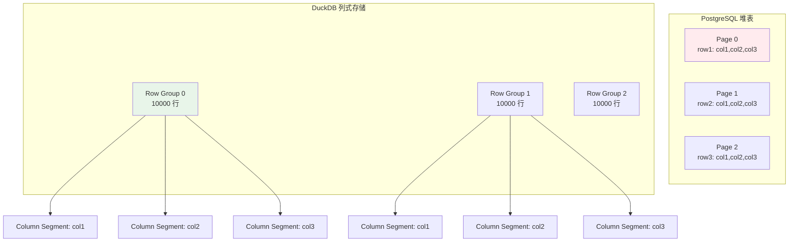
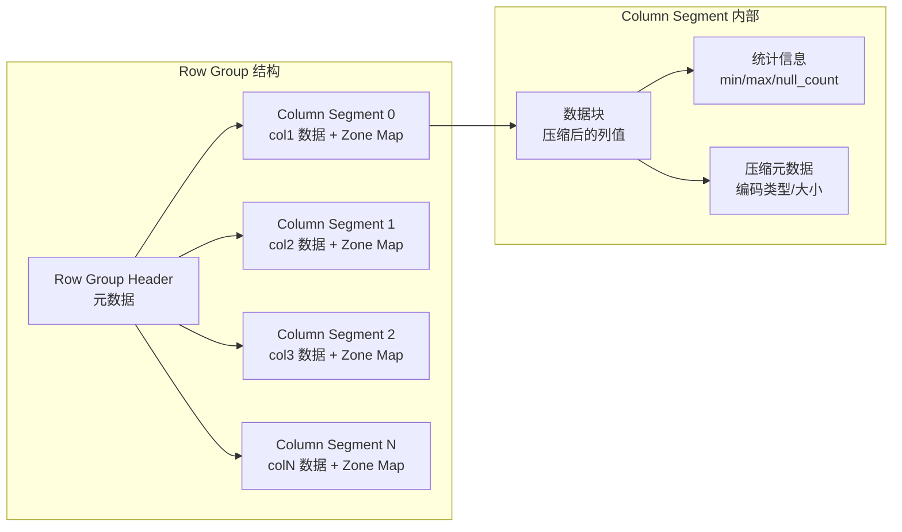
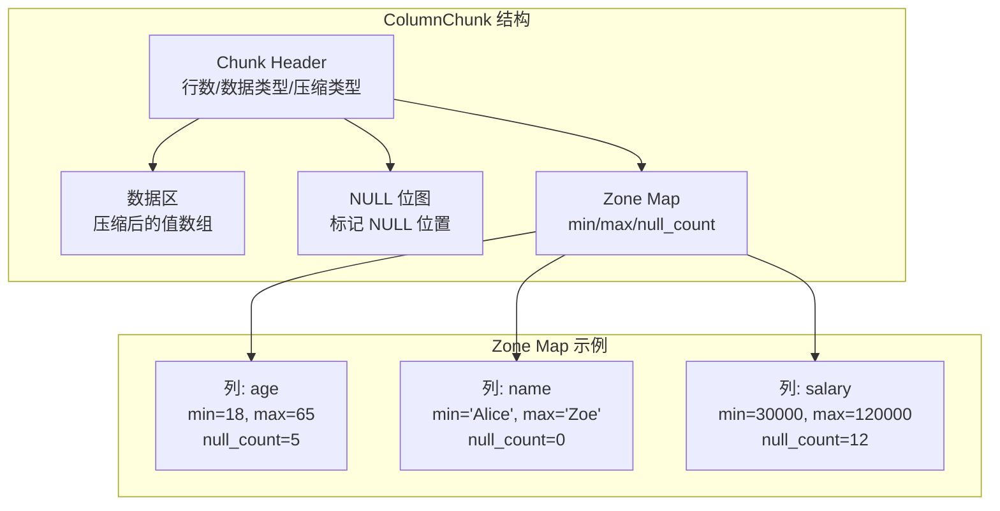
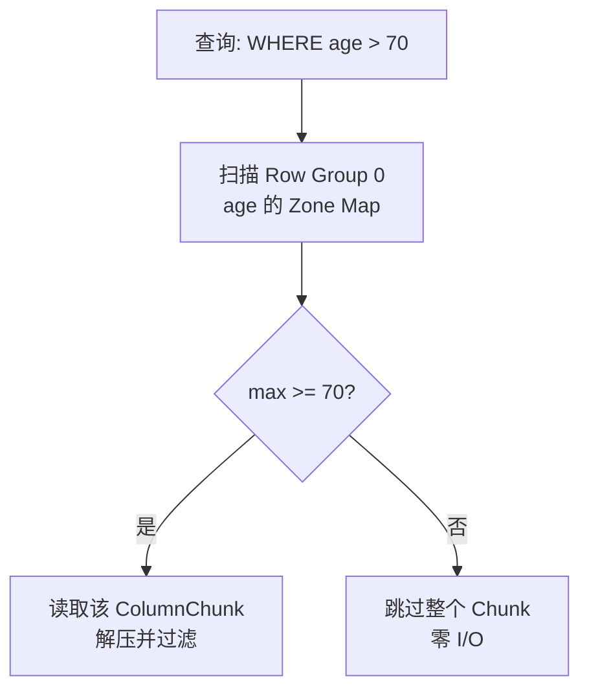
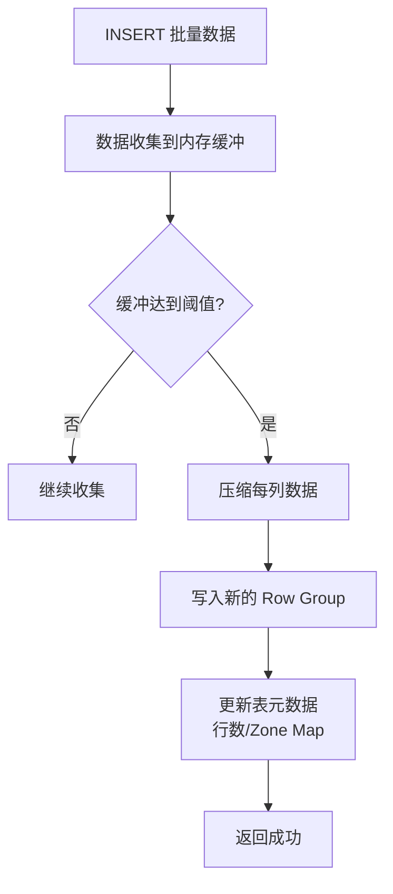
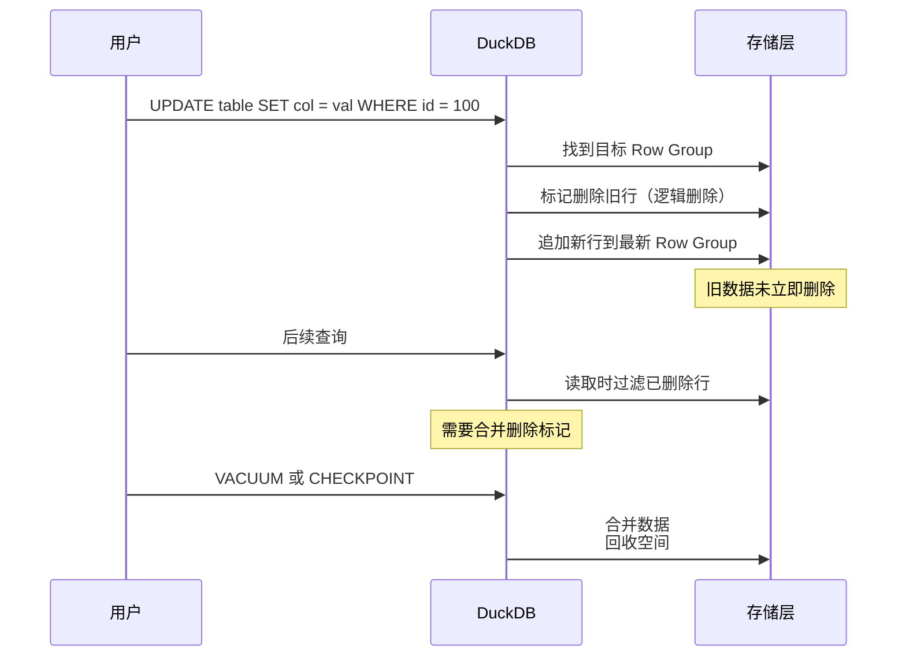
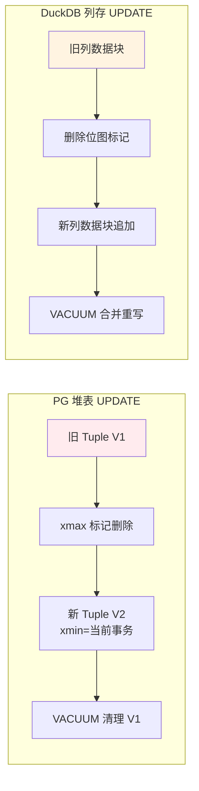
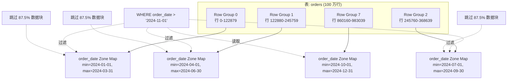

# Heap Table 堆表存储

## 学习目标

- 理解 DuckDB 为何无堆表概念，转而采用纯列式存储
- 掌握 ColumnChunk、Row Group、Column Segment 的三层存储结构
- 熟悉 Zone Map 统计信息如何实现高效的谓词下推过滤

## 核心概念

- **无堆表概念**：DuckDB 不使用 PG 风格的"无序堆 + ctid 指针"，每张表按列存储
- **ColumnChunk（列数据块）**：单列的一段连续数据，通常 10000-50000 行
- **Row Group（行组）**：一组行（如 10000 行）的所有列数据，是 DuckDB 的基本存储单元
- **Column Segment（列段）**：单个 Row Group 内的一列数据，对应一个 ColumnChunk
- **Zone Map（区域映射）**：每个 ColumnChunk 维护 min/max/null_count，用于过滤无用数据块
- **无 MVCC 行版本**：DuckDB 不维护 xmin/xmax，更新操作是"删除旧数据 + 追加新数据"

## 整体存储结构

DuckDB 的表存储是**纯列式**的，与 PostgreSQL 的堆表有根本差异：



**关键差异**：
- PG 的页面包含**完整行**（跨列），查询时需要读取整行再提取所需列
- DuckDB 的 Row Group 包含**分列存储**，查询时只读取需要的列

## Row Group 与 Column Segment

Row Group 是 DuckDB 的基本存储单元，默认包含 122880 行（可配置）。每个 Row Group 内部，每列独立存储为 Column Segment。



**设计原因**：

1. **批量处理效率**：Row Group 大小与向量化执行的批量大小（1024 行）对齐，方便整块加载
2. **压缩效率**：同一列数据类型一致，压缩比高（RLE/Delta/字典编码）
3. **并行扫描**：不同 Row Group 可并行处理，无锁竞争

## ColumnChunk 数据布局

ColumnChunk 是单个 Column Segment 的物理存储单元：



**Zone Map 的作用**：



**性能提升**：对于选择性高的查询（如"age > 70"只匹配 5% 数据），Zone Map 可以跳过 95% 的数据块，I/O 减少 20 倍。

## 写入路径

DuckDB 的写入是**批量追加**优化的，不支持高效的随机插入：



**关键步骤**：

1. **批量收集**：单行插入会先缓存在内存，凑够一个 Row Group 才刷盘
2. **列级压缩**：每列独立选择最优压缩算法（RLE/Delta/字典/FSST）
3. **追加写入**：新数据总是追加到文件末尾，不做随机插入

**性能影响**：
- 批量插入（INSERT INTO ... VALUES (...), (...), ...）性能极高
- 单行插入性能较差，需要等待缓冲凑够 Row Group

## 更新与删除

DuckDB 的更新和删除是**逻辑标记 + 后台合并**模式，与 PG 的 MVCC 不同：



**关键差异**：
- PG 的 UPDATE 会写入新版本，老版本通过 VACUUM 清理
- DuckDB 的 UPDATE 是"逻辑删除 + 追加新行"，需要显式 VACUUM 或等待后台合并

## 与 PostgreSQL 堆表的对比



| 维度 | PostgreSQL 堆表 | DuckDB 列存 |
|------|----------------|-------------|
| 数据组织 | 无序堆 + ctid 指针 | Row Group + Column Segment |
| 页面大小 | 固定 8KB | 可变（由 Row Group 决定） |
| UPDATE 代价 | 写入新版本，老版本待回收 | 逻辑删除 + 追加新行 + 后台合并 |
| 删除方式 | 标记 xmax，VACUUM 回收空间 | 删除位图，VACUUM 合并重写 |
| 随机插入 | 支持高效随机插入 | 仅优化批量追加 |
| Zone Map | 无（需依赖索引统计） | 每列自动维护 |
| MVCC | 完整行版本链 | 无行版本，逻辑删除 |

## Zone Map 过滤示例



**查询优化效果**：

```sql
-- 查询: 只需要 2024-11-01 之后的数据
SELECT COUNT(*) FROM orders WHERE order_date > '2024-11-01';

-- DuckDB 执行计划:
-- 1. 读取每个 Row Group 的 Zone Map（元数据，开销极小）
-- 2. 只有 Row Group 7 的 max >= 2024-11-01，需要读取
-- 3. 跳过 87.5% 的数据块，I/O 减少 8 倍
```

## 要点总结

- DuckDB **无堆表概念**，采用纯列式存储，每列独立存储为 Column Segment
- Row Group 是基本存储单元（默认 122880 行），内部按列划分为多个 Column Segment
- Zone Map（min/max/null_count）实现高效的谓词下推，可跳过无关数据块
- UPDATE 是"逻辑删除 + 追加新行"，需要显式 VACUUM 或后台合并
- 与 PG 堆表相比，列存不适合随机插入，但大幅优化了分析查询的 I/O

## 思考题

1. 为什么 DuckDB 选择 122880 行作为 Row Group 大小？这个数字在压缩效率、并行度、I/O 粒度之间如何权衡？
2. Zone Map 只记录 min/max/null_count，如果查询条件是"col BETWEEN min AND max 但实际无匹配"，会发生什么？
3. 假设一张表频繁更新（如状态字段从"待处理"变为"已完成"），DuckDB 的"逻辑删除 + 追加"模式会带来什么问题？如何优化？
4. 与 PG 堆表的 MVCC 行版本相比，DuckDB 的无版本设计在并发事务下有何优劣？
