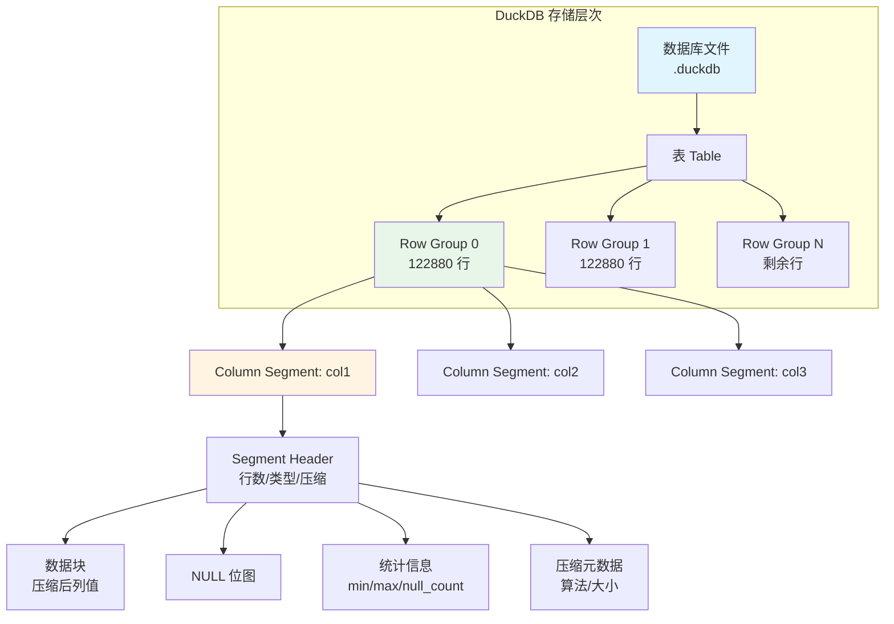
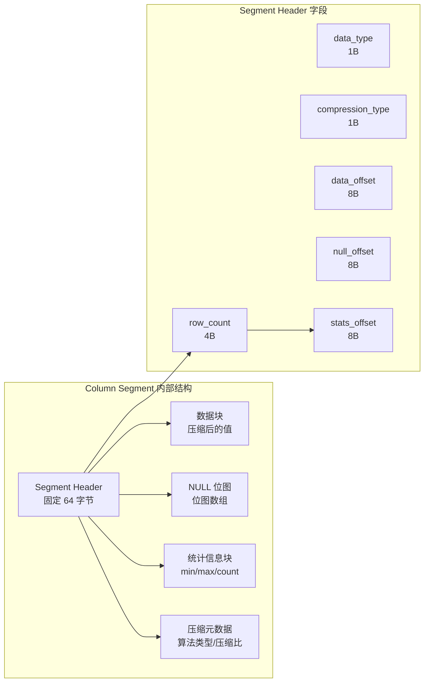
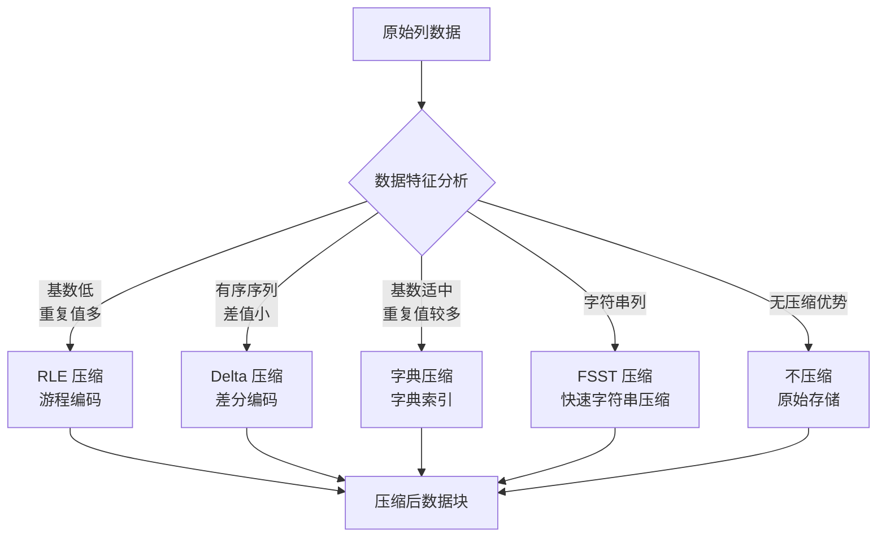
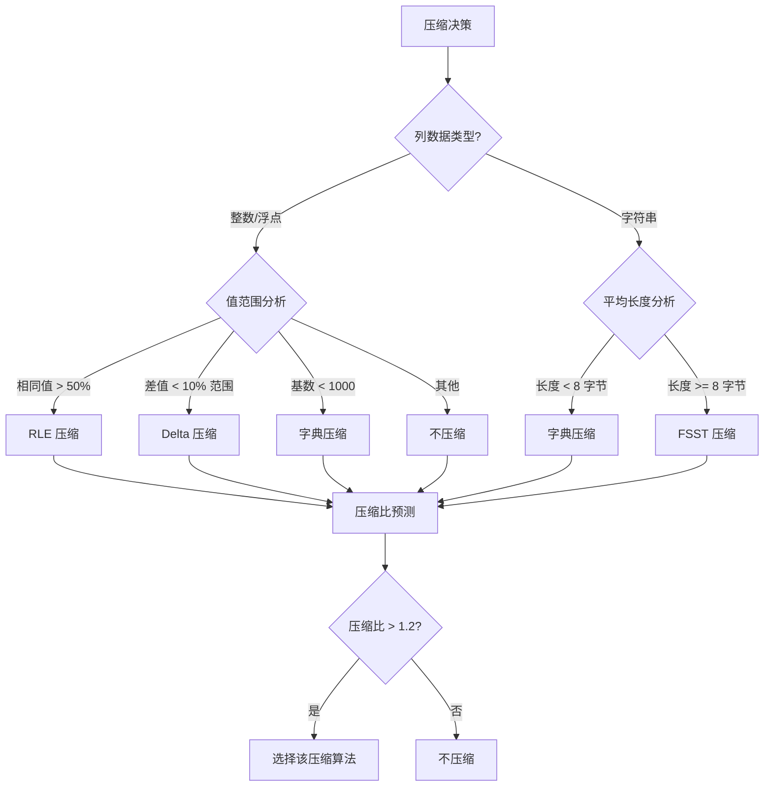
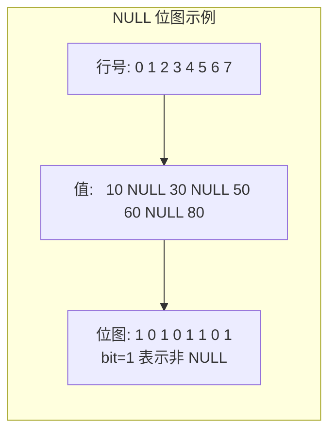
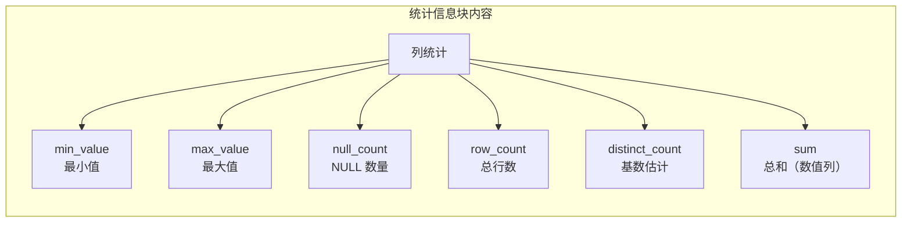
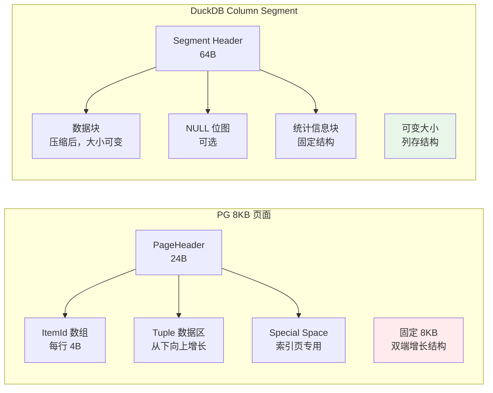
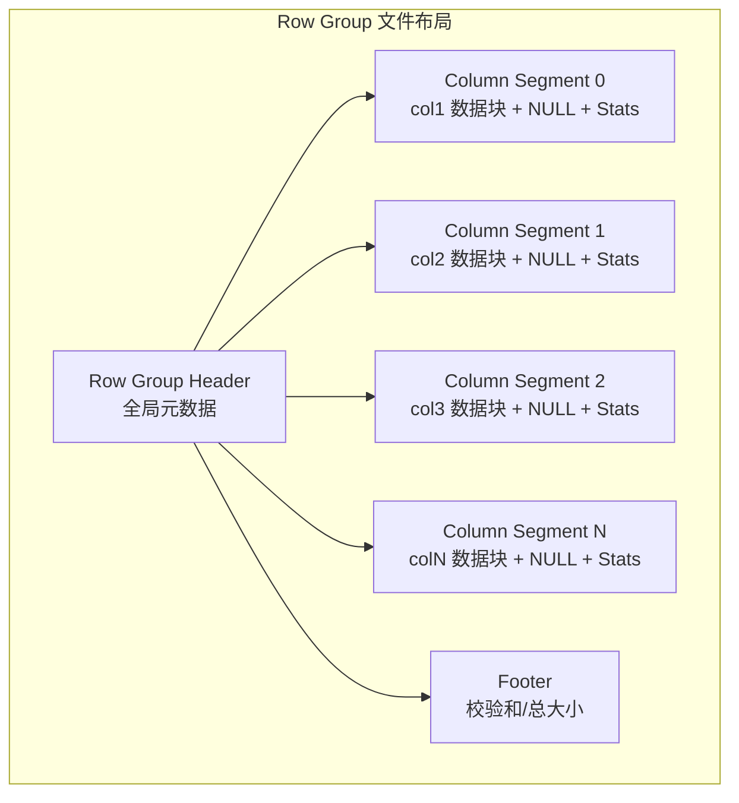

# Page 页面结构

## 学习目标

- 理解 DuckDB 为何无传统"页面"概念，转而采用 Row Group + Column Segment 结构
- 掌握 Column Segment 的数据布局：数据块 + NULL 位图 + 统计信息 + 压缩元数据
- 熟悉 DuckDB 的存储粒度与 PostgreSQL 8KB 页面的本质差异

## 核心概念

- **无固定页面大小**：DuckDB 不使用 PG 的 8KB 页面，存储粒度由 Row Group 决定
- **Row Group（行组）**：一组行（默认 122880 行）的所有列数据，是 DuckDB 的"逻辑页面"
- **Column Segment（列段）**：单个 Row Group 内的一列数据，物理上对应一个数据块
- **数据块（Data Block）**：压缩后的列值数组，大小可变（通常几 KB 到几百 KB）
- **NULL 位图**：标记哪些行为 NULL，与数据块分离存储
- **统计信息块（Statistics Block）**：存储 min/max/null_count/count 等聚合统计
- **压缩元数据（Compression Metadata）**：记录压缩算法类型、压缩前后大小

## 整体存储布局

DuckDB 的存储是**多层嵌套**结构，从上到下依次是：数据库 → 表 → Row Group → Column Segment → 数据块。



**关键差异**：
- PG 的页面是**固定 8KB**，每页包含多行完整记录
- DuckDB 的 Row Group 是**可变大小**（几十 MB），内部按列分块存储

## Column Segment 结构详解

每个 Column Segment 由四个部分组成：头部、数据块、NULL 位图、统计信息。



**Segment Header 字段说明**：

| 字段 | 大小 | 含义 |
|------|------|------|
| `row_count` | 4B | 该 Segment 包含的行数 |
| `data_type` | 1B | 数据类型（INT/BIGINT/VARCHAR 等） |
| `compression_type` | 1B | 压缩算法（Uncompressed/RLE/Delta/字典/FSST） |
| `data_offset` | 8B | 数据块在文件中的偏移 |
| `null_offset` | 8B | NULL 位图的偏移 |
| `stats_offset` | 8B | 统计信息块的偏移 |

## 数据块与压缩策略

数据块是列值的压缩存储，DuckDB 支持多种压缩算法：



**压缩算法选择策略**：



**示例**：

```c
// 原始列数据: [1, 1, 1, 1, 2, 2, 3, 3, 3, 3, 3]
// RLE 压缩后: [(value=1, count=4), (value=2, count=2), (value=3, count=5)]
// 压缩比: 11 个值 → 3 个对，约 3:1

// 原始列数据: [100, 101, 102, 103, 104]
// Delta 压缩后: [base=100, deltas=[0, 1, 2, 3, 4]]
// 压缩比: 5 个值 → 1 个 base + 5 个小整数，约 2:1

// 原始列数据: ['Alice', 'Bob', 'Alice', 'Alice', 'Bob']
// 字典压缩后: dictionary=['Alice', 'Bob'], indices=[0, 1, 0, 0, 1]
// 压缩比: 5 个字符串 → 2 个字典项 + 5 个索引，约 3:1
```

## NULL 位图存储

NULL 位图是一个 bit 数组，每一位对应一行：



**存储优化**：
- 如果某列**无 NULL 值**，则不存储 NULL 位图，节省空间
- NULL 位图本身也可以压缩（如果是长连续 NULL 段）

## 统计信息块

每个 Column Segment 维护详细的统计信息，用于查询优化：



**统计信息的作用**：

1. **Zone Map 过滤**：查询条件不落在 [min, max] 范围内时，跳过整个 Segment
2. **基数估计**：优化器用于估算选择率，选择最优 Join 策略
3. **聚合加速**：SUM/COUNT/AVG 可以直接从统计信息计算，无需扫描数据

```mermaid
flowchart TD
    A[查询: SELECT SUM(salary)] --> B[读取每个 Segment 的统计信息]
    B --> C[直接返回 sum 值]
    C --> D[零 I/O，毫秒级响应]

    style D fill:#e8f5e9
```

## 与 PostgreSQL 页面的对比



| 维度 | PostgreSQL 8KB Page | DuckDB Column Segment |
|------|---------------------|----------------------|
| 存储粒度 | 固定 8KB | 可变（几 KB 到几百 KB） |
| 数据组织 | 行式存储，每页含多行完整记录 | 列式存储，每个 Segment 只含一列 |
| 空间管理 | pd_lower/pd_upper 双指针 | 数据块 + NULL 位图分离 |
| 压缩 | TOAST（大字段外存） | 列级压缩（RLE/Delta/字典/FSST） |
| 统计信息 | 无页面级统计（需 ANALYZE） | 自动维护 min/max/null_count |
| 页面修复 | Page Prune + VACUUM | 无需修复（追加写入） |
| I/O 粒度 | 8KB（与 OS 页面对齐） | 由 Row Group 大小决定 |

## Row Group 的物理布局

一个 Row Group 在磁盘上的布局：



**Row Group Header 字段**：

| 字段 | 大小 | 含义 |
|------|------|------|
| `row_group_id` | 4B | Row Group 编号 |
| `row_count` | 4B | 包含的行数 |
| `column_count` | 4B | 列数 |
| `segment_offsets[]` | N * 8B | 每个 Column Segment 的起始偏移 |
| `checksum` | 4B | 整个 Row Group 的校验和 |

## 扫描路径

DuckDB 扫描一张表时，按 Row Group 并行处理：

```mermaid
flowchart TD
    A[SELECT SUM(col1) FROM table] --> B[读取表元数据<br/>Row Group 数量]
    B --> C[并行启动多个线程]
    C --> D[线程 1: 处理 Row Group 0-2]
    C --> E[线程 2: 处理 Row Group 3-5]
    C --> F[线程 3: 处理 Row Group 6-8]

    D --> G[每个线程: 读取 col1 的 Column Segment]
    E --> G
    F --> G

    G --> H[解压数据块<br/>利用 Zone Map 过滤]
    H --> I[向量化执行<br/>1024 行批量]
    I --> J[聚合结果]
    J --> K[汇总各线程结果]
```

**并行度优势**：
- 不同 Row Group 之间**零锁竞争**，每个线程独立处理
- PG 的堆表扫描需要逐页加锁，并行度受限

## 要点总结

- DuckDB **无固定页面大小**，存储粒度由 Row Group（默认 122880 行）决定
- Column Segment 是列数据的物理存储单元，包含：数据块 + NULL 位图 + 统计信息 + 压缩元数据
- 数据块采用多种压缩算法（RLE/Delta/字典/FSST），自动选择最优压缩
- 统计信息（min/max/null_count）支持 Zone Map 过滤和聚合加速
- 与 PG 的 8KB 页面相比，DuckDB 的可变粒度更适合批量分析

## 思考题

1. 为什么 DuckDB 不使用固定页面大小？可变粒度的 Row Group 在 I/O 效率与内存管理上有何优劣？
2. Column Segment 的统计信息（min/max/null_count）在哪些场景下会失效？如何检测和处理？
3. 假设一个列的值是完全随机的（无重复、无序），哪种压缩算法都不适用。DuckDB 会如何存储？
4. 与 PG 的 Page Prune 机制相比，DuckDB 的"追加写入 + 无修复"设计有何优劣？
