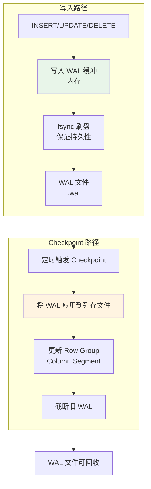
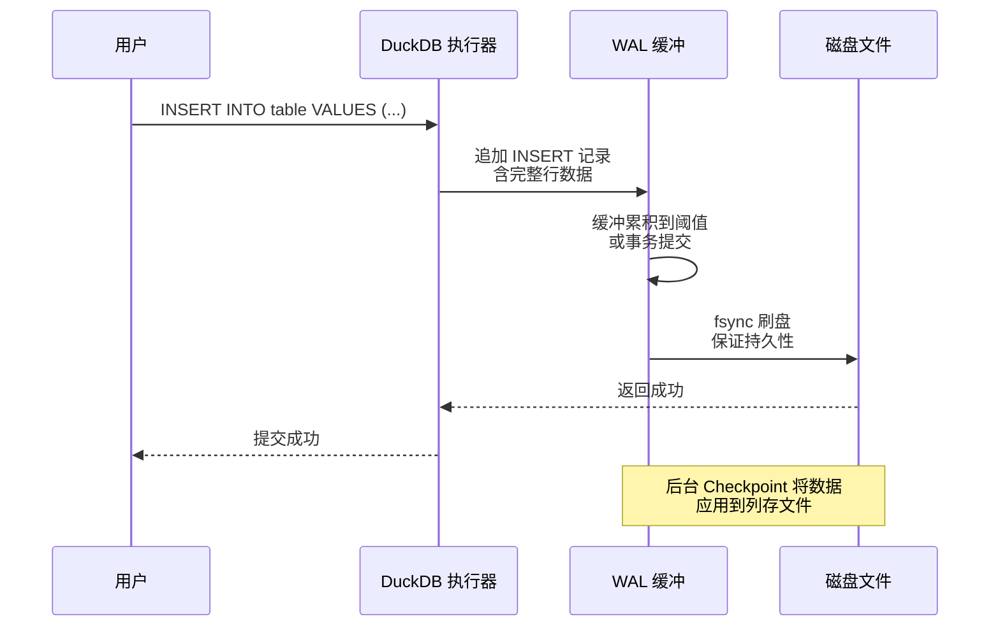
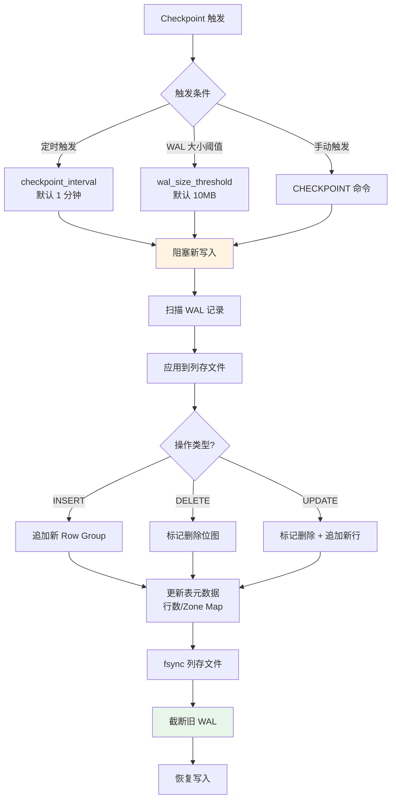
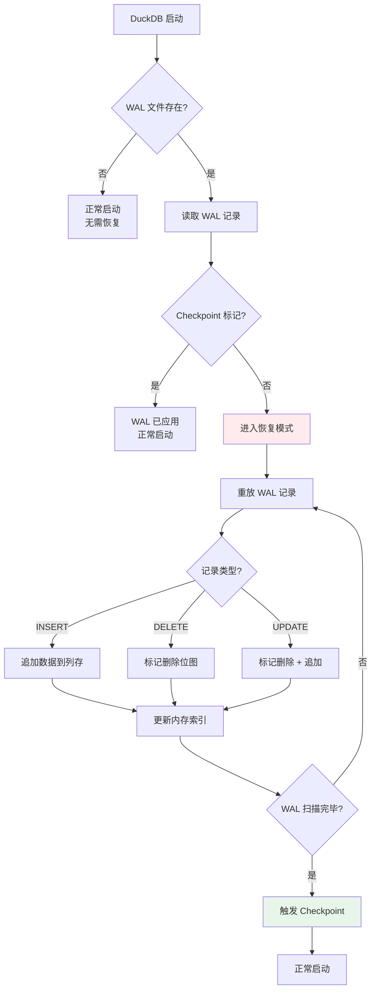
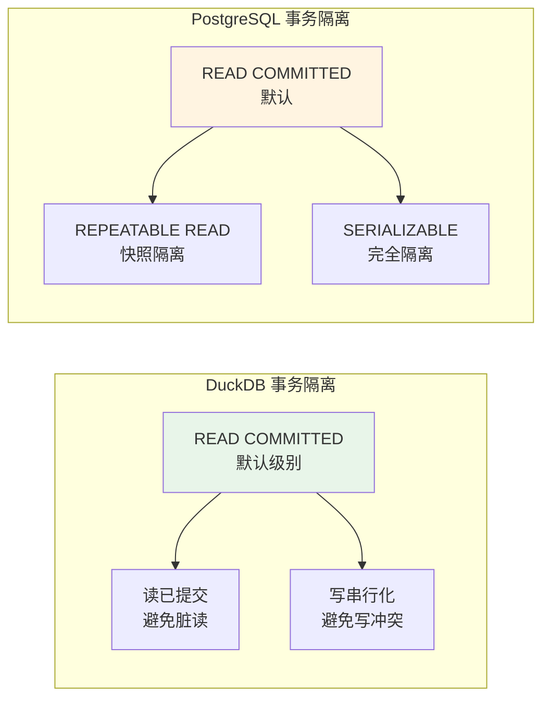
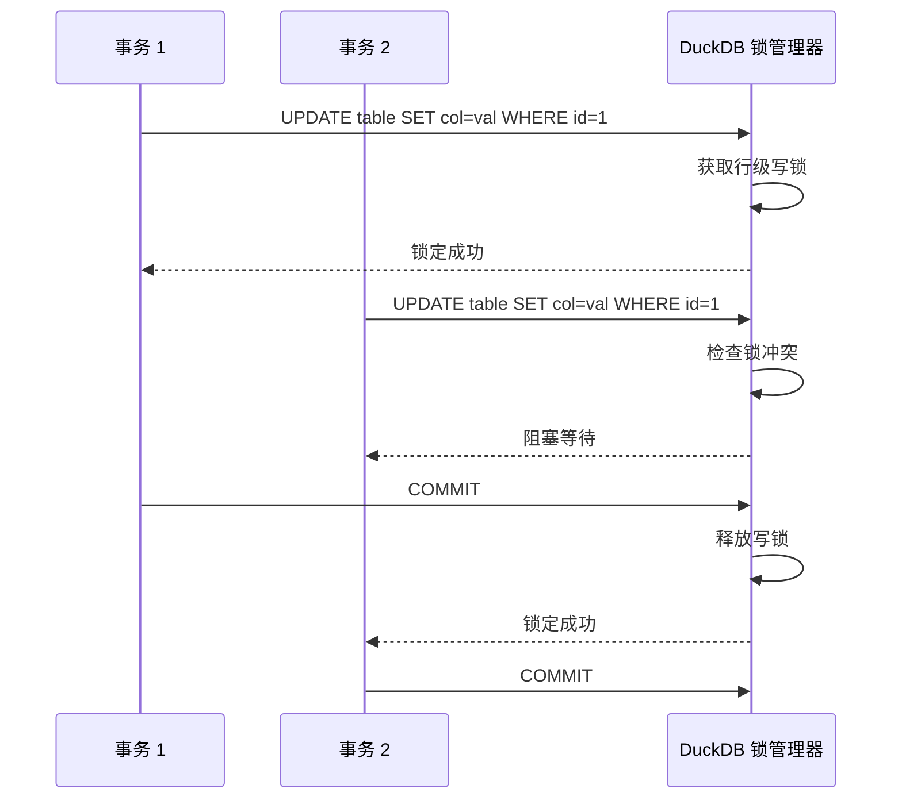
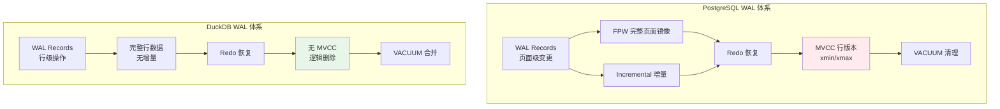
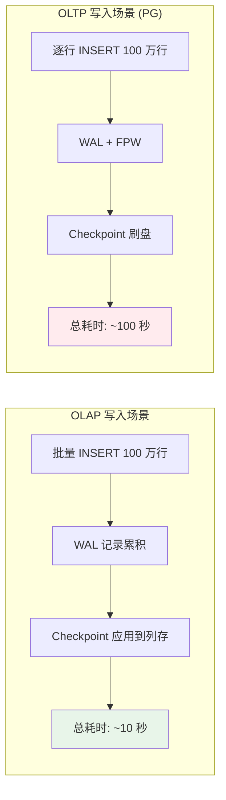

# WAL 预写日志

## 学习目标

- 理解 DuckDB 的 WAL 设计理念：append-only、无传统 MVCC、轻量级事务
- 掌握 WAL 写入策略、Checkpoint 机制、崩溃恢复流程
- 熟悉 DuckDB 与 PostgreSQL WAL 的本质差异（列存 vs 行存、无回滚段）

## 核心概念

- **append-only 设计**：DuckDB 的更新操作不覆盖原数据，而是追加新版本到 WAL
- **无传统 MVCC**：不维护 xmin/xmax 行版本链，事务隔离依赖时间戳 + 可见性判断
- **WAL 记录类型**：INSERT/DELETE/UPDATE/CREATE_TABLE/DROP_TABLE 等
- **Checkpoint**：将 WAL 中的变更应用到持久化列存文件，截断旧 WAL
- **无回滚段**：DuckDB 不实现 PG 风格的回滚段，事务回滚直接丢弃 WAL 缓冲

## 整体架构

DuckDB 的 WAL 设计比 PostgreSQL 简洁得多，核心思想是**追加写入 + 定期 Checkpoint**。



**关键差异**：
- PG 的 WAL 记录的是**页面级变更**（FPW + 增量）
- DuckDB 的 WAL 记录的是**行级操作**（INSERT/DELETE/UPDATE 的完整数据）

## WAL 写入流程



**写入策略**：
1. **延迟刷盘**：WAL 记录先缓存在内存，凑够一定量再 fsync
2. **批量提交**：多个事务的 WAL 记录可以批量刷盘，减少 I/O 次数
3. **无 FPW**：不需要 Full Page Writes，因为 DuckDB 不直接修改页面

## WAL 记录格式

DuckDB 的 WAL 记录比 PG 简洁，直接记录操作类型 + 数据：

```mermaid
graph LR
    subgraph "WAL 记录格式"
        A[记录头<br/>类型/长度/LSN]
        A --> B[操作类型<br/>INSERT/DELETE/UPDATE]
        A --> C[表 ID<br/>目标表标识]
        A --> D[行数据<br/>完整行内容]
        A --> E[可选: 旧值<br/>用于回滚]
    end

    subgraph "INSERT 记录示例"
        F[type: INSERT]
        F --> G[table_id: 42]
        G --> H[row: (id=1, name='Alice', age=30)]
    end

    subgraph "DELETE 记录示例"
        I[type: DELETE]
        I --> J[table_id: 42]
        J --> K[row_id: 行标识]
        K --> L[old_row: (id=1, name='Alice', age=30)]
    end

    subgraph "UPDATE 记录示例"
        M[type: UPDATE]
        M --> N[table_id: 42]
        N --> O[row_id: 行标识]
        O --> P[old_row: (id=1, name='Alice', age=30)]
        P --> Q[new_row: (id=1, name='Bob', age=31)]
    end
```

**与 PG 的对比**：

| 维度 | PostgreSQL WAL Record | DuckDB WAL Record |
|------|----------------------|-------------------|
| 记录粒度 | 页面级变更（增量或 FPW） | 行级操作（完整数据） |
| 记录大小 | 较小（增量）或较大（FPW） | 较大（完整行数据） |
| 回滚信息 | xmin/xmax + 回滚段 | 记录旧值（可选） |
| 压缩 | wal_compression 可选 | 自动压缩字符串列 |

## Checkpoint 机制

DuckDB 的 Checkpoint 是将 WAL 中的变更应用到持久化列存文件：



**关键步骤**：

1. **阻塞写入**：Checkpoint 期间暂停新的 INSERT/UPDATE/DELETE
2. **应用变更**：将 WAL 记录应用到列存文件（追加新的 Row Group 或更新删除位图）
3. **持久化**：fsync 列存文件，保证数据落盘
4. **截断 WAL**：删除已应用的 WAL 记录，回收空间

## 崩溃恢复

DuckDB 启动时检查 WAL 文件是否存在未应用的记录：



**恢复策略**：
1. **Redo-only**：DuckDB 只需重做 WAL 记录，无需 Undo（因为没有回滚段）
2. **幂等性**：同一条 WAL 记录多次重放结果相同，保证恢复正确性
3. **快速恢复**：WAL 记录数量通常较少（相比 PG 的 FPW），恢复速度快

## 事务隔离级别

DuckDB 支持 ACID 事务，但隔离级别较为简化：



**关键差异**：
- PG 支持 4 级隔离（Read Committed / Repeatable Read / Serializable / 可配置）
- DuckDB 只支持 Read Committed + 写串行化，不实现完整的 MVCC 快照

**并发控制**：



## 与 PostgreSQL WAL 的对比



| 维度 | PostgreSQL WAL | DuckDB WAL |
|------|----------------|------------|
| 记录粒度 | 页面级变更 | 行级操作 |
| FPW 机制 | 必须开启（防止部分写） | 无需（追加写入） |
| MVCC | 完整行版本链（xmin/xmax） | 无行版本（逻辑删除） |
| 回滚段 | 需要维护回滚段 | 无回滚段 |
| 隔离级别 | 4 级隔离 + 快照 | Read Committed + 写串行化 |
| Checkpoint | 阻塞写 + 全量刷盘 | 阻塞写 + 应用 WAL |
| 恢复速度 | 较慢（需处理 FPW） | 较快（直接应用行数据） |

## WAL 配置参数

| 参数 | 默认值 | 说明 |
|------|--------|------|
| `checkpoint_interval` | 1 分钟 | 自动 Checkpoint 触发间隔 |
| `wal_size_threshold` | 10MB | WAL 文件大小阈值 |
| `wal_autocheckpoint` | ON | 自动 Checkpoint 开关 |

**与 PG 的对比**：

| 参数 | PostgreSQL | DuckDB |
|------|------------|--------|
| Checkpoint 间隔 | `checkpoint_timeout`（5 分钟） | `checkpoint_interval`（1 分钟） |
| WAL 大小阈值 | `max_wal_size`（1GB） | `wal_size_threshold`（10MB） |
| 自动 Checkpoint | 默认开启 | 默认开启 |
| Full Page Writes | 必须开启 | 无需 |

## 性能影响分析



**关键洞察**：
- DuckDB 的 WAL 设计**不适合高并发写入**，因为没有行级锁和完整 MVCC
- DuckDB 适合**批量写入 + 分析查询**的 OLAP 场景
- PG 的 WAL 设计适合**高并发写入 + 随机访问**的 OLTP 场景

## 要点总结

- DuckDB 的 WAL 采用**append-only 设计**，更新操作不覆盖原数据，而是追加新版本
- **无传统 MVCC**，不维护 xmin/xmax 行版本链，事务隔离依赖时间戳 + 可见性判断
- WAL 记录的是**行级操作**（INSERT/DELETE/UPDATE 的完整数据），而非页面级变更
- Checkpoint 机制将 WAL 应用到列存文件，截断旧 WAL
- 与 PG 的 WAL + MVCC 相比，DuckDB 的设计更简洁，但不适合高并发 OLTP

## 思考题

1. 为什么 DuckDB 的 WAL 记录的是完整行数据，而非页面级变更？这种设计在 OLAP 和 OLTP 场景下各有什么优劣？
2. DuckDB 没有实现 Full Page Writes（FPW），这是否会导致崩溃恢复时出现部分写问题？为什么？
3. 假设 DuckDB 需要支持 REPEATABLE READ 隔离级别，需要引入哪些机制？这会如何影响 WAL 设计？
4. 与 PG 的 VACUUM 清理死元组相比，DuckDB 的"逻辑删除 + Checkpoint 合并"在空间回收效率上有何优劣？
