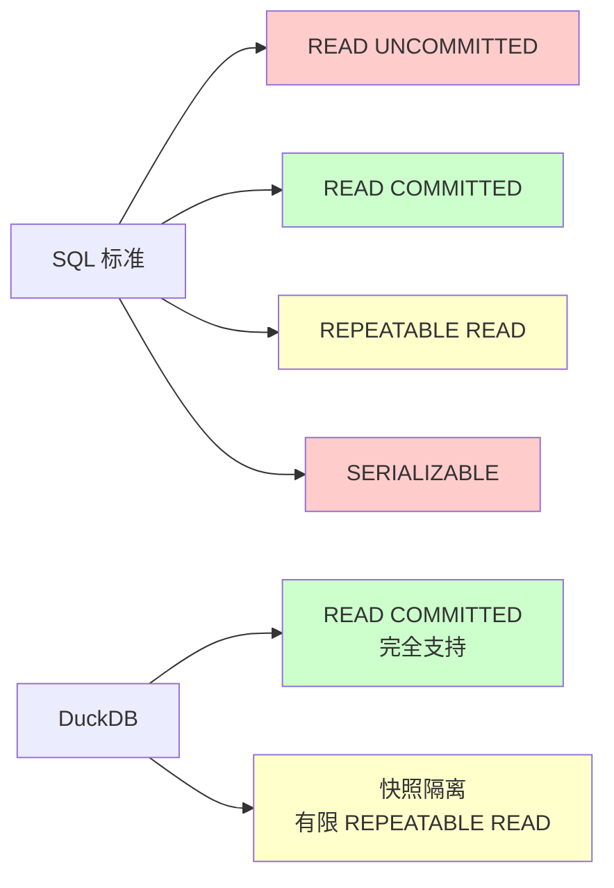

# DuckDB 事务隔离级别

## 学习目标

- 掌握 DuckDB 支持的事务隔离级别及其实现原理
- 理解 DuckDB 为何不实现完整的 REPEATABLE READ 和 SERIALIZABLE 隔离级别
- 对比 DuckDB 与 PostgreSQL/MySQL/SQLite 的隔离级别差异

## 核心概念

### 事务隔离级别概述

SQL 标准定义了 4 种事务隔离级别：

1. **READ UNCOMMITTED**：可以读取未提交的数据（脏读）
2. **READ COMMITTED**：只能读取已提交的数据
3. **REPEATABLE READ**：同一事务中多次读取结果相同（防止不可重复读）
4. **SERIALIZABLE**：完全隔离，防止幻读

### DuckDB 支持的隔离级别

DuckDB 只支持有限的隔离级别：

| 隔离级别 | 是否支持 | 实现程度 |
|----------|---------|----------|
| READ UNCOMMITTED | 不支持 | - |
| READ COMMITTED | 完全支持 | 默认级别 |
| REPEATABLE READ | 有限支持 | 快照隔离，但有幻读风险 |
| SERIALIZABLE | 不支持 | - |



## READ COMMITTED 隔离级别

### 实现原理

READ COMMITTED 是 DuckDB 的默认隔离级别：

```sql
-- 事务 T1
BEGIN;
SELECT * FROM users WHERE id = 1;  -- 读取版本 V1
-- 事务 T2 提交更新
SELECT * FROM users WHERE id = 1;  -- 读取版本 V2（T2 的更新）
COMMIT;
```

**关键点**：

- 每次查询都读取最新的已提交版本
- 不保证多次读取结果一致

### 版本可视性判断

```c
// DuckDB 的版本可视性判断
bool is_visible(ColumnChunkMetadata* metadata, int64_t current_timestamp) {
    // 如果数据块已被删除，不可见
    if (metadata->is_deleted) return false;

    // 如果数据块的事务已提交，且时间戳早于当前时间戳，可见
    if (metadata->max_timestamp <= current_timestamp) return true;

    // 否则不可见
    return false;
}
```

## 快照隔离（有限 REPEATABLE READ）

### 实现原理

DuckDB 的快照隔离基于 append-only 设计：

```sql
-- 事务 T1
BEGIN;
SELECT * FROM users;  -- 创建快照 S1（读取所有已提交数据）
-- 事务 T2 提交插入新数据
SELECT * FROM users;  -- 可能读到 T2 的插入（幻读）
COMMIT;
```

**关键问题**：

- DuckDB 的快照隔离**不保证**完全的 REPEATABLE READ
- 幻读可能发生，因为 append-only 设计导致新数据追加到表尾

### 幻读现象

```sql
-- 事务 T1
BEGIN;
SELECT COUNT(*) FROM users WHERE age > 30;  -- 结果：100
-- 事务 T2 插入新数据（age = 35）
SELECT COUNT(*) FROM users WHERE age > 30;  -- 结果：101（幻读）
COMMIT;
```

**原因**：

- DuckDB 的列式存储按追加顺序组织数据
- 新插入的数据追加到表尾，可能被后续查询扫描到
- 没有完整的快照版本链，无法完全隔离幻读

## 为何不支持 SERIALIZABLE

### OLAP 场景的需求

DuckDB 的设计针对 OLAP 场景：

1. **分析查询为主**：读取大量数据，写入频率低
2. **批量加载**：写入通常是批量导入，不是逐行插入
3. **低并发写入**：不需要高并发事务竞争

**SERIALIZABLE 的成本**：

- 需要完整的快照版本链
- 需要细粒度锁（行级锁）
- 需要死锁检测和事务回滚机制
- 这些机制在 OLAP 场景下带来不必要的开销

### 列式存储的限制

列式存储天然不适合细粒度事务：

- 数据按列组织，行级锁难以实现
- append-only 设计导致版本管理简化，无法支持完整 MVCC
- 统计信息（Zone Map）无法准确识别幻读范围

## 与 PostgreSQL 隔离级别对比

| 维度 | DuckDB | PostgreSQL |
|------|--------|------------|
| 默认隔离级别 | READ COMMITTED | READ COMMITTED |
| REPEATABLE READ | 有限支持（幻读） | 完全支持（快照隔离） |
| SERIALIZABLE | 不支持 | 完全支持（SSI） |
| 快照实现 | Append-Only | MVCC 元组版本链 |
| 幻读防止 | 不保证 | 保证（SERIALIZABLE） |
| 适用场景 | OLAP 分析 | OLTP 事务 |

### 与 MySQL 隔离级别对比

| 维度 | DuckDB | MySQL (InnoDB) |
|------|--------|----------------|
| 默认隔离级别 | READ COMMITTED | REPEATABLE READ |
| REPEATABLE READ | 有限支持 | 完全支持（Next-Key Lock） |
| SERIALIZABLE | 不支持 | 支持（锁所有读） |
| 锁粒度 | 表级锁 | 行级锁 |

### 与 SQLite 隔离级别对比

| 维度 | DuckDB | SQLite |
|------|--------|--------|
| 默认隔离级别 | READ COMMITTED | SERIALIZABLE |
| REPEATABLE READ | 有限支持 | 不支持 |
| SERIALIZABLE | 不支持 | 支持（文件级锁） |
| 锁粒度 | 表级锁 | 文件级锁 |

## 事务隔离的配置

### 设置隔离级别

DuckDB 不支持通过 SQL 命令设置隔离级别：

```sql
-- 不支持
SET TRANSACTION ISOLATION LEVEL REPEATABLE READ;
```

**默认行为**：所有事务使用 READ COMMITTED。

### 并发事务示例

```sql
-- 连接 1（读取）
BEGIN;
SELECT * FROM users;  -- 读取版本 V1
-- 连接 2 提交更新
SELECT * FROM users;  -- 读取版本 V2（READ COMMITTED）
COMMIT;
```

```sql
-- 连接 1（写入）
BEGIN;
INSERT INTO users VALUES (1, 'Alice');
-- 连接 2（写入）—— 会等待
INSERT INTO users VALUES (2, 'Bob');  -- 等待连接 1 提交或回滚
COMMIT;
```

## 要点总结

- DuckDB 只支持 READ COMMITTED 和有限的快照隔离
- 快照隔离可能出现幻读（append-only 设计导致）
- 不支持 REPEATABLE READ 和 SERIALIZABLE（OLAP 场景不需要）
- 隔离级别的限制源于表级锁、append-only 设计、列式存储
- 与 PG/MySQL/SQLite 相比，DuckDB 的事务隔离更简单，适合低并发写入场景

## 思考题

1. DuckDB 的快照隔离为何无法防止幻读？append-only 设计如何导致幻读问题？
2. 如果在 DuckDB 中实现完整 SERIALIZABLE 隔离级别，需要增加哪些机制？这些机制会带来多大的性能开销？
3. 列式存储天然不适合细粒度事务，原因是什么？如果强行实现行级锁，会有哪些问题？
4. DuckDB 的 READ COMMITTED 隔离级别在哪些场景下足够使用？哪些场景需要更高的隔离级别？