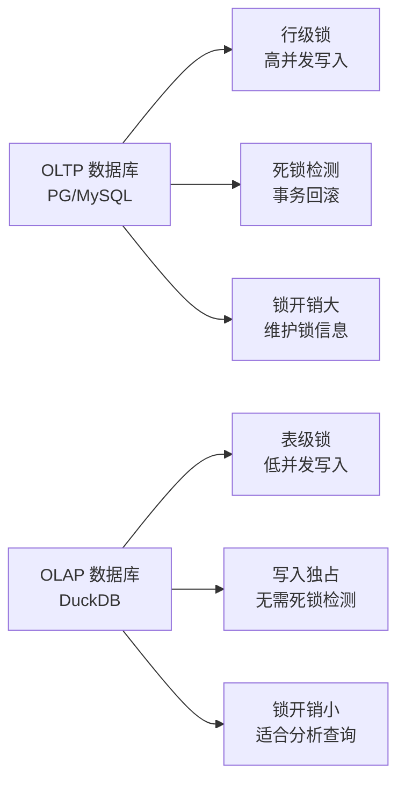
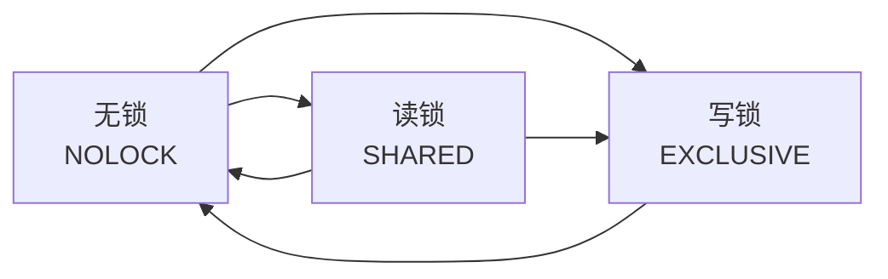
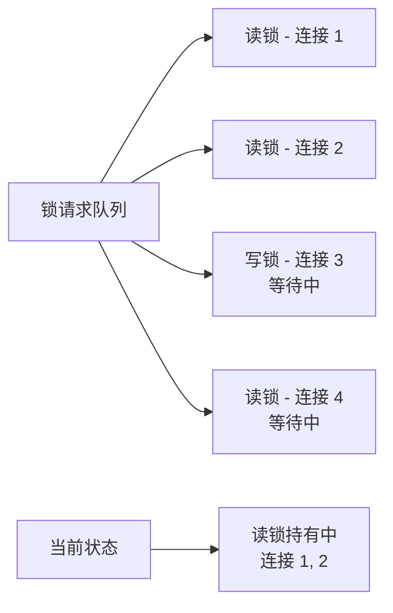

# DuckDB 锁机制

## 学习目标

- 掌握 DuckDB 的锁机制设计，理解 OLAP 数据库的锁策略
- 理解 DuckDB 为何使用表级锁而非行级锁
- 对比 DuckDB 与 PostgreSQL/MySQL/SQLite 的锁机制差异

## 核心概念

### DuckDB 的锁设计哲学

DuckDB 的锁机制设计围绕 OLAP 工作负载优化：

1. **表级锁**：最小锁粒度是表，不支持行级锁
2. **读写锁**：支持并发读取，写入独占
3. **无死锁检测**：写入操作串行化，避免死锁



## 锁类型

### 1. 读锁（Shared Lock）

- 多个连接可以同时持有读锁
- 读锁之间不互斥
- 读锁与写锁互斥

### 2. 写锁（Exclusive Lock）

- 写入操作需要获取写锁
- 写锁与读锁互斥
- 写锁之间互斥

### 锁状态转换



## 文件锁实现

### 基于文件锁的实现

DuckDB 使用 OS 提供的文件锁机制：

```c
// 获取读锁
int acquire_shared_lock(int fd) {
#ifdef _WIN32
    OVERLAPPED overlapped = {0};
    LockFileEx(fd, LOCKFILE_READ, 0, 1, 0, &overlapped);
#else
    struct flock fl = {F_RDLCK, SEEK_SET, 0, 0, 0};
    fcntl(fd, F_SETLK, &fl);
#endif
    return 0;
}

// 获取写锁
int acquire_exclusive_lock(int fd) {
#ifdef _WIN32
    OVERLAPPED overlapped = {0};
    LockFileEx(fd, LOCKFILE_READ | LOCKFILE_EXCLUSIVE, 0, 1, 0, &overlapped);
#else
    struct flock fl = {F_WRLCK, SEEK_SET, 0, 0, 0};
    fcntl(fd, F_SETLK, &fl);
#endif
    return 0;
}
```

### 锁超时与重试

```c
// 带重试的锁获取
int acquire_lock_with_retry(int fd, int type, int timeout_ms) {
    int elapsed = 0;
    while (elapsed < timeout_ms) {
        if (try_acquire_lock(fd, type) == 0) {
            return 0;  // 成功
        }
        sleep(10);     // 重试间隔
        elapsed += 10;
    }
    return -1;  // 超时
}
```

## 并发控制策略

### 读取并发

DuckDB 支持多连接并发读取：

```sql
-- 连接 1（读取）
SELECT * FROM users;

-- 连接 2（读取）
SELECT * FROM users;  -- 与连接 1 同时执行
```

**实现**：多个读取操作共享读锁，不互斥。

### 写入并发

DuckDB 不支持多连接并发写入：

```sql
-- 连接 1（写入）
INSERT INTO users VALUES (1, 'Alice');

-- 连接 2（写入）—— 会等待或失败
INSERT INTO users VALUES (2, 'Bob');  -- 等待连接 1 释放
```

**实现**：写入操作需要获取写锁，写锁与其他锁互斥。

### 读写并发

```sql
-- 连接 1（读取）
SELECT * FROM users;

-- 连接 2（写入）—— 会等待读取完成
INSERT INTO users VALUES (2, 'Bob');  -- 等待连接 1 释放读锁
```

**实现**：读锁和写锁互斥，写入需要等待所有读取完成。

## 锁队列

DuckDB 使用简单的锁队列管理锁请求：



**FIFO 策略**：

- 所有锁请求按到达顺序排队
- 读锁请求到达时，如果当前持有写锁，排队等待
- 写锁请求到达时，如果当前持有读锁，等待所有读锁释放

## 与 PostgreSQL 锁对比

| 维度 | DuckDB | PostgreSQL |
|------|--------|------------|
| 锁粒度 | 表级 | 行级 + 表级 |
| 锁类型 | 读锁 / 写锁 | 8 种锁（AccessShare ~ AccessExclusive） |
| 死锁检测 | 无（写入串行化） | 有（死锁检测 + 回滚） |
| 锁超时 | 简单重试 | 配置参数（deadlock_timeout） |
| 并发写入 | 不支持 | 支持（行级锁） |
| 热备 | 不支持 | 支持（流复制） |

### 与 SQLite 锁对比

| 维度 | DuckDB | SQLite |
|------|--------|--------|
| 锁粒度 | 表级 | 文件级（5 级状态） |
| 锁状态 | 2 种（读/写） | 5 种（UNLOCKED → EXCLUSIVE） |
| 并发读取 | 支持 | 支持 |
| 并发写入 | 不支持 | 有限支持（RESERVED 模式） |
| 锁实现 | 文件锁 | 文件锁（fcntl/LockFileEx） |

## 锁优化的限制

### OLAP 场景的锁需求

DuckDB 的锁设计针对 OLAP 场景：

1. **低并发写入**：分析查询主要是只读，写入频率低
2. **批量写入**：写入通常是批量加载，不是逐行插入
3. **无事务竞争**：分析查询不需要细粒度锁

### 不支持的场景

| 场景 | 影响 |
|------|------|
| 高并发写入 | 连接等待，性能下降 |
| 行级锁定 | 不支持，整表禁止写入 |
| 死锁恢复 | 无死锁检测，写入串行化 |
| 隔离级别升级 | 锁粒度限制，无法实现行级隔离 |

## 要点总结

- DuckDB 使用表级锁（读锁/写锁），不支持行级锁
- 多连接并发读取支持，写入操作独占
- 写入串行化，避免死锁检测和死锁恢复
- 锁实现基于 OS 文件锁（fcntl/LockFileEx）
- 锁设计针对 OLAP 场景：低并发写入、批量加载
- 与 PG/SQLite 的锁机制相比更简单，适合分析查询

## 思考题

1. DuckDB 为何使用表级锁而非行级锁？行级锁在 OLAP 场景下会带来哪些额外开销？
2. 如果要在 DuckDB 中实现多连接并发写入，需要如何改进锁机制？会引入哪些问题？
3. DuckDB 的写锁串行化策略与 SQLite 的 5 级锁状态机有何异同？哪种设计更适合嵌入场景？
4. 在 OLAP 场景中，表级锁比行级锁节省了多少开销？如何量化这个差异？