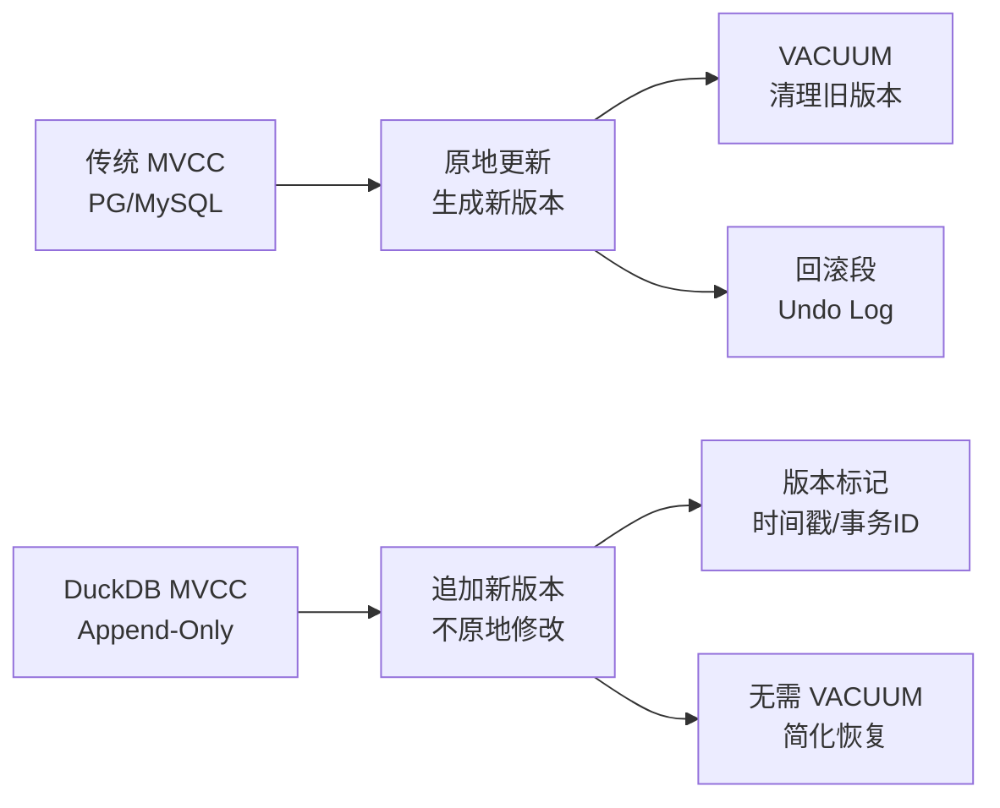
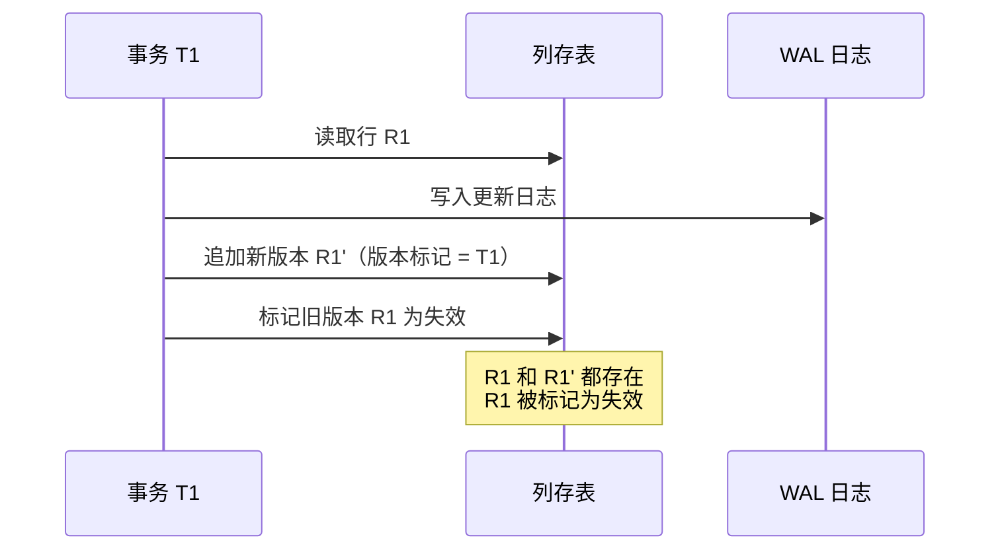

# DuckDB MVCC 实现

## 学习目标

- 掌握 DuckDB 的多版本并发控制（MVCC）设计
- 理解 DuckDB 的 append-only 存储策略和版本标记机制
- 对比 DuckDB 与 PostgreSQL 的 MVCC 实现差异

## 核心概念

### DuckDB 的 MVCC 特点

DuckDB 的 MVCC 实现与传统 OLTP 数据库（如 PostgreSQL）有根本差异：

1. **Append-Only 设计**：更新操作 = 追加新版本，不原地修改数据
2. **版本标记**：使用时间戳或事务 ID 标记数据版本的可视性
3. **无回滚段**：不维护传统的 undo log，简化了崩溃恢复
4. **有限隔离**：不支持完整的 SERIALIZABLE 隔离级别



## Append-Only 存储策略

### 更新操作的处理流程



**关键点**：

- DuckDB 不删除旧版本数据，只是标记为失效
- 新版本数据追加到列存文件末尾
- 读取时根据版本标记过滤掉失效版本

### 版本标记机制

每个列数据块包含版本信息：

```c
// 列数据块的版本元数据
typedef struct ColumnChunkMetadata {
    int64_t min_timestamp;    // 该块的最小事务时间戳
    int64_t max_timestamp;    // 该块的最大事务时间戳
    int32_t transaction_id;   // 创建该块的事务 ID
    bool is_deleted;          // 是否被删除标记
} ColumnChunkMetadata;
```

**可视性判断**：

- 如果 `transaction_id` 未提交，该数据块对其他事务不可见
- 如果 `is_deleted = true`，该数据块被视为删除（但未物理删除）

## 事务隔离级别

### DuckDB 支持的隔离级别

| 隔离级别 | 是否支持 | 说明 |
|----------|---------|------|
| READ UNCOMMITTED | 不支持 | - |
| READ COMMITTED | 支持 | 默认级别 |
| REPEATABLE READ | 有限支持 | 快照隔离，但有幻读风险 |
| SERIALIZABLE | 不支持 | OLAP 场景不需要 |

### READ COMMITTED 实现

```sql
-- 事务 T1
BEGIN;
SELECT * FROM users WHERE id = 1;  -- 读取版本 V1
-- 事务 T2 提交更新
SELECT * FROM users WHERE id = 1;  -- 读取版本 V2（T2 的更新）
COMMIT;
```

**实现原理**：

- 每次查询读取最新的已提交版本
- 未提交的版本对其他事务不可见

### 快照隔离（有限 REPEATABLE READ）

```sql
-- 事务 T1
BEGIN;
SELECT * FROM users;  -- 创建快照 S1
-- 事务 T2 提交插入
SELECT * FROM users;  -- 可能读到 T2 的插入（幻读）
COMMIT;
```

**限制**：

- DuckDB 的快照隔离不保证完全的 REPEATABLE READ
- 幻读可能发生（因为 append-only 设计，新数据追加到表尾）

## 与 PostgreSQL MVCC 对比

| 维度 | DuckDB | PostgreSQL |
|------|--------|------------|
| 更新策略 | Append-Only | 原地更新 + 新版本元组 |
| 版本清理 | 无需 VACUUM（标记失效） | 需要 VACUUM 清理死元组 |
| 回滚段 | 无 Undo Log | 无 Undo Log（依赖 WAL） |
| 隔离级别 | READ COMMITTED + 有限快照隔离 | 完整 MVCC（SERIALIZABLE） |
| 事务 ID | 简单递增时间戳 | 32 位事务 ID（需冻结） |
| 崩溃恢复 | WAL 重放 + 版本标记检查 | WAL 重放 + MVCC 检查 |
| 适用场景 | OLAP 分析（低并发写） | OLTP 事务（高并发写） |

## MVCC 的性能影响

### 优势

1. **无 VACUUM 开销**：不需要后台进程清理旧版本
2. **简化崩溃恢复**：只需重放 WAL，无需复杂的回滚操作
3. **适合批量写入**：追加操作性能高（OLAP 场景）

### 劣势

1. **存储空间占用**：旧版本数据未物理删除，占用额外空间
2. **读取性能影响**：需要过滤失效版本，增加 CPU 开销
3. **并发写入限制**：append-only 设计不适合高并发写入场景

## 崩溃恢复

### WAL 重放流程


**关键步骤**：

1. **读取 WAL**：从最后一个检查点开始重放
2. **重放操作**：重新执行未提交的写入操作
3. **版本标记检查**：标记未完成事务的数据块为失效
4. **恢复完成**：数据库进入一致状态

### 对比 PostgreSQL

- PostgreSQL 需要重放 WAL + 重建 MVCC 状态（检查事务状态）
- DuckDB 只需重放 WAL + 标记失效版本，更简单

## 要点总结

- DuckDB 使用 append-only MVCC，更新操作追加新版本，不原地修改
- 版本标记机制简单：时间戳/事务 ID + 失效标记
- 无需 VACUUM，简化了维护，但增加了存储开销
- 支持 READ COMMITTED 和有限的快照隔离，不支持 SERIALIZABLE
- 崩溃恢复简单：WAL 重放 + 版本标记检查
- 适合 OLAP 场景（低并发写），不适合 OLTP 场景（高并发写）

## 思考题

1. DuckDB 的 append-only MVCC 为何不需要 VACUUM？旧版本数据何时被物理删除？
2. DuckDB 的快照隔离为何可能出现幻读？append-only 设计如何导致幻读问题？
3. 如果在 DuckDB 中实现完整 SERIALIZABLE 隔离级别，需要增加哪些机制？
4. DuckDB 的 MVCC 在高并发写入场景下的性能瓶颈在哪里？为何不适合 OLTP？