# Executor 执行器

## 学习目标

- 理解 DuckDB 向量化执行引擎的核心设计：Vector 批量处理 + Push-Based 执行模型
- 掌握物理算子的实现方式与协作机制
- 理解 SIMD 指令在向量化执行中的加速原理
- 对比 DuckDB 与 PostgreSQL 的执行模型差异（Vectorized vs Volcano、Push vs Pull）

## 核心概念

- **Vector（向量）**：DuckDB 的基本数据单元，通常包含 1024 行数据
- **Push-Based 执行模型**：数据从下游算子向上游推送，减少虚函数调用
- **Physical Operator（物理算子）**：执行计划中的具体操作节点
- **DataChunk**：向量化执行中的数据块，多列 Vector 的集合
- **SIMD（单指令多数据流）**：一条指令同时处理多个数据元素
- **Pipeline（流水线）**：算子的执行调度单元

## 执行模型总览

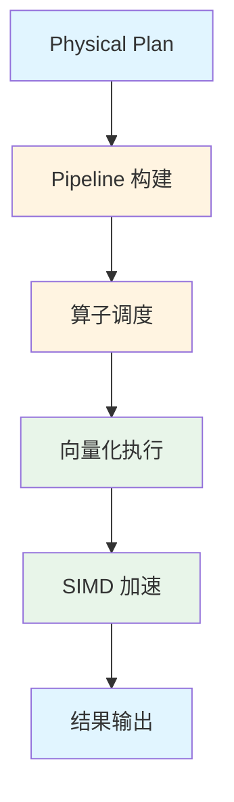

## Vector 向量数据模型

### DataChunk 结构

DuckDB 以 DataChunk 为基本数据单元：

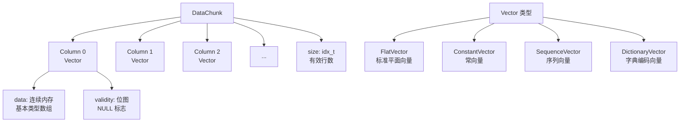

**Vector 类型详解**：

| Vector 类型 | 说明 | 使用场景 |
|-------------|------|---------|
| **FlatVector** | 标准平面向量，连续内存数组 | 多数场景的默认选择 |
| **ConstantVector** | 全部元素相同，仅存储一个值 | 常量传播、聚合中的常量列 |
| **SequenceVector** | 等差序列，存储 start/inc | 生成自增序列 |
| **DictionaryVector** | 字典编码，存储索引数组 | 字符串列去重 |

### 1024 行选择

1024 行是 DuckDB 的默认向量大小：

```mermaid
graph TD
    A[1024 行设计] --> B[缓存友好<br/>L1/L2 缓存命中]
    A --> C[SIMD 寄存器<br/>AVX2 256bit × 32 条]
    A --> D[虚函数调用<br/>减少 1024 倍]
    A --> E[内存带宽<br/>预取友好]

    B --> F[L1 缓存: 32KB<br/>可容纳 1024 × 4 列]
    C --> G[AVX2: 一次处理 8 个 int32]
    D --> H[Volcano 每条调用一次 next()]
    D --> I[Vectorized 每 1024 行调用一次]
```

## Push-Based 执行模型

DuckDB 使用 Push-Based 模型，数据从上游向下游推送：

```mermaid
graph TD
    subgraph "Push-Based (DuckDB)"
        A1[Source 算子<br/>TableScan] -->|push DataChunk| B1[中间算子<br/>Filter/Projection]
        B1 -->|push DataChunk| C1[Sink 算子<br/>Aggregate/Join]
        C1 --> D1[结果]
    end

    subgraph "Pull-Based (PostgreSQL)"
        A2[Result 消费者] -->|pull| B2[中间算子]
        B2 -->|pull| C2[Source 算子<br/>TableScan]
        B2 -->|next() 返回| A2
        C2 -->|next() 返回| B2
    end
```

### Push-Based vs Pull-Based 对比

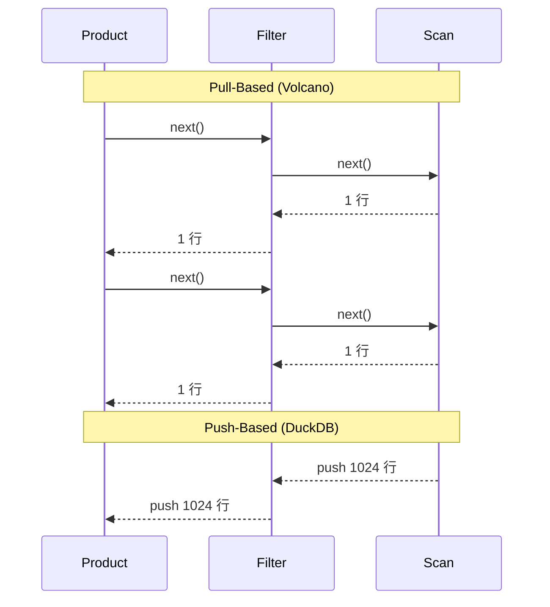

| 维度 | Push-Based (DuckDB) | Pull-Based (PostgreSQL) |
|------|--------------------|----------------------|
| **数据流方向** | 上游向下游推 | 下游向上游拉 |
| **调用方式** | 批量推送 | 逐行 next() 调用 |
| **虚函数调用** | 每 1024 行一次 | 每行一次 |
| **控制流** | 协程式调度 | 递归调用 |
| **内存局部性** | 好（批量处理） | 差（逐行跳转） |
| **并行化** | 天然适合并行 | 需要显式 Gather 节点 |

### Pipeline 执行模型

DuckDB 使用 Pipeline 算子调度：

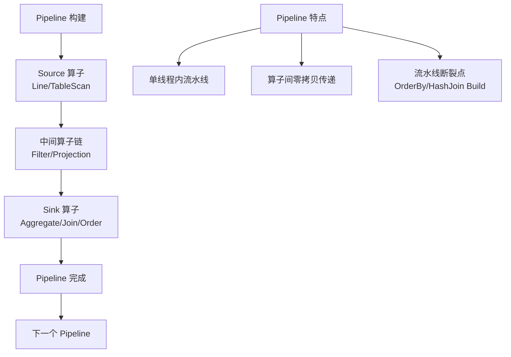

**Pipeline 示例**：

```sql
SELECT name, SUM(amount) FROM orders WHERE amount > 100 GROUP BY name;
```

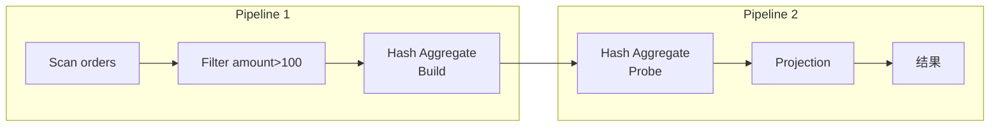

## 物理算子实现

### PhysicalTableScan（表扫描）

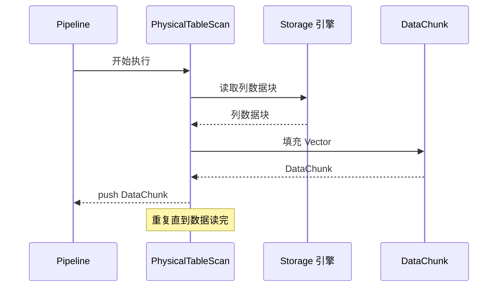

### PhysicalFilter（过滤）

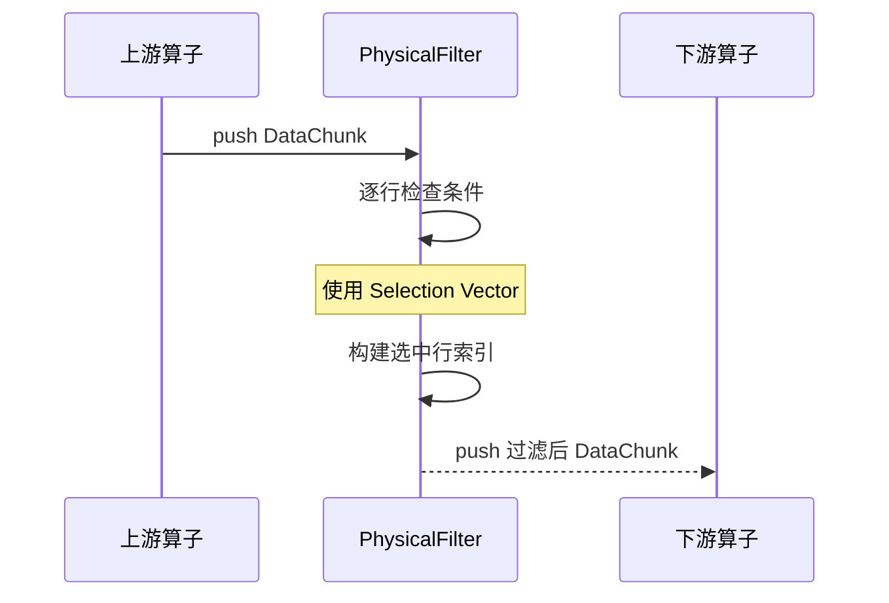

**Selection Vector 机制**：

```mermaid
graph LR
    A[原始 Vector] --> B[Selection Vector]
    B --> C[选中索引<br/>[0, 2, 5, 7, ...]]
    C --> D[过滤后 Vector]
    D --> E[仅包含选中行]

    F[优势] --> G[零拷贝过滤]
    F --> H[避免数据移动]
    F --> I[缓存友好]
```

### PhysicalHashJoin（Hash 连接）

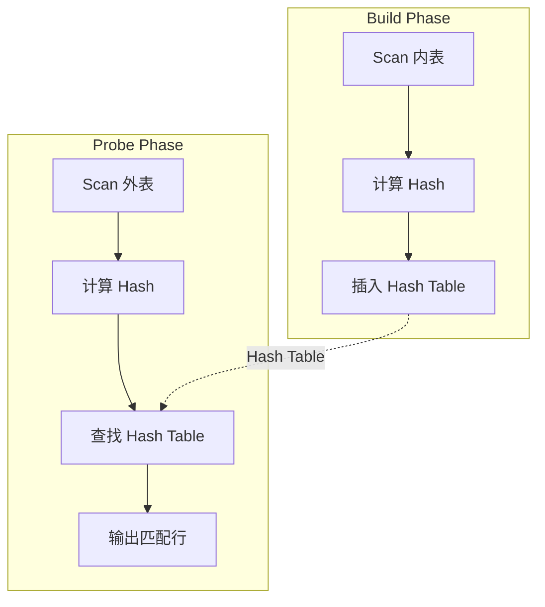

**Hash Join 流程**：

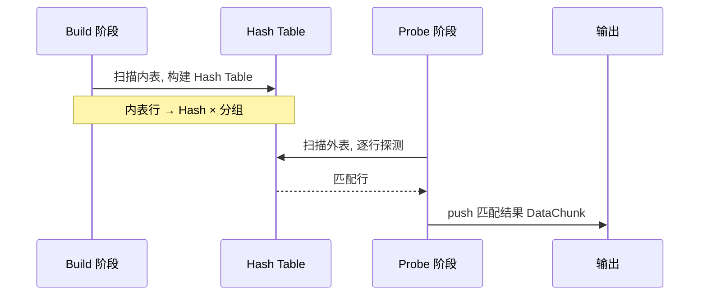

### PhysicalHashAggregate（Hash 聚合）

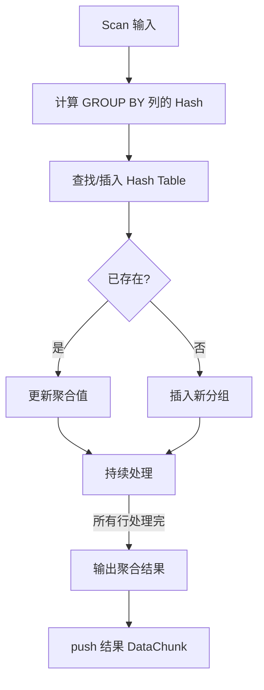

**聚合类型**：

| 聚合方式 | 说明 | 使用场景 |
|----------|------|---------|
| **Hash Aggregate** | 哈希表分组聚合 | 无排序要求的分组查询 |
| **Sorted Aggregate** | 排序后流式聚合 | 输入已排序的分组查询 |
| **Simple Aggregate** | 无 GROUP BY 的全局聚合 | `SELECT COUNT(*) FROM t` |

### PhysicalSort（排序）

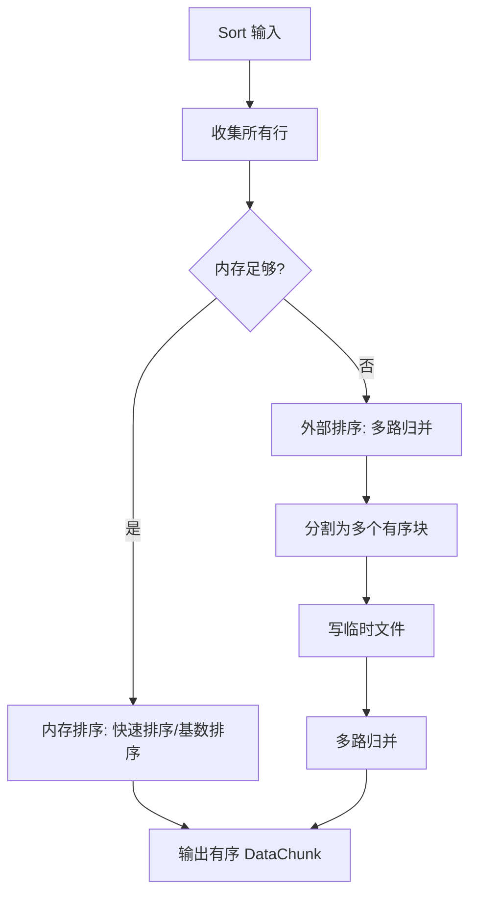

## SIMD 加速

DuckDB 利用 SIMD 指令加速向量化操作：

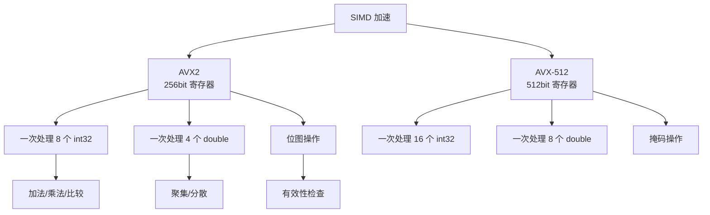

**SIMD 加速场景**：

| 场景 | 操作 | SIMD 加速比 |
|------|------|------------|
| 数值运算 | 列间加法/乘法 | 8x (AVX2 int32) |
| 比较过滤 | col > 100 条件判断 | 8x (AVX2 int32) |
| 位图操作 | NULL 检查 | 32x (AVX2 bit) |
| 哈希计算 | Hash Join 的 Hash 值 | 4x (AVX2) |
| 聚合累加 | SUM/COUNT 累加 | 8x (AVX2 int32) |
| 字符串匹配 | LIKE 模式匹配 | 2x-4x |

**SIMD 示例：过滤条件加速**：

```c
// 标量版本
for (int i = 0; i < 1024; i++) {
    if (data[i] > 100) {
        sel_vector[count++] = i;
    }
}

// SIMD 版本 (AVX2)
__m256i threshold = _mm256_set1_epi32(100);
for (int i = 0; i < 1024; i += 8) {
    __m256i v = _mm256_loadu_si256((__m256i*)&data[i]);
    __m256i cmp = _mm256_cmpgt_epi32(v, threshold);
    int mask = _mm256_movemask_epi8(cmp);
    // 根据 mask 构建 sel_vector
}
```

## 执行流程示例

### 完整查询执行

```sql
SELECT name, SUM(amount) FROM orders WHERE amount > 100 GROUP BY name;
```

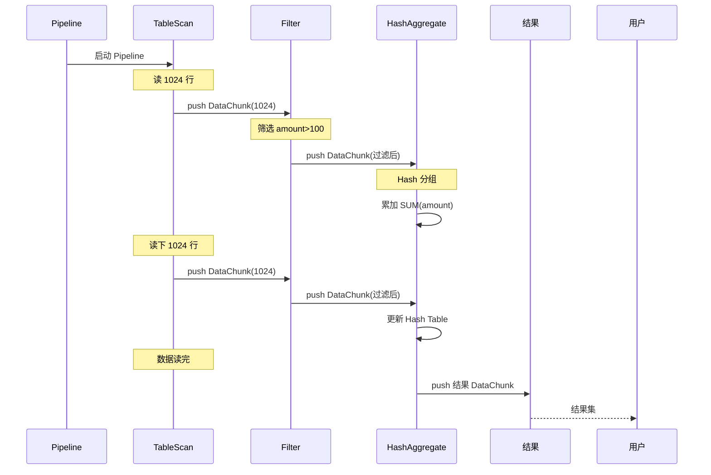

### 多表连接执行

```sql
SELECT u.name, o.total FROM users u JOIN orders o ON u.id = o.user_id WHERE u.age > 18;
```

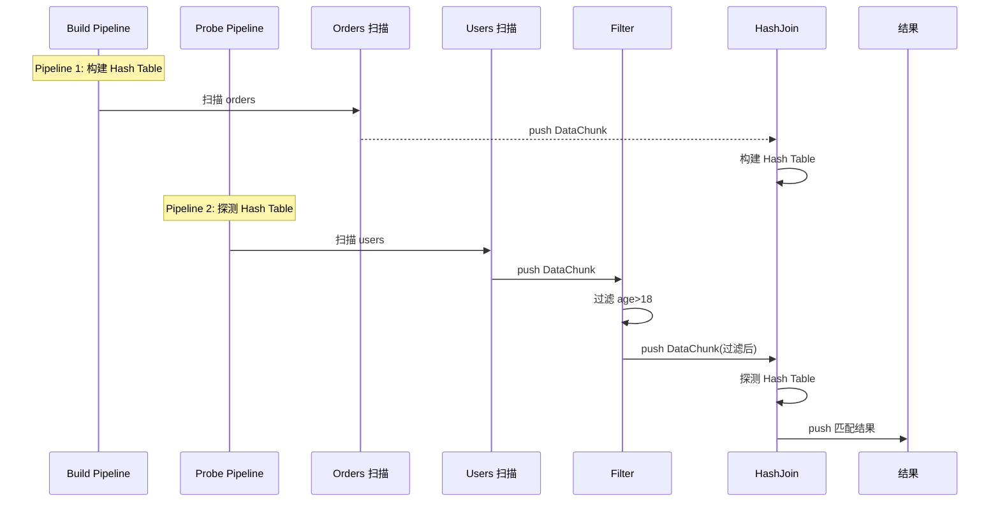

## 与 PostgreSQL 执行器对比

```mermaid
graph TD
    subgraph "DuckDB Executor"
        A1[Vectorized<br/>1024 行批量]
        A2[Push-Based<br/>上游推下游]
        A3[SIMD 加速<br/>AVX2/AVX-512]
        A4[Pipeline 调度<br/>自然并行]
    end

    subgraph "PostgreSQL Executor"
        B1[Volcano 模型<br/>逐行 next()]
        B2[Pull-Based<br/>下游拉上游]
        B3[JIT 编译<br/>LLVM 加速]
        B4[Gather 并行<br/>显式并行]
    end
```

| 维度 | DuckDB | PostgreSQL |
|------|--------|------------|
| **执行模型** | 向量化 + Push-Based | Volcano + Pull-Based |
| **数据单元** | DataChunk (1024 行) | TupleTableSlot (1 行) |
| **调用方式** | 批量推送 | 逐行 next() 递归 |
| **虚函数开销** | 低（每 1024 行一次） | 高（每行一次） |
| **加速方式** | SIMD (AVX2/AVX-512) | JIT (LLVM) |
| **并行方式** | 自然 Pipeline 并行 | Gather 节点显式协调 |
| **内存局部性** | 好（连续内存 Vector） | 一般（散列 Tuple） |
| **适用场景** | OLAP 分析查询 | OLTP 事务查询 |

## 执行器优化技术

### 延迟物化（Late Materialization）

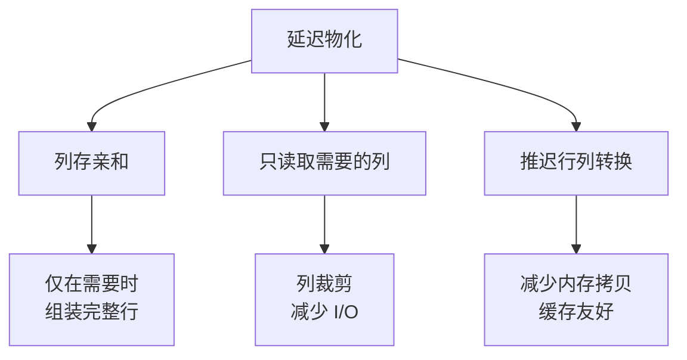

### 自适应执行

DuckDB 在执行过程中调整策略：

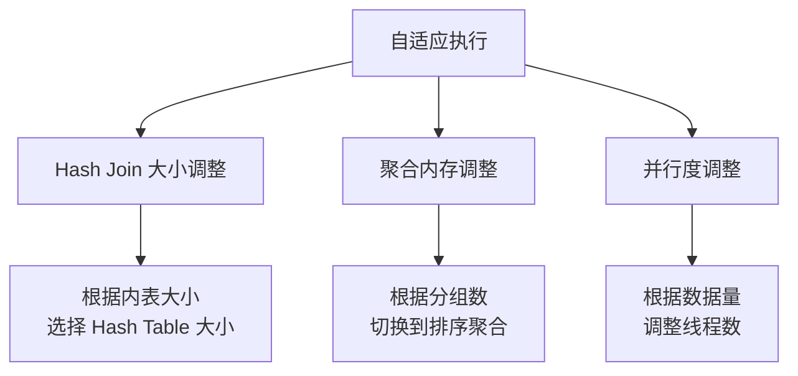

### 表达式编译

DuckDB 将表达式编译为高效执行代码：

```mermaid
graph TD
    A[表达式编译] --> B[表达式树 → 执行函数]
    B --> C[标量函数向量化]
    B --> D[减少虚函数调用]
    B --> E[JIT 编译优化]

    C --> F[将标量函数<br/>批量处理]
    D --> G[直接调用<br/>而非虚函数]
    E --> H[LLVM 编译<br/>生成机器码]
```

## 要点总结

- DuckDB 使用**向量化执行引擎**，以 DataChunk（1024 行）为基本数据单元
- **Push-Based 模型**：数据从上游向下游推送，减少虚函数调用开销
- **Pipeline 调度**：将算子组织为流水线，实现自然的并行执行
- **SIMD 加速**：利用 AVX2/AVX-512 指令加速过滤、聚合、哈希等操作
- 物理算子包括：PhysicalTableScan、PhysicalFilter、PhysicalHashJoin、PhysicalHashAggregate、PhysicalSort 等
- 与 PG 的 Volcano 模型相比，DuckDB 以批量处理取代逐行迭代，在 OLAP 场景下性能提升 10-100 倍
- 向量化 + Push-Based + SIMD 是 DuckDB 高性能查询执行的三驾马车

## 思考题

1. DuckDB 选择 1024 行作为向量大小是权衡了哪些因素？更大的向量（如 4096）或更小的向量（如 256）会有什么影响？
2. Push-Based 模型相比 Pull-Based 模型，除了减少虚函数调用，还有哪些优势？在什么场景下 Pull-Based 更合适？
3. SIMD 指令在分析查询中有哪些典型应用？对于字符串操作（如 LIKE 匹配），SIMD 如何加速？
4. 如果 PostgreSQL 切换为向量化执行引擎，会有哪些挑战？PG 的架构设计中哪些部分限制了向量化改造？