# Parser SQL 解析器

## 学习目标

- 理解 DuckDB 手写递归下降解析器的设计理念与实现细节
- 掌握 Tokenizer → Parser → AST 三阶段解析流程
- 对比 DuckDB 与 PostgreSQL/SQLite 的解析器架构差异

## 核心概念

- **Tokenizer（词法分析器）**：将 SQL 文本切分成 Token 流
- **Parser（语法分析器）**：根据 Token 流构建抽象语法树（AST）
- **AST（抽象语法树）**：表示 SQL 语句结构的数据结构
- **递归下降解析器**：手写的、自顶向下的解析器实现
- **SelectStatement、InsertStatement、CreateStatement**：AST 节点类型

## 解析流程总览

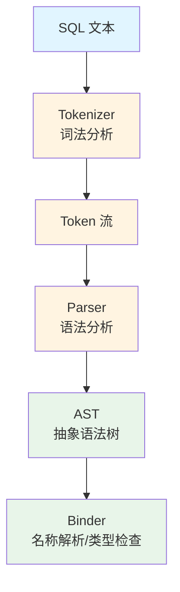

## Tokenizer 词法分析器

DuckDB 的 Tokenizer 负责将 SQL 文本切分成 Token：

```mermaid
graph LR
    A[SQL 文本] --> B[Tokenizer]
    B --> C[Token 流]

    subgraph "Token 类型"
        D1[关键字: SELECT/FROM/WHERE]
        D2[标识符: table_name/col]
        D3[常量: 123/'abc']
        D4[运算符: + - * /]
        D5[分隔符: , ; ( )]
    end

    C --> D1
    C --> D2
    C --> D3
    C --> D4
    C --> D5
```

**Token 结构**：

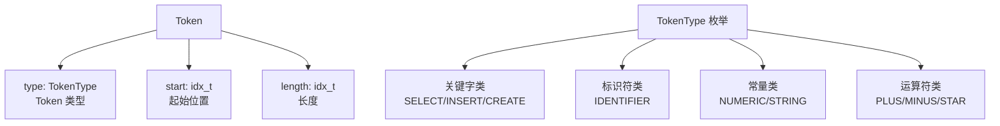

**Tokenizer 特性**：

| 特性 | 说明 |
|------|------|
| **流式读取** | 不一次性加载全部 SQL，按需读取字符 |
| **位置追踪** | 记录每个 Token 的行列位置，用于错误报告 |
| **关键字识别** | 维护关键字哈希表，快速识别 |
| **Unicode 支持** | 正确处理 UTF-8 编码的标识符和字符串 |

## Parser 语法分析器

DuckDB 使用**手写递归下降解析器**，而非 YACC/Bison 等解析器生成工具：

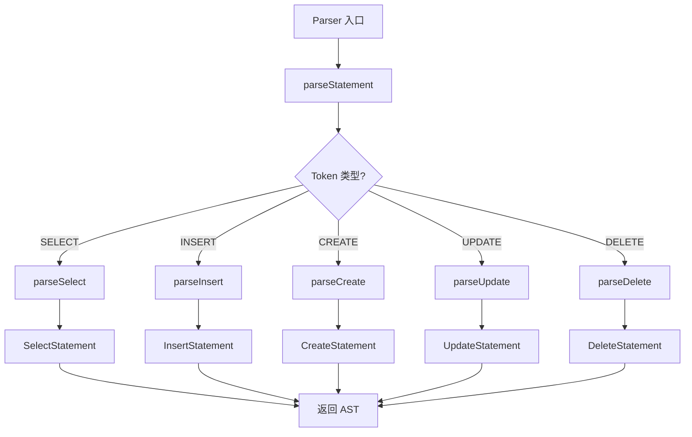

### 递归下降解析示例

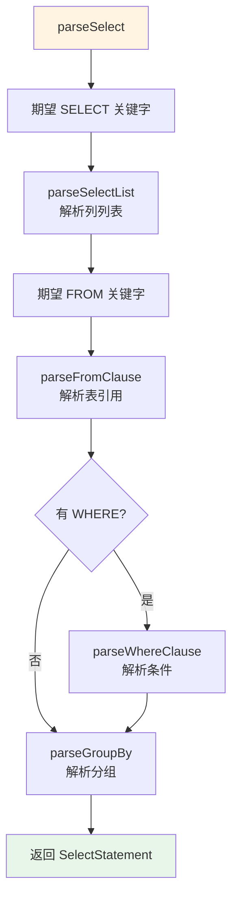

**核心设计理念**：

1. **手写而非生成**：相比 YACC/Bison 自动生成，手写解析器更易维护和调试
2. **错误恢复友好**：可以精确定位错误位置，提供更好的错误提示
3. **扩展性强**：添加新语法只需新增解析函数，无需修改语法规则文件
4. **性能可控**：避免解析器生成工具带来的额外开销

## AST 节点结构

DuckDB 的 AST 节点定义在 `src/include/parser/parsed_data/` 目录：

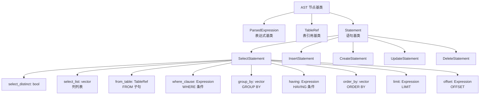

### SelectStatement 示例

```sql
SELECT id, name FROM users WHERE id > 100 ORDER BY name LIMIT 10;
```

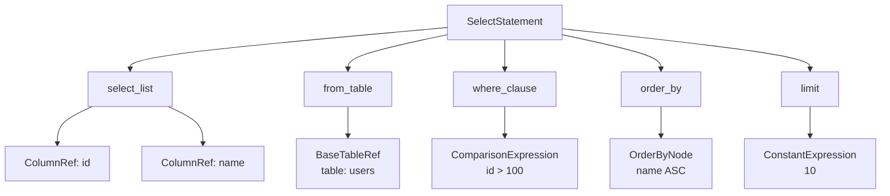

## 表达式解析

DuckDB 的表达式解析支持运算符优先级：

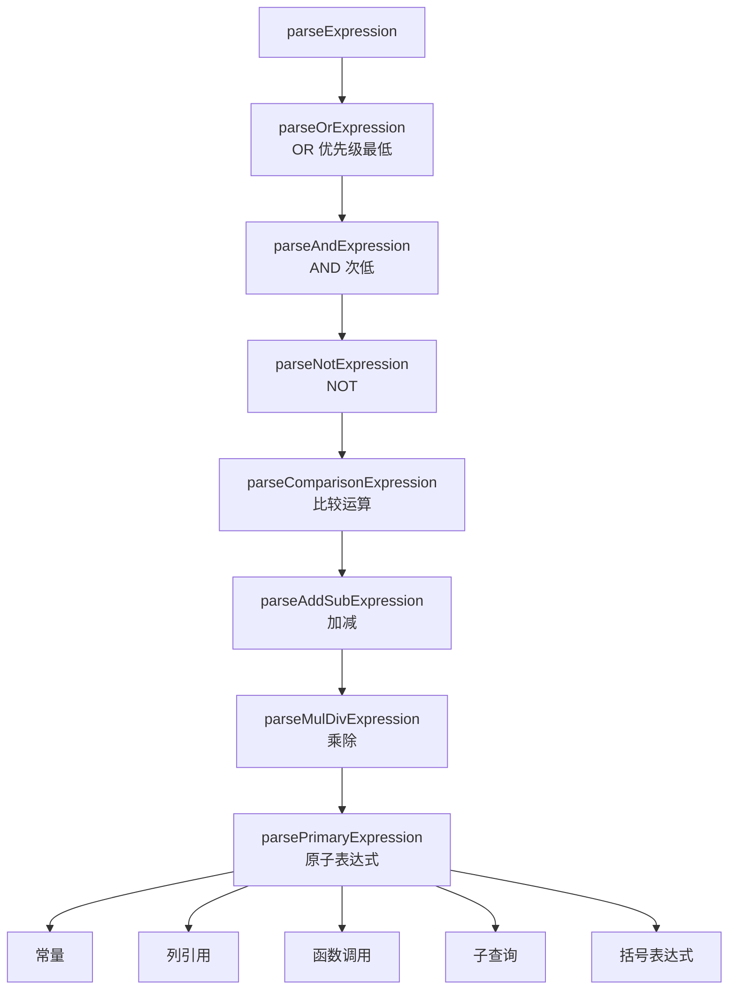

**运算符优先级表**：

| 优先级 | 运算符 | 结合性 |
|--------|--------|--------|
| 1（最低） | OR | 左结合 |
| 2 | AND | 左结合 |
| 3 | NOT | 右结合 |
| 4 | =, <>, <, >, <=, >=, LIKE, IN | 左结合 |
| 5 | +, - | 左结合 |
| 6 | *, /, % | 左结合 |
| 7 | 一元运算符 -, NOT | 右结合 |
| 8（最高） | 括号、函数调用 | - |

## SQL 语法支持

DuckDB 支持 SQL 标准语法 + PostgreSQL 兼容语法：

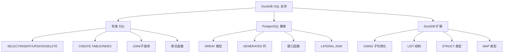

## 与 PostgreSQL/SQLite 解析器对比

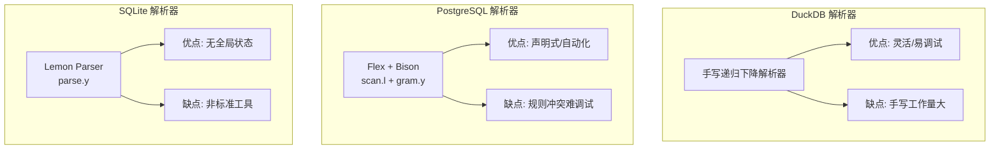

| 维度 | DuckDB | PostgreSQL | SQLite |
|------|--------|------------|--------|
| **解析器类型** | 手写递归下降 | Flex + Bison | Lemon Parser |
| **语法规则文件** | C++ 代码 | gram.y | parse.y |
| **词法分析** | 手写 Tokenizer | Flex (scan.l) | 内置 Tokenizer |
| **扩展性** | 高（直接修改代码） | 中（修改 gram.y） | 中（修改 parse.y） |
| **错误提示** | 精确（手写控制） | 中等 | 中等 |
| **性能** | 高 | 中（Bison 开销） | 高 |
| **维护性** | 中（需理解代码流程） | 高（声明式规则） | 中 |

## 错误处理

DuckDB 提供详细的错误报告：

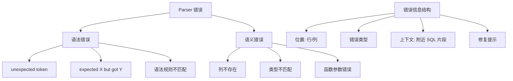

**错误报告示例**：

```sql
SELECT id FORM users;
-- Error: Parser error: Expected FROM but got FORM
--        SELECT id FORM users
--                    ^
```

## 解析器扩展点

DuckDB 提供扩展机制允许自定义语法：

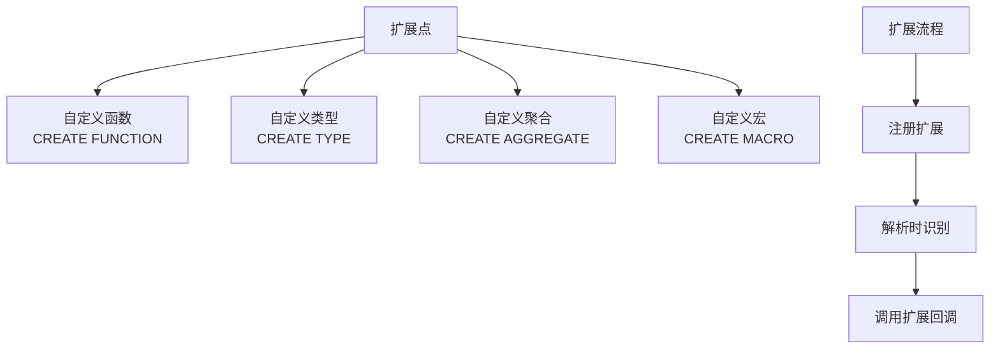

## 要点总结

- DuckDB 使用**手写递归下降解析器**，避免依赖 YACC/Bison，提高灵活性和可维护性
- 解析流程：Tokenizer → Parser → AST，Token 流是中间表示
- AST 节点类型丰富：SelectStatement、InsertStatement、CreateStatement 等
- 运算符优先级通过解析函数调用栈实现，而非外部声明
- 错误处理精确，提供位置信息和修复提示
- 与 PG（Flex/Bison）和 SQLite（Lemon）相比，DuckDB 选择手写方案，强调灵活性和可调试性

## 思考题

1. 为什么 DuckDB 选择手写递归下降解析器而不是使用 YACC/Bison？这种选择在什么情况下是优势，什么情况下是劣势？
2. DuckDB 的 Tokenizer 如何处理 SQL 注入？解析阶段是否需要考虑安全性？
3. 如果要扩展 DuckDB 支持自定义 SQL 语法（如 `SELECT ... SAMPLE 10%`），应该修改哪些模块？
4. 手写解析器 vs 声明式语法规则（gram.y），哪个更容易支持复杂的 SQL 方言（如 PL/pgSQL 的控制流）？
