# Planner 查询计划器

## 学习目标

- 理解 DuckDB 查询计划器的四阶段架构（Binder → Logical Planner → Optimizer → Physical Planner）
- 掌握 Cascades 框架的优化器设计原理
- 对比 DuckDB 与 PostgreSQL 的优化器架构差异（Cascades vs System-R）

## 核心概念

- **Binder**：名称解析、类型检查、将 AST 转换为绑定后的逻辑计划
- **Logical Planner**：生成逻辑查询计划（Logical Plan）
- **Optimizer**：基于 Cascades 框架的查询优化器，应用规则优化
- **Physical Planner**：将逻辑计划转换为物理执行计划
- **Cascades Framework**：基于规则的搜索框架，探索等价计划空间
- **Cost Model**：代价模型，估算不同执行计划的代价

## 计划器四阶段架构

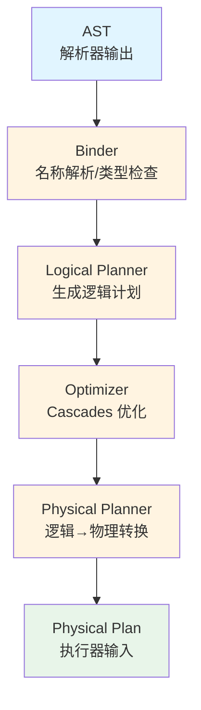

## Binder 绑定器

Binder 负责 AST 的名称解析和类型检查：

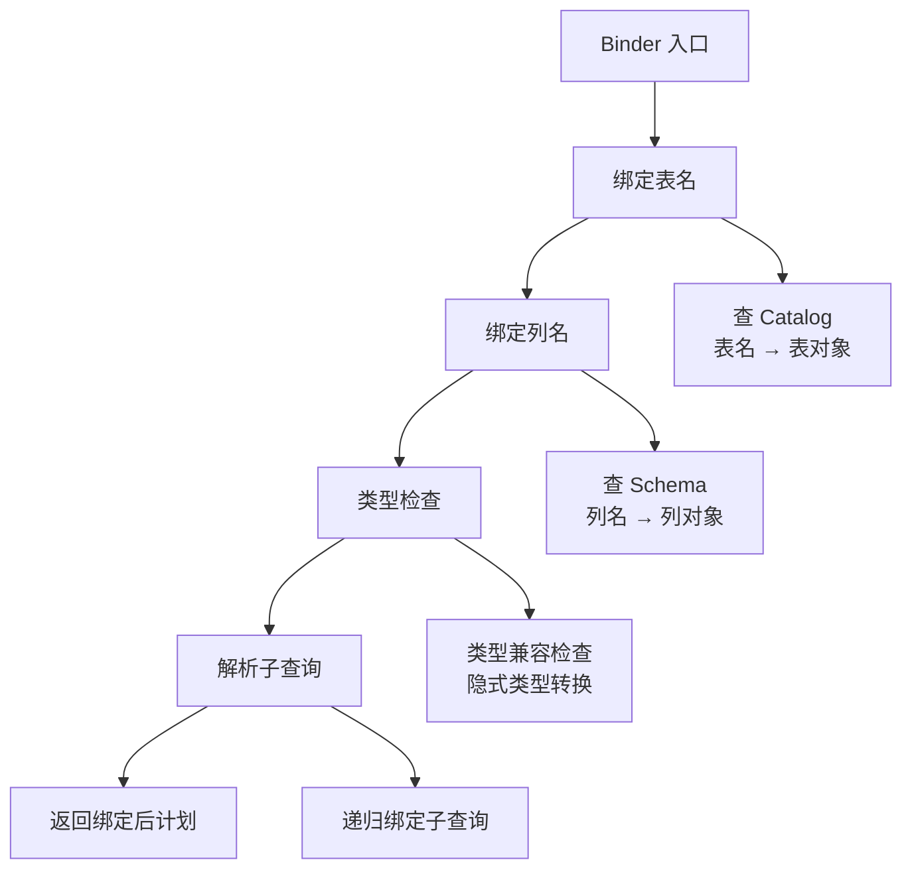

**Binder 职责**：

| 职责 | 说明 |
|------|------|
| **名称解析** | 将表名、列名绑定到 Catalog 中的实际对象 |
| **类型检查** | 检查表达式类型是否合法，必要时进行隐式类型转换 |
| **作用域管理** | 管理子查询、CTE、JOIN 的作用域，解决列引用歧义 |
| **别名处理** | 处理表别名、列别名，建立别名映射表 |
| **参数绑定** | 绑定 Prepared Statement 的参数位置 |

**绑定示例**：

```sql
SELECT u.name, o.total FROM users u JOIN orders o ON u.id = o.user_id;
```

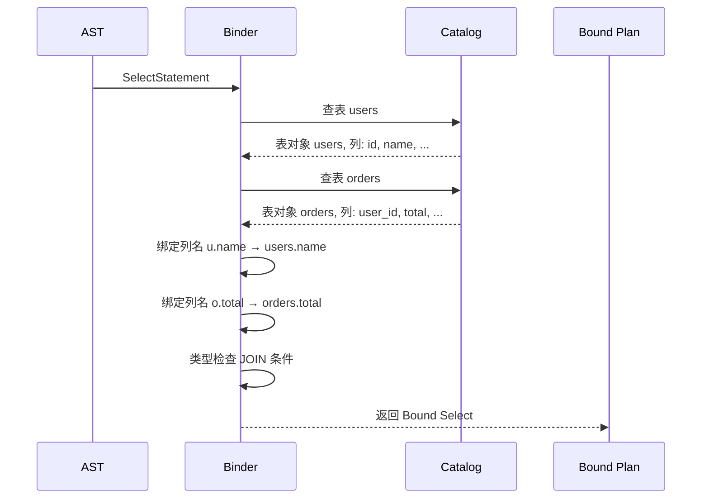

## Logical Planner 逻辑计划器

Logical Planner 将绑定后的 AST 转换为逻辑算子树：

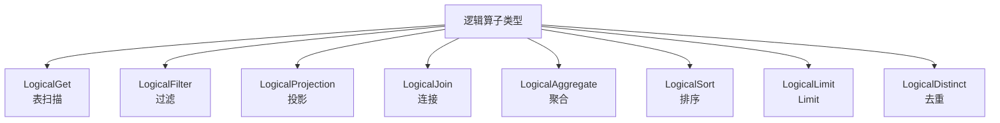

**逻辑计划示例**：

```sql
SELECT name, SUM(amount) FROM orders WHERE amount > 100 GROUP BY name;
```

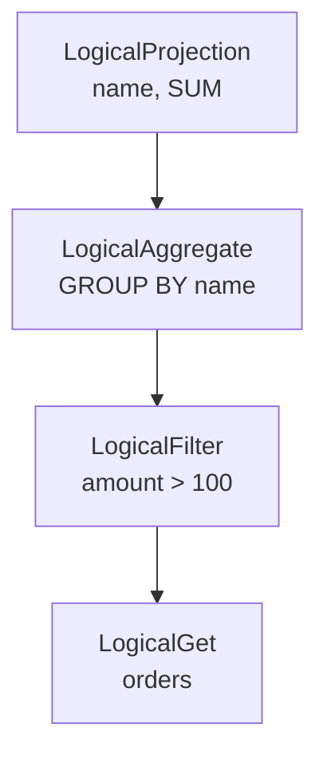

## Optimizer 优化器

DuckDB 使用**基于 Cascades 框架的优化器**：

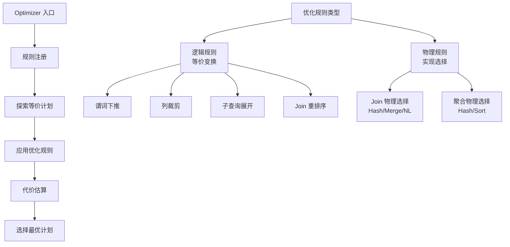

### Cascades 框架核心概念

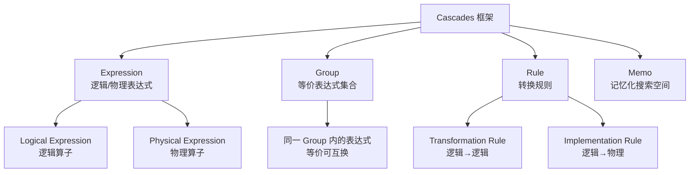

**Cascades 工作流程**：

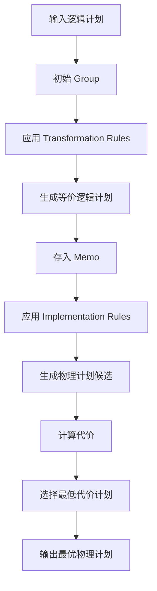

### 优化规则详解

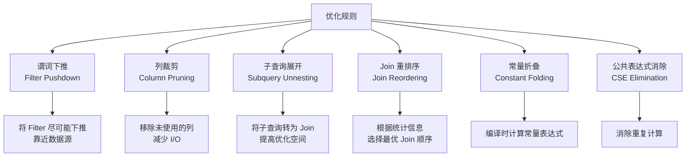

### 代价模型

DuckDB 的代价模型基于统计信息估算：

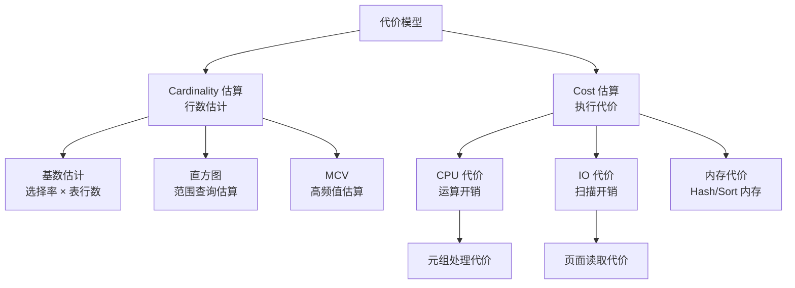

**代价计算公式**：

```
总代价 = 启动代价 + 执行代价
执行代价 = CPU 代价 + IO 代价 + 内存代价
```

| 代价因子 | 说明 |
|----------|------|
| **tuple_cost** | 处理一行数据的代价 |
| **scan_cost** | 顺序扫描一个页面的代价 |
| **index_scan_cost** | 索引扫描的代价 |
| **hash_build_cost** | 构建 Hash Table 的代价 |
| **hash_probe_cost** | 探测 Hash Table 的代价 |
| **sort_cost** | 排序代价 |

### Join 重排序

DuckDB 使用动态规划 + 代价估算选择最优 Join 顺序：

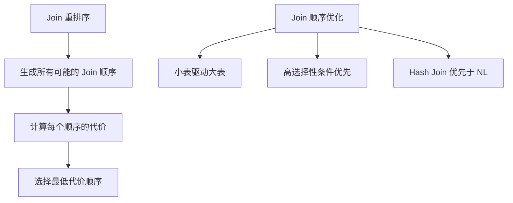

**示例**：

```sql
SELECT * FROM a JOIN b ON a.id = b.a_id JOIN c ON b.id = c.b_id;
```

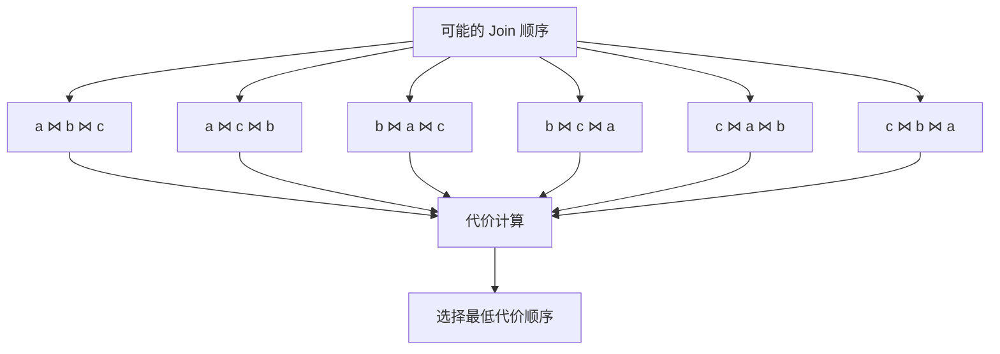

## Physical Planner 物理计划器

Physical Planner 将逻辑计划转换为物理计划：

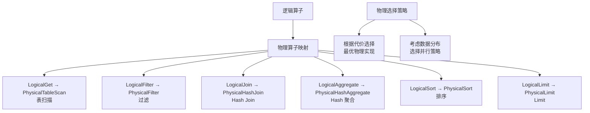

**物理算子类型**：

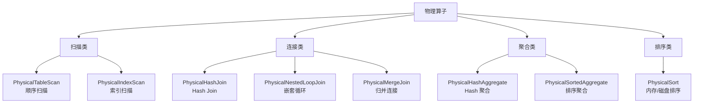

## 与 PostgreSQL 优化器对比

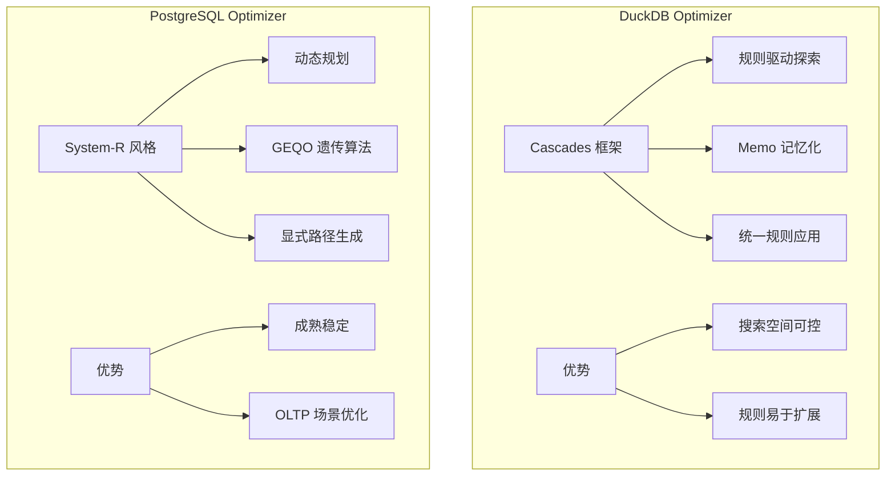

| 维度 | DuckDB (Cascades) | PostgreSQL (System-R) |
|------|-------------------|----------------------|
| **优化框架** | Cascades | System-R + GEQO |
| **搜索策略** | 规则驱动探索 | 动态规划 + 遗传算法 |
| **Join 重排序** | Cascades 自动探索 | 显式路径生成 + GEQO |
| **规则扩展** | 易于添加新规则 | 需修改 planner 代码 |
| **代价模型** | 基于统计信息估算 | 基于统计信息 + 参数 |
| **并行查询** | 自动并行化 | 显式 Parallel Path |
| **适用场景** | OLAP 分析查询 | OLTP 事务查询 |

## 优化器统计信息

DuckDB 维护表级和列级统计信息：

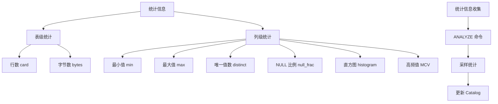

**选择率估算示例**：

```sql
-- 等值条件
SELECT * FROM t WHERE col = 'value';
-- 选择率 = 1 / distinct_count

-- 范围条件
SELECT * FROM t WHERE col > 100;
-- 选择率 = (max - 100) / (max - min)
```

## 优化示例

### 谓词下推

```sql
SELECT name FROM users WHERE age > 30;
```

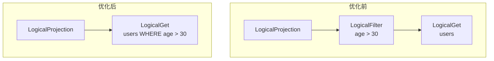

### Join 重排序

```sql
SELECT * FROM small_table s JOIN large_table l ON s.id = l.s_id;
```

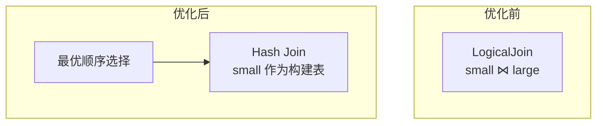

## 要点总结

- DuckDB 优化器分为四阶段：Binder → Logical Planner → Optimizer → Physical Planner
- 使用**Cascades 框架**进行优化，通过规则探索等价计划空间
- 优化规则包括谓词下推、列裁剪、子查询展开、Join 重排序等
- 代价模型基于统计信息估算行数和执行代价
- 与 PostgreSQL 的 System-R 风格相比，Cascades 更易扩展规则，适合 OLAP 场景
- 统计信息是优化的基础，ANALYZE 命令收集并更新统计

## 思考题

1. Cascades 框架相比传统的动态规划优化器（如 PostgreSQL 的 System-R）有何优势？在什么情况下劣势？
2. 谓词下推为何能显著提升性能？是否存在谓词下推反而降低性能的情况？
3. Join 重排序是一个 NP 问题，DuckDB 如何在合理时间内找到较好的 Join 顺序？
4. 如果统计信息过期，优化器会做出错误的决策。DuckDB 如何保证统计信息的时效性？
