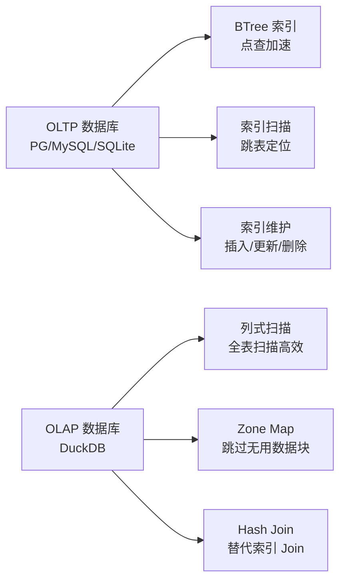
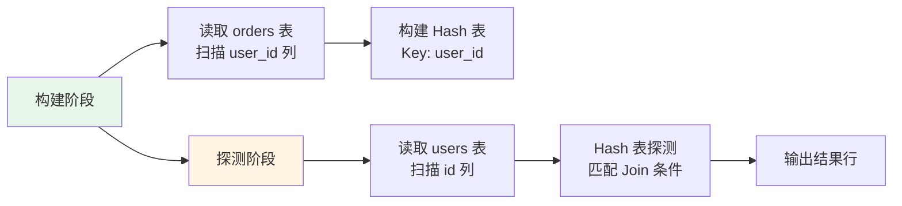

# DuckDB BTree 索引

## 学习目标

- 理解 DuckDB 为何不依赖 BTree 索引（列式存储天然不需要）
- 掌握 DuckDB 针对列式查询的替代优化策略（Zone Map、Hash Join、排序合并）
- 对比 DuckDB 与 PostgreSQL/MySQL/SQLite 的索引设计差异

## 核心概念

### DuckDB 的索引设计哲学

DuckDB 的设计定位是 OLAP 数据库，列式存储 + 向量化执行 + 全表扫描的组合对分析查询更高效。因此，DuckDB **不依赖 BTree 索引**。



### 为何列式存储不需要 BTree

**BTree 索引的优势**：快速定位少量行（点查）——OLTP 场景的核心需求。

**DuckDB 的查询模式**：

- 扫描大量行（百万-亿级）
- 聚合操作（SUM/AVG/COUNT）
- 分组操作（GROUP BY）
- 全表分析

**BTree 索引在 OLAP 场景的问题**：

1. **随机 I/O 高**：BTree 索引查找需要随机访问多个页面
2. **维护成本高**：批量加载时 BTree 重建开销大
3. **不适合列式存储**：列式存储按列组织数据，索引查找需要跨列组装

## DuckDB 的替代优化策略

### 1. Zone Map 统计过滤

DuckDB 的列数据块存储统计信息，实现谓词下推：

```c
// Zone Map 过滤
typedef struct ZoneMap {
    int64_t min_value;  // 该列数据块的最小值
    int64_t max_value;  // 该列数据块的最大值
    int64_t null_count; // NULL 值数量
} ZoneMap;

// 谓词下推判断
bool can_skip_block(ZoneMap* zone, QueryPredicate* pred) {
    switch (pred->type) {
        case PRED_GREATER:
            // 如果该块最大值 <= 谓词值，跳过
            return zone->max_value <= pred->value;
        case PRED_LESS:
            // 如果该块最小值 >= 谓词值，跳过
            return zone->min_value >= pred->value;
        case PRED_EQUAL:
            // 如果该块最小值 > 值 或 最大值 < 值，跳过
            return zone->min_value > pred->value || zone->max_value < pred->value;
        default:
            return false;
    }
}
```

**Zone Map 与 BTree 对比**：

| 维度 | Zone Map | BTree 索引 |
|------|----------|------------|
| 数据结构 | 列统计数据块 | 平衡树 |
| 查询类型 | 范围扫描 | 点查 + 范围扫描 |
| 定位精度 | 数据块级别 | 行级别 |
| 维护成本 | 低（追加统计） | 高（插入/更新） |
| 列式存储 | 天然支持 | 不适应 |

### 2. Hash Join

DuckDB 使用 Hash Join 替代索引 Join：

```sql
-- 传统 SQL 的索引 Join（PG/MySQL）
SELECT * FROM orders o JOIN users u ON o.user_id = u.id;
-- 使用 BTree 索引查找 user_id

-- DuckDB 的 Hash Join
SELECT * FROM orders o JOIN users u ON o.user_id = u.id;
-- 构建 Hash 表 + 探测
```

**Hash Join 流程**：



**Hash Join 优势**：

- 适合 OLAP 大表 Join（百万-亿级）
- 列式存储下，只需读取 Join 列（user_id, id）
- 一次扫描完成 Hash 表构建，不需要随机 I/O

### 3. 排序合并

**排序合并 Join** 也是 DuckDB 的 Join 策略之一：

```sql
-- 排序合并 Join
SELECT * FROM orders o JOIN users u ON o.user_id = u.id
ORDER BY o.user_id;
```

**适用场景**：

- 数据已经排序（如从 ORDER BY 传递）
- 不需要全表扫描的 Hash 表构建

### 4. 全表扫描

DuckDB 的默认查询策略是全表扫描：

```sql
-- DuckDB 的默认查询计划
EXPLAIN SELECT * FROM users WHERE age > 30;
-- 输出：TABLE_SCAN → FILTER → PROJECTION
-- 没有索引扫描，直接全表扫描 + 过滤
```

**全表扫描效率**：

- 列式存储只读取需要的列（age 列 + 其他 select 列）
- Zone Map 跳过无用数据块
- 向量化执行批量处理，充分利用 CPU 缓存

## 索引使用场景

### 何时需要索引

DuckDB 在某些场景下仍然需要索引：

1. **主键约束**：唯一性检查（需要索引支持）
2. **外键约束**：参考完整性检查
3. **点查场景**：`SELECT * FROM users WHERE id = 1`

### DuckDB 的 Artifical Index

DuckDB 实现了"人工索引"（Artifical Index）用于特殊场景：

```sql
-- 创建主键（DuckDB 使用内部索引维护唯一性）
CREATE TABLE users (
    id INTEGER PRIMARY KEY,
    name VARCHAR
);

-- 创建唯一约束
CREATE UNIQUE INDEX idx_users_id ON users(id);
```

**注意**：DuckDB 的索引主要用于约束维护，不用于加速查询。

## 与 PostgreSQL 索引对比

| 维度 | DuckDB | PostgreSQL |
|------|--------|------------|
| 索引类型 | 无（仅约束维护） | BTree、Hash、GIN、GiST、BRIN |
| 索引加速 | 不使用 | 加速点查/范围查 |
| 查询策略 | 全表扫描 | 索引扫描优先 |
| Join 策略 | Hash Join | 索引 Join + Hash Join |
| 列式支持 | 天然无需索引 | BRIN 近似效果 |

### 与 SQLite 索引对比

| 维度 | DuckDB | SQLite |
|------|--------|--------|
| 索引类型 | 无 | BTree（统一存储） |
| 索引存储 | 无 | 独立 BTree |
| 查询策略 | 全表扫描 | 索引扫描 + 表扫描 |
| 约束维护 | 内部索引 | BTree 索引 |

## Zone Map 与 BTree 的实际效果对比

### 测试场景

```sql
-- 1000 万行数据
CREATE TABLE test AS SELECT range AS id, ... FROM range(0, 10000000);

-- 查询：SELECT * FROM test WHERE id > 9990000;
-- - 使用 BTree：定位到 9990000 行，返回 10000 行
-- - 使用 Zone Map：跳过 999 个数据块（每个块 10000 行），读取最后 1 块
```

### 性能对比

| 查询类型 | DuckDB（Zone Map） | PostgreSQL（BTree） |
|----------|-------------------|-------------------|
| `id > 9990000`（范围扫描尾部） | 读取 1 块 | 索引扫描 + 少量行返回 |
| `id BETWEEN 5000000 AND 5000100`（范围扫描中部） | 读取 1 块 | 索引扫描 + 100 行返回 |
| `id = 1`（点查） | 读取 1 块（未优化） | 索引扫描，1 行返回 |

**结论**：

- Zone Map 适合范围扫描，尤其适合 OLAP 场景
- BTree 适合点查，尤其适合 OLTP 场景
- 在大量数据扫描场景下，Zone Map 与 BTree 性能接近

## 要点总结

- DuckDB 不依赖 BTree 索引，列式存储 + 全表扫描对分析查询更高效
- Zone Map 统计信息实现数据块级别过滤，跳过无用数据
- Hash Join 替代索引 Join，更适合大表分析
- 全表扫描在列式存储下高效（只读需要的列）
- DuckDB 仅在约束维护（主键/唯一）时使用内部索引
- Zone Map 适合范围扫描，BTree 适合点查——OLAP vs OLTP 的根本差异

## 思考题

1. DuckDB 的 Zone Map 过滤在数据分布不均匀时（如大量数据集中在一个数据块），过滤效果如何？会有什么问题？
2. 列式存储为何不适合 BTree 索引？BTree 索引在列式存储中需要跨列组装，这带来了哪些性能开销？
3. DuckDB 的全表扫描在列式存储下为何比 PostgreSQL 的索引扫描更快？哪些因素决定了这个差异？
4. 如果在 DuckDB 中实现 BTree 索引，哪些查询会受益？哪些查询会受影响？