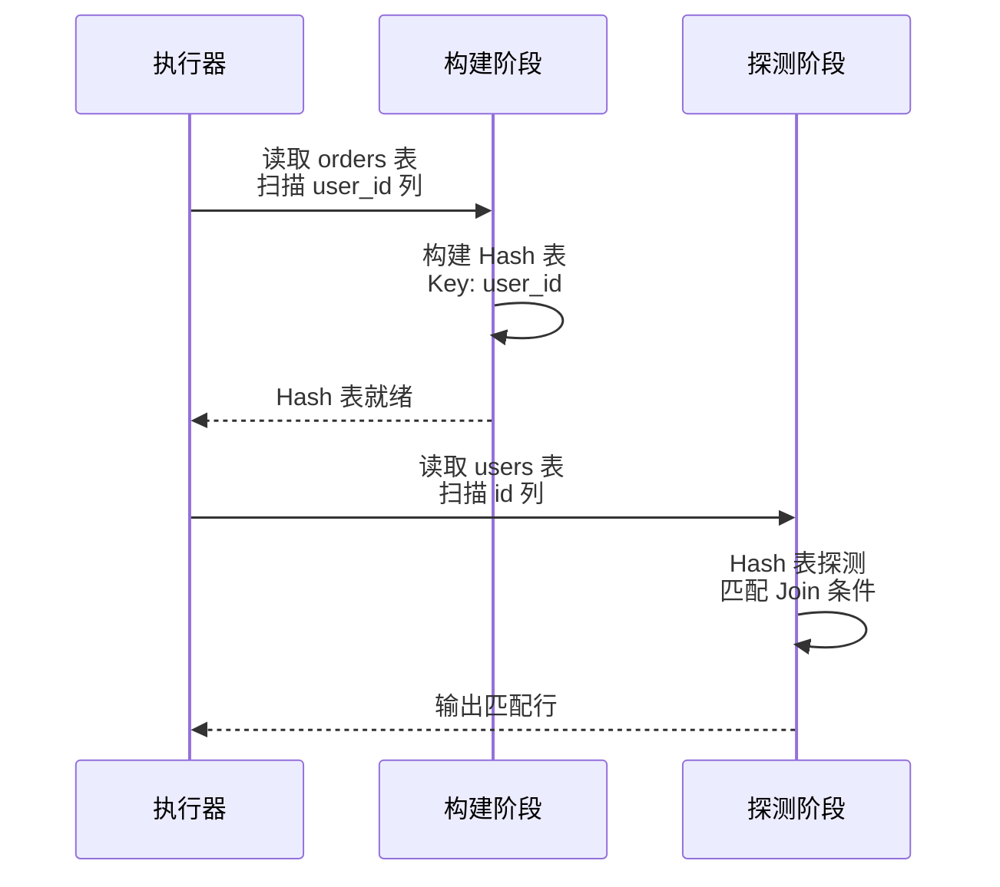

# DuckDB Hash 索引

## 学习目标

- 理解 DuckDB 为何不实现原生 Hash 索引
- 掌握 DuckDB 使用 Hash Join 替代 Hash 索引的策略
- 对比 DuckDB 与 PostgreSQL/MySQL 的 Hash 索引设计差异

## 核心概念

### DuckDB 无原生 Hash 索引

DuckDB 不实现原生 Hash 索引，原因如下：

1. **列式存储不适用**：Hash 索引需要快速定位行，列式存储按列组织，索引查找需要跨列组装
2. **OLAP 查询模式**：分析查询主要是扫描-过滤-聚合，不需要点查定位
3. **维护成本高**：Hash 索引在批量加载时需要重建，不适合 OLAP 批量导入场景

```mermaid
graph LR
    A[OLTP 数据库<br/>PG/MySQL] --> B[Hash 索引<br/>等值查询加速]
    A --> C[Hash 表查找<br/>O(1) 定位]

    D[OLAP 数据库<br/>DuckDB] --> E[无 Hash 索引<br/>列存不适用]
    D --> F[Hash Join<br/>替代索引查找]
```

## Hash Join 作为替代方案

### Hash Join 原理

DuckDB 使用 Hash Join 处理等值连接：

```sql
-- DuckDB 的 Hash Join
SELECT * FROM orders o JOIN users u ON o.user_id = u.id;
```

**执行流程**：



### Hash Join 的优势

| 维度 | Hash Join | Hash 索引 |
|------|-----------|----------|
| 构建时机 | 查询时动态构建 | 插入时预先构建 |
| 空间占用 | 临时（查询结束释放） | 持久（占用磁盘） |
| 维护成本 | 无（临时） | 高（插入/更新/删除） |
| 适用场景 | OLAP 大表 Join | OLTP 点查 |
| 列式存储 | 适合（只读 Join 列） | 不适合（跨列组装） |

### Hash Join 实现

```c
// Hash Join 构建
void hash_join_build(Vector* build_key, HashTable* table) {
    for (int i = 0; i < 1024; i++) {
        int64_t key = build_key->data[i];
        int hash = hash_function(key);
        hash_table_insert(table, hash, key, i);  // 插入 Hash 表
    }
}

// Hash Join 探测
void hash_join_probe(Vector* probe_key, HashTable* table, Vector* result) {
    for (int i = 0; i < 1024; i++) {
        int64_t key = probe_key->data[i];
        int hash = hash_function(key);
        int matched = hash_table_lookup(table, hash, key);
        if (matched >= 0) {
            result->data[result->count++] = matched;  // 匹配成功
        }
    }
}
```

## 等值查询的替代方案

### 全表扫描 + Zone Map

```sql
-- 等值查询（无索引）
SELECT * FROM users WHERE id = 100;
-- DuckDB：全表扫描 + Zone Map 过滤

-- Zone Map 过滤逻辑
-- 如果某个数据块的 min <= 100 <= max，读取该块
-- 否则跳过该块
```

**Zone Map 过滤效率**：

- 如果数据分布均匀，大部分数据块被跳过
- 如果数据分布不均匀（如 100 在某个高密度块），读取该块全量数据

### 排序 + 二分查找

```sql
-- 如果数据已排序
SELECT * FROM users WHERE id = 100;
-- DuckDB 可以使用二分查找优化
```

**优化策略**：

- 如果查询包含 `ORDER BY`，DuckDB 可以利用排序数据进行二分查找
- 但这仅适用于已排序数据，不是通用方案

## 与 PostgreSQL Hash 索引对比

| 维度 | DuckDB | PostgreSQL |
|------|--------|------------|
| Hash 索引 | 无 | 有（CREATE INDEX ... USING HASH） |
| Hash Join | 有（默认 Join 策略） | 有（可选策略） |
| 等值查询优化 | 全表扫描 + Zone Map | Hash 索引点查 |
| 索引维护 | 无 | 高（Hash 冲突处理） |

### 与 MySQL Hash 索引对比

| 维度 | DuckDB | MySQL (InnoDB) |
|------|--------|----------------|
| Hash 索引 | 无 | 有（自适应 Hash 索引） |
| Hash Join | 有 | 无（使用 Hash 索引 Join） |
| 等值查询优化 | 全表扫描 | 自适应 Hash 索引 |

## Hash Join 的适用场景

### 适合 Hash Join 的查询

```sql
-- 大表 Join
SELECT * FROM orders o JOIN users u ON o.user_id = u.id;
-- orders: 1000 万行，users: 10 万行
-- Hash Join: 构建 users 的 Hash 表（10 万条），探测 orders（1000 万条）

-- 等值连接（非主键）
SELECT * FROM orders o JOIN products p ON o.product_id = p.id;
-- product_id 不是主键，Hash Join 仍然高效
```

### 不适合 Hash Join 的查询

```sql
-- 小表点查（需要 BTree 索引）
SELECT * FROM users WHERE id = 1;
-- DuckDB: 全表扫描 + Zone Map（效率低）
-- PostgreSQL: BTree 索引点查（高效）

-- 高并发等值查询（OLTP 场景）
SELECT * FROM sessions WHERE session_id = ?;
-- DuckDB: 全表扫描（不适合 OLTP）
```

## 要点总结

- DuckDB 不实现原生 Hash 索引，列式存储不适用索引点查
- Hash Join 是 DuckDB 的核心 Join 策略，动态构建 Hash 表
- Hash Join 适合 OLAP 大表 Join，不适合 OLTP 点查
- 等值查询依赖全表扫描 + Zone Map 过滤
- DuckDB 的设计哲学：索引维护成本高，不如动态 Hash Join 灵活
- 与 PG/MySQL 相比，DuckDB 更依赖 Hash Join，不依赖 Hash 索引

## 思考题

1. DuckDB 的 Hash Join 在 Join 键的选择性高（大量重复值）时，Hash 表会膨胀吗？如何处理 Hash 冲突？
2. Hash Join 的动态构建成本与 Hash 索引的维护成本对比：在 OLAP 场景下，Hash Join 的临时构建更优，原因是什么？
3. 列式存储为何不适用 Hash 索引？Hash 索引在列式存储中查找一行数据需要哪些额外开销？
4. 如果在 DuckDB 中实现 Hash 索引，哪些查询会受益？哪些查询不会受益？