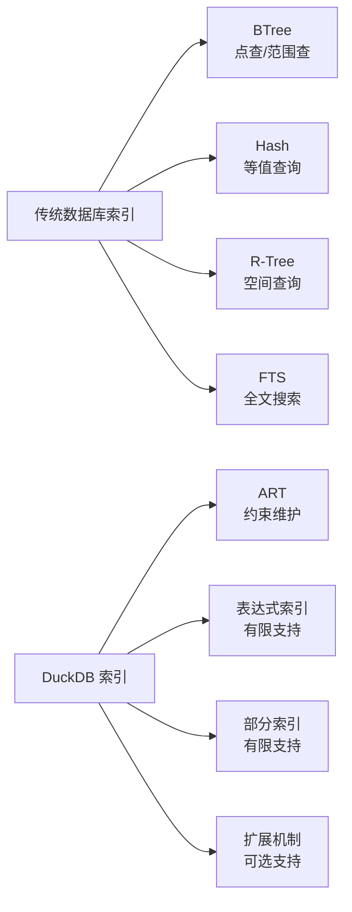
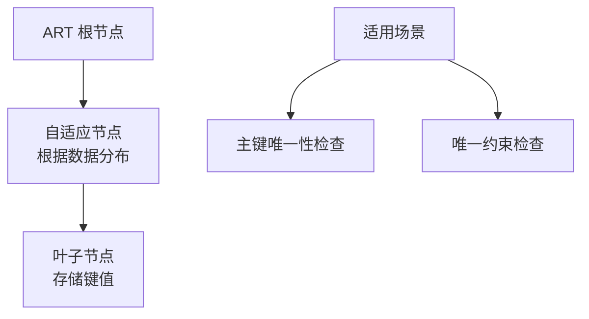
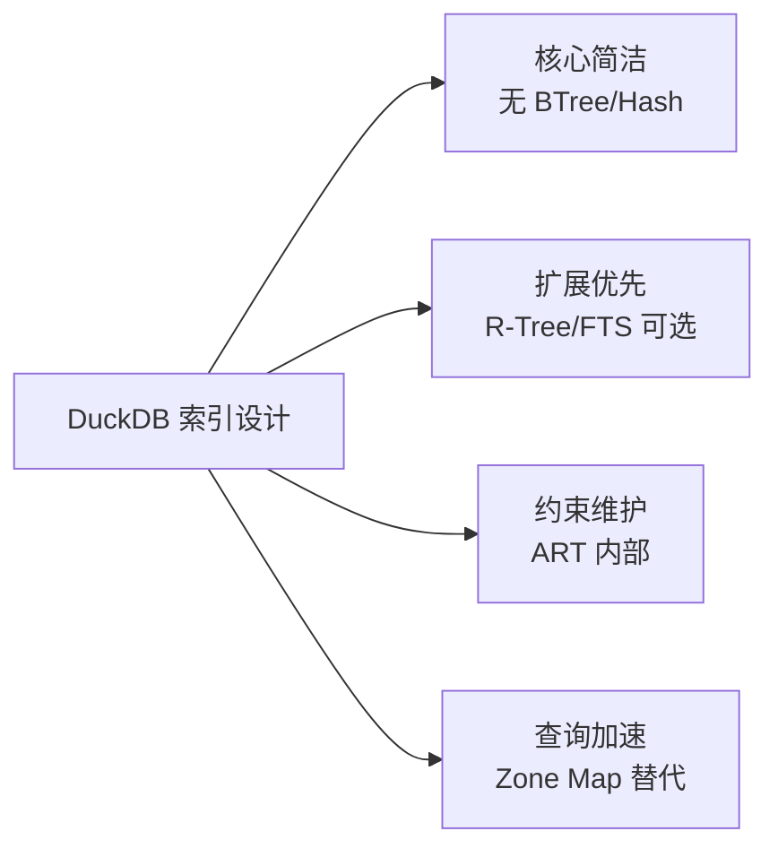

# DuckDB 其他索引类型

## 学习目标

- 掌握 DuckDB 支持的特殊索引类型：表达式索引、部分索引、ART（Adaptive Radix Tree）
- 理解 DuckDB 为何不实现空间索引（R-Tree）和全文索引（FTS），但可以通过扩展支持
- 对比 DuckDB 与 PostgreSQL/SQLite 的索引扩展能力

## 核心概念

### DuckDB 的索引类型概览

DuckDB 的索引设计极简，主要类型：

| 索引类型 | 是否支持 | 说明 |
|----------|---------|------|
| BTree | 不支持 | 列式存储不适用 |
| Hash | 不支持 | 列式存储不适用 |
| R-Tree | 不支持（可通过扩展） | 空间索引 |
| FTS | 不支持（可通过扩展） | 全文搜索 |
| 表达式索引 | 支持（有限） | 计算列索引 |
| 部分索引 | 支持（有限） | 条件过滤索引 |
| ART | 支持（内部） | 用于约束维护 |



## 表达式索引

### 什么是表达式索引

表达式索引（Expression Index）是对表达式结果建立的索引：

```sql
-- PostgreSQL 示例
CREATE INDEX idx_lower_name ON users(LOWER(name));

-- DuckDB 有限支持（主要用于约束）
CREATE TABLE users (
    id INTEGER PRIMARY KEY,
    name VARCHAR
);

-- DuckDB 不支持在任意表达式上创建索引
-- CREATE INDEX idx_lower_name ON users(LOWER(name));  -- 不支持
```

### DuckDB 的限制

DuckDB 的表达式索引主要用于**约束维护**，不用于查询加速：

- 主键约束（自动创建唯一索引）
- 唯一约束（自动创建唯一索引）
- 不支持在函数表达式上创建索引

### 列存场景的替代方案

```sql
-- 传统方案（PG）：在表达式上建索引
CREATE INDEX idx_lower_name ON users(LOWER(name));
SELECT * FROM users WHERE LOWER(name) = 'alice';  -- 索引加速

-- DuckDB 方案：生成列 + Zone Map
ALTER TABLE users ADD COLUMN name_lower VARCHAR GENERATED ALWAYS AS (LOWER(name)) STORED;
-- Zone Map 自动维护 name_lower 列的统计信息
SELECT * FROM users WHERE name_lower = 'alice';  -- Zone Map 过滤
```

## 部分索引

### 什么是部分索引

部分索引（Partial Index）是对表中满足条件的行建立的索引：

```sql
-- PostgreSQL 示例
CREATE INDEX idx_active_users ON users(email) WHERE active = true;

-- DuckDB 有限支持（主要用于约束）
CREATE TABLE orders (
    id INTEGER PRIMARY KEY,
    status VARCHAR,
    CONSTRAINT unique_pending UNIQUE (id) WHERE status = 'pending'
);

-- DuckDB 不支持创建独立的查询加速部分索引
-- CREATE INDEX idx_active_users ON users(email) WHERE active = true;  -- 不支持
```

### DuckDB 的限制

DuckDB 的部分索引主要用于**约束维护**，不用于查询加速：

- 唯一约束的过滤条件（如上例）
- 不支持在任意条件上创建部分索引

### 列存场景的替代方案

```sql
-- 传统方案（PG）：部分索引
CREATE INDEX idx_active_users ON users(email) WHERE active = true;
SELECT email FROM users WHERE active = true;  -- 索引加速

-- DuckDB 方案：Zone Map + 列裁剪
SELECT email FROM users WHERE active = true;
-- Zone Map 过滤 active = true 的数据块
-- 只读取 email 列（不读取其他列）
```

## ART（Adaptive Radix Tree）

### ART 是什么

ART（Adaptive Radix Tree）是 DuckDB 用于约束维护的内部索引结构：

- 自适应基数树，根据数据分布调整节点大小
- 用于快速判断主键/唯一键是否冲突
- 不用于查询加速，仅用于约束检查



### ART 与 BTree 对比

| 维度 | ART | BTree |
|------|-----|-------|
| 节点大小 | 自适应（根据数据分布） | 固定（页面大小） |
| 查找复杂度 | O(k)，k 为键长度 | O(log N) |
| 适用场景 | 键查找、约束检查 | 范围查找、排序 |
| DuckDB 用途 | 约束维护 | 无（不使用） |

## 扩展机制：支持更多索引

### DuckDB 扩展架构

DuckDB 提供扩展机制，可以加载自定义索引：

```sql
-- 加载扩展
INSTALL spatial;
LOAD spatial;

-- 创建空间索引（扩展支持）
CREATE INDEX idx_location ON users USING rtree(location);

-- 空间查询
SELECT * FROM users WHERE location @> ST_MakePoint(12.5, 55.6);
```

### 现有扩展

| 扩展名 | 索引类型 | 说明 |
|--------|---------|------|
| `spatial` | R-Tree | 空间索引（GIS 场景） |
| `fts` | FTS5 | 全文搜索（倒排索引） |

**示例：全文搜索扩展**

```sql
-- 安装 FTS 扩展
INSTALL fts;
LOAD fts;

-- 创建全文索引
CREATE INDEX idx_content ON documents USING fts(content);

-- 全文搜索
SELECT * FROM documents WHERE content MATCH 'database AND performance';
```

## 与 PostgreSQL 索引对比

| 维度 | DuckDB | PostgreSQL |
|------|--------|------------|
| 表达式索引 | 有限（仅约束） | 完全支持（查询加速） |
| 部分索引 | 有限（仅约束） | 完全支持（查询加速） |
| ART | 支持（内部） | 不支持 |
| R-Tree | 扩展支持 | 内置（GiST） |
| FTS | 扩展支持 | 内置（GIN） |

### 与 SQLite 索引对比

| 维度 | DuckDB | SQLite |
|------|--------|--------|
| 表达式索引 | 有限 | 不支持 |
| 部分索引 | 有限 | 不支持 |
| R-Tree | 扩展支持 | 内置扩展 |
| FTS | 扩展支持 | 内置扩展（FTS5） |

## 索引设计的权衡

### DuckDB 的设计哲学

DuckDB 的索引设计基于以下权衡：

1. **OLAP 场景**：分析查询不需要索引加速，全表扫描更高效
2. **列式存储**：索引查找需要跨列组装，不适合列存
3. **批量加载**：索引维护成本高，影响批量导入性能
4. **扩展优先**：通过扩展机制支持特殊索引，核心保持简洁



## 要点总结

- DuckDB 不实现传统索引（BTree/Hash），列式存储不需要
- 表达式索引和部分索引仅用于约束维护，不用于查询加速
- ART 是 DuckDB 内部的约束检查结构，不用于查询
- 扩展机制可以支持 R-Tree、FTS 等特殊索引
- DuckDB 的索引设计哲学：核心简洁 + 扩展灵活
- 与 PG/SQLite 相比，DuckDB 的索引功能更少，但符合 OLAP 定位

## 思考题

1. DuckDB 的 ART 与 PostgreSQL 的 BTree 在约束检查上的性能差异？为何 DuckDB 选择 ART 而非 BTree？
2. 表达式索引在列式存储中的维护成本为何高？如果强行实现表达式索引，批量导入性能会下降多少？
3. DuckDB 的扩展机制相比 PostgreSQL 的内置索引（GiST/GIN），有哪些优势和劣势？
4. 如果你的应用需要空间索引（GIS 场景），DuckDB 的 spatial 扩展与 PostgreSQL 的 PostGIS 相比，功能和性能如何？