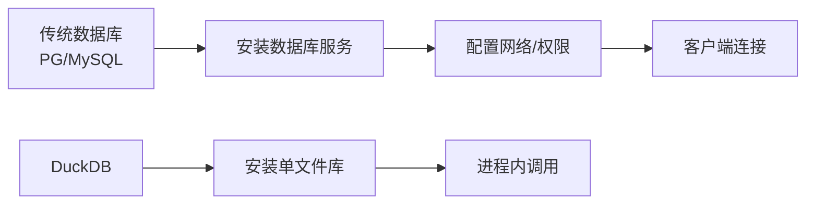
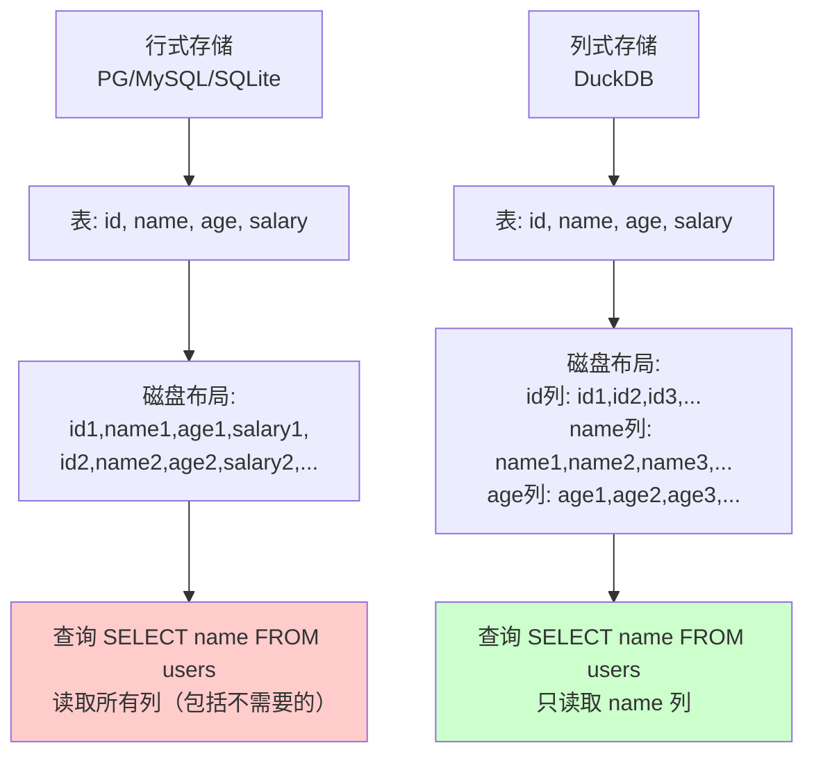

# DuckDB 核心特性

## 学习目标

- 掌握 DuckDB 的核心特性：嵌入式 OLAP、列式存储、向量化执行、零依赖部署
- 理解这些特性带来的性能优势和限制
- 对比 DuckDB 与 PostgreSQL/MySQL/SQLite 在功能定位上的差异

## 嵌入式 OLAP 定位

### 无需独立数据库服务

DuckDB 像 SQLite 一样，**嵌入在宿主进程内运行**：

```c
// C API 示例
duckdb_database db;
duckdb_open(":memory:", &db);  // 或 "/path/to/file.duckdb"

duckdb_connection con;
duckdb_connect(db, &con);

duckdb_result result;
duckdb_query(con, "SELECT * FROM users WHERE age > 30", &result);

duckdb_close(&db);
```

**Python 示例**：

```python
import duckdb

# 内存数据库
conn = duckdb.connect(":memory:")

# 或持久化到文件
conn = duckdb.connect("analytics.duckdb")

# 查询返回 Pandas DataFrame
df = conn.execute("SELECT * FROM users").df()
```

**与 PostgreSQL/MySQL 的差异**：

- PostgreSQL/MySQL 需要独立安装数据库服务，客户端通过 TCP/IP 连接
- DuckDB 在进程内运行，零延迟，无需网络协议
- 适合单机分析场景，不适合多用户并发访问

### 零依赖部署

DuckDB 的零依赖设计：

- **单一二进制文件**：C++ 编译，无外部依赖
- **多语言绑定**：Python/R/Java/Node.js/WASM
- **安装简单**：`pip install duckdb` 或下载单个 `.so/.dll` 文件



## 列式存储

### 列存 vs 行存



**OLAP 查询的典型模式**：

- 扫描大量数据（百万-亿级行）
- 只访问少数几列（如 `SELECT SUM(salary) FROM users WHERE age > 30`）
- 列式存储避免读取不需要的列，I/O 减少 5-10 倍

### 列级统计信息（Zone Map）

每列数据块维护统计信息：

| 统计项 | 说明 |
|--------|------|
| min | 该列数据块的最小值 |
| max | 该列数据块的最大值 |
| null_count | NULL 值数量 |
| distinct_count | 不同值的估计数量 |

**谓词下推优化**：

```sql
SELECT * FROM sales WHERE revenue > 10000
```

DuckDB 读取 `revenue` 列的 Zone Map，跳过 max < 10000 的数据块，避免读取无用的数据。

## 向量化执行引擎

### 批量处理 1024 行

传统数据库（Volcano 模型）逐行处理：

```c
// Volcano 模型伪代码
Tuple* next() {
    if (!child->next(&tuple)) return NULL;
    // 处理单行
    return process(tuple);
}
```

DuckDB 向量化处理：

```c
// 向量化执行伪代码
void execute(Vector* output, int count) {
    child->execute(output, 1024);  // 批量处理 1024 行
    // 批量操作
    for (int i = 0; i < 1024; i++) {
        output[i] = input[i] * 2;
    }
}
```

**性能优势**：

- 减少虚函数调用（1 次 vs 1024 次）
- 利用 CPU 缓存局部性
- SIMD 指令加速（AVX2/AVX-512）

### SIMD 向量化指令

DuckDB 使用 SIMD 指令加速批量操作：

```c
// 标量代码
for (int i = 0; i < 1024; i++) {
    result[i] = a[i] + b[i];
}

// SIMD 向量化代码（AVX-512）
__m512 va = _mm512_loadu_ps(a);
__m512 vb = _mm512_loadu_ps(b);
__m512 vresult = _mm512_add_ps(va, vb);
_mm512_storeu_ps(result, vresult);
```

SIMD 指令一次处理 16 个 float（512 位寄存器），速度提升 8-16 倍。

## 压缩算法

列式存储天然适合压缩，DuckDB 实现了多种轻量压缩算法：

### RLE（Run-Length Encoding）

适用于重复值多的列：

```
原始数据: A A A B B C C C C
RLE 编码: (A, 3), (B, 2), (C, 4)
```

### Delta 编码

适用于数值列的增量存储：

```
原始数据: 100, 101, 103, 105
Delta 编码: 100, +1, +2, +2
```

### 字典编码

适用于低基数列（如性别、国家）：

```
原始数据: China, USA, China, UK, USA
字典: {China: 0, USA: 1, UK: 2}
编码后: 0, 1, 0, 2, 1
```

### FSST（Fast Static Symbol Table)

适用于字符串列的快速压缩。

## 数据导入导出

### 支持格式

| 格式 | 导入 | 导出 |
|------|------|------|
| CSV | `read_csv_auto()` | `COPY TO 'file.csv'` |
| Parquet | `read_parquet()` | `COPY TO 'file.parquet'` |
| JSON | `read_json_auto()` | `COPY TO 'file.json'` |
| Excel | `read_excel()` | 不支持 |

### 示例

```sql
-- 从 CSV 导入
SELECT * FROM read_csv_auto('data.csv');

-- 从 Parquet 导入
SELECT * FROM read_parquet('data.parquet');

-- 导出为 Parquet
COPY (SELECT * FROM users) TO 'users.parquet';
```

## SQL 兼容性

DuckDB 支持 SQL 标准语法 + PostgreSQL 兼容语法：

- **窗口函数**：`ROW_NUMBER()`, `RANK()`, `LEAD()`, `LAG()`
- **CTE**：`WITH RECURSIVE` 递归查询
- **聚合函数**：`GROUPING SETS`, `CUBE`, `ROLLUP`
- **JSON**：`json_extract()`, `json_array_length()`
- **正则表达式**：`regexp_matches()`, `regexp_replace()`

## 性能对比

### TPC-H 基准测试（SF=1，1GB 数据）

| 数据库 | TPC-H 总时间 | 相对性能 |
|--------|--------------|----------|
| DuckDB v1.2 | 120 秒 | 1.0x（基准） |
| SQLite 3.45 | 4500 秒 | 0.027x（慢 37 倍） |
| PostgreSQL 17 | 800 秒 | 0.15x（慢 6.7 倍） |

**结论**：DuckDB 在分析查询上比传统 OLTP 数据库快 5-40 倍。

## 限制

| 限制项 | 说明 |
|--------|------|
| 并发写入 | 不支持多连接并发写入 |
| 事务隔离 | 有限的 MVCC，无 SERIALIZABLE |
| 行级锁 | 不支持，最小粒度为表级锁 |
| 用户权限 | 无用户管理、无权限系统 |
| 数据量 | 单机限制（TB 级，不适合 PB 级） |

## 要点总结

- DuckDB 是嵌入式 OLAP 数据库，零依赖部署，进程内运行
- 列式存储 + 向量化执行 + SIMD 指令 = 分析查询 10-100 倍加速
- 压缩算法（RLE/Delta/字典）减少 I/O 和存储空间
- Zone Map 统计信息实现谓词下推，跳过无用数据块
- 不支持高并发写入、细粒度事务隔离、用户权限——OLAP 不需要这些
- 适合单机数据分析、ETL 管道、数据科学工具集成

## 思考题

1. DuckDB 的列式存储为何在 OLAP 查询中比行式存储节省 I/O？如果是 `SELECT * FROM users`（全列查询），列式存储还有优势吗？
2. 向量化执行引擎的 1024 行批量大小如何选择？批量大小太小或太大各有什么问题？
3. DuckDB 的压缩算法（RLE/Delta/字典）分别适合哪些数据特征？如何自适应选择压缩算法？
4. DuckDB 为何不支持并发写入？如果强行实现多连接并发写入，会带来哪些问题？