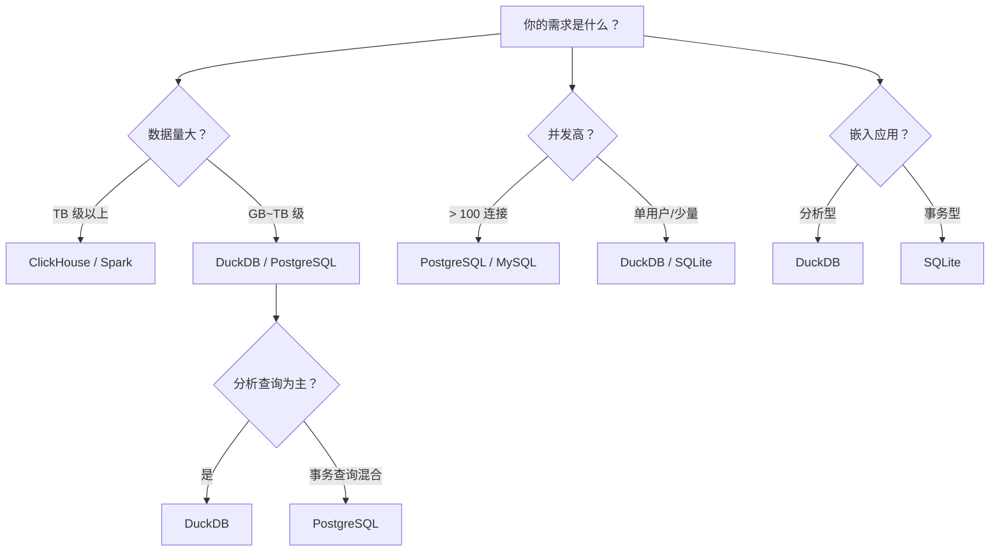

# DuckDB 使用场景

## 学习目标

- 掌握 DuckDB 的典型使用场景与其设计定位的匹配关系
- 理解 DuckDB 在数据科学、ETL、嵌入式分析等场景中的具体用法
- 对比 DuckDB 与 SQLite/PostgreSQL/MySQL 的场景选择策略

## 核心场景：交互式数据分析

### Jupyter Notebook 分析

DuckDB 在数据科学领域最大的优势是**快速上手**和**零配置**：

```python
import duckdb
import pandas as pd

# 从 Pandas DataFrame 直接查询
df = pd.read_csv("sales.csv")
result = duckdb.sql("""
    SELECT 
        region,
        SUM(revenue) AS total_revenue,
        AVG(revenue) AS avg_revenue,
        COUNT(*) AS transaction_count
    FROM df
    WHERE date >= '2026-01-01'
    GROUP BY region
    ORDER BY total_revenue DESC
""").df()
```

**优势**：无需 ETL、无需配置数据库、直接查询 DataFrame/CSV/Parquet。

### 大数据集探索

对于 GB-TB 级数据，DuckDB 可以替代 Spark SQL 的部分场景：

```python
# 直接查询 Parquet 文件（无需导入）
df = duckdb.sql("""
    SELECT part_type, AVG(price) as avg_price
    FROM read_parquet('sales_data/*.parquet')
    WHERE sale_date BETWEEN '2026-01-01' AND '2026-06-30'
    GROUP BY part_type
    ORDER BY avg_price DESC
    LIMIT 10
""").df()
```

**优势**：列式存储 + 向量化执行，单机性能优于 Pandas 的 DataFrame 操作。

## ETL 数据管道

### 轻量级数据转换

```python
# ETL 管道示例
import duckdb

conn = duckdb.connect("etl_pipeline.duckdb")

# 1. 从 CSV 提取
conn.execute("""
    CREATE TABLE raw_data AS
    SELECT * FROM read_csv_auto('data/source_*.csv')
""")

# 2. 转换
conn.execute("""
    CREATE TABLE cleaned AS
    SELECT 
        id,
        UPPER(name) AS name,
        CAST(amount AS DOUBLE) AS amount,
        CASE 
            WHEN amount > 1000 THEN 'VIP'
            ELSE 'NORMAL'
        END AS category
    FROM raw_data
    WHERE amount IS NOT NULL
""")

# 3. 加载到 Parquet
conn.execute("""
    COPY cleaned TO 'output/cleaned.parquet'
""")
```

### 跨格式数据集成

```sql
-- DuckDB 可以在不同数据格式之间直接转换
CREATE TABLE monthly_report AS
SELECT 
    c.customer_id,
    c.name,
    s.total_spent,
    s.order_count
FROM read_csv('customers.csv') c
JOIN read_parquet('orders/*.parquet') s
    ON c.customer_id = s.customer_id
WHERE s.order_date >= '2026-01-01';
```

## 嵌入式分析场景

### 移动端/桌面应用

DuckDB 可以嵌入在桌面应用中提供分析功能：

```c
// C API 嵌入到桌面应用
duckdb_database db;
duckdb_open("app_data.duckdb", &db);

duckdb_connection con;
duckdb_connect(db, &con);

// 应用内分析
duckdb_query(con, 
    "SELECT category, COUNT(*) FROM logs "
    "WHERE timestamp > CURRENT_TIMESTAMP - INTERVAL '7 days' "
    "GROUP BY category", 
    &result);
```

### IoT 设备统计

```python
# IoT 设备上的嵌入式分析
import duckdb

conn = duckdb.connect("device_stats.duckdb")

# 设备端计算
result = conn.execute("""
    SELECT 
        sensor_id,
        AVG(temperature) AS avg_temp,
        MAX(temperature) AS max_temp,
        MIN(temperature) AS min_temp
    FROM read_json('sensor_data.json')
    WHERE timestamp > CURRENT_TIMESTAMP - INTERVAL '1 hour'
    GROUP BY sensor_id
""").fetchall()
```

## 小规模数据科学

### 替代 Pandas 的场景

当数据量超过内存时，Pandas 会崩溃，而 DuckDB 可以处理溢出：

```python
# Pandas 处理 10GB CSV 会内存溢出
# df = pd.read_csv("large_data.csv")  # 内存不足

# DuckDB 通过列式存储 + 压缩处理
duckdb.sql("""
    SELECT date, SUM(revenue)
    FROM read_csv_auto('large_data.csv')
    GROUP BY date
""").show()
```

### 机器学习特征工程

```python
# 特征工程
features = duckdb.sql("""
    WITH user_features AS (
        SELECT 
            user_id,
            COUNT(*) AS total_orders,
            SUM(amount) AS total_spent,
            AVG(amount) AS avg_order_value,
            MAX(amount) AS max_order_value,
            DATEDIFF('day', MAX(order_date), CURRENT_DATE) AS days_since_last_order
        FROM orders
        GROUP BY user_id
    ),
    category_features AS (
        SELECT 
            user_id,
            COUNT(DISTINCT category) AS category_diversity,
            FIRST(category ORDER BY COUNT(*) DESC) AS fav_category
        FROM orders
        GROUP BY user_id, category
    )
    SELECT * FROM user_features u
    LEFT JOIN category_features c ON u.user_id = c.user_id
""").df()
```

## 何时不应使用 DuckDB

| 场景 | 原因 | 替代方案 |
|------|------|----------|
| 高并发 OLTP | 表级锁、无事务隔离 | PostgreSQL / MySQL |
| 多用户系统 | 无用户管理、无权限系统 | PostgreSQL / MySQL |
| 实时写入（每秒 > 1000 行） | 写入性能有限 | ClickHouse / TimescaleDB |
| 数据量 > 10TB | 单机限制 | ClickHouse / Spark / Presto |
| 移动端轻量存储（< 100MB） | 功能过剩 | SQLite |
| 需要强一致性事务 | 有限的 MVCC 支持 | PostgreSQL |

## 场景选择决策树



## DuckDB vs SQLite 定位对比

| 维度 | DuckDB | SQLite |
|------|--------|--------|
| 定位 | 嵌入式 OLAP | 嵌入式 OLTP |
| 存储模型 | 列式 | 行式（BTree） |
| 执行模型 | 向量化（1024 行批量） | 逐行（VDBE 字节码） |
| 典型查询 | 聚合、扫描、分组 | 点查、插入、更新 |
| 压缩 | RLE/Delta/字典 | 无 |
| 索引 | 无（列存不需要） | BTree 索引 |
| 事务隔离 | 有限 MVCC | 5 级文件锁 |
| 数据量 | GB-TB | MB-GB |
| 典型场景 | 数据分析、ETL | 移动端、嵌入式设备 |

## 要点总结

- DuckDB 最适合单机分析场景：交互式数据探索、ETL、数据科学
- 与 SQLite 同属嵌入式，但分别面向 OLAP 和 OLTP 两个极端
- 推荐在 Jupyter Notebook 中作为 Pandas 的替代方案（处理超内存数据）
- 不推荐用于高并发、多用户、强事务场景
- 适用于 GB-TB 级数据量，超过 10TB 需要 ClickHouse/Spark 等分布式方案

## 思考题

1. 在 Jupyter Notebook 中，使用 DuckDB 查询 Parquet 文件相比 Pandas DataFrame 操作有哪些优势？
2. 如果你的应用需要同时支持 OLTP（用户事务）和 OLAP（分析报表），单体使用 DuckDB 还是多数据库混合方案更合适？
3. DuckDB 的嵌入式设计在哪些场景下比 ClickHouse 的分布式架构更适合？两者的边界在哪里？
4. 如果要在移动端实现嵌入式分析，DuckDB 的 WASM 版本相比 SQLite 在性能、内存占用、功能完整性上如何？