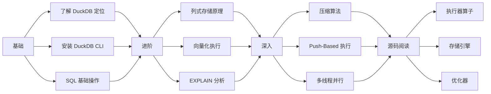

# DuckDB 学习资源

## 学习目标

- 了解 DuckDB 的官方文档结构、社区资源、推荐书籍
- 掌握 DuckDB 源码阅读路径和关键入口点
- 建立系统化的 DuckDB 学习路线图

## 官方文档

### 文档入口

- **DuckDB 官网**：[https://duckdb.org](https://duckdb.org)
- **文档首页**：[https://duckdb.org/docs](https://duckdb.org/docs)
- **GitHub 仓库**：[https://github.com/duckdb/duckdb](https://github.com/duckdb/duckdb)
- **API 参考**：[https://duckdb.org/docs/api](https://duckdb.org/docs/api)

### 文档结构

```
docs/
├── sql/                  # SQL 语法参考
│   ├── statements/       # DDL/DML 语句
│   ├── functions/        # 函数列表
│   ├── data_types/       # 数据类型
│   └── query_syntax/     # 查询语法
├── api/                  # 多语言 API
│   ├── c/                # C API
│   ├── python/           # Python API
│   ├── java/             # JDBC
│   ├── nodejs/           # Node.js
│   └── r/                # R API
├── data/                 # 数据导入导出
│   ├── parquet/          # Parquet
│   ├── csv/              # CSV
│   └── json/             # JSON
├── extensions/           # 扩展
│   ├── fts/              # 全文搜索
│   ├── httpfs/           # HTTP 文件系统
│   └── spatial/          # 空间扩展
└── internals/            # 内部实现
    ├── execution/        # 执行引擎
    ├── storage/          # 存储引擎
    └── optimizer/        # 优化器
```

### 关键文档

- **SQL 语法参考**：官方的 SQL 语法文档是最全面的参考资料
- **Python API 文档**：Python 绑定是 DuckDB 最常用的接口
- **Internals 文档**：了解 DuckDB 内部实现的最佳入口

## 推荐书籍

### 论文

- **《DuckDB: an Embeddable Analytical Database》**：DuckDB 的 SIGMOD 2019 论文，介绍了核心设计理念
- **《Morsel-Driven Parallelism: A NUMA-Aware Query Evaluation Framework》**：DuckDB 向量化执行的灵感来源（MonetDB/X100 论文）
- **《The Cascades Framework for Query Optimization》**：DuckDB 优化器的理论基础
- **《Column-Stores vs. Row-Stores: How Different Are They Really?》**：列式存储 vs 行式存储的经典对比

### 参考书籍

- **《Database Systems: The Complete Book》**（Garcia-Molina, Ullman, Widom）：数据库系统基础
- **《Readings in Database Systems》**（Peter Bailis 等）：数据库系统经典论文合集
- **《Designing Data-Intensive Applications》**（Martin Kleppmann）：数据密集型系统设计

## 源码阅读路径

### 源码结构

```
src/
├── include/              # 头文件
│   ├── duckdb.hpp        # 主头文件
│   ├── common/           # 公共类型
│   ├── parser/           # SQL 解析器
│   ├── planner/          # 计划器
│   ├── optimizer/        # 优化器
│   ├── executor/         # 执行器
│   └── storage/          # 存储引擎
├── parser/               # 解析器实现
│   ├── parser.cpp        # SQL → AST
│   └── transformer/      # AST 转换
├── planner/               # 计划器实现
│   ├── planner.cpp       # AST → Logical Plan
│   └── binder/           # 名称绑定
├── optimizer/             # 优化器实现
│   ├── optimizer.cpp     # 主优化器
│   ├── filter_pushdown/  # 谓词下推
│   ├── column_lifetime/  # 列裁剪
│   └── join_order/       # Join 排序
├── executor/              # 执行器实现
│   ├── executor.cpp      # 主执行器
│   ├── operator/         # 物理算子
│   │   ├── physical_table_scan.cpp
│   │   ├── physical_hash_join.cpp
│   │   └── physical_aggregate.cpp
│   └── vector/           # 向量化操作
│       ├── vector_operations.cpp
│       └── simd/         # SIMD 加速
└── storage/               # 存储引擎实现
    ├── storage.cpp       # 主存储
    ├── table/            # 表的存储
    └── compression/      # 压缩算法
        ├── rle.cpp       # RLE 编码
        ├── delta.cpp     # Delta 编码
        └── dictionary.cpp# 字典编码
```

### 推荐阅读顺序

```
1. src/include/duckdb.hpp          # 主头文件，了解整体结构
2. src/parser/parser.cpp           # 解析器入口
3. src/planner/planner.cpp         # 计划器入口
4. src/optimizer/optimizer.cpp     # 优化器入口
5. src/executor/executor.cpp       # 执行器核心
6. src/executor/operator/          # 物理算子实现
7. src/executor/vector/            # 向量化操作
8. src/storage/storage.cpp         # 存储引擎
9. src/storage/compression/        # 压缩算法
```

## 关键源码入口

### 向量化执行引擎

**核心文件**：`src/executor/executor.cpp`

```cpp
// 主执行循环
void Executor::Execute(PhysicalOperator& plan) {
    // 创建执行上下文
    ExecutionContext context;
    
    // 递归执行物理计划
    auto result = ExecuteOperator(plan, context);
    
    // 收集结果
    while (result->HasNext()) {
        auto chunk = result->GetNext();
        // 处理结果块
    }
}
```

### 向量化算子

**核心文件**：`src/executor/vector/vector_operations.cpp`

```cpp
// 向量化加法操作
void VectorOperations::Add(Vector& left, Vector& right, Vector& result) {
    // 批量处理 1024 行
    for (int i = 0; i < 1024; i++) {
        result.data[i] = left.data[i] + right.data[i];
    }
}
```

### 列压缩

**核心文件**：`src/storage/compression/rle.cpp`

```cpp
// RLE 压缩
void RLECompression::Compress(Vector& input, Vector& output) {
    int run_count = 0;
    int current_run = 1;
    for (int i = 1; i < 1024; i++) {
        if (input.data[i] == input.data[i-1]) {
            current_run++;
        } else {
            output.data[run_count] = input.data[i-1];
            output.run_length[run_count] = current_run;
            run_count++;
            current_run = 1;
        }
    }
}
```

## 社区资源

### GitHub

- **DuckDB 主仓库**：[https://github.com/duckdb/duckdb](https://github.com/duckdb/duckdb)
- **DuckDB 扩展**：[https://github.com/duckdb/duckdb](https://github.com/duckdb/duckdb) 下的 `extension/` 目录
- **DuckDB 分析**：[https://github.com/duckdb/duckdb-analysis](https://github.com/duckdb/duckdb-analysis)

### 社区

- **Discord**：[https://discord.duckdb.org](https://discord.duckdb.org)（最活跃的社区渠道）
- **GitHub Issues**：Bug 报告和功能请求
- **Stack Overflow**：`duckdb` 标签

### 博客

- **DuckDB 博客**：[https://duckdb.org/news](https://duckdb.org/news)（官方博客，发布新版本和性能故事）
- **Medium 文章**：许多 DuckDB 教程和案例研究

## 学习路线图



## 要点总结

- DuckDB 官方文档是学习 SQL 语法和 API 的最佳参考
- 源码阅读推荐顺序：解析器 → 计划器 → 优化器 → 执行器 → 存储引擎
- 向量化执行引擎是 DuckDB 的核心，应重点阅读 `src/executor/` 目录
- 社区以 Discord 和 GitHub Issues 为最活跃渠道
- 学习路线图：基础 → 进阶 → 深入 → 源码阅读

## 思考题

1. DuckDB 的源码结构相比 PostgreSQL 的源码（`src/backend/`）有哪些简化？这些简化对理解数据库实现有何帮助？
2. DuckDB 的向量化执行引擎与 MonetDB 的 X100 引擎有何异同？DuckDB 在哪些方面做了改进？
3. 如果要在你的项目中集成 DuckDB 作为嵌入式分析引擎，C API 和 Python API 哪个更适合？各有什么优缺点？
4. DuckDB 的压缩算法（RLE/Delta/字典）的源码实现中，哪些部分可以复用到你的项目中？