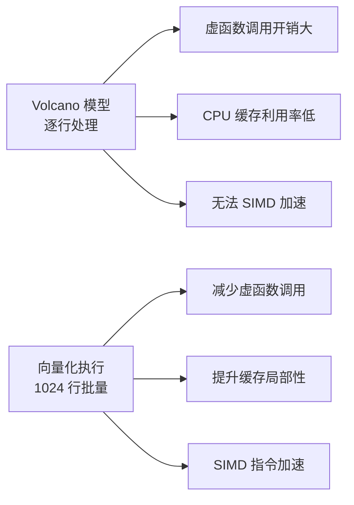

# DuckDB 与本项目的关系

## 学习目标

- 理解 DuckDB 作为嵌入式 OLAP 数据库的实现参考价值
- 掌握 DuckDB 的架构设计对本项目存储引擎、执行引擎的启发
- 建立本项目与 DuckDB 的对比学习路径

## 本项目概述

本项目（`book` 仓库）是一个 C/C++ 数据库学习项目，实现了：

- **存储引擎**：PostgreSQL 风格的存储架构（Catalog、Buffer Pool、Heap AM、BTree AM、WAL）
- **多模态存储**：KV、Vector、Timeseries、Document、Spatial、Graph、Yang
- **查询引擎**：SQL 解析、计划器、优化器、执行器
- **学习轨道**：LeetCode、面试题、教学代码

**项目定位**：学习型数据库实现，参考 PostgreSQL/SQLite/DuckDB 等开源数据库的设计。

## DuckDB 对本项目的启发

### 1. 向量化执行引擎

**本项目现状**：

- 执行器采用传统的 Volcano 模型（逐行 next() 调用）
- 代码路径：`engineering/src/db/sql/executor/`

**DuckDB 的启发**：



**改进方向**：

- 在执行器中引入向量化算子（如 `VectorizedFilter`、`VectorizedJoin`）
- 批量处理数据块（1024 行为一个单元）
- 利用 SIMD 指令加速聚合操作

### 2. 列式存储

**本项目现状**：

- 仅支持行式存储（堆表 + BTree 索引）
- 多模态存储中，Vector 和 Timeseries 仍是行式实现

**DuckDB 的启发**：

- 在 `engineering/src/db/storage/` 中新增列式存储引擎
- 实现 Zone Map 统计信息（min/max/null_count）
- 设计列压缩算法（RLE/Delta/字典）

**潜在架构**：

```c
// 列式存储抽象
typedef struct ColumnChunk {
    int column_id;
    void* data;             // 列数据
    int64_t min_value;      // 最小值
    int64_t max_value;      // 最大值
    int null_count;         // NULL 数量
    CompressionType type;   // 压缩类型
} ColumnChunk;
```

### 3. Push-Based 执行模型

**本项目现状**：

- 执行器采用 Pull-Based 模型（下游算子调用上游的 next()）

**DuckDB 的启发**：

- 数据从下游向上游推送，减少虚函数调用
- 适合向量化执行，批量推送数据块

**改进方向**：

```c
// Pull-Based（当前）
Tuple* next() {
    return child->next();
}

// Push-Based（改进）
void execute(ResultSink* sink) {
    child->execute(sink);  // 向下游推送数据
}
```

### 4. 压缩算法

**本项目现状**：

- 无数据压缩支持

**DuckDB 的启发**：

- 在列式存储中集成轻量压缩算法
- 压缩算法选择器（根据数据特征自动选择）

**潜在实现**：

```c
// 压缩接口
typedef struct CompressionStrategy {
    void (*compress)(ColumnChunk* input, ColumnChunk* output);
    void (*decompress)(ColumnChunk* input, ColumnChunk* output);
    int (*estimate_ratio)(ColumnChunk* data);  // 估算压缩率
} CompressionStrategy;
```

## 对比学习路径

### 存储引擎对比

| 维度 | 本项目（PG 风格） | DuckDB |
|------|------------------|--------|
| 存储模型 | 行式（堆表） | 列式 |
| Buffer Pool | 有（Clock-Sweep） | 无（OS 页缓存） |
| 索引 | BTree | 无（列存不需要） |
| 压缩 | 无 | RLE/Delta/字典 |
| 统计信息 | 无 | Zone Map |

**学习目标**：

- 理解为何 DuckDB 不需要独立 Buffer Pool（列存直接映射内存）
- 掌握列式存储的 Zone Map 过滤原理
- 比较行式存储与列式存储在不同查询模式下的性能差异

### 执行引擎对比

| 维度 | 本项目（PG 风格） | DuckDB |
|------|------------------|--------|
| 执行模型 | Volcano（Pull-Based） | 向量化（Push-Based） |
| 批量大小 | 1 行 | 1024 行 |
| SIMD 加速 | 无 | 有（AVX2/AVX-512） |
| Join 策略 | Hash Join | Hash Join |
| 聚合策略 | 排序聚合 | Hash 聚合 |

**学习目标**：

- 对比 Pull-Based 与 Push-Based 执行模型的性能差异
- 理解向量化执行在分析查询中的优势
- 掌握 SIMD 指令在数据库执行引擎中的应用

### 优化器对比

| 维度 | 本项目（PG 风格） | DuckDB |
|------|------------------|--------|
| 优化器框架 | System-R 风格 | Cascades 框架 |
| Join 重排序 | 启发式 | 基于代价 |
| 谓词下推 | 支持 | 支持 + Zone Map |
| 列裁剪 | 支持 | 支持 |

**学习目标**：

- 比较 System-R 与 Cascades 优化器的设计差异
- 理解 DuckDB 如何利用统计信息进行代价估算
- 掌握列式存储特有的优化规则（Zone Map 过滤）

## 项目集成可能性

### 1. DuckDB 作为分析引擎

**场景**：在本项目中嵌入 DuckDB 作为分析查询引擎。

```c
// 嵌入 DuckDB
duckdb_database db;
duckdb_open(":memory:", &db);

// 执行分析查询
duckdb_query(db, "SELECT SUM(revenue) FROM sales WHERE region = 'Asia'", &result);
```

**优势**：

- 利用 DuckDB 的向量化执行引擎加速分析查询
- 零配置嵌入，无需独立安装

### 2. DuckDB 作为数据导入工具

**场景**：使用 DuckDB 导入 Parquet/CSV 数据到本项目的存储引擎。

```python
import duckdb

# 读取 Parquet
df = duckdb.sql("SELECT * FROM read_parquet('data.parquet')").df()

# 转换为本项目的存储格式
# ...
```

### 3. DuckDB 的测试数据生成

**场景**：使用 DuckDB 生成测试数据集。

```sql
-- DuckDB 生成测试数据
CREATE TABLE test_data AS
SELECT
    range AS id,
    random() * 1000 AS value
FROM range(0, 1000000);

-- 导出为本项目可导入的格式
COPY test_data TO 'test_data.csv';
```

## 不适合集成的部分

| DuckDB 特性 | 不适合原因 |
|-------------|-----------|
| OLAP 定位 | 本项目同时支持 OLTP 和 OLAP，不能只依赖 DuckDB |
| 无事务隔离 | 本项目需要完整 MVCC 事务 |
| 无用户管理 | 本项目需要用户权限系统 |
| 单机限制 | 本项目计划支持分布式 |

## 要点总结

- DuckDB 的向量化执行引擎是本项目执行器改进的重要参考
- 列式存储 + Zone Map + 压缩算法是本项目多模态存储的补充方向
- Push-Based 执行模型与向量化执行配套，适合分析查询
- DuckDB 不适合作为本项目的唯一存储引擎（OLAP vs OLTP 定位不同）
- 推荐将 DuckDB 作为嵌入式分析引擎、数据导入工具、测试数据生成器集成到项目中

## 思考题

1. 如果在本项目中新增列式存储引擎，应该放在 `engineering/src/db/storage/` 的哪个位置？如何与现有的行式存储引擎共存？
2. 向量化执行引擎的引入是否需要重写整个执行器？有没有渐进式引入的方案？
3. DuckDB 的 Push-Based 执行模型与 PostgreSQL 的 Pull-Based 模型在实现复杂度上有何差异？哪种更容易调试和理解？
4. 本项目的多模态存储（Vector/Timeseries）是否适合采用 DuckDB 的列式存储设计？为什么？