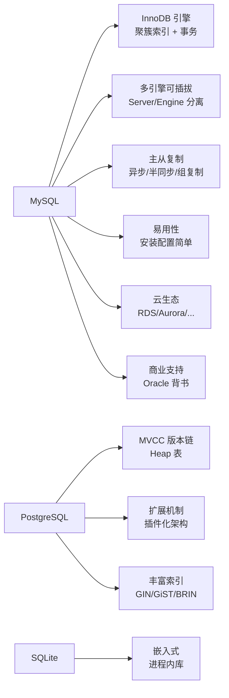
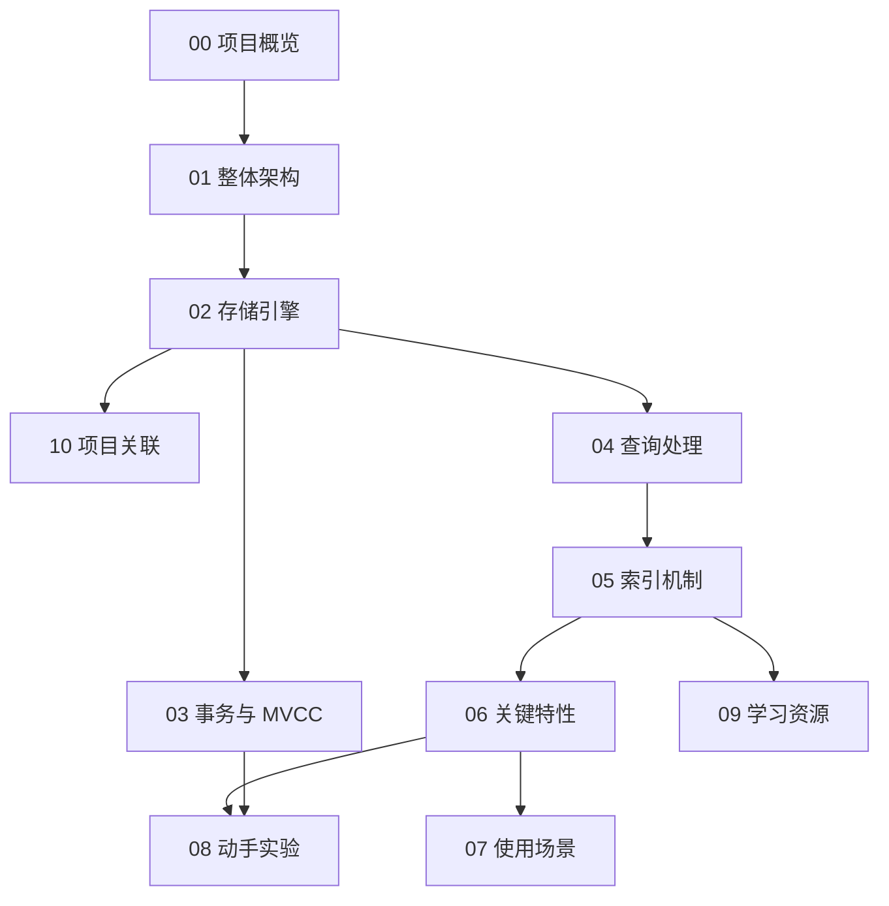

# MySQL 项目概览

## 学习目标

- 了解 MySQL 的项目定位、历史脉络与社区生态
- 掌握 MySQL 的核心设计理念与适用场景
- 建立对 MySQL 全栈模块的整体认知框架，重点理解 InnoDB 引擎

## 项目定位

> MySQL 是目前最流行的开源关系型数据库管理系统之一，以"多引擎可插拔"架构和"易用性"为核心竞争力。

**基本信息**：

- 开发方：Oracle Corporation（最初由 MySQL AB 开发，2008 年被 Sun 收购，2010 年 Sun 被 Oracle 收购）
- 创始人：Michael "Monty" Widenius 和 David Axmark
- 首次发布：1995 年
- 开源协议：GPL v2（双协议许可，商业版需购买 Oracle 授权）
- 当前最新版本：8.4 LTS / 9.x Innovation（Oracle 自 2023 年起采用 LTS + Innovation Release 双轨制，LTS 每 2 年发版，Innovation 季度发版）
- GitHub Stars：约 11k（[mysql/mysql-server](https://github.com/mysql/mysql-server)）
- 官方网站：[https://www.mysql.com](https://www.mysql.com)

## 核心设计理念

MySQL 的设计哲学可以概括为四点：**多引擎可插拔**、**易用性优先**、**读写分离生态**、**商业友好**。

第一，**多引擎可插拔（Pluggable Storage Engine）**。这是 MySQL 最独特的架构决策。Server 层负责连接管理、SQL 解析、优化、缓存，而存储引擎层以插件形式挂载。InnoDB 是默认引擎（2005 年起），此外还有 MyISAM（全文索引）、Memory（临时表）、NDB Cluster（分布式）等。这种分离让用户可以根据业务场景选择合适的引擎——尽管实践中大多数场景只使用 InnoDB。

第二，**易用性优先**。MySQL 的安装、配置、管理都比 PostgreSQL 更简便。用户不需要理解复杂的进程模型、共享内存配置、VACUUM 等概念就能上手。MySQL 社区有大量现成的运维工具、云厂商托管服务，降低了 DBA 入门门槛。

第三，**读写分离生态**。MySQL 原生支持异步主从复制，加上 ProxySQL、Orchestrator、MGR（MySQL Group Replication）等工具，可以构建灵活的高可用和读写分离架构。这在互联网公司中非常流行。

第四，**商业友好**。Oracle 对 MySQL 的双协议许可策略使其在商业环境中"用起来简单、买起来也简单"——GPL 版本免费可用，商业版提供额外工具和技术支持。Oracle 同时持续投入 InnoDB 的性能优化，尤其是 8.0 之后的版本。

## 核心优势与差异化特性

MySQL 与 PostgreSQL 的关键差异：

- **引擎架构**：MySQL 是 Server / Engine 分离，同一引擎可替换；PG 是单引擎深度优化
- **存储方式**：MySQL InnoDB 使用聚簇索引（IOT），数据即主键索引；PG 使用 Heap 表，数据和索引分离
- **MVCC 实现**：MySQL InnoDB 使用 undo log + read view；PG 在 Heap Tuple 上携带 xmin/xmax
- **进程模型**：MySQL 一个连接一个线程；PG 一个连接一个进程
- **复制方式**：MySQL 基于 binlog 的逻辑复制；PG 基于 WAL 的物理流复制

## 适用场景

MySQL 在以下场景中表现出色：

- **互联网 OLTP 系统**：高并发读写、简单查询为主、读写分离架构
- **SaaS 平台**：多租户隔离、快速部署、运维简单
- **电商/金融**：InnoDB 的聚簇索引在等值查询和范围扫描上性能优异
- **CMS 与博客**：WordPress、Drupal 等 CMS 默认使用 MySQL
- **云原生部署**：RDS、Aurora、PolarDB 等云数据库均以 MySQL 兼容协议为基础

不擅长的场景：

- **复杂分析查询**：MySQL 的优化器复杂 JOIN 能力弱于 PG，不支持 CTE 递归、窗口函数有限
- **GIS 空间数据**：PostGIS 远强于 MySQL 的空间扩展
- **全文检索**：Elasticsearch / PG 的全文检索能力更强
- **超大规模数据仓库**：ClickHouse / DuckDB 更适合列存分析
- **嵌入式场景**：SQLite 更轻量

## 学习路线图

建议按以下顺序学习 MySQL：

**推荐路径**：先读 `01_architecture.md` 理解 Server / Engine 分层架构；再到 `02_storage` 了解 InnoDB 的 Buffer Pool、Redo Log、Undo Log；接着 `03_transaction` 理解 MVCC 与锁机制；然后 `04_query` 看 SQL 执行流程；最后到 `05_index` 理解 MySQL 的 B+Tree 聚簇索引与 InnoDB 的索引组织表。

## 要点总结

- MySQL 以"多引擎可插拔 + 易用性"为核心竞争力，InnoDB 是默认且最常用的引擎
- 聚簇索引是 MySQL InnoDB 最核心的存储特征——数据即主键索引
- MySQL 使用 undo log 实现 MVCC、redo log 实现崩溃恢复，这种日志体系与 PG 的 xmin/xmax 方案不同
- MySQL 的复制基于 binlog（逻辑日志），主从架构成熟，读写分离生态丰富
- 学习 MySQL 应从 Server/Engine 分层架构切入，重点理解 InnoDB 存储引擎

## 思考题

1. MySQL 的"多引擎可插拔"架构对数据库运维和业务开发带来了哪些好处？又带来了哪些限制？
2. 聚簇索引（IOT）相比 Heap 表的优势是什么？在什么场景下聚簇索引会成为劣势？
3. 为什么 MySQL 的默认隔离级别是 RR（可重复读），而 PostgreSQL 是 RC（读已提交）？这与两者的 MVCC 实现有何关系？
4. 在你的项目中，哪些模块可以借鉴 MySQL/InnoDB 的设计？