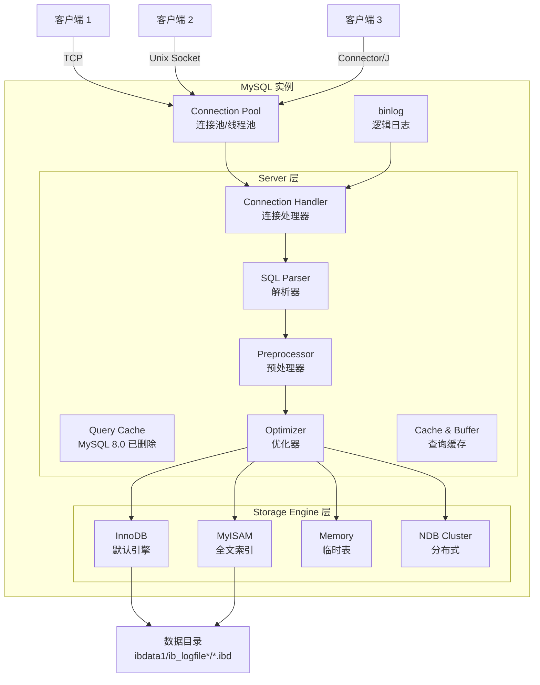
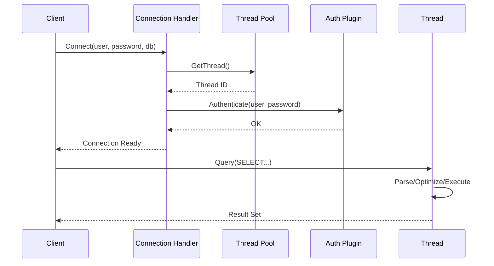
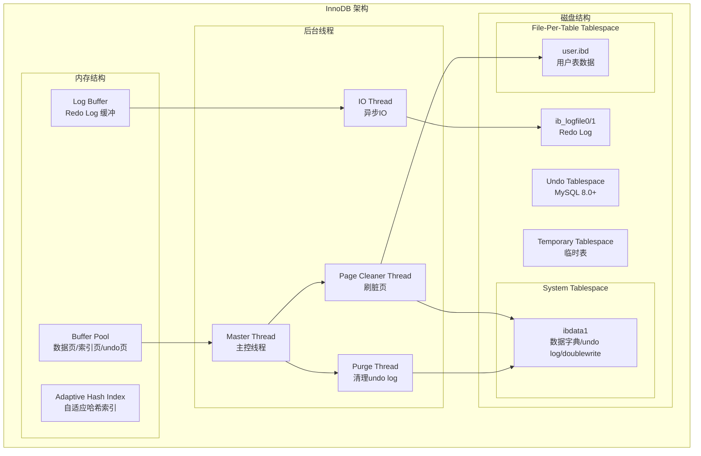
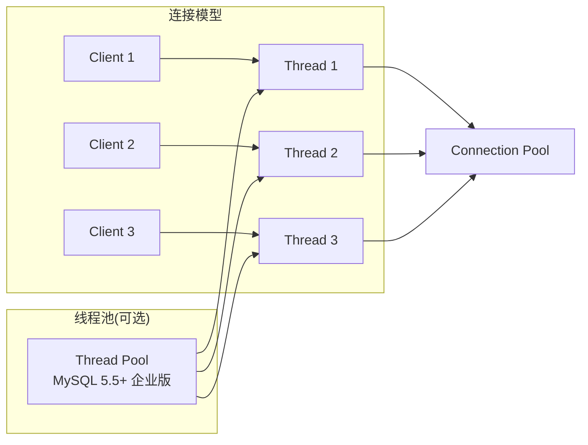
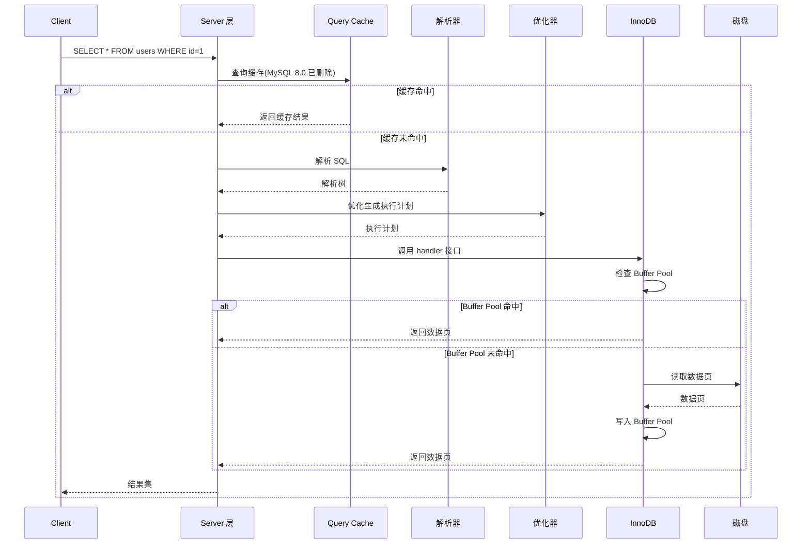

# MySQL 架构设计

## 学习目标

- 理解 MySQL 的 Server 层与 Storage Engine 层分离架构
- 掌握 MySQL 的线程模型（一个连接一个线程）与连接池
- 熟悉一次查询从客户端接入到结果返回的全链路，以及 InnoDB 引擎的内部组件

## 核心概念

- **Server 层**：负责连接管理、SQL 解析、查询优化、查询缓存、日志（binlog）
- **Storage Engine 层**：可插拔存储引擎接口，InnoDB 是默认引擎，负责数据存储、事务、锁、索引
- **Connection Pool**：线程池管理，每个连接一个线程
- **Query Cache**：MySQL 8.0 已删除，早期版本用于缓存查询结果
- **binlog**：Server 层的逻辑日志，用于主从复制和 PITR
- **InnoDB Buffer Pool**：InnoDB 的内存缓存池，缓存数据页、索引页、undo 页
- **Redo Log**：InnoDB 的物理日志，用于崩溃恢复
- **Undo Log**：InnoDB 的回滚日志，用于 MVCC 和事务回滚

## 整体架构

MySQL 采用 Server 层与 Storage Engine 层分离的架构。Server 层负责连接、解析、优化、缓存，Engine 层负责数据存储与事务。这种分离使得用户可以根据业务场景选择不同的存储引擎。

## Server 层职责

### 连接管理（Connection Management）

每个客户端连接对应一个独立的线程（MySQL 5.5 之前是每连接每线程，5.5+ 引入线程池）。连接处理流程：

1. 监听端口（默认 3306），接受新连接
2. 为新连接创建线程或从线程池中取出空闲线程
3. 进行身份验证（用户名/密码/主机）
4. 将线程绑定到连接，处理后续 SQL 请求

### SQL 解析器（SQL Parser）

MySQL 使用 Yacc/Lex 词法与语法分析器，将 SQL 文本转为解析树（Parse Tree）：

- **词法分析（lex）**：识别关键字、标识符、字面量、操作符
- **语法分析（yacc）**：验证语法正确性，生成解析树
- **解析树（Parse Tree）**：SQL 语句的结构化表示，例如 SELECT 语句包含 select_item、from_clause、where_clause 等

### 查询优化器（Query Optimizer）

MySQL 的优化器采用基于成本的优化（CBO），核心步骤：

1. **逻辑优化**：等价变换，例如谓词下推、子查询展开、外连接消除
2. **物理优化**：选择访问路径，例如全表扫描 vs 索引扫描
3. **成本估算**：根据统计信息估算不同执行计划的 I/O、CPU、内存成本

```mermaid
flowchart TD
    ParseTree[解析树] --> LogicOpt[逻辑优化<br/>等价变换]
    LogicOpt --> AccessPath[生成访问路径<br/>全表扫描/索引扫描...]
    AccessPath --> CostEst[成本估算<br/>I/O + CPU + Memory]
    CostEst --> BestPlan[最优执行计划]
    BestPlan --> Executor[执行器]
```

### 查询缓存（Query Cache）

**MySQL 8.0 已删除查询缓存**。在 5.7 及之前版本，查询缓存会缓存完整的 SELECT 结果：

- 优点：相同查询可从内存直接返回，无需解析和执行
- 缺点：缓存失效频繁（表上任何写操作都会清空该表的所有缓存），并发性能差

MySQL 8.0 移除后，推荐使用外部缓存（Redis/Memcached）或应用层缓存。

## Storage Engine 层职责

### 可插拔存储引擎接口

Storage Engine 层通过 `handler` 类接口与 Server 层解耦。不同的存储引擎实现 `handler` 接口：

- **InnoDB**：支持事务、行锁、外键、MVCC
- **MyISAM**：不支持事务、表锁、全文索引、压缩
- **Memory**：内存表、哈希索引、表锁
- **NDB Cluster**：分布式、share-nothing 架构

### InnoDB 引擎架构

InnoDB 是 MySQL 的默认引擎，采用聚簇索引、MVCC、Redo/Undo Log 机制：

**核心组件**：

- **Buffer Pool**：内存缓存池，默认占物理内存 60-80%，缓存数据页、索引页、undo 页
- **Redo Log Buffer**：Redo Log 缓冲区，事务提交前写入，由后台线程刷盘
- **Adaptive Hash Index**：InnoDB 自动为热点页创建哈希索引，提升等值查询性能
- **Change Buffer**：修改非唯一二级索引时，先缓存变更，后台合并到索引页
- **Doublewrite Buffer**：页写入时的安全机制，防止页损坏

## 线程模型

MySQL 使用"一个连接一个线程"模型（MySQL 5.5+ 支持线程池）：

**与 PostgreSQL 的对比**：

| 维度 | MySQL 线程模型 | PostgreSQL 进程模型 |
|------|---------------|-------------------|
| 资源开销 | 线程切换开销小 | 进程切换开销大 |
| 内存隔离 | 线程共享进程内存 | 进程内存隔离 |
| 稳定性 | 一个线程崩溃可能影响整个进程 | 一个进程崩溃不影响其他进程 |
| 连接数 | 数千连接可接受 | 数百连接需要连接池 |

## 查询执行全链路

一次完整的查询从客户端到结果返回的全过程：

## 关键差异：Server 层 vs Engine 层

| 职责 | Server 层 | Storage Engine 层 |
|------|----------|------------------|
| 连接管理 | Connection Pool | - |
| SQL 解析 | Parser | - |
| 查询优化 | Optimizer | - |
| 查询缓存 | Query Cache（已删除） | - |
| 日志 | binlog（Server 层逻辑日志） | Redo Log（InnoDB 物理日志） |
| 数据存储 | - | Buffer Pool + Tablespace |
| 事务管理 | - | MVCC + Undo Log + Lock |
| 索引 | - | B+Tree 索引（聚簇/二级） |
| 崩溃恢复 | - | Redo Log + Doublewrite |

## 要点总结

- MySQL 采用 Server 层与 Storage Engine 层分离架构，Server 层负责连接、解析、优化，Engine 层负责存储与事务
- InnoDB 是默认引擎，采用聚簇索引、MVCC、Redo/Undo Log，是学习的重点
- MySQL 使用线程模型，一个连接一个线程，与 PostgreSQL 的进程模型不同
- binlog 是 Server 层的逻辑日志，用于复制；Redo Log 是 InnoDB 的物理日志，用于崩溃恢复
- 学习 MySQL 应重点理解 InnoDB 架构，因为大多数生产环境都使用 InnoDB

## 思考题

1. 为什么 MySQL 选择 Server 层与 Engine 层分离架构？这种设计带来了哪些好处和坏处？
2. MySQL 的线程模型与 PostgreSQL 的进程模型相比，各自的优势是什么？
3. 为什么 MySQL 8.0 移除了查询缓存？查询缓存的问题是什么？
4. binlog（Server 层）和 Redo Log（InnoDB 层）的区别是什么？为什么要两份日志？
