# InnoDB Buffer Pool 实现

## 学习目标

- 理解 InnoDB Buffer Pool 的 LRU 变体算法（Midpoint Insertion Strategy）
- 掌握 Buffer Pool 的内部结构与多实例配置
- 熟悉脏页刷盘、预热、自适应哈希索引等高级特性
- 对比 InnoDB LRU 与 PostgreSQL Clock Sweep 的设计差异

## 核心概念

- **Buffer Pool**：InnoDB 的主内存缓存区域，缓存数据页、索引页、undo 页、自适应哈希索引等
- **innodb_buffer_pool_size**：Buffer Pool 总大小，推荐物理内存的 60-80%
- **LRU List**：变体 LRU 链表，分为 old sublist（冷端）和 new sublist（热端）
- **Midpoint Insertion Strategy**：新读入的页面插入 LRU 链表的中点（old/new 交界处），而非头部
- **Flush List**：脏页链表，按最早修改时间排序，Page Cleaner Thread 异步刷盘
- **Free List**：空闲缓冲页链表，新页面分配来源
- **Page Cleaner Thread**：异步刷脏页的后台线程，降低用户线程阻塞
- **innodb_buffer_pool_instances**：Buffer Pool 实例数，减少锁竞争
- **自适应哈希索引（AHI）**：Buffer Pool 内自动构建的哈希索引，加速等值查询

## 架构设计

InnoDB Buffer Pool 是一块连续的共享内存区域，内部由三个核心链表组成：LRU List、Flush List、Free List。

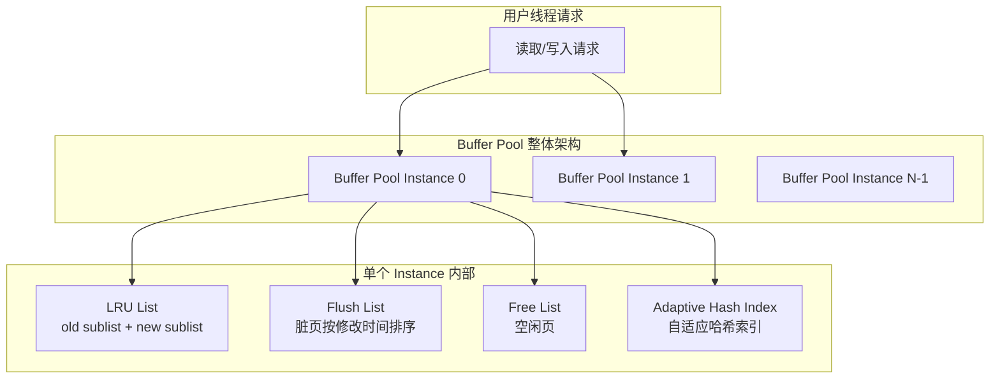

**关键设计原则**：
1. **减少锁竞争**：多个 Buffer Pool Instance 分摊并发压力
2. **避免全池污染**：Midpoint Insertion 防止顺序扫描把热数据挤出
3. **异步刷盘**：Page Cleaner Thread 在后台刷脏页，用户线程专注于事务处理

## LRU Midpoint Insertion 策略

InnoDB 使用的是 LRU 变体算法，不是传统的 LRU 头插法，而是 **Midpoint Insertion**（中点插入）。

### LRU 链表分区

LRU 链表分为两段：

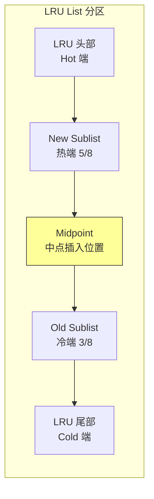

**参数配置**：
- `innodb_old_blocks_pct`：控制 old sublist 占比，默认 37（即 3/8）
- `innodb_old_blocks_time`：页面在 old sublist 停留的最短时间（毫秒），默认 1000ms

### 页面晋升流程

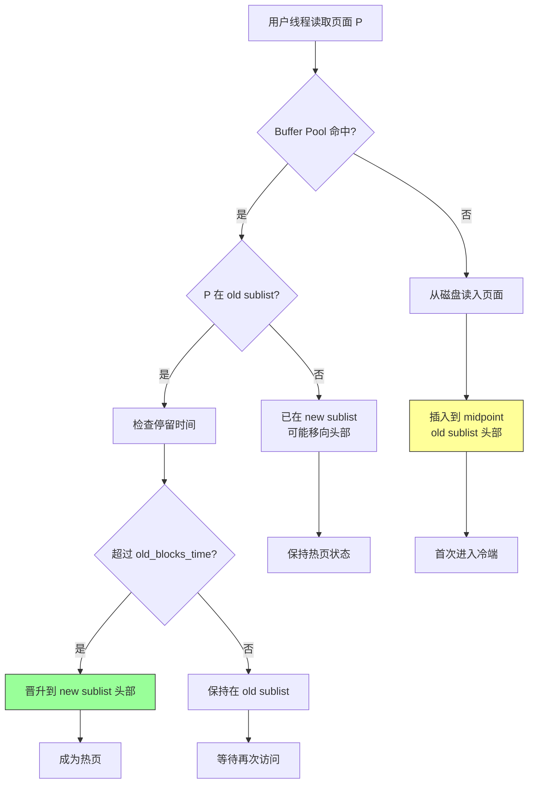

**Midpoint Insertion 的核心优势**：
1. **防止扫描污染**：顺序扫描读入的大量页面不会立即进入热端，而是在冷端停留
2. **保护热数据**：只有真正被多次访问的页面才能晋升到热端
3. **减少抖动**：避免"刚插入即被淘汰"的问题

### 与传统 LRU 的对比

| 策略 | 传统 LRU 头插法 | InnoDB Midpoint Insertion |
|------|----------------|---------------------------|
| 新页插入位置 | LRU 链表头部 | LRU 链表中点（old sublist 头部） |
| 热页保护 | 无，任何新页都进入热端 | 有，必须从冷端晋升 |
| 顺序扫描影响 | 会把所有热数据挤出 | 只进入冷端，不影响热端 |
| 实现复杂度 | 简单 | 中等（需维护 old/new 分界） |
| 缓存命中率 | 大扫描时下降 | 大扫描时保持稳定 |

## Buffer Pool 内部结构

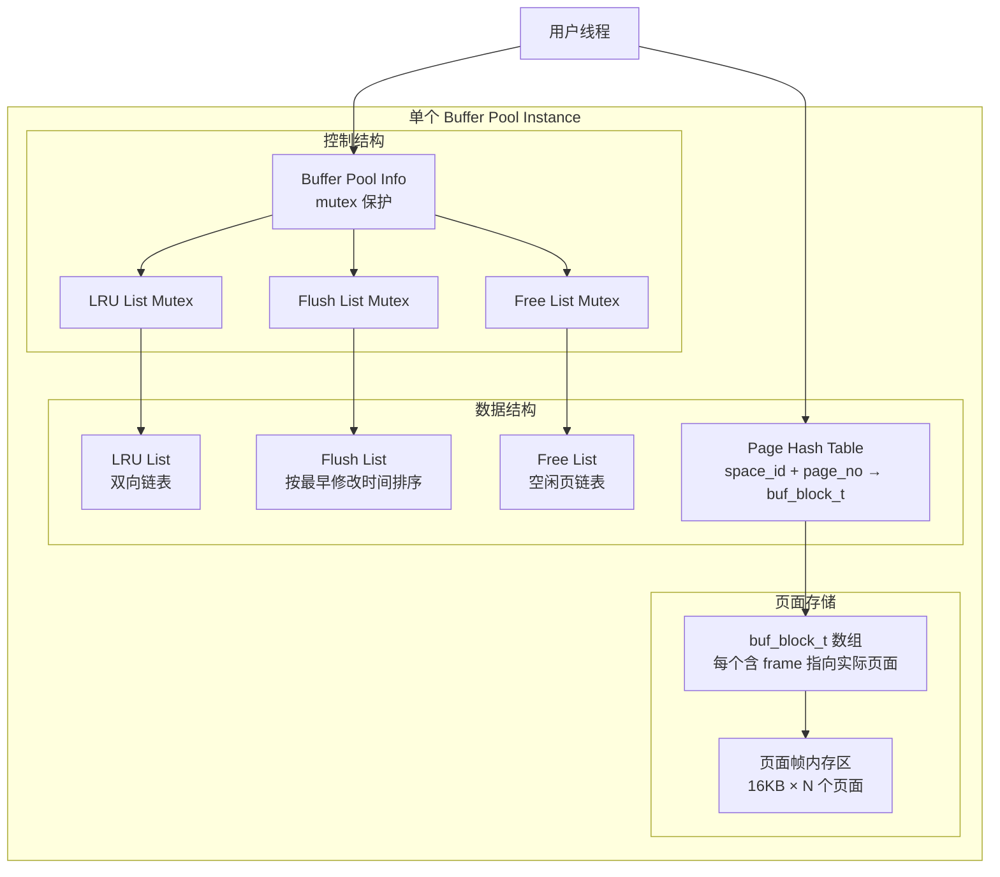

### 关键数据结构

**buf_block_t（缓冲块）**：
```c
struct buf_block_t {
    ulint           offset;         // 页面号
    ulint           space;          // 表空间 ID
    byte*           frame;          // 指向实际的 16KB 页面帧
    buf_page_state  state;          // 页面状态（FREE/READY/NOT_READY 等）
    unsigned        buf_fix_count;  // 引用计数
    rw_lock_t       lock;           // 读写锁
    UT_LIST_NODE    LRU;            // LRU 链表节点
    UT_LIST_NODE    flush_list;     // Flush 链表节点
    lsn_t           newest_modification;  // 最新修改 LSN
    lsn_t           oldest_modification;  // 最早修改 LSN
};
```

**Page Hash Table**：
- Key：`(space_id, page_no)` 组合
- Value：指向 `buf_block_t` 的指针
- 用途：O(1) 时间查找页面是否在 Buffer Pool 中

### 页面状态转换

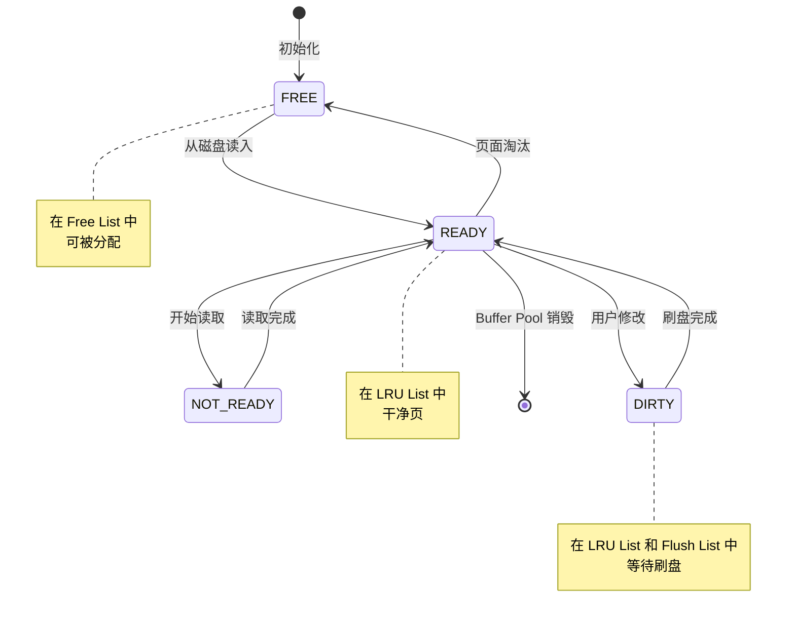

## 多个 Buffer Pool Instance

当 `innodb_buffer_pool_size > 1GB` 时，建议配置多个 Buffer Pool Instance 以减少锁竞争。

### 实例配置

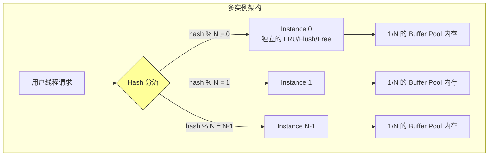

**Hash 分流算法**：
```c
instance_id = (space_id << 8 + page_no) % innodb_buffer_pool_instances
```

**配置建议**：

| Buffer Pool Size | 推荐 Instances | 说明 |
|-----------------|----------------|------|
| ≤ 1GB | 1 | 单实例足够 |
| 1GB - 4GB | 2-4 | 减少锁竞争 |
| 4GB - 16GB | 4-8 | 高并发场景 |
| > 16GB | 8-16 | 最大不超过 CPU 核心数 |

**注意事项**：
- 每个实例有独立的 LRU/Flush/Free List 和 Mutex
- 实例数越多，锁竞争越少，但管理开销增加
- 实例数不应超过 CPU 核心数

## 脏页刷盘机制

InnoDB 的脏页刷盘由 Page Cleaner Thread 负责，分三种触发条件：

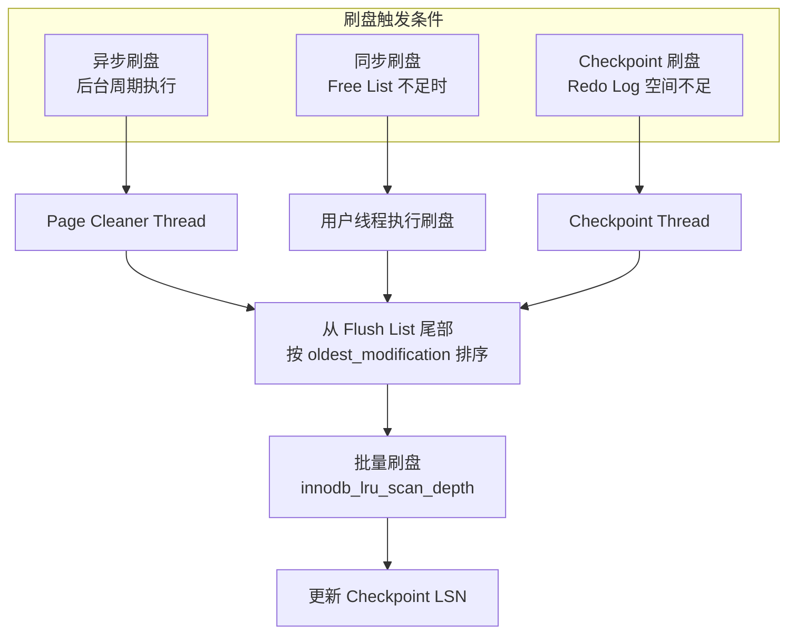

### 刷盘策略参数

| 参数 | 默认值 | 说明 |
|------|--------|------|
| `innodb_page_cleaners` | 4 | Page Cleaner 线程数 |
| `innodb_max_dirty_pages_pct` | 75 | 脏页比例上限，触发加速刷盘 |
| `innodb_max_dirty_pages_pct_lwm` | 0 | 脏页比例下限，开始预刷盘 |
| `innodb_lru_scan_depth` | 1024 | 每次 LRU 扫描深度 |
| `innodb_io_capacity` | 200 | 每秒刷盘页数（HDD） |
| `innodb_io_capacity_max` | 2000 | 刷盘速率上限 |

### Flush List 组织

Flush List 按 `oldest_modification`（最早修改 LSN）排序：

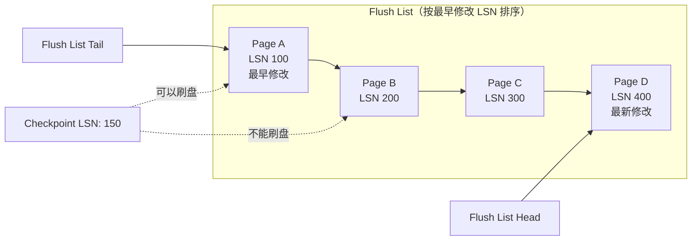

**关键规则**：
- 只有 `oldest_modification < Checkpoint LSN` 的页面才能刷盘
- 刷盘顺序与 LSN 顺序一致，保证崩溃恢复时 Redo Log 可以正确应用
- 刷盘后从 Flush List 移除，但仍在 LRU List 中

## Buffer Pool 预热

Buffer Pool 预热允许在启动时快速加载之前的热数据，缩短服务预热时间。

### 预热机制

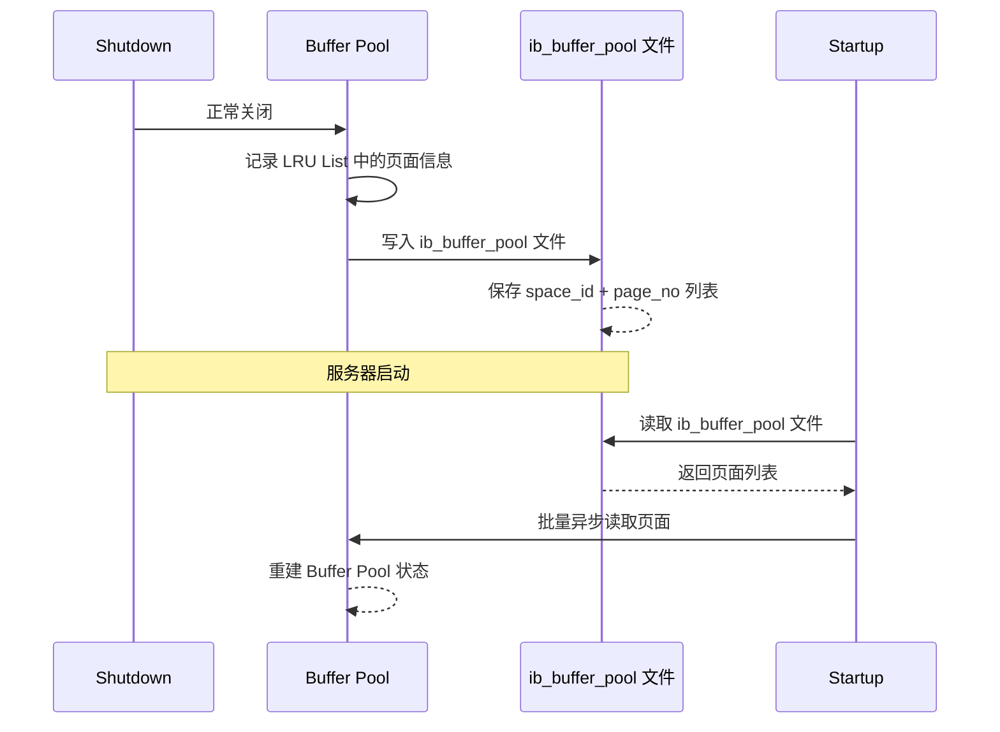

**相关参数**：

| 参数 | 默认值 | 说明 |
|------|--------|------|
| `innodb_buffer_pool_dump_at_shutdown` | ON | 关闭时导出页面列表 |
| `innodb_buffer_pool_load_at_startup` | ON | 启动时加载页面列表 |
| `innodb_buffer_pool_dump_pct` | 25 | 导出 LRU 热端百分比 |
| `innodb_buffer_pool_load_now` | - | 手动触发加载 |
| `innodb_buffer_pool_dump_now` | - | 手动触发导出 |

### 预热文件格式

`ib_buffer_pool` 文件内容示例：
```
# Saved at 2026-07-20 10:30:00
0, 100    # space_id=0, page_no=100
0, 101
0, 200
1, 50     # space_id=1, page_no=50
```

## 自适应哈希索引（AHI）

AHI 是 InnoDB 自动在 Buffer Pool 中构建的哈希索引，用于加速等值查询。

### 工作原理

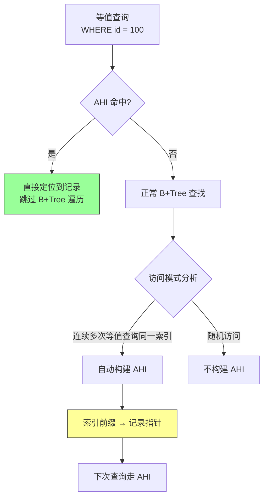

**AHI 构建条件**：
- 同一索引页面被访问超过 100 次
- 访问模式为等值查询（精确匹配）
- 查询使用索引前缀

**AHI 数据结构**：
- Hash Table 存储在 Buffer Pool 中
- Key：索引键前缀 + fold（哈希值）
- Value：记录指针数组

### 相关参数

| 参数 | 默认值 | 说明 |
|------|--------|------|
| `innodb_adaptive_hash_index` | ON | 启用 AHI |
| `innodb_adaptive_hash_index_parts` | 8 | AHI 分区数，减少锁竞争 |

### AHI 的利弊

**优点**：
- 等值查询性能提升 2-10 倍
- 自动构建，无需人工干预
- 内存占用小（利用 Buffer Pool）

**缺点**：
- 高并发写入时可能成为瓶颈（AHI 锁竞争）
- 范围查询、LIKE 查询无收益
- 极端情况下可能退化（频繁重建）

**建议**：
- OLTP 场景：开启 AHI
- 高并发写入场景：关闭 AHI 或增加分区数
- 混合负载：测试后决定

## 与 PostgreSQL Clock Sweep 的对比

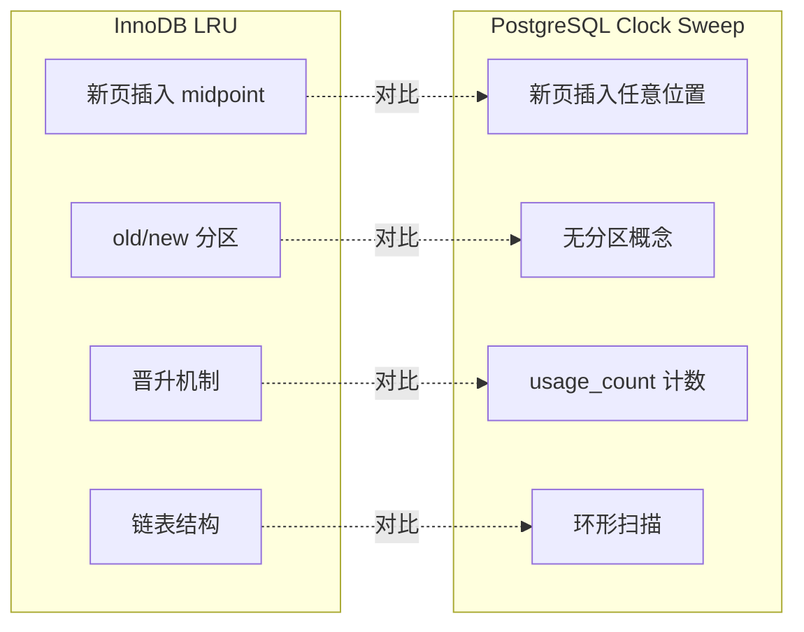

### 详细对比表

| 维度 | InnoDB LRU | PostgreSQL Clock Sweep |
|------|-----------|----------------------|
| 数据结构 | 双向链表 | 数组 + 时钟指针 |
| 淘汰策略 | old sublist 尾部淘汰 | usage_count == 0 淘汰 |
| 新页插入 | midpoint（old sublist 头部） | 随机可用槽位 |
| 热页保护 | old → new 晋升机制 | usage_count 累加 |
| 大扫描保护 | old sublist 隔离 | ring buffer |
| 脏页处理 | Flush List + Page Cleaner | bgwriter + checkpointer |
| 并发控制 | LRU Mutex | LWLock |
| 调参复杂度 | 中等（old_blocks_pct/time） | 简单（usage_count 上限） |
| 缓存命中率 | 大扫描时稳定 | 大扫描时依赖 ring buffer |
| 实现复杂度 | 中等 | 简单 |

### 设计哲学差异

**InnoDB LRU**：
- 假设：存在大量顺序扫描，需要保护热数据
- 策略：Midpoint Insertion + 晋升机制
- 优势：大扫描时不影响热数据
- 劣势：链表操作开销，晋升有延迟

**PostgreSQL Clock Sweep**：
- 假设：访问模式多样化，需要快速响应
- 策略：环形扫描 + usage_count 计数
- 优势：实现简单，扫描开销可控
- 劣势：大扫描时需额外 ring buffer 保护

## 配置最佳实践

### 内存配置

| 场景 | innodb_buffer_pool_size | 实例数 | 说明 |
|------|------------------------|--------|------|
| 单机小规模 | 物理内存 50-60% | 1 | 预留 OS 和其他进程 |
| 单机中等规模 | 物理内存 70-80% | 4-8 | 典型生产环境 |
| 专用数据库服务器 | 物理内存 80-90% | 8-16 | 最大化缓存 |
| 多实例共享 | 物理内存 40-50% | 2-4 | 避免抢占 |

### 刷盘配置

| 场景 | io_capacity | io_capacity_max | 说明 |
|------|------------|-----------------|------|
| HDD | 200 | 2000 | 默认值 |
| SSD | 2000 | 4000 | 提升 10 倍 |
| NVMe | 5000+ | 10000+ | 极限性能 |

### 预热配置

```sql
-- 手动导出当前 Buffer Pool 状态
SET GLOBAL innodb_buffer_pool_dump_now = ON;

-- 查看预热状态
SHOW STATUS LIKE 'Innodb_buffer_pool_load_status';

-- 手动触发预热
SET GLOBAL innodb_buffer_pool_load_now = ON;
```

## 监控与诊断

### 关键状态变量

```sql
-- Buffer Pool 命中率
SHOW STATUS LIKE 'Innodb_buffer_pool_read%';
-- Innodb_buffer_pool_read_requests: 逻辑读次数
-- Innodb_buffer_pool_reads: 物理读次数（缓存未命中）
-- 命中率 = 1 - (reads / read_requests)

-- 脏页比例
SHOW STATUS LIKE 'Innodb_buffer_pool_dirty%';
-- Innodb_buffer_pool_pages_dirty: 当前脏页数

-- LRU/Free/Flush 页数
SHOW STATUS LIKE 'Innodb_buffer_pool_pages%';
```

### 计算命中率

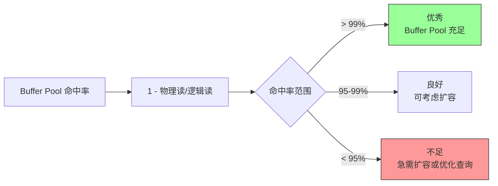

### Performance Schema 监控

```sql
-- 查看 Buffer Pool 等待事件
SELECT * FROM performance_schema.file_summary_by_instance
WHERE FILE_NAME LIKE '%ibdata%' OR FILE_NAME LIKE '%ibd%';

-- 查看 InnoDB 内部状态
SHOW ENGINE INNODB STATUS\G
```

## 要点总结

- InnoDB Buffer Pool 使用 **LRU 变体算法**，通过 Midpoint Insertion 保护热数据不被顺序扫描污染
- LRU List 分为 **old sublist（冷端）** 和 **new sublist（热端）**，新页面从冷端进入，需晋升才能进入热端
- 多个 Buffer Pool Instance 减少**锁竞争**，建议实例数与 CPU 核心数匹配
- Page Cleaner Thread **异步刷脏页**，减少用户线程阻塞
- **自适应哈希索引（AHI）** 自动加速等值查询，但高并发写入场景可能成为瓶颈
- Buffer Pool **预热**缩短服务启动后的冷启动时间
- 与 PostgreSQL Clock Sweep 相比，InnoDB LRU 更**主动保护热数据**，但实现更复杂

## 思考题

1. 为什么 InnoDB 选择 Midpoint Insertion 而非传统 LRU 头插法？在什么场景下这种设计优势最明显？

2. `innodb_old_blocks_time` 参数设置为 1000ms，意味着什么？如果设置为 0 会有什么影响？

3. Buffer Pool 命中率从 99.5% 下降到 95%，可能是什么原因？如何诊断和解决？

4. 自适应哈希索引在高并发写入场景下可能成为瓶颈，具体原因是什么？如何判断是否应该关闭 AHI？

5. 如果 `innodb_buffer_pool_instances` 设置为 16，但服务器只有 4 核 CPU，会有什么问题？

6. InnoDB 的 Flush List 按 `oldest_modification` 排序，为什么不能按 `newest_modification` 排序？这与崩溃恢复有什么关系？
