# InnoDB 表空间与行格式

## 学习目标

- 理解 InnoDB 索引组织表（IOT）的核心设计
- 掌握表空间结构（System Tablespace vs File-Per-Table）
- 熟悉四种行格式（REDUNDANT/COMPACT/DYNAMIC/COMPRESSED）
- 了解 BLOB/CLOB 行外存储机制
- 对比 InnoDB IOT 与 PostgreSQL Heap Table 的设计差异

## 核心概念

- **索引组织表（IOT）**：InnoDB 表即主键索引，数据存储在 B+Tree 叶子节点
- **聚簇索引（Clustered Index）**：主键索引，叶子节点存储完整行数据
- **二级索引（Secondary Index）**：非主键索引，叶子节点存储主键值（非行指针）
- **表空间（Tablespace）**：InnoDB 存储数据的逻辑容器，由一个或多个文件组成
- **System Tablespace**：共享表空间，默认 `ibdata1`，存储元数据、undo log、doublewrite buffer
- **File-Per-Table Tablespace**：独立表空间，每表一个 `.ibd` 文件，默认启用
- **行格式（Row Format）**：行的物理存储格式，影响存储效率和查询性能
- **溢出页（Overflow Page）**：BLOB/CLOB 等大字段存储在独立的页面

## 索引组织表（IOT）架构

InnoDB 的核心设计理念是"表即索引"，数据按主键组织在 B+Tree 中。

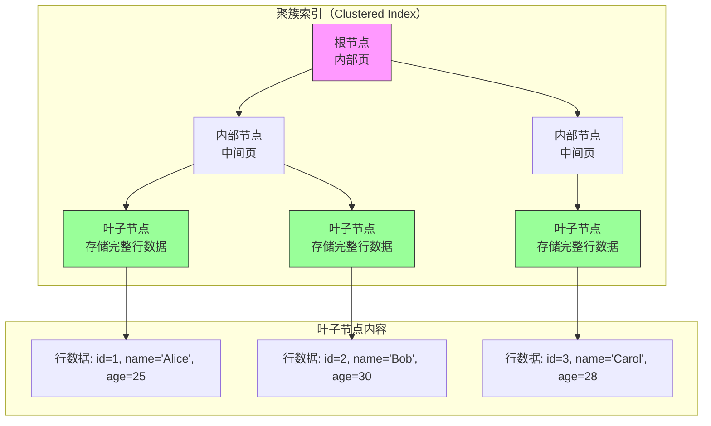

### 聚簇索引与二级索引的关系

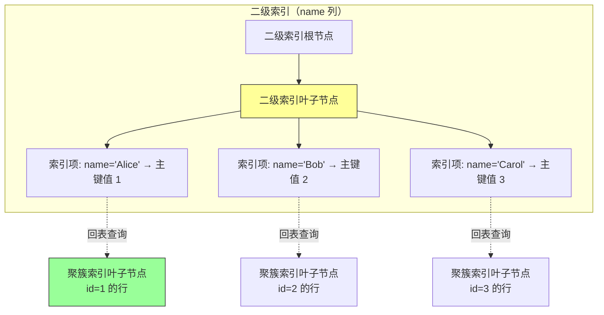

**关键设计**：
1. **二级索引存储主键值**：不存储行指针（ctid），避免更新主键时更新所有二级索引
2. **回表查询**：二级索引查找需先找到主键值，再回聚簇索引查找完整行
3. **主键顺序存储**：数据按主键物理排序，范围查询效率高

### 无显式主键的处理

如果表没有显式主键，InnoDB 按以下顺序选择聚簇索引：

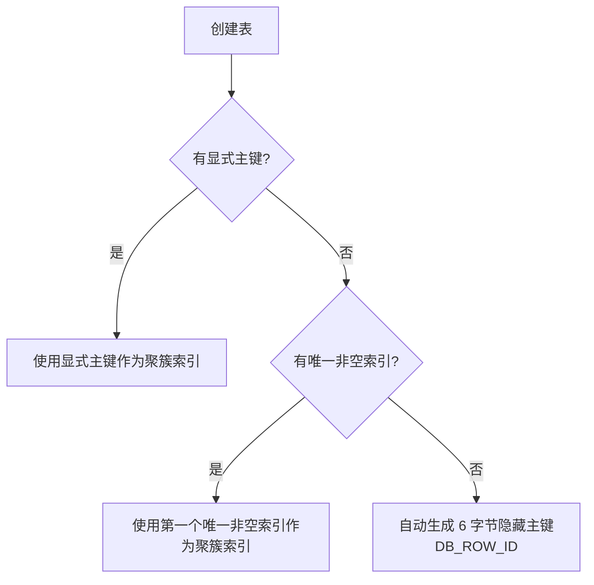

**隐藏列说明**：
- **DB_ROW_ID**：6 字节，无主键时自动生成，单调递增
- **DB_TRX_ID**：6 字节，最后修改事务 ID
- **DB_ROLL_PTR**：7 字节，回滚指针，指向 undo log

## 表空间结构

### System Tablespace（共享表空间）


**存储内容**：
- **数据字典**：表、列、索引元数据（SYS_TABLES、SYS_COLUMNS、SYS_INDEXES）
- **Undo Log**：回滚日志（MySQL 8.0 可分离到独立 undo tablespace）
- **Insert Buffer**：二级索引变更缓冲
- **Doublewrite Buffer**：防止页面部分写入（128 页，2MB）
- **用户数据**：仅 `innodb_file_per_table=OFF` 时存储

### File-Per-Table Tablespace（独立表空间）

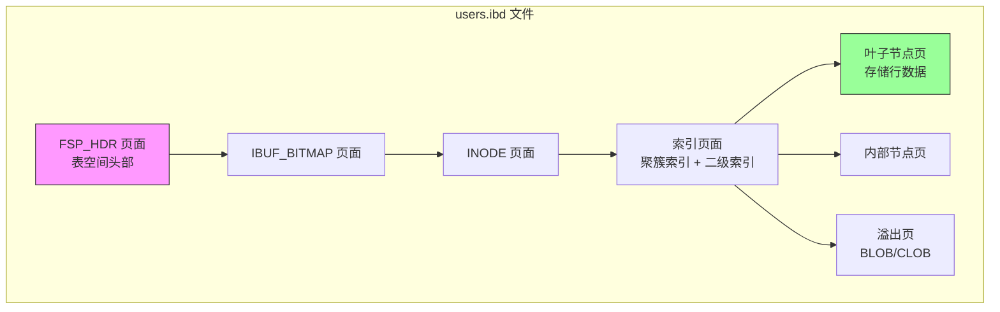

**优势**：
- **独立管理**：DROP TABLE 直接删除文件，不产生碎片
- **空间回收**：TRUNCATE TABLE 瞬间完成
- **文件系统优化**：可利用文件系统特性（如 TRIM）
- **迁移方便**：可单独备份/迁移某个表

### System vs File-Per-Table 对比

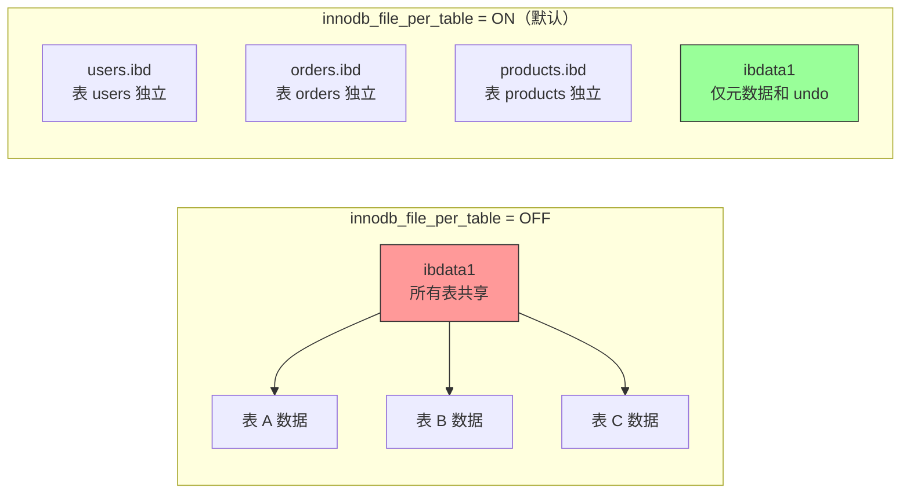

**对比表**：

| 维度 | System Tablespace | File-Per-Table |
|------|------------------|----------------|
| 文件管理 | 单一大文件 | 每表独立文件 |
| DROP TABLE | 标记删除，空间不释放 | 直接删除文件，空间立即回收 |
| TRUNCATE | 逐行删除 | 瞬间重建文件 |
| 碎片整理 | 需全库导出导入 | OPTIMIZE TABLE 单表重建 |
| 表迁移 | 需导出导入 | 直接复制 .ibd 文件 |
| 适用场景 | 小型数据库 | 中大型生产环境 |

## 行格式（Row Format）

InnoDB 支持四种行格式，影响存储效率和查询性能。

### 四种行格式对比

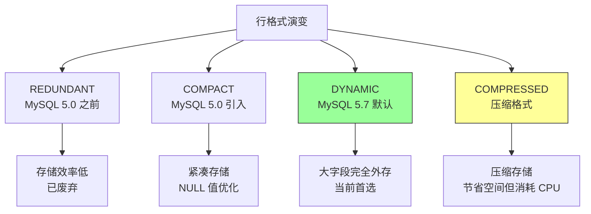

### COMPACT 行格式结构

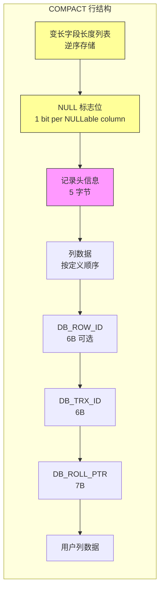

**记录头信息（5 字节）**：

| 字段 | 位数 | 说明 |
|------|-----|------|
| `deleted_flag` | 1 | 删除标志 |
| `min_rec_flag` | 1 | B+Tree 非叶子节点最小记录标志 |
| `n_owned` | 4 | 该记录拥有的记录数（用于 Page Directory） |
| `heap_no` | 13 | 堆中位置编号 |
| `record_type` | 3 | 记录类型（000=普通，001=B+Tree 指针，010=Infimum，011=Supremum） |
| `next_record` | 16 | 下一条记录偏移 |

### DYNAMIC 行格式（默认）

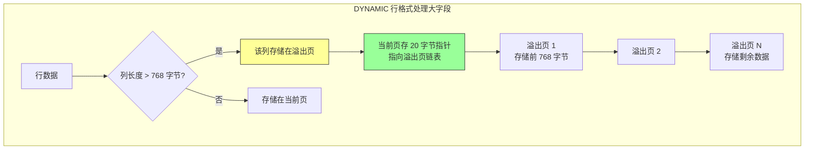

**DYNAMIC vs COMPACT**：

| 维度 | COMPACT | DYNAMIC |
|------|---------|---------|
| 大字段阈值 | > 768 字节部分外存 | > 768 字节完全外存 |
| 当前页存储 | 前 768 字节 + 指针 | 仅 20 字节指针 |
| 溢出页利用率 | 每页存储部分数据 | 每页存储完整数据 |
| 适用场景 | 传统 OLTP | 现代 OLTP + 混合负载 |

### COMPRESSED 行格式

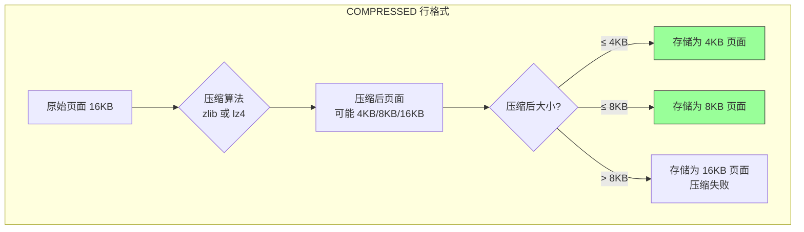

**压缩配置**：
```sql
CREATE TABLE compressed_table (
    id INT PRIMARY KEY,
    data TEXT
) ROW_FORMAT=COMPRESSED KEY_BLOCK_SIZE=8;
-- KEY_BLOCK_SIZE 可选: 1/2/4/8（对应压缩后页大小）
```

**压缩的利弊**：

| 优点 | 缺点 |
|------|------|
| 节省磁盘空间 50-70% | CPU 消耗增加 |
| 减少 I/O 读取量 | 压缩/解压缩延迟 |
| 增加 Buffer Pool 有效容量 | 压缩失败浪费空间 |
| 适合读多写少 | 不适合频繁更新 |

## 溢出页（Overflow Page）

当行数据超过页面大小的一半（约 8KB）时，InnoDB 使用溢出页存储大字段。

### 溢出页链表结构

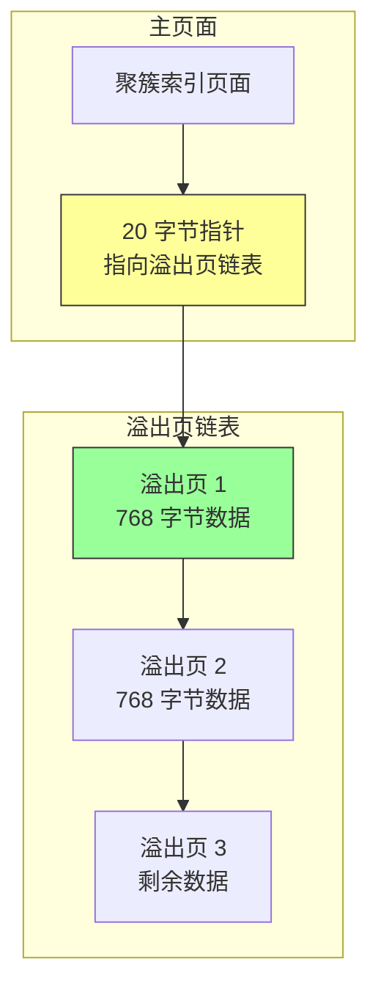

**溢出页指针结构（20 字节）**：

| 字段 | 大小 | 说明 |
|------|-----|------|
| space_id | 4B | 表空间 ID |
| page_no | 4B | 溢出页号 |
| offset | 4B | 数据在页内偏移 |
| length | 8B | 外存数据长度 |

### BLOB/CLOB 存储策略

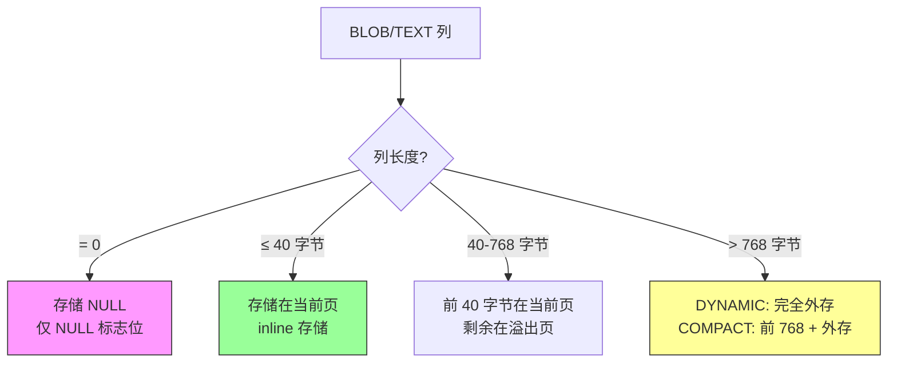

**注意事项**：
1. **查询性能**：读取大字段需要额外 I/O，可能成为性能瓶颈
2. **更新代价**：更新大字段可能触发溢出页重新分配
3. **Buffer Pool 污染**：大字段可能占用大量缓存，建议分离存储

## 行大小限制

InnoDB 行最大长度为 65535 字节（MySQL 限制），但实际受页面大小限制。

### 行大小计算规则

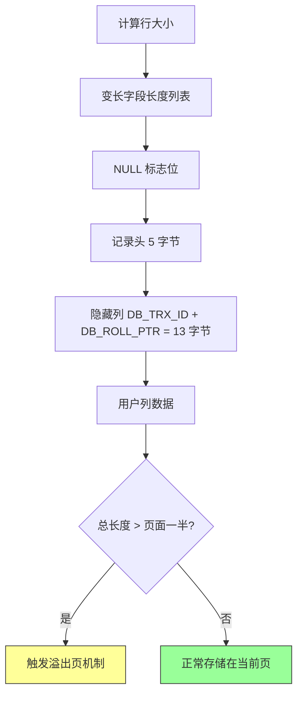

**示例计算**：

假设表定义：
```sql
CREATE TABLE example (
    id INT PRIMARY KEY,
    name VARCHAR(100),
    description TEXT,
    created_at TIMESTAMP
);
```

行大小计算：
- 变长字段长度列表：2 字节（name + description）
- NULL 标志位：1 字节（3 个 NULLable 列，向上取整到 8 bit）
- 记录头：5 字节
- 隐藏列：13 字节
- id：4 字节
- name：最大 100 字节
- description：TEXT 列，超过阈值外存
- created_at：4 字节

**实际存储大小** ≈ 2 + 1 + 5 + 13 + 4 + 100 + 4 = 129 字节（不含 TEXT 外存）

## 页面组织与 B+Tree 结构

### B+Tree 叶子节点链表

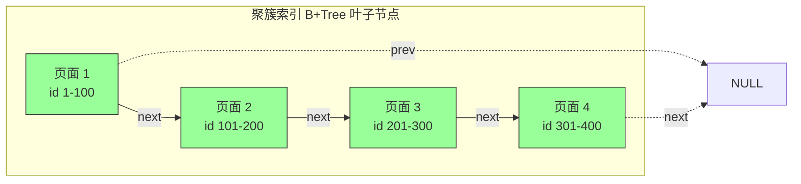

**页面结构**：
- **File Header**：38 字节，包含页面号、前后指针、LSN、页面类型等
- **Page Header**：56 字节，包含记录数、槽位数、空闲空间等
- **Infimum + Supremum**：系统记录，标记最小/最大值
- **User Records**：用户数据区
- **Free Space**：空闲空间
- **Page Directory**：页目录，加速查找
- **File Trailer**：8 字节，校验和 + LSN

### 页面内部记录组织

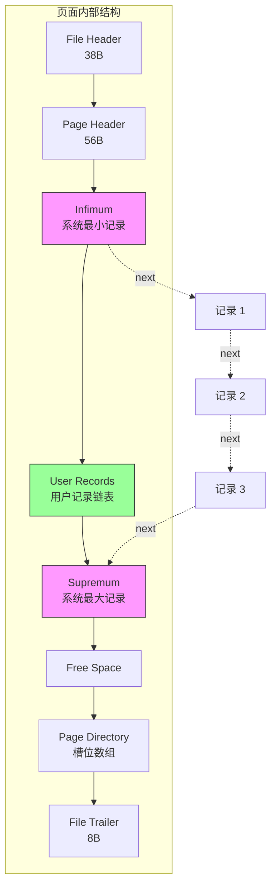

**记录链表**：
- 所有记录按主键顺序组成单向链表
- Infimum 指向第一条用户记录
- 最后一条用户记录指向 Supremum
- Page Directory 提供二分查找加速

## 与 PostgreSQL Heap Table 的对比

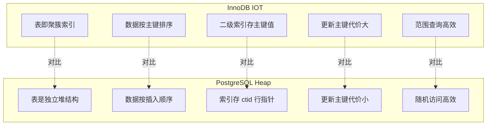

### 详细对比表

| 维度 | InnoDB IOT | PostgreSQL Heap |
|------|-----------|----------------|
| 数据组织 | 主键聚簇索引 | 无序堆 |
| 主键要求 | 强烈推荐 | 可选 |
| 二级索引内容 | 主键值 | ctid（行指针） |
| 更新主键代价 | 高（需移动行 + 更新所有二级索引） | 低（仅更新索引） |
| 范围查询性能 | 高（顺序 I/O） | 中（随机 I/O） |
| 插入性能 | 高（主键顺序） | 高（堆尾部追加） |
| 空间利用率 | 中（索引开销） | 高（无索引组织开销） |
| 全表扫描 | 中（按主键顺序） | 高（按 ctid 顺序） |
| MVCC 实现 | Undo Log + Read View | xmin/xmax 多版本 |

### 设计哲学差异

**InnoDB IOT**：
- 假设：主键是核心访问路径，范围查询常见
- 策略：数据按主键组织，牺牲更新主键的性能
- 优势：范围查询、主键点查高效
- 劣势：更新主键代价大，无主键表性能差

**PostgreSQL Heap**：
- 假设：访问模式多样，更新频繁
- 策略：堆存储 + 独立索引，更新主键无额外开销
- 优势：更新主键高效，全表扫描友好
- 劣势：范围查询可能随机 I/O

## 配置最佳实践

### 表空间配置

```sql
-- 查看当前表空间配置
SHOW VARIABLES LIKE 'innodb_file_per_table';

-- 启用独立表空间（MySQL 5.6+ 默认）
SET GLOBAL innodb_file_per_table = ON;

-- 查看表空间文件
SELECT 
    TABLE_NAME,
    ENGINE,
    TABLESPACE_NAME,
    FILE_NAME
FROM information_schema.INNODB_TABLES
JOIN information_schema.INNODB_TABLESPACES 
    USING (SPACE);
```

### 行格式选择

| 场景 | 推荐行格式 | 说明 |
|------|----------|------|
| OLTP + 小字段 | DYNAMIC | 默认，综合最优 |
| OLTP + 大字段多 | DYNAMIC | 完全外存，保护 Buffer Pool |
| 读多写少 | COMPRESSED | 节省空间，减少 I/O |
| 写多读少 | DYNAMIC | 避免压缩开销 |
| 兼容旧版本 | COMPACT | MySQL 5.0+ 兼容 |

### 大字段处理建议

```sql
-- 分离存储大字段
CREATE TABLE articles (
    id INT PRIMARY KEY,
    title VARCHAR(200),
    author VARCHAR(100)
);

CREATE TABLE article_contents (
    article_id INT PRIMARY KEY,
    content LONGTEXT,
    FOREIGN KEY (article_id) REFERENCES articles(id)
) ROW_FORMAT=DYNAMIC;

-- 或使用压缩
CREATE TABLE compressed_blob (
    id INT PRIMARY KEY,
    data LONGBLOB
) ROW_FORMAT=COMPRESSED KEY_BLOCK_SIZE=8;
```

## 要点总结

- InnoDB 是 **索引组织表（IOT）**，数据存储在聚簇索引叶子节点，按主键排序
- 二级索引存储 **主键值** 而非行指针，回表查询需先找主键值
- **File-Per-Table Tablespace** 是默认推荐方案，便于空间回收和表迁移
- 四种行格式中 **DYNAMIC** 是现代首选，大字段完全外存保护 Buffer Pool
- **溢出页链表** 存储超过页面一半的大字段，可能成为性能瓶颈
- 与 PostgreSQL Heap 相比，InnoDB IOT 对 **范围查询和主键点查** 更友好
- 更新主键代价大，建议使用 **自增主键或雪花算法主键**

## 思考题

1. 为什么 InnoDB 选择索引组织表而非堆表？这种设计在什么场景下优势最明显？

2. 二级索引存储主键值而非行指针，这种设计的利弊是什么？如果表有多个二级索引，更新主键时会发生什么？

3. 如果一个表没有主键，InnoDB 会如何处理？这种情况下性能如何？

4. DYNAMIC 和 COMPRESSED 行格式在存储大字段时有何不同？在什么场景下应该选择 COMPRESSED？

5. 为什么不建议频繁更新主键？如果必须更新，有什么优化策略？

6. 比较 InnoDB IOT 和 PostgreSQL Heap 在 MVCC 实现上的差异，这对并发性能有什么影响？
