# InnoDB 页面布局

## 学习目标

- 理解 InnoDB 页面的物理布局与组织方式
- 掌握 File Header、Page Header、Page Directory 等关键字段
- 熟悉页面类型与页面分裂/合并机制
- 对比 InnoDB 16KB 页面与 PostgreSQL 8KB 页面的设计差异

## 核心概念

- **Page**：InnoDB 最小的磁盘 I/O 与缓存单位，默认 16KB（`innodb_page_size`）
- **File Header**：页面级头部，38 字节，包含页面号、LSN、页面类型、前后指针等
- **Page Header**：页面级元数据，56 字节，包含记录数、槽数、空闲空间等
- **Infimum / Supremum**：系统记录，标记最小/最大值，用于边界处理
- **User Records**：用户数据区，按主键顺序组织成单向链表
- **Page Directory**：页目录，槽数组加速二分查找
- **File Trailer**：页面尾部，8 字节，包含校验和和 LSN
- **页面分裂**：插入导致页面满时，分裂成两个页面
- **页面合并**：删除导致页面空时，合并到相邻页面

## 页面整体布局

InnoDB 默认页面大小为 16KB，页面内部按固定结构组织。

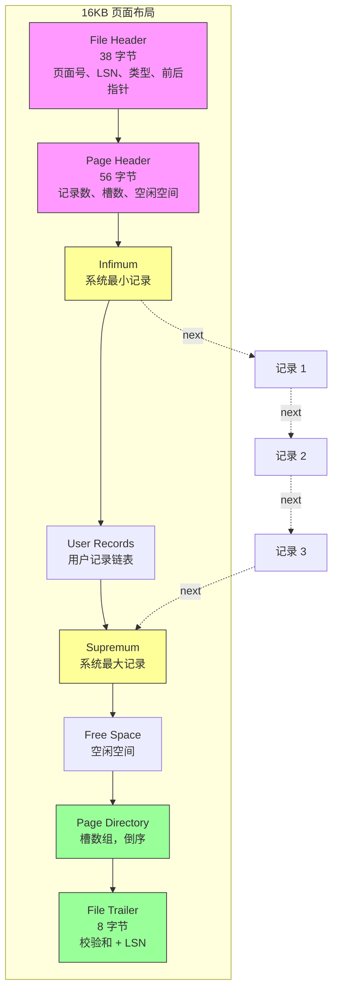

**关键设计**：
1. **单向链表**：用户记录按主键顺序组织成单向链表，Infimum 指向第一条，最后一条指向 Supremum
2. **Page Directory 加速**：槽数组提供二分查找，每 4-8 条记录一个槽位
3. **尾部校验**：File Trailer 包含校验和，检测部分写入

## File Header（38 字节）

File Header 是页面的固定头部，存储页面级元数据。

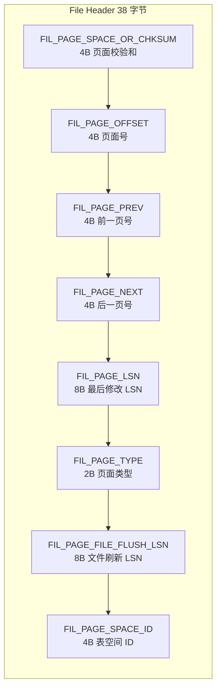

**关键字段详解**：

| 偏移 | 字段名 | 大小 | 说明 |
|------|--------|-----|------|
| 0 | FIL_PAGE_SPACE_OR_CHKSUM | 4B | 页面校验和（CRC32） |
| 4 | FIL_PAGE_OFFSET | 4B | 页面号（从 0 开始） |
| 8 | FIL_PAGE_PREV | 4B | 前一页号（B+Tree 叶子节点链表） |
| 12 | FIL_PAGE_NEXT | 4B | 后一页号 |
| 16 | FIL_PAGE_LSN | 8B | 最后修改的 LSN（用于崩溃恢复） |
| 24 | FIL_PAGE_TYPE | 2B | 页面类型 |
| 26 | FIL_PAGE_FILE_FLUSH_LSN | 8B | 文件刷新 LSN（仅用于系统表空间第一个页面） |
| 34 | FIL_PAGE_SPACE_ID | 4B | 表空间 ID |

**页面类型（FIL_PAGE_TYPE）**：

| 类型值 | 名称 | 说明 |
|--------|------|------|
| 0x0002 | FIL_PAGE_TYPE_WRITE_CREATED | 写入创建的页面 |
| 0x0003 | FIL_PAGE_INDEX | B+Tree 索引页（最常见） |
| 0x0004 | FIL_PAGE_UNDO_LOG | Undo 日志页 |
| 0x0005 | FIL_PAGE_INODE | 索引节点页 |
| 0x0006 | FIL_PAGE_IBUF_FREE_LIST | Insert Buffer 空闲链表 |
| 0x0007 | FIL_PAGE_IBUF_BITMAP | Insert Buffer 位图 |
| 0x0008 | FIL_PAGE_TYPE_SYS | 系统页 |
| 0x0009 | FIL_PAGE_TYPE_TRX_SYS | 事务系统页 |
| 0x000A | FIL_PAGE_TYPE_FSP_HDR | 文件空间头 |
| 0x000B | FIL_PAGE_TYPE_XDES | 扩展描述页 |
| 0x000C | FIL_PAGE_TYPE_BLOB | BLOB 页（溢出页） |
| 0x45BF | FIL_PAGE_TYPE_ZBLOB | 压缩 BLOB 页 |

## Page Header（56 字节）

Page Header 存储索引页特有的元数据。

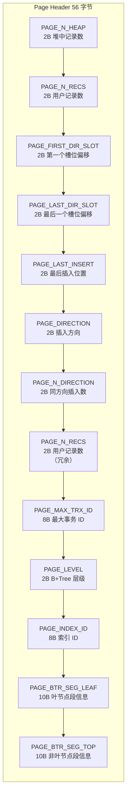

**关键字段详解**：

| 偏移 | 字段名 | 大小 | 说明 |
|------|--------|-----|------|
| 38 | PAGE_N_HEAP | 2B | 堆中的记录总数（含 Infimum/Supremum） |
| 40 | PAGE_N_RECS | 2B | 用户记录数 |
| 42 | PAGE_FIRST_DIR_SLOT | 2B | Page Directory 第一个槽位偏移 |
| 44 | PAGE_LAST_DIR_SLOT | 2B | Page Directory 最后一个槽位偏移 |
| 46 | PAGE_LAST_INSERT | 2B | 最后插入记录的偏移 |
| 48 | PAGE_DIRECTION | 2B | 插入方向（左/右） |
| 50 | PAGE_N_DIRECTION | 2B | 同方向连续插入数 |
| 52 | PAGE_N_RECS | 2B | 用户记录数（与偏移 40 冗余） |
| 54 | PAGE_MAX_TRX_ID | 8B | 最后修改该页的事务 ID |
| 62 | PAGE_LEVEL | 2B | B+Tree 层级（0=叶子） |
| 64 | PAGE_INDEX_ID | 8B | 索引 ID |
| 72 | PAGE_BTR_SEG_LEAF | 10B | 叶节点段信息 |
| 82 | PAGE_BTR_SEG_TOP | 10B | 非叶节点段信息 |

**插入方向优化**：
- `PAGE_DIRECTION`：记录上次插入方向（左/右）
- `PAGE_N_DIRECTION`：同方向连续插入次数
- 用途：优化插入位置预测，减少查找开销

## Infimum 和 Supremum

Infimum 和 Supremum 是系统记录，标记最小和最大值。

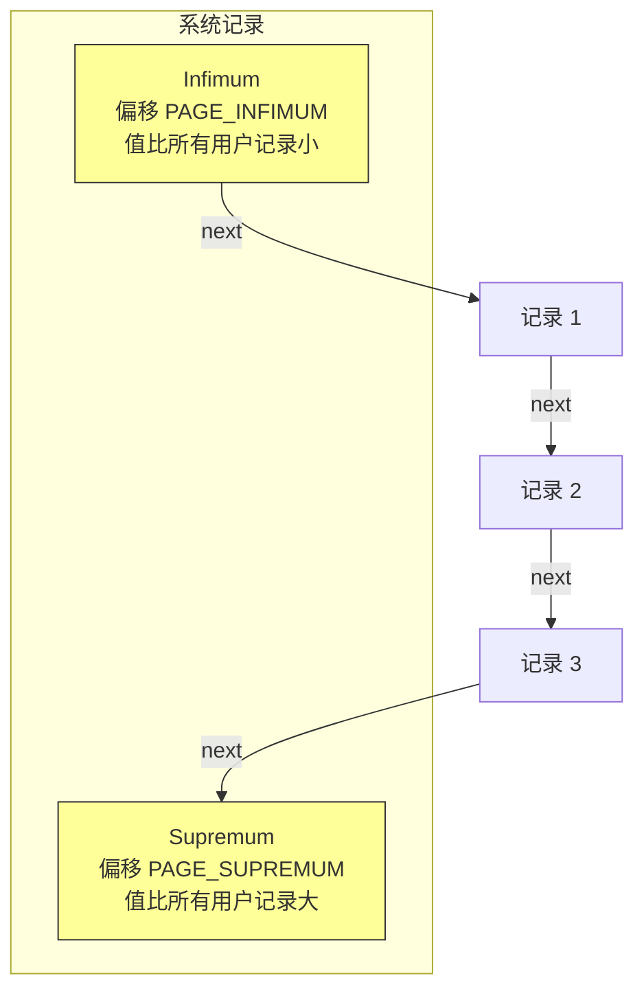

**系统记录的作用**：
1. **边界处理**：避免空链表，简化代码逻辑
2. **查找终点**：Supremum 标记查找结束
3. **范围查询**：Infimum 作为起点

## User Records 区

用户记录按主键顺序组织成单向链表。


**记录头 5 字节详解**：

| 位范围 | 字段 | 说明 |
|--------|------|------|
| 0 | deleted_flag | 删除标志 |
| 1 | min_rec_flag | 非叶子节点最小记录标志 |
| 2-5 | n_owned | 该记录拥有的记录数 |
| 6-18 | heap_no | 堆中位置编号 |
| 19-21 | record_type | 记录类型（0=普通，1=指针，2=Infimum，3=Supremum） |
| 22-37 | next_record | 下一条记录偏移 |

### 记录查找过程

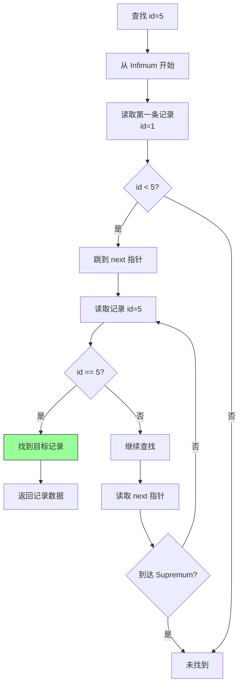

**线性查找的问题**：
- 时间复杂度 O(N)
- 大量记录时性能差

**Page Directory 优化**：
- 槽数组提供二分查找，复杂度 O(log N)

## Page Directory（页目录）

Page Directory 是槽数组，加速记录查找。

### Slot 组织方式

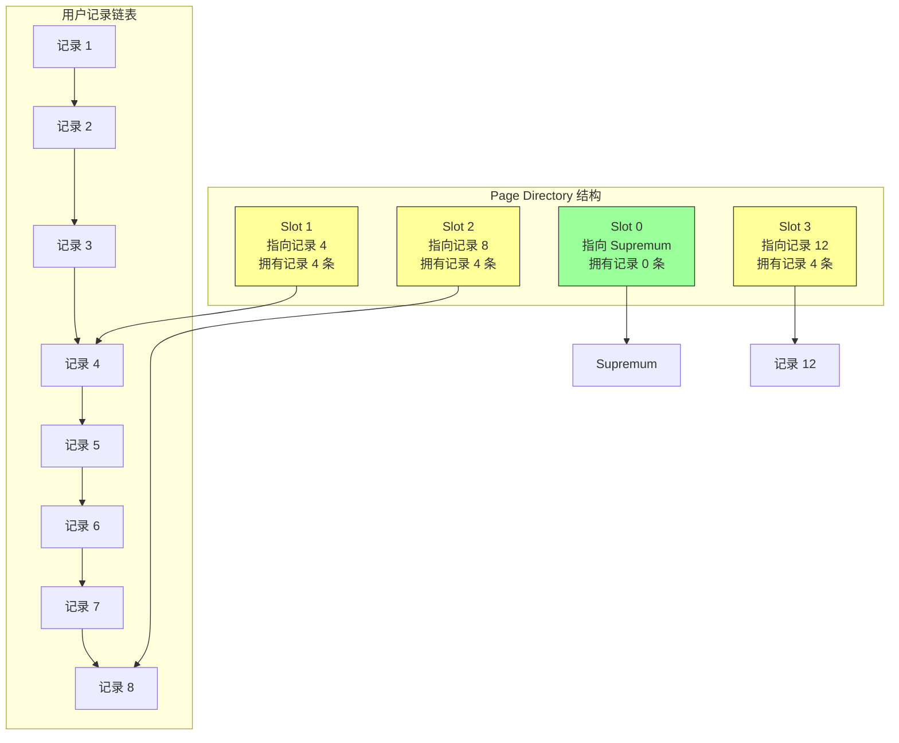

**Slot 规则**：
1. **每 4-8 条记录一个 Slot**：InnoDB 动态调整，保持每个 Slot 拥有 4-8 条记录
2. **Slot 倒序存储**：从页尾向前增长，避免与用户记录冲突
3. **n_owned 计数**：每个 Slot 指向的记录的 `n_owned` 字段记录该 Slot 管辖的记录数

### 二分查找流程

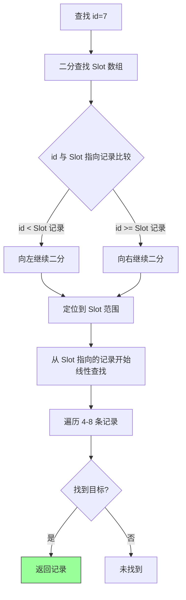

**查找效率**：
- 二分查找 Slot：O(log N)
- 线性查找 Slot 管辖记录：O(1)（最多 8 条）
- 总复杂度：O(log N)

## File Trailer（8 字节）

File Trailer 提供页面级校验，防止部分写入。

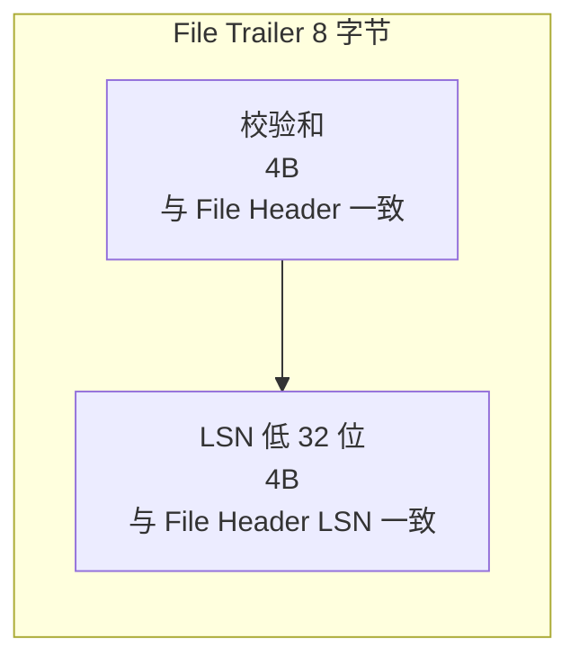

**校验机制**：
1. **写入时**：计算页面 CRC32，写入 File Header 和 File Trailer
2. **读取时**：校验两处校验和是否一致
3. **LSN 校验**：检测部分写入

**部分写入检测**：
- 如果写入过程中崩溃，File Header 和 File Trailer 不一致
- InnoDB 检测到不一致，触发崩溃恢复

## 页面类型详解

### INDEX 页面（B+Tree）

INDEX 页面是最常见的类型，存储 B+Tree 节点数据。

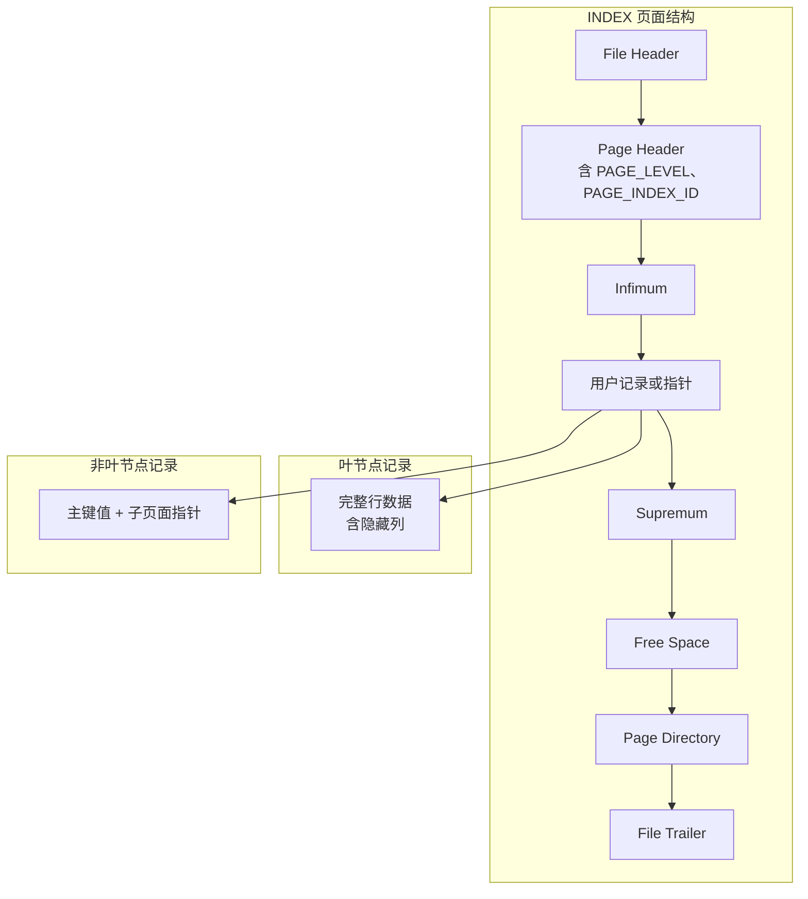

**叶节点 vs 非叶节点**：

| 维度 | 叶节点 | 非叶节点 |
|------|--------|----------|
| PAGE_LEVEL | 0 | > 0 |
| 记录内容 | 完整行数据 | 主键值 + 子页面指针 |
| next_record | 指向下一条用户记录 | 指向下一个索引项 |
| 子页面指针 | 无 | 每条记录含 4 字节子页面号 |

### BLOB 页面（溢出页）

BLOB 页面存储大字段溢出数据。


**BLOB 链表**：
- 一个 BLOB 字段可能存储在多个 BLOB 页面
- 每个页面最多 768 字节（COMPACT 格式）
- DYNAMIC 格式可能更多

### UNDO_LOG 页面

Undo Log 页面存储事务回滚信息。


## 页面分裂机制

当插入记录导致页面满时，InnoDB 触发页面分裂。

### 分裂触发条件

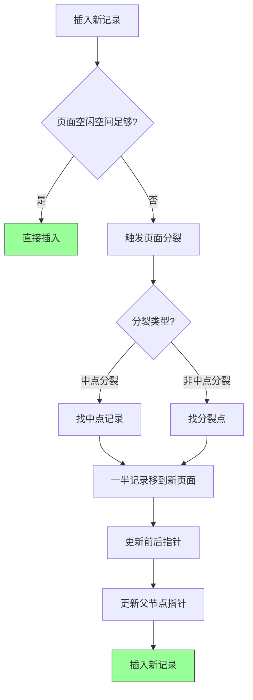

### 分裂过程示例

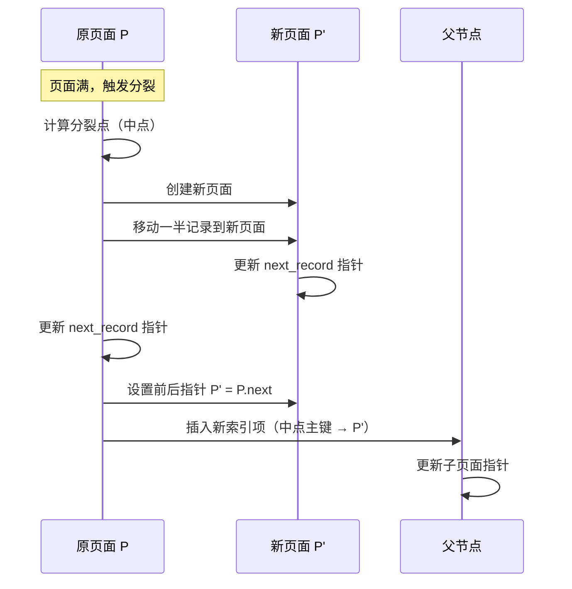

**分裂开销**：
- 记录复制：约一半记录移到新页面
- 锁竞争：分裂期间锁定两个页面
- 父节点更新：可能递归触发父节点分裂

### 优化策略

**批量插入优化**：


**建议**：
- 使用自增主键，减少随机插入
- 批量插入前按主键排序
- 适当增加页面大小（`innodb_page_size=32K`）

## 页面合并机制

当删除记录导致页面空时，InnoDB 触发页面合并。

### 合并触发条件

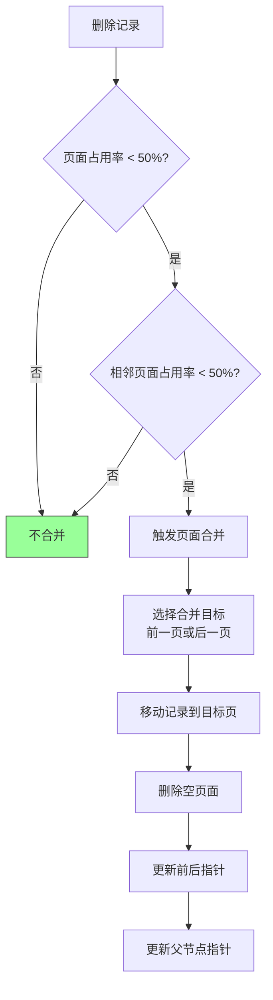

**合并策略**：
- 仅当两个相邻页面占用率都 < 50% 时触发
- 合并方向：优先合并到前一页，减少指针更新

## 页面大小配置

InnoDB 支持多种页面大小，需在服务器启动时设置。

### 页面大小选项


### 页面大小影响

| 页面大小 | 优点 | 缺点 | 适用场景 |
|----------|------|------|----------|
| 4KB | 减少锁竞争 | 更多页面管理开销 | 高并发 OLTP |
| 8KB | 兼容其他数据库 | 中等 | 迁移场景 |
| 16KB | 平衡性能与空间 | 默认值 | 大多数场景 |
| 32KB | 减少页面分裂 | 大字段外存压力大 | 大行数据 |
| 64KB | 减少页面数量 | Buffer Pool 污染风险 | OLAP |

**注意事项**：
- 页面大小在服务器启动后无法修改
- 影响范围：所有表空间（包括系统表空间）
- 备份恢复时需保持一致

## 与 PostgreSQL 8KB 页面的对比

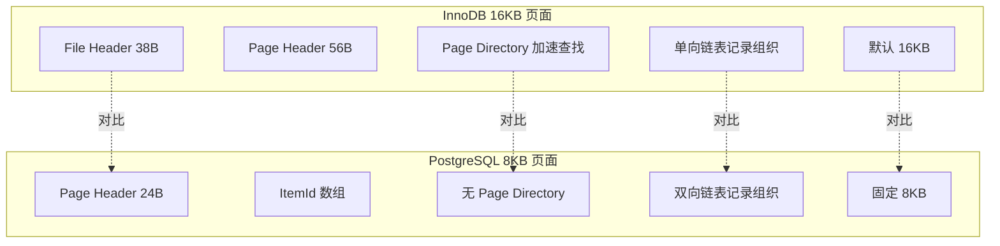

### 详细对比表

| 维度 | InnoDB 16KB | PostgreSQL 8KB |
|------|-------------|----------------|
| 页面大小 | 4K-64K 可配置 | 固定 8KB |
| File Header | 38 字节 | 24 字节 |
| Page Header | 56 字节 | 无（含在 File Header） |
| Page Directory | 有，二分查找加速 | 无，线性查找 |
| 记录组织 | 单向链表 | 双向链表（ItemId + Tuple） |
| 系统记录 | Infimum/Supremum | 无 |
| 尾部校验 | 有（8 字节） | 无（checksum 在头部） |
| 页面分裂 | 中点分裂 | 差额分裂 |
| 页面合并 | 有 | 无（依赖 VACUUM） |
| 大字段存储 | 溢出页链表 | TOAST 表 |
| 页面类型 | 多种（INDEX/BLOB/UNDO 等） | 单一（通用） |

### 设计哲学差异

**InnoDB 16KB 页面**：
- 假设：主键查找是核心操作，需要快速定位
- 策略：Page Directory 加速，单向链表简化指针
- 优势：查找效率高，页面分裂优化
- 劣势：页面管理开销大

**PostgreSQL 8KB 页面**：
- 假设：页面类型多样，需要通用设计
- 策略：ItemId + Tuple 双向，无 Page Directory
- 优势：实现简洁，空间利用率高
- 劣势：查找效率略低（线性）

## 监控与诊断

### 页面利用率监控

```sql
-- 查看表空间页面使用情况
SELECT 
    TABLE_NAME,
    TABLESPACE_NAME,
    FILE_NAME,
    EXTENT_SIZE,
    INITIAL_SIZE,
    ENGINE
FROM information_schema.INNODB_TABLES
JOIN information_schema.INNODB_TABLESPACES 
    USING (SPACE);

-- 查看页面分裂统计
SHOW STATUS LIKE 'Innodb_pages%';
-- Innodb_pages_created: 新创建页面数
-- Innodb_pages_read: 读取页面数
-- Innodb_pages_written: 写入页面数
```

### 页面大小配置检查

```sql
-- 查看当前页面大小
SHOW VARIABLES LIKE 'innodb_page_size';

-- 查看页面大小影响
SHOW ENGINE INNODB STATUS\G
-- 查看 File space 和 Page operations
```

## 要点总结

- InnoDB 默认 **16KB 页面**，由 File Header + Page Header + User Records + Page Directory + File Trailer 组成
- **File Header 38 字节** 包含页面号、LSN、前后指针、页面类型等元数据
- **Page Header 56 字节** 包含记录数、槽数、插入方向等索引页特有信息
- **Page Directory 槽数组** 加速记录查找，每 4-8 条记录一个槽位
- **页面分裂** 在插入导致页面满时触发，中点分裂减少记录移动
- **页面合并** 在删除导致页面空时触发，减少页面数量
- 与 PostgreSQL 8KB 页面相比，InnoDB **查找效率更高**，但管理开销更大

## 思考题

1. 为什么 InnoDB 选择单向链表而非双向链表组织记录？这对删除和查找有什么影响？

2. Page Directory 为什么限制每个 Slot 管辖 4-8 条记录？如果设为 1 条或 100 条会怎样？

3. 页面分裂时选择中点分裂，而非直接分裂为"满页面+新页面"，原因是什么？

4. InnoDB 默认 16KB 页面，PostgreSQL 默认 8KB 页面，哪种更适合 OLTP？为什么？

5. 如果频繁插入导致大量页面分裂，有哪些优化策略？

6. File Trailer 的校验和与 File Header 的校验和为什么要分别存储？这不是浪费空间吗？