# InnoDB 日志系统：Redo Log + Undo Log + binlog

## 学习目标

- 理解 InnoDB Redo Log 的循环写入与崩溃恢复机制
- 掌握 Undo Log 的 MVCC 版本链与事务回滚
- 熟悉 binlog 的三种格式与主从复制
- 了解 Redo Log 与 binlog 的两阶段提交
- 对比三种日志的定位与协作关系

## 核心概念

- **Redo Log（重做日志）**：InnoDB 存储引擎层的物理日志，记录"对页面做了哪些修改"，用于崩溃恢复
- **Undo Log（回滚日志）**：InnoDB 存储引擎层的逻辑日志，记录"如何回滚修改"，用于 MVCC 和事务回滚
- **binlog（二进制日志）**：MySQL Server 层的逻辑日志，记录"数据变更 SQL"，用于主从复制和 PITR
- **LSN（Log Sequence Number）**：Redo Log 中的逻辑位置，单调递增
- **Checkpoint**：将 LSN 之前的数据页刷到磁盘，回收 Redo Log 空间
- **Group Commit**：多个事务的 Redo Log 一起刷盘，减少 I/O 次数
- **Doublewrite Buffer**：防止页面部分写入的保护机制
- **两阶段提交（XA）**：保证 Redo Log 和 binlog 的一致性
- **MVCC 版本链**：Undo Log 链接多个行版本，实现事务隔离

## Redo Log 重做日志

Redo Log 是 InnoDB 持久化的核心，遵循 WAL（Write-Ahead Logging）原则：**在修改数据页之前，先把 Redo Log 刷盘**。

### 日志写入路径

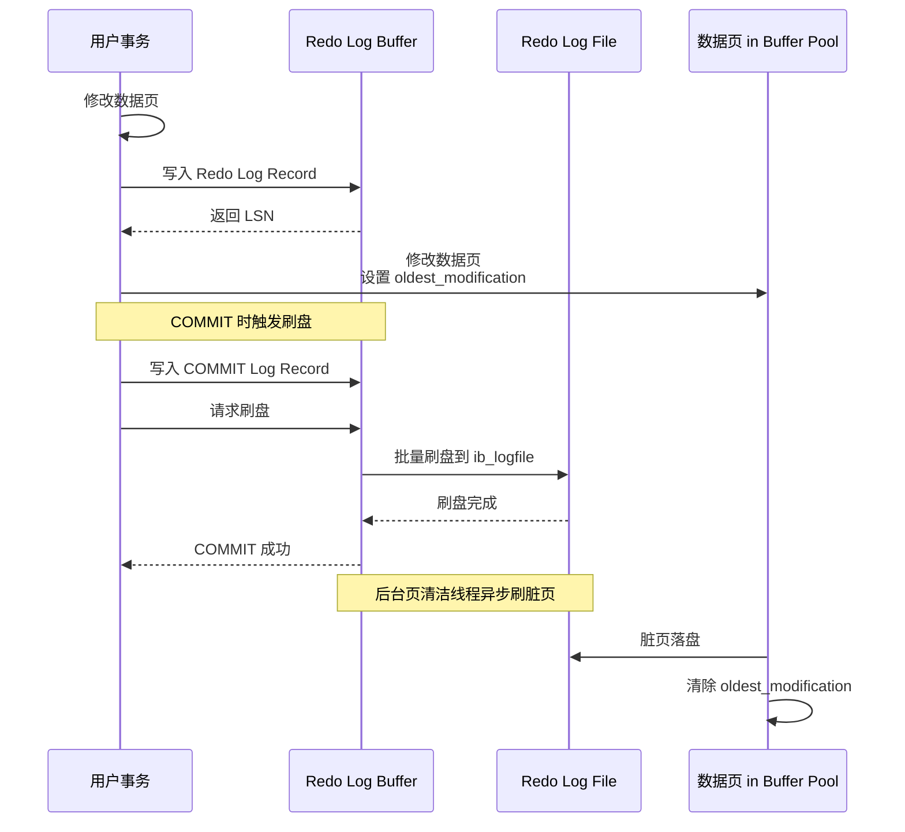

### Redo Log 循环写入

Redo Log 文件是循环写入的，由 `ib_logfile0`、`ib_logfile1` 等文件组成。

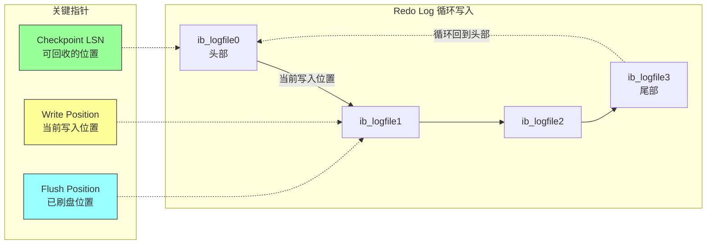

**三个关键指针**：

| 指针 | 说明 | 推进时机 |
|------|------|----------|
| Write LSN | 当前写入位置 | 每次写入 Redo Log |
| Flush LSN | 已刷盘位置 | 每次刷盘后 |
| Checkpoint LSN | 可回收位置 | 脏页刷盘后 |

**Checkpoint 回收规则**：
- Checkpoint LSN 之前的所有 Redo Log 可以被覆盖
- Checkpoint LSN 之后的所有 Redo Log 必须保留
- Checkpoint 推进需要对应脏页已落盘

### Redo Log Record 结构

每条 Redo Log Record 记录一次页面修改操作。

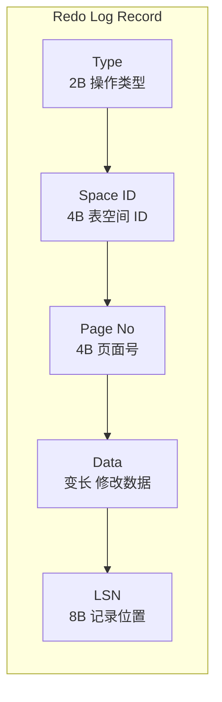

**Redo Log 操作类型**：

| 类型 | 值 | 说明 |
|------|-----|------|
| MLOG_1BYTE | 1 | 单字节修改 |
| MLOG_2BYTE | 2 | 双字节修改 |
| MLOG_4BYTE | 4 | 四字节修改 |
| MLOG_8BYTE | 8 | 八字节修改 |
| MLOG_REC_INSERT | 12 | 记录插入 |
| MLOG_REC_UPDATE | 13 | 记录更新 |
| MLOG_REC_DELETE | 14 | 记录删除 |
| MLOG_COMP_REC_INSERT | 36 | 压缩页记录插入 |
| MLOG_WRITE_STRING | 42 | 写入字符串 |

### Group Commit 批处理

多个事务的 Redo Log 一起刷盘，大幅减少 I/O 次数。

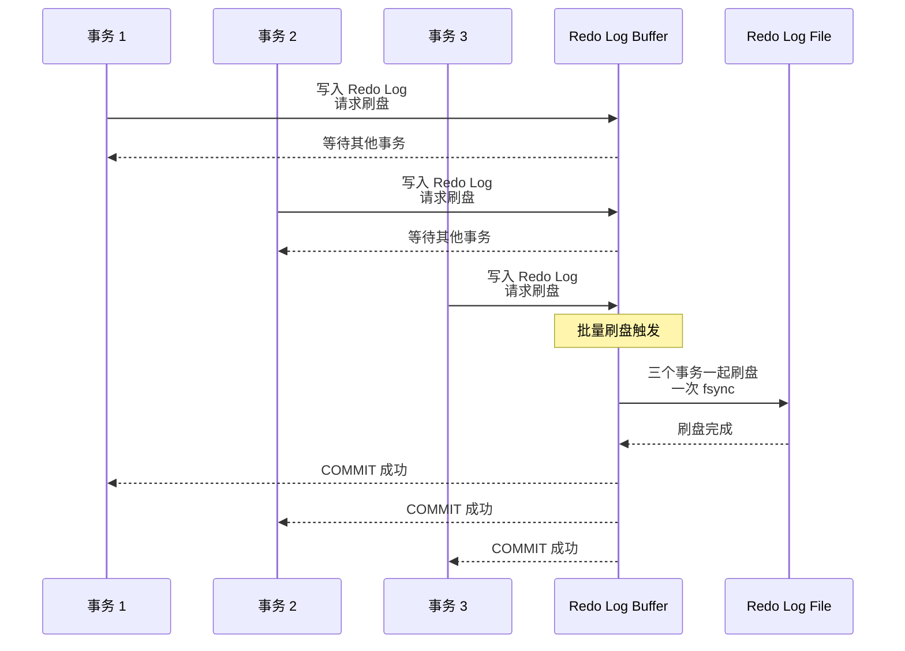

**Group Commit 优势**：
- 减少 fsync 调用次数
- 提高吞吐量（事务/秒）
- 降低 I/O 延迟

### Checkpoint 机制

Checkpoint 是 Redo Log 空间回收的关键机制。

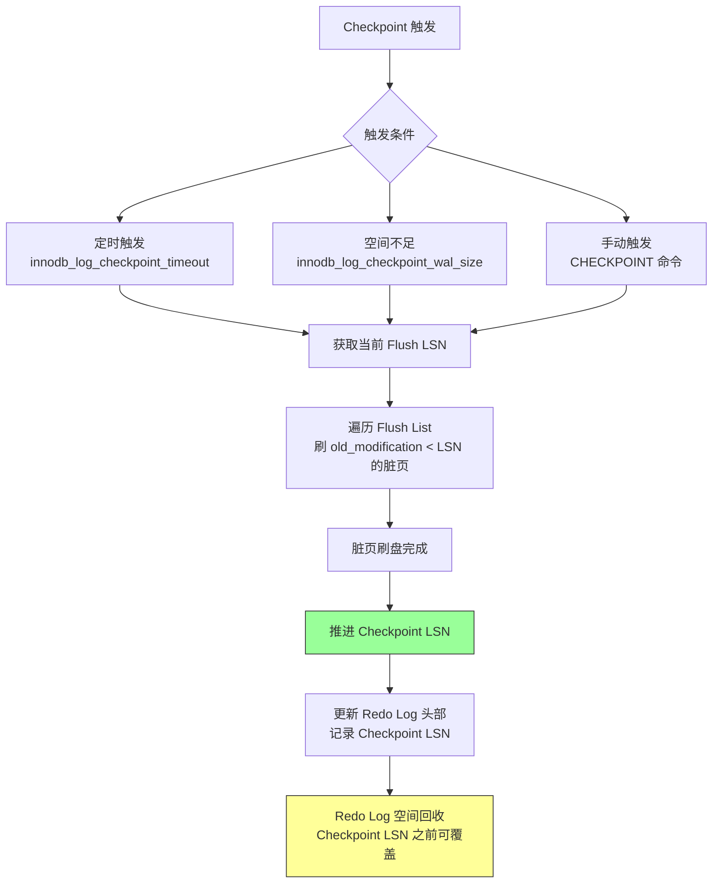

**Checkpoint 相关参数**：

| 参数 | 默认值 | 说明 |
|------|--------|------|
| `innodb_log_checkpoint_timeout` | 30s | Checkpoint 超时时间 |
| `innodb_log_checkpoint_wal_size` | 0 | 触发 Checkpoint 的 WAL 大小 |
| `innodb_max_dirty_pages_pct` | 75 | 脏页比例上限 |

### Redo Log 与 Doublewrite Buffer

Doublewrite Buffer 是数据页写入的保护机制，与 Redo Log 配合使用。

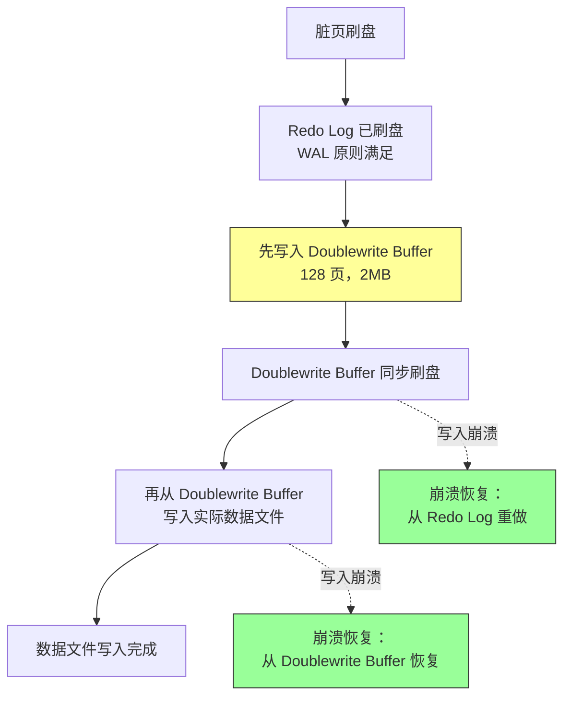

**为什么需要 Doublewrite Buffer**：
- 页面写入是 16KB，但磁盘 I/O 以 4KB 为单位
- 写入过程中崩溃，页面可能只有部分写入成功
- Redo Log 记录的是增量修改，无法恢复损坏的页面
- Doublewrite Buffer 保证写入原子性

### 崩溃恢复流程

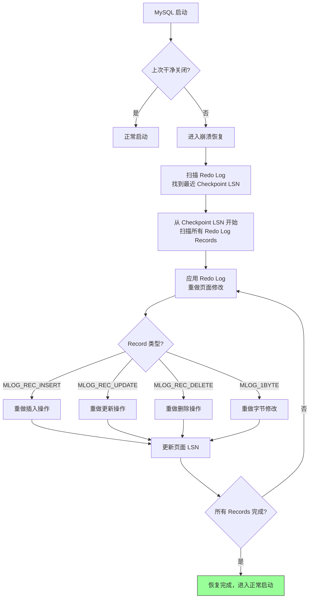

## Undo Log 回滚日志

Undo Log 是 InnoDB 实现 MVCC 和事务回滚的关键机制。

### Undo Log 类型

Undo Log 分为两种类型：Insert Undo Log 和 Update Undo Log。

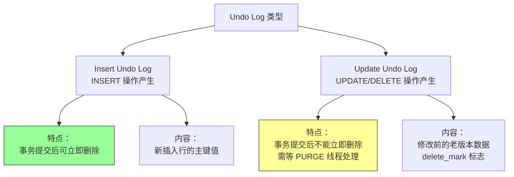

### Insert Undo Log

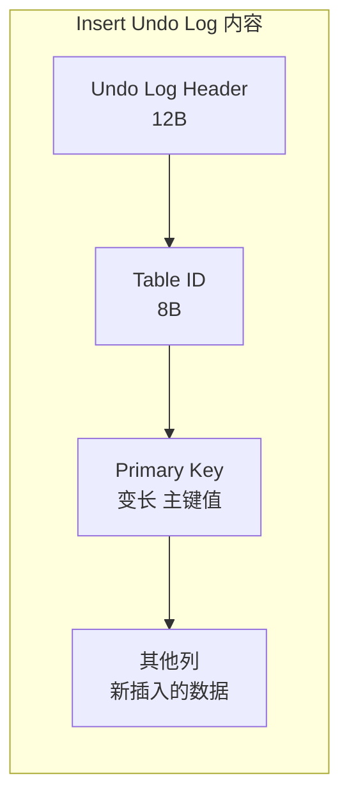

**Insert Undo Log 特点**：
- 只记录主键值，回滚时直接删除
- 事务提交后立即清理
- 不需要 MVCC 可见性检查

### Update Undo Log

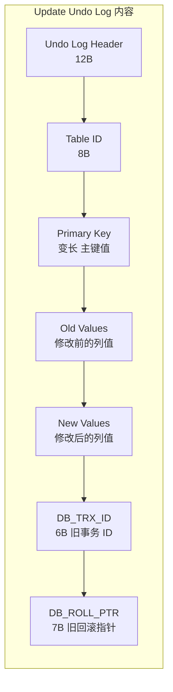

**Update Undo Log 特点**：
- 记录修改前的列值
- 事务提交后不能立即删除
- 需等 PURGE 线程确认没有活跃事务需要该版本

### MVCC 版本链

Undo Log 通过回滚指针（DB_ROLL_PTR）链接多个行版本。

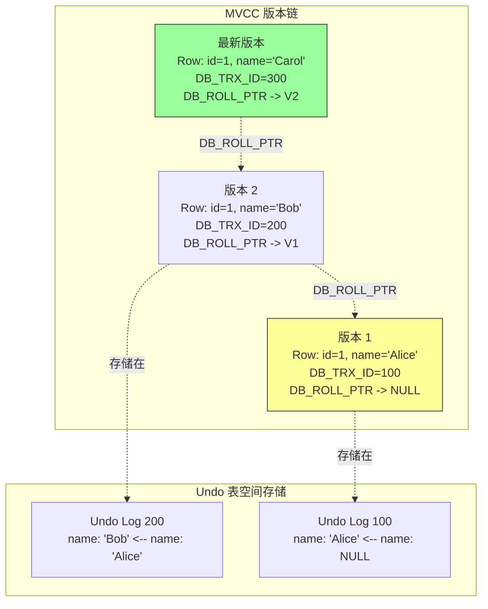

**版本链可见性规则**：

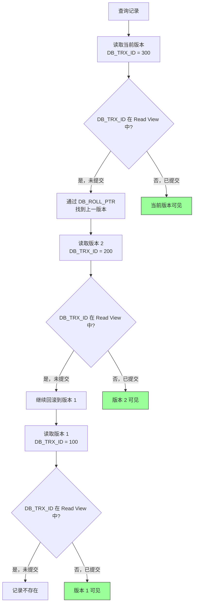

### Undo 表空间管理（MySQL 8.0）

MySQL 8.0 将 Undo Log 从 System Tablespace 分离到独立的 Undo 表空间。

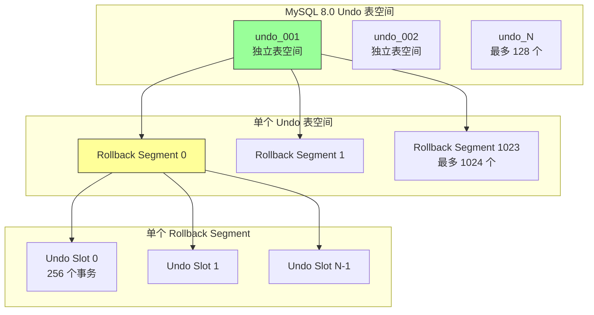

**MySQL 8.0 Undo 改进**：

| 特性 | MySQL 5.7 | MySQL 8.0 |
|------|----------|-----------|
| Undo 存储位置 | System Tablespace | 独立 Undo 表空间 |
| 表空间数量 | 最多 2 个 | 最多 128 个 |
| 回收机制 | 需手动 TRUNCATE | 自动 TRUNCATE |
| 磁盘空间 | 不可回收 | 可回收 |
| 参数 | 无 | `innodb_undo_tablespaces` |

### Purge Thread 清理

Purge Thread 负责清理不再需要的 Undo Log 和已删除的行版本。

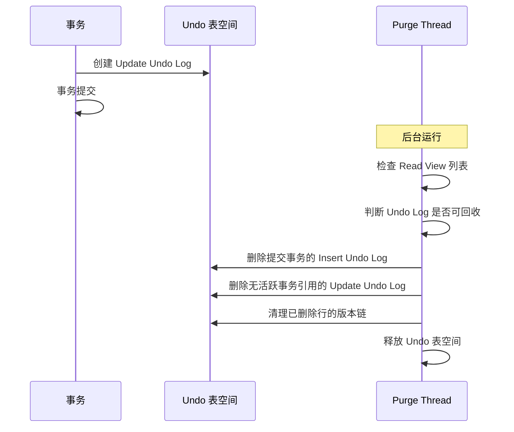

**Purge 相关参数**：

| 参数 | 默认值 | 说明 |
|------|--------|------|
| `innodb_purge_threads` | 4 | Purge 线程数 |
| `innodb_purge_batch_size` | 300 | 每次批量清理的 Undo Log 数 |
| `innodb_purge_rseg_truncate_frequency` | 128 | Undo 表空间 TRUNCATE 频率 |

## binlog 二进制日志

binlog 是 MySQL Server 层的逻辑日志，用于主从复制和 PITR。

### binlog 三种格式

```mermaid
graph TD
    A[binlog 格式] --> B[STATEMENT<br/>记录 SQL 语句]
    A --> C[ROW<br/>记录行变更]
    A --> D[MIXED<br/>混合模式]

    B --> E[优点：<br/>日志量小]
    B --> F[缺点：<br/>非确定性值可能不一致<br/>NOW()、UUID() 等]

    C --> G[优点：<br/>数据一致性高<br/>安全可靠]
    C --> H[缺点：<br/>日志量大<br/>批量操作日志膨胀]

    D --> I[优点：<br/>依据情况自动选择<br/>安全 SQL 用 STATEMENT<br/>非安全 SQL 用 ROW]

    style C fill:#9f9,stroke:#333
    style D fill:#ff9,stroke:#333
```

**三种格式对比**：

| 维度 | STATEMENT | ROW | MIXED |
|------|-----------|-----|-------|
| 日志内容 | SQL 语句 | 行变更前后值 | 自动选择 |
| 日志大小 | 小 | 大（批量更新尤甚） | 中等 |
| 一致性 | 低（非确定性函数） | 高 | 高 |
| 性能 | 快 | 慢（解析开销） | 中等 |
| 复制安全 | 依赖 SQL 兼容性 | 安全 | 安全 |
| 恢复精确度 | 可能不一致 | 精确 | 精确 |

### binlog 文件结构

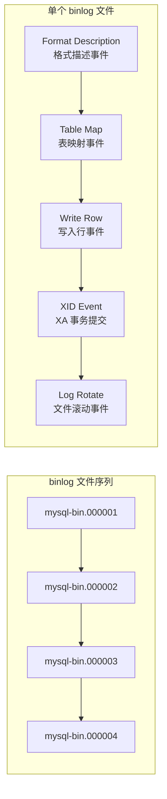

**binlog 事件类型**：

| 事件类型 | 说明 |
|----------|------|
| FORMAT_DESCRIPTION_EVENT | 文件格式描述 |
| TABLE_MAP_EVENT | 表映射（ROW 格式） |
| WRITE_ROWS_EVENT | 行写入 |
| UPDATE_ROWS_EVENT | 行更新 |
| DELETE_ROWS_EVENT | 行删除 |
| XID_EVENT | XA 事务提交 |
| QUERY_EVENT | SQL 语句（STATEMENT 格式） |
| ROTATE_EVENT | 文件滚动 |

### binlog 在主从复制中的作用

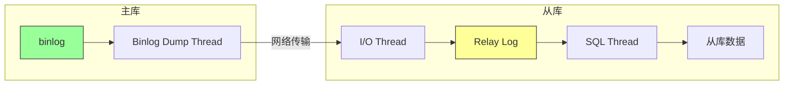

**复制流程**：
1. 主库事务提交，写入 binlog
2. Binlog Dump Thread 读取 binlog 发送给从库
3. 从库 I/O Thread 接收并写入 Relay Log
4. 从库 SQL Thread 重放 Relay Log，更新从库数据

## 两阶段提交（XA）

两阶段提交保证 Redo Log 和 binlog 的一致性。

### 提交流程

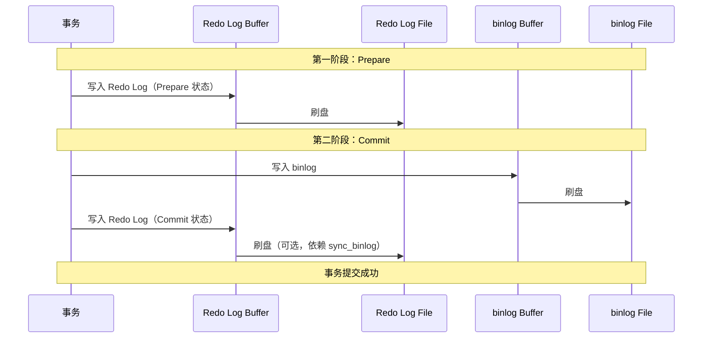

### 崩溃恢复时的一致性检查

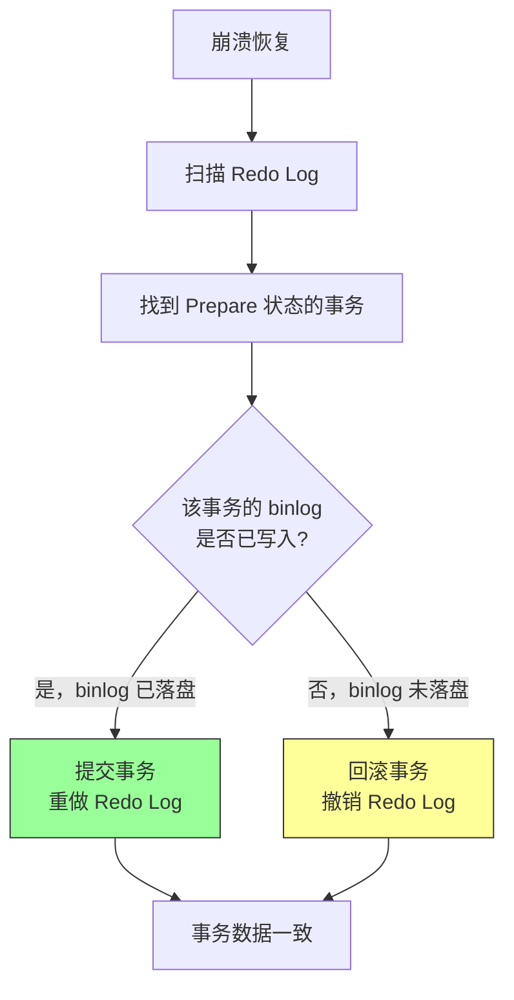

**关键参数**：

| 参数 | 默认值 | 说明 |
|------|--------|------|
| `sync_binlog` | 1 | 每次事务提交同步 binlog 刷盘 |
| `innodb_flush_log_at_trx_commit` | 1 | 每次事务提交同步 Redo Log 刷盘 |

**参数配置影响**：

| sync_binlog | innodb_flush_log_at_trx_commit | 持久性 | 性能 |
|-------------|--------------------------------|--------|------|
| 1 | 1 | 最高（完全持久） | 最低 |
| 1 | 2 | 中等（Redo Log 每秒刷盘） | 中等 |
| 0 | 0 | 最低（可能丢失 1 秒数据） | 最高 |

## 三种日志的对比

### 对比表

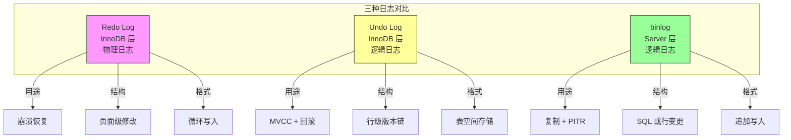

### 详细对比表

| 维度 | Redo Log | Undo Log | binlog |
|------|----------|----------|--------|
| 所属层 | InnoDB 引擎层 | InnoDB 引擎层 | MySQL Server 层 |
| 日志类型 | 物理日志 | 逻辑日志 | 逻辑日志 |
| 记录内容 | 页面修改（偏移+数据） | 行版本（旧值+事务ID） | SQL 或行变更 |
| 写入方式 | 循环写入 | 表空间追加 | 追加写入 |
| 文件管理 | ib_logfile0/1 | undo_001/002 | mysql-bin.000001 |
| 主要用途 | 崩溃恢复 | MVCC + 回滚 | 复制 + PITR |
| 事务提交 | 必须刷盘 | 非必须 | 必须刷盘 |
| 空间回收 | Checkpoint 推进 | Purge 清理 | 手动或自动清理 |
| 是否可禁用 | 否 | 否 | 可（不推荐） |
| 主从复制 | 不使用 | 不使用 | 使用 |
| 时间点恢复 | 不支持 | 不支持 | 支持 |

### 三种日志的协作关系

```mermaid
graph TD
    subgraph "事务执行流程"
        START[事务开始] --> WRITE[修改数据]
        WRITE --> U1[写入 Undo Log<br/>记录旧版本]
        U1 --> R1[写入 Redo Log<br/>记录页面修改]
        R1 --> M[修改 Buffer Pool 页面]
        M --> C1[Prepare 阶段<br/>Redo Log 刷盘]
        C1 --> C2[Commit 阶段<br/>更新 Redo Log 状态]
    end

    subgraph "崩溃恢复"
        C2 --> CR[Redo Log 重做]
        CR --> CRP[Purge 清理 Undo Log]
    end

    subgraph "正常流程"
        C2 --> B[binlog 写入]
        B --> P[Purge 清理 Undo Log]
    end

    style C2 fill:#9f9,stroke:#333
    style CR fill:#ff9,stroke:#333
```

## 配置最佳实践

### Redo Log 配置

```sql
-- 查看 Redo Log 配置
SHOW VARIABLES LIKE 'innodb_log%';

-- 设置 Redo Log 文件大小（MySQL 8.0）
SET GLOBAL innodb_log_file_size = 2 * 1024 * 1024 * 1024; -- 2GB

-- 设置 Redo Log 文件数
SET GLOBAL innodb_log_files_in_group = 4;

-- 设置 Redo Log Buffer 大小
SET GLOBAL innodb_log_buffer_size = 64 * 1024 * 1024; -- 64MB
```

### Undo Log 配置（MySQL 8.0）

```sql
-- 查看 Undo 配置
SHOW VARIABLES LIKE 'innodb_undo%';

-- 设置 Undo 表空间数
SET GLOBAL innodb_undo_tablespaces = 4;

-- 手动 TRUNCATE Undo 表空间
ALTER UNDO TABLESPACE undo_001 SET INACTIVE;
ALTER UNDO TABLESPACE undo_001 UNDO;
```

### binlog 配置

```sql
-- 查看 binlog 配置
SHOW VARIABLES LIKE 'binlog%';

-- 启用 binlog（需在 my.cnf 中配置）
-- log_bin = mysql-bin

-- 设置 binlog 格式
SET GLOBAL binlog_format = ROW;

-- 设置 binlog 保留时间
SET GLOBAL binlog_expire_logs_seconds = 604800; -- 7 天
```

### 推荐配置

| 场景 | Redo Log | Undo Log | binlog |
|------|----------|----------|--------|
| 生产环境 | 2-4GB × 4 文件 | 4 个表空间 | ROW 格式 |
| 高并发写入 | 2-4GB × 8 文件 | 8 个表空间 | ROW 格式 |
| 开发测试 | 1GB × 2 文件 | 2 个表空间 | MIXED 格式 |
| 只读备库 | 512MB × 2 文件 | 2 个表空间 | 不启用 |

## 监控与诊断

### Redo Log 监控

```sql
-- 查看 Redo Log 状态
SHOW ENGINE INNODB STATUS\G
-- 查看 LOG 部分

-- 查看 LSN 信息
SHOW STATUS LIKE 'Innodb_redo_log%';
-- Innodb_redo_log_logical_size: 逻辑写入量
-- Innodb_redo_log_physical_size: 物理空间使用

-- 查看 Checkpoint 状态
SHOW STATUS LIKE 'Innodb_log_waits';
-- 等待 Checkpoint 的次数
```

### Undo Log 监控

```sql
-- 查看 Undo 表空间信息
SELECT * FROM information_schema.INNODB_UNDO_TABLESPACES;

-- 查看 Undo Log 大小
SELECT * FROM information_schema.INNODB_TABLESPACES
WHERE NAME LIKE '%undo%';

-- 查看 Undo 等待
SHOW STATUS LIKE 'Innodb_undo_log%';
```

### binlog 监控

```sql
-- 查看 binlog 文件列表
SHOW BINARY LOGS;

-- 查看当前 binlog 位置
SHOW MASTER STATUS;

-- 查看 binlog 大小
SHOW VARIABLES LIKE 'max_binlog_size';

-- 查看从库延迟
SHOW SLAVE STATUS\G
```

## 要点总结

- **Redo Log** 是 InnoDB 引擎层的物理日志，循环写入，用于崩溃恢复，记录页面级的修改操作
- **Undo Log** 是 InnoDB 引擎层的逻辑日志，表空间存储，用于 MVCC 版本链和事务回滚
- **binlog** 是 MySQL Server 层的逻辑日志，追加写入，用于主从复制和时间点恢复（PITR）
- **两阶段提交（XA）** 保证 Redo Log 和 binlog 的一致性，崩溃恢复时以 binlog 为准
- **Group Commit** 批量刷盘多个事务的 Redo Log，减少 I/O 次数
- **Doublewrite Buffer** 防止页面部分写入，与 Redo Log 配合保证数据完整性
- **Purge Thread** 清理不再需要的 Undo Log 和已删除的行版本
- 与 PostgreSQL 相比，InnoDB 的日志系统更复杂，但提供了更强的数据一致性保障

## 思考题

1. 为什么 Redo Log 使用循环写入而 binlog 使用追加写入？两种设计各自的优缺点是什么？

2. 两阶段提交中，为什么崩溃恢复时以 binlog 为准而非 Redo Log？如果反过来会有什么问题？

3. Undo Log 的 MVCC 版本链在长事务场景下为什么会膨胀？如何监控和优化？

4. 设置 `sync_binlog=1` 和 `innodb_flush_log_at_trx_commit=1` 对性能的影响有多大？在什么场景下可以安全地调低这些参数？

5. 如果 Redo Log 文件太小，会发生什么？如何判断当前 Redo Log 大小是否合适？

6. MySQL 8.0 将 Undo Log 从 System Tablespace 分离到独立表空间，这对运维和管理有什么好处？

7. 比较 InnoDB 的 Redo Log 和 PostgreSQL 的 WAL，两者在写入协议和恢复机制上有什么本质差异？