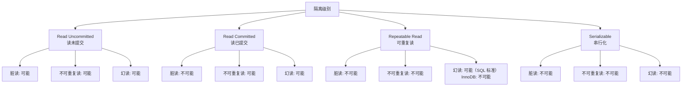
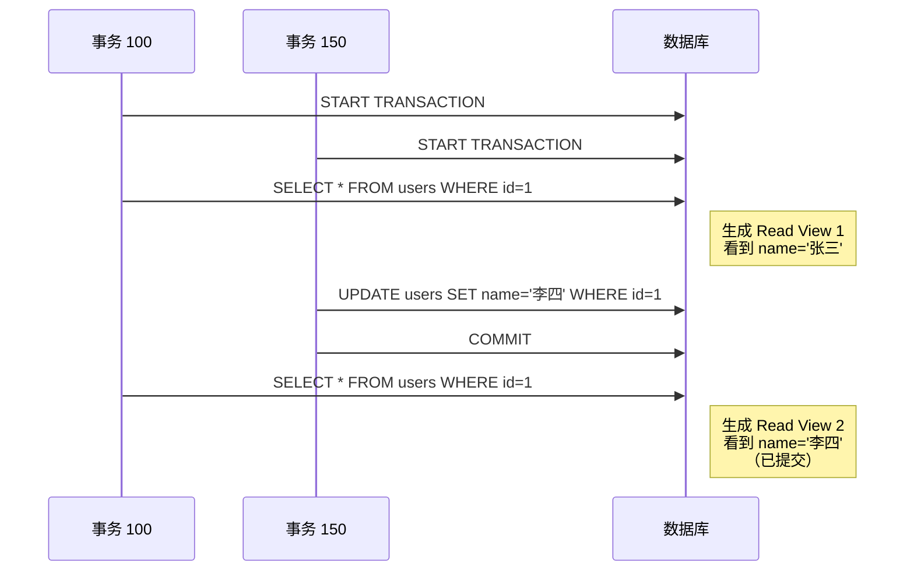
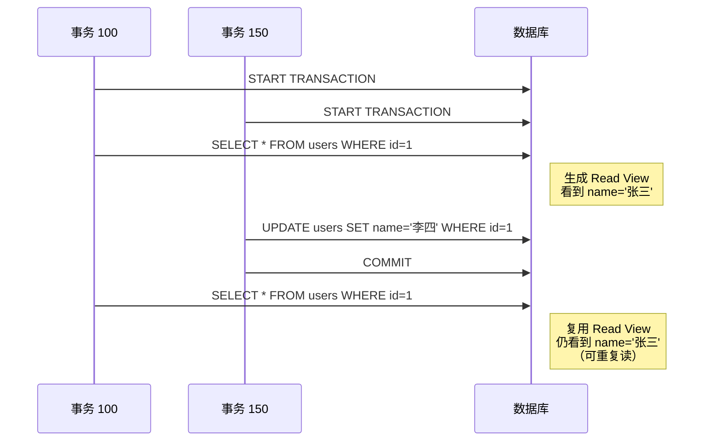
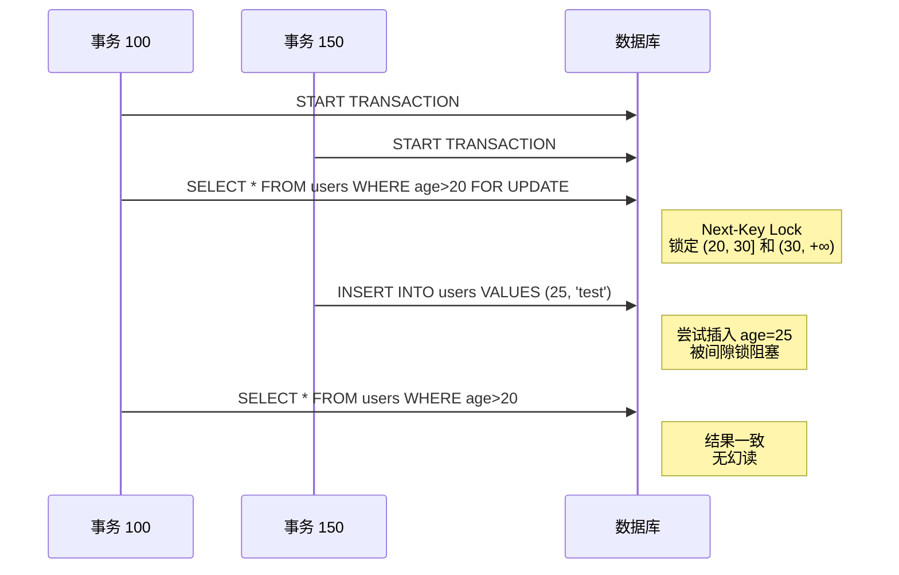
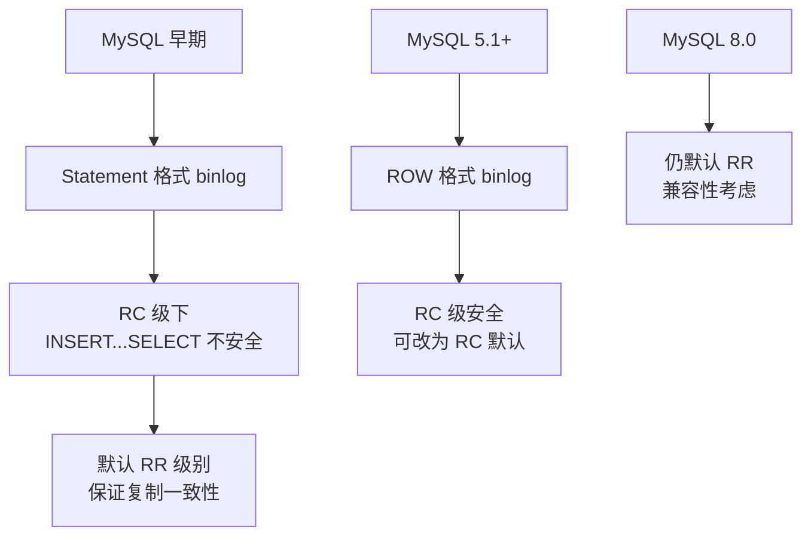
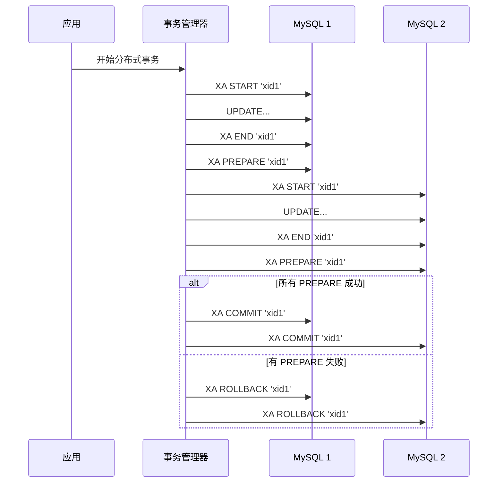

# MySQL 隔离级别

## 学习目标

- 理解 SQL 标准定义的 4 种隔离级别
- 掌握 InnoDB 对各隔离级别的实现机制
- 了解 MySQL 默认 RR 的历史原因

## 核心概念

- **脏读（Dirty Read）**：读取未提交事务的数据
- **不可重复读（Non-repeatable Read）**：同一事务两次读取结果不同（UPDATE/DELETE）
- **幻读（Phantom Read）**：同一事务两次读取结果不同（INSERT）
- **Read Committed（RC）**：读已提交，InnoDB 通过 Read View（语句级）实现
- **Repeatable Read（RR）**：可重复读，InnoDB 默认级别，通过 Read View（事务级）+ Next-Key Lock 实现
- **Serializable**：串行化，所有读操作自动转为 SELECT FOR SHARE

## 4 种隔离级别对比

SQL 标准定义了 4 种隔离级别，针对三种现象（脏读、不可重复读、幻读）：



**对比表**：

| 隔离级别 | 脏读 | 不可重复读 | 幻读 |
|---------|------|----------|------|
| Read Uncommitted | 可能 | 可能 | 可能 |
| Read Committed | 不可能 | 可能 | 可能 |
| Repeatable Read | 不可能 | 不可能 | 可能（SQL 标准）/ 不可能（InnoDB） |
| Serializable | 不可能 | 不可能 | 不可能 |

## InnoDB 隔离级别实现

### Read Committed（RC）

**特点**：

- 每条 SELECT 语句生成新的 Read View
- 可以看到其他事务已提交的更改
- 不加间隙锁，只加记录锁（Record Lock）



**Read View 生成时机**：

- 每条 SELECT 语句生成新 Read View
- 同一事务内不同语句可能看到不同数据

### Repeatable Read（RR）

**特点**：

- 事务第一次 SELECT 生成 Read View，后续复用
- 看不到其他事务已提交的更改
- 加 Next-Key Lock（Record Lock + Gap Lock），防止幻读



**Next-Key Lock 防止幻读**：



### Serializable

**特点**：

- 所有 SELECT 自动转为 SELECT FOR SHARE（加 S 锁）
- 完全串行化执行，无并发问题
- 性能最差，极少使用


## InnoDB 默认 RR 的历史原因

MySQL 默认隔离级别是 RR，而 PostgreSQL、Oracle、SQL Server 默认是 RC。这源于历史原因：



**Statement 格式 binlog 的问题**：

```sql
-- RC 级别下
INSERT INTO target SELECT * FROM source WHERE condition;

-- 问题：
-- 如果 source 表在 SELECT 执行期间被其他事务修改
-- binlog 中记录的 SELECT 结果与主库不一致
-- 从库重放时数据不一致
```

**ROW 格式 binlog 解决问题**：

- 记录实际的行变更，而不是 SQL 语句
- RC 级别下复制安全
- MySQL 5.1+ 开始支持 ROW 格式

## RC vs RR 的选择

### RC 级别适用场景

- 需要看到最新已提交数据
- 简单 OLTP 系统，不关心一致性快照
- 减少锁冲突（无间隙锁）

### RR 级别适用场景

- 需要一致性快照（报表、审计）
- 防止幻读（范围查询 + 插入）
- 兼容旧系统（Statement 格式 binlog）

**对比表**：

| 维度 | Read Committed | Repeatable Read |
|------|---------------|----------------|
| 一致性快照 | 无（每条语句新快照） | 有（事务级快照） |
| 锁类型 | Record Lock | Next-Key Lock |
| 幻读 | 可能 | 不可能 |
| 死锁概率 | 低（无间隙锁） | 高（间隙锁） |
| 适用场景 | 实时性要求高 | 一致性要求高 |

## 设置隔离级别

### 全局设置

```sql
-- 查看当前隔离级别
SELECT @@transaction_isolation;

-- 设置全局隔离级别（重启生效）
SET GLOBAL transaction_isolation = 'READ-COMMITTED';
```

### 会话设置

```sql
-- 设置会话隔离级别
SET SESSION transaction_isolation = 'REPEATABLE-READ';

-- 设置下个事务隔离级别
SET TRANSACTION ISOLATION LEVEL READ COMMITTED;
```

### 配置文件（my.cnf）

```ini
[mysqld]
transaction_isolation = REPEATABLE-READ
```

## 分布式事务与 XA

MySQL 支持 XA 事务（两阶段提交），用于跨数据库的分布式事务：



**XA 事务语法**：

```sql
-- 开始 XA 事务
XA START 'xid';

-- SQL 操作
UPDATE accounts SET balance = balance - 100 WHERE id = 1;

-- 结束 XA 事务（不提交）
XA END 'xid';

-- 准备阶段
XA PREPARE 'xid';

-- 提交或回滚
XA COMMIT 'xid';
-- 或
XA ROLLBACK 'xid';
```

**使用场景**：

- 跨数据库事务（MySQL + PostgreSQL）
- 跨服务事务（微服务架构）
- 实际使用较少（性能差、复杂度高）

## 要点总结

- SQL 标准定义 4 种隔离级别，InnoDB 默认 RR，PG 默认 RC
- RC 级别每条语句生成新 Read View，RR 级别事务开始时生成并复用
- InnoDB 在 RR 级别通过 Next-Key Lock 防止幻读，超越 SQL 标准
- MySQL 默认 RR 的历史原因是 Statement 格式 binlog 在 RC 级下不安全
- 实际应用中，RC 级别更常用（实时性高、锁冲突少）
- XA 事务支持分布式事务，但性能差、复杂度高

## 思考题

1. 为什么 InnoDB 在 RR 级别能防止幻读，而 SQL 标准认为 RR 不能防止幻读？
2. 为什么 PostgreSQL 默认 RC 级别，而 MySQL 默认 RR 级别？这种选择反映了什么设计哲学？
3. 在什么场景下应该选择 RC 级别？在什么场景下应该选择 RR 级别？
4. XA 事务的两阶段提交为什么能保证跨数据库的一致性？有什么缺点？