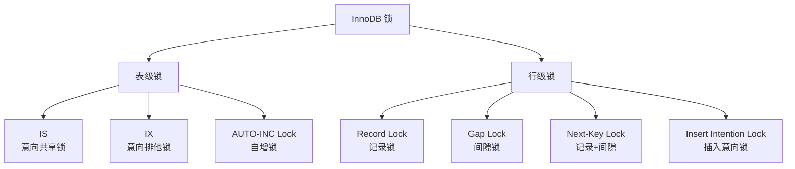
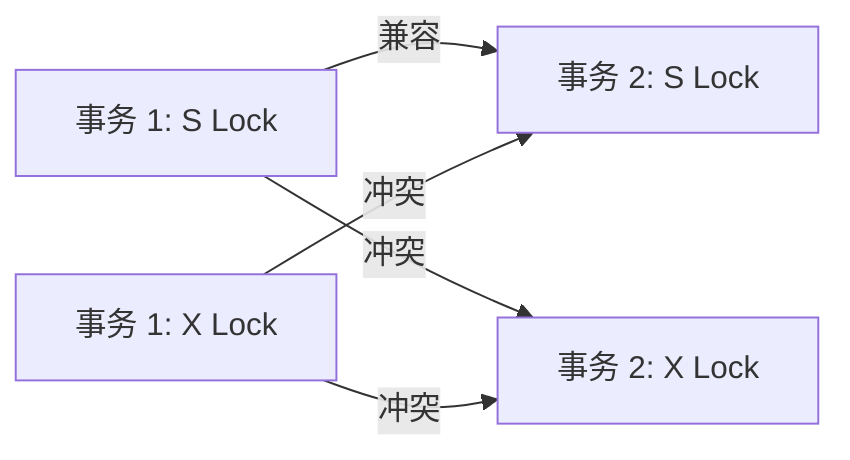
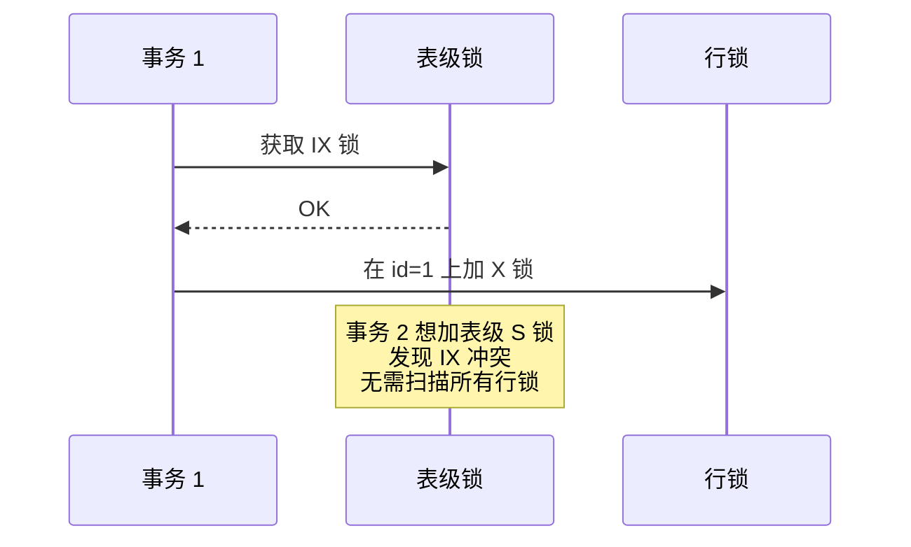
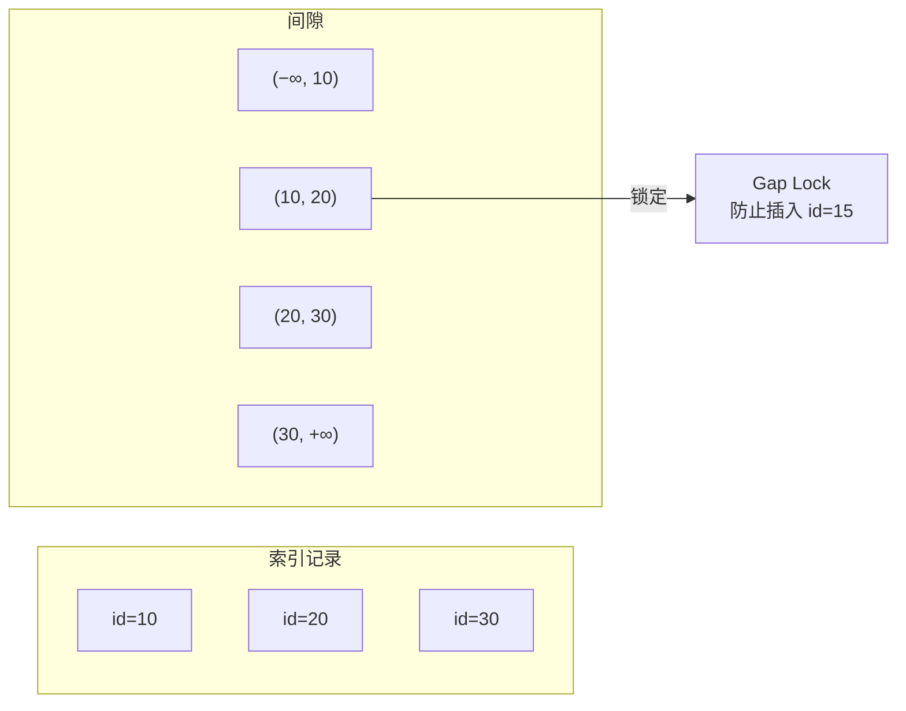
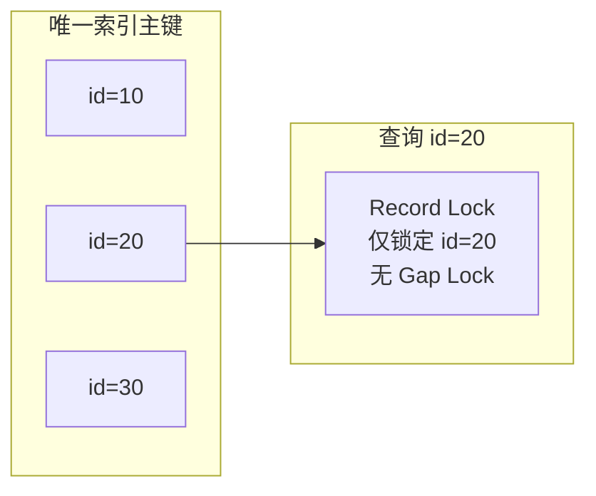
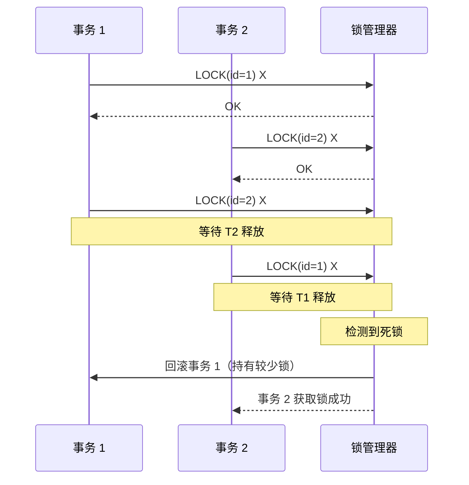
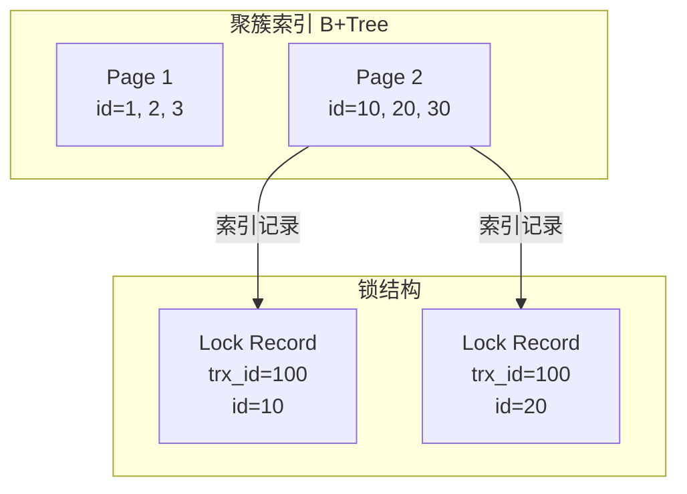

# InnoDB 锁机制

## 学习目标

- 理解 InnoDB 的行级锁类型与兼容性矩阵
- 掌握间隙锁（Gap Lock）与 Next-Key Lock 的作用范围
- 了解死锁检测与锁等待超时机制

## 核心概念

- **行锁（Record Lock）**：锁定单条索引记录
- **间隙锁（Gap Lock）**：锁定索引记录之间的间隙，防止幻读
- **Next-Key Lock**：行锁 + 间隙锁，RR 级别的默认锁
- **意向锁（Intention Lock）**：表级锁，标识事务意图在行上加锁
- **插入意向锁（Insert Intention Lock）**：INSERT 操作在插入位置加的锁

## 锁类型层次结构

InnoDB 支持多种锁类型，形成层次结构：



## 共享锁与排他锁

### 兼容性矩阵

| 锁类型 | 共享锁（S） | 排他锁（X） |
|-------|-----------|-----------|
| 共享锁（S） | 兼容 | 冲突 |
| 排他锁（X） | 冲突 | 冲突 |



### 获取方式

**共享锁（S Lock）**：

```sql
-- 显式加共享锁
SELECT * FROM users WHERE id = 1 FOR SHARE;

-- 隐式加共享锁（SERIALIZABLE 级别）
-- 所有 SELECT 自动转为 FOR SHARE
```

**排他锁（X Lock）**：

```sql
-- SELECT FOR UPDATE
SELECT * FROM users WHERE id = 1 FOR UPDATE;

-- UPDATE / DELETE
UPDATE users SET name = '张三' WHERE id = 1;
DELETE FROM users WHERE id = 1;

-- INSERT（插入意向锁）
INSERT INTO users VALUES (1, '张三');
```

## 意向锁（Intention Lock）

意向锁是表级锁，用于标识事务意图在行上加锁，避免全表扫描检查行锁：



**意向锁类型**：

| 锁类型 | 说明 |
|--------|------|
| IS（Intention Shared） | 意图在行上加 S 锁 |
| IX（Intention Exclusive） | 意图在行上加 X 锁 |
| AUTO-INC Lock | 自增主键计数器锁 |

**兼容性矩阵**：

| 锁类型 | IS | IX | S | X |
|--------|----|----|---|---|
| IS | 兼容 | 兼容 | 兼容 | 冲突 |
| IX | 兼容 | 兼容 | 冲突 | 冲突 |
| S | 兼容 | 冲突 | 兼容 | 冲突 |
| X | 冲突 | 冲突 | 冲突 | 冲突 |

## 间隙锁（Gap Lock）

间隙锁锁定索引记录之间的间隙，防止其他事务插入新记录：



**间隙锁特点**：

- 只在 RR 隔离级别生效（RC 级别无间隙锁）
- 锁定范围是开区间（例如 `(10, 20)`）
- 目的：防止幻读（防止其他事务在间隙内插入新记录）
- 间隙锁之间不冲突（都是防止插入，可以共存）

## Next-Key Lock

Next-Key Lock = Record Lock + Gap Lock，是 InnoDB RR 级别的默认锁：

```mermaid
graph LR
    subgraph "索引记录"
        R1[id=10]
        R2[id=20]
        R3[id=30]
    end

    subgraph "Next-Key Lock (id=20)"
        REC[Record Lock<br/>锁定 id=20]
        GAP[Gap Lock<br/>锁定 (10, 20)]
    end

    R2 --> REC
    G2["(10, 20)"] --> GAP
```

**Next-Key Lock 示例**：

```sql
-- RR 级别
SELECT * FROM users WHERE id = 20 FOR UPDATE;

-- 锁定范围：
-- 1. Record Lock: 锁定 id=20
-- 2. Gap Lock: 锁定 (10, 20)
-- 合计：Next-Key Lock，锁定 (10, 20]
```

### 唯一索引等值查询退化为 Record Lock

如果查询条件命中唯一索引，Next-Key Lock 退化为 Record Lock：



```sql
-- 唯一索引等值查询
SELECT * FROM users WHERE id = 20 FOR UPDATE;

-- 只锁定 id=20（Record Lock）
-- 不加 Gap Lock，因为唯一性保证不会插入 id=20
```

## 死锁检测

InnoDB 自动检测死锁，并回滚持有最少排他锁的事务：



**死锁检测参数**：

```sql
-- 启用死锁检测（默认）
SET GLOBAL innodb_deadlock_detect = ON;

-- 禁用死锁检测（高并发场景可能关闭）
SET GLOBAL innodb_deadlock_detect = OFF;
```

**查看死锁信息**：

```sql
-- 查看最近一次死锁
SHOW ENGINE INNODB STATUS\G

-- 输出中的 LATEST DETECTED DEADLOCK 部分
```

## 锁等待超时

事务等待锁超时后，会返回错误（默认 50 秒）：

```sql
-- 设置锁等待超时（秒）
SET innodb_lock_wait_timeout = 50;

-- 查看当前值
SHOW VARIABLES LIKE 'innodb_lock_wait_timeout';
```

**错误信息**：

```
ERROR 1205 (HY000): Lock wait timeout exceeded; try restarting transaction
```

## 行级锁实现原理

InnoDB 的行级锁通过索引实现：



**无索引时退化为表锁**：

```sql
-- 无索引字段
UPDATE users SET name = 'test' WHERE name = '张三';

-- 扫描所有行，对所有行加锁
-- 等效于表锁
```

## 要点总结

- InnoDB 使用行级锁（Record Lock）和间隙锁（Gap Lock），RR 级别默认使用 Next-Key Lock
- 意向锁（IS/IX）是表级锁，避免全表扫描检查行锁
- 间隙锁防止幻读，只在 RR 级别生效
- 唯一索引等值查询退化为 Record Lock，不加间隙锁
- InnoDB 自动检测死锁，回滚持有最少锁的事务
- 行级锁通过索引实现，无索引时退化为表锁

## 思考题

1. 为什么 InnoDB 选择"行级锁 + 间隙锁"而不是纯行级锁？间隙锁解决了什么问题？
2. Next-Key Lock 在 RR 级别防止幻读，为什么 RC 级别不需要 Next-Key Lock？
3. 为什么唯一索引等值查询的 Next-Key Lock 会退化为 Record Lock？
4. 如果禁用死锁检测（`innodb_deadlock_detect=OFF`），会发生什么？