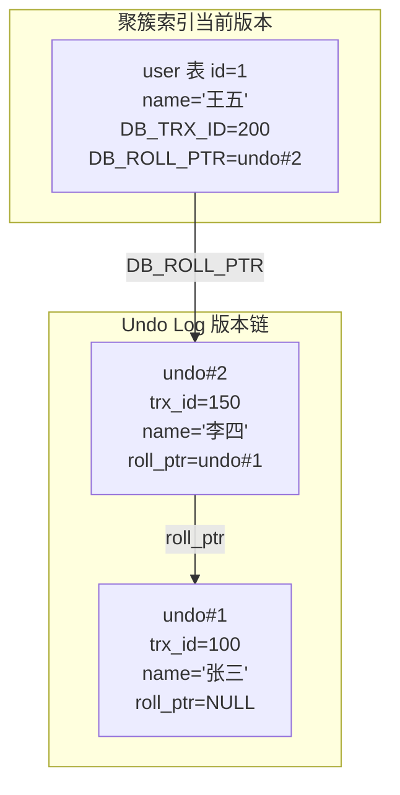
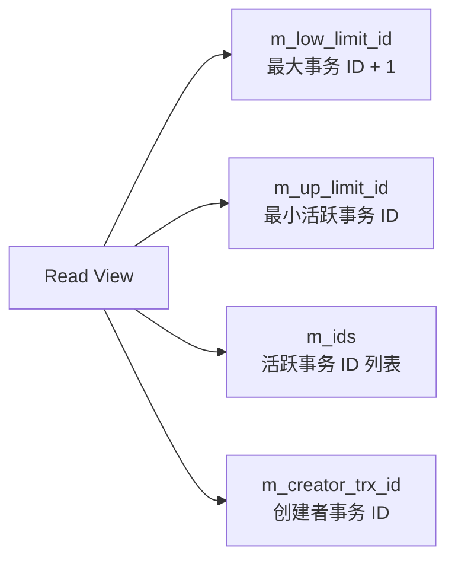
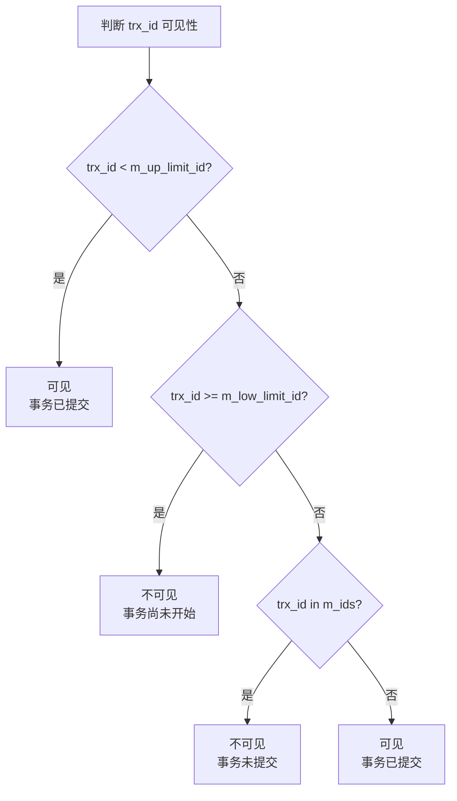
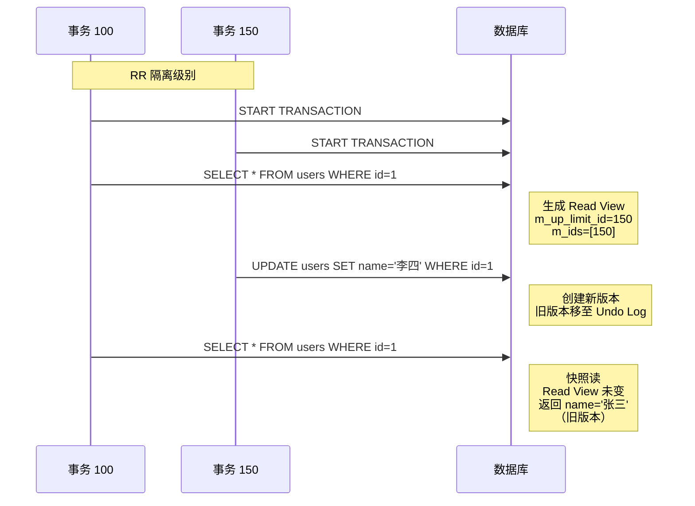
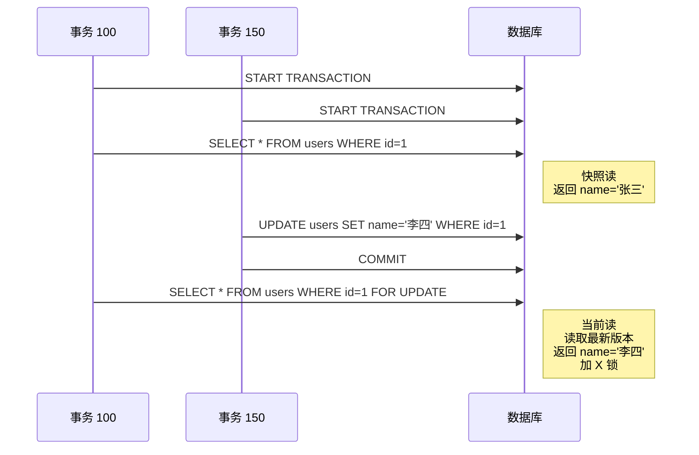
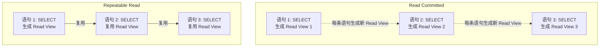
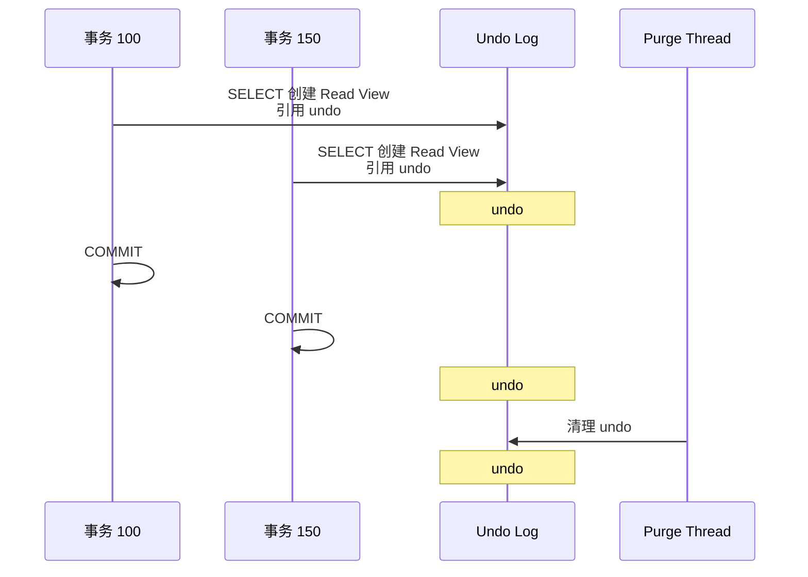
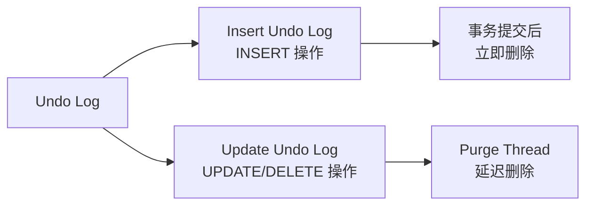

# InnoDB MVCC 实现

## 学习目标

- 理解 InnoDB 的 MVCC 实现机制（基于 Undo Log）
- 掌握 Read View 的构成与可见性判断规则
- 区分快照读与当前读的差异

## 核心概念

- **Undo Log**：回滚日志，存储行记录的旧版本
- **Read View**：事务快照，用于判断版本可见性
- **DB_TRX_ID**：聚簇索引行记录中的事务 ID 字段
- **DB_ROLL_PTR**：聚簇索引行记录中的回滚指针，指向 Undo Log
- **快照读**：普通 SELECT 语句，使用 Read View，不加锁
- **当前读**：SELECT FOR UPDATE / UPDATE / DELETE，读取最新版本，加锁

## Undo Log 版本链

InnoDB 的 MVCC 实现基于 Undo Log，与 PostgreSQL 的 xmin/xmax 方案完全不同。每次 UPDATE 不修改原记录，而是创建新版本，旧版本保留在 Undo Log 中。

**版本链形成过程**：

1. 事务 100 插入 `id=1, name='张三'` → 当前版本
2. 事务 150 更新 `name='李四'` → 新版本，旧版本移至 Undo Log（undo#1）
3. 事务 200 更新 `name='王五'` → 新版本，旧版本移至 Undo Log（undo#2）

## Read View 构成

事务执行快照读时，会生成一个 Read View，包含以下字段：

**字段含义**：

- `m_low_limit_id`：系统当前最大事务 ID + 1（后续新事务都大于此值，不可见）
- `m_up_limit_id`：当前活跃事务中最小的事务 ID（小于此值的事务已提交，可见）
- `m_ids`：当前活跃事务 ID 列表（在这些事务中，不可见）
- `m_creator_trx_id`：创建 Read View 的事务 ID

## 可见性判断规则

给定一个事务 ID（`trx_id`），判断其对当前 Read View 是否可见：

**判断逻辑**：

1. 如果 `trx_id < m_up_limit_id`：可见（事务在 Read View 创建前已提交）
2. 如果 `trx_id >= m_low_limit_id`：不可见（事务在 Read View 创建后才开始）
3. 如果 `trx_id` 在 `m_ids` 中：不可见（事务未提交）
4. 否则：可见（事务已提交）

## 快照读 vs 当前读

### 快照读（Snapshot Read）

普通 SELECT 语句使用快照读，读取 Read View 可见的版本：

### 当前读（Current Read）

SELECT FOR UPDATE / UPDATE / DELETE 使用当前读，读取最新版本并加锁：

## RC vs RR 的 Read View 差异

Read Committed 和 Repeatable Read 的核心差异在于 Read View 的生成时机：

**关键差异**：

| 隔离级别 | Read View 生成时机 | 效果 |
|---------|-------------------|------|
| Read Committed | 每条 SELECT 语句 | 可见其他事务已提交的更改 |
| Repeatable Read | 事务第一次 SELECT | 整个事务看到一致的快照 |

## Purge Thread 清理机制

Undo Log 不能无限增长，需要 Purge Thread 清理不再需要的旧版本：

**清理条件**：

- Undo Log 中的版本没有任何 Read View 引用
- Purge Thread 周期性扫描 Undo Log，清理不再需要的版本

## InnoDB MVCC 实现细节

### 隐藏列（Hidden Columns）

InnoDB 在聚簇索引行记录中添加三个隐藏列：

| 列名 | 大小 | 说明 |
|------|------|------|
| DB_ROW_ID | 6 字节 | 行 ID（无主键时使用） |
| DB_TRX_ID | 6 字节 | 最近修改事务 ID |
| DB_ROLL_PTR | 7 字节 | 回滚指针，指向 Undo Log |

### Undo Log 类型

- **Insert Undo Log**：INSERT 操作产生，事务提交后立即删除
- **Update Undo Log**：UPDATE/DELETE 操作产生，由 Purge Thread 延迟删除

## 要点总结

- InnoDB 的 MVCC 通过 Undo Log 实现版本链，与 PostgreSQL 的 xmin/xmax 方案完全不同
- Read View 包含 m_low_limit_id、m_up_limit_id、m_ids，用于判断版本可见性
- 快照读（普通 SELECT）使用 Read View，当前读（SELECT FOR UPDATE）读取最新版本
- RC 级别每条语句生成新 Read View，RR 级别整个事务复用 Read View
- Purge Thread 清理不再被 Read View 引用的 Undo Log

## 思考题

1. 为什么 InnoDB 选择 Undo Log 实现 MVCC，而不是 PostgreSQL 的 xmin/xmax 方案？
2. Read View 的可见性判断为什么需要三个字段（m_low_limit_id、m_up_limit_id、m_ids）？
3. 为什么 RC 级别不能防止幻读，而 RR 级别可以？这与 Read View 的生成时机有什么关系？
4. Purge Thread 清理 Undo Log 的时机是什么？如果清理不及时会发生什么？