# Executor 执行器

## 学习目标

- 理解 MySQL 执行器的迭代器模型架构与 PostgreSQL 火山模型的异同
- 掌握 MySQL 执行器的核心组件：Table Scan Iterator、Index Scan Iterator、Sort Iterator、Join Iterator、Aggregation Iterator
- 熟悉 `handler` 接口的调用方式与存储引擎交互细节
- 掌握 Using filesort、Using temporary、ICP、MRR 的原理与应用场景

## 核心概念

- **Iterator Model**：执行器采用迭代器模型，每个节点实现 `Read()` 接口返回一行
- **handler 接口**：Server 层与存储引擎的抽象接口，屏蔽不同存储引擎的差异
- **Using filesort**：MySQL 排序操作的实现，使用 sort_buffer 或临时文件
- **Using temporary**：使用临时表的情况（GROUP BY、DISTINCT、UNION、子查询）
- **ICP（Index Condition Pushdown）**：将 WHERE 条件中与索引相关的部分下推到存储引擎
- **MRR（Multi-Range Read）**：对二级索引范围扫描，先排序主键再回表，将随机 IO 转为顺序 IO

## 执行器组件架构

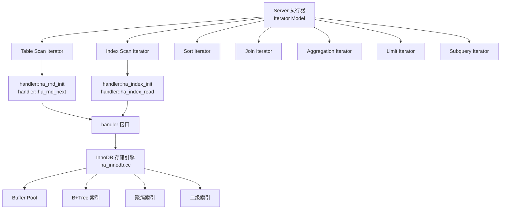

### handler 接口

`handler` 是 Server 层与存储引擎的抽象接口，所有存储引擎（InnoDB、MyISAM、Memory）都实现此接口。

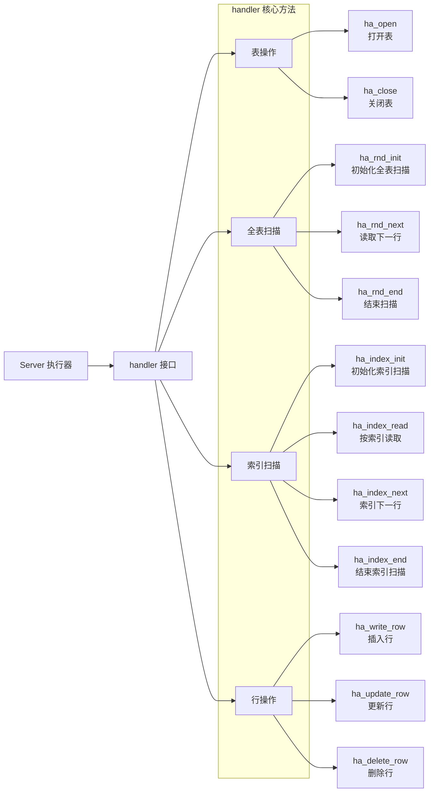

### handler 接口调用示例

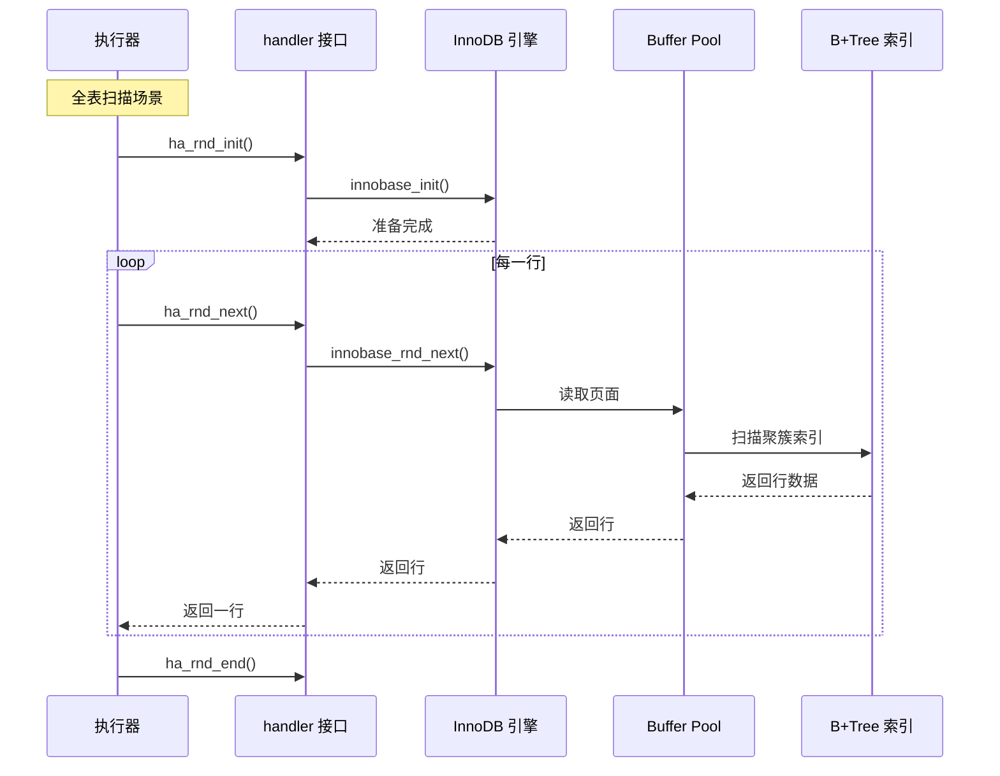

## Table Scan Iterator

全表扫描是最简单的执行方式，遍历聚簇索引的所有叶子节点。

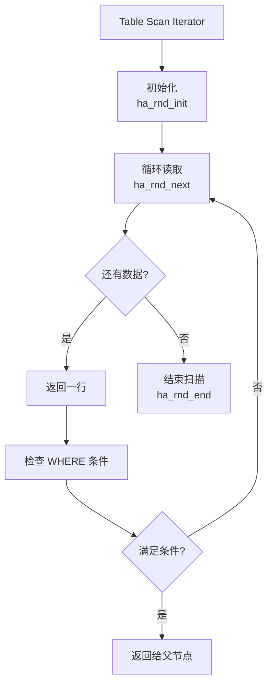

**全表扫描的代价**：

- IO 代价：读取聚簇索引的所有叶子页面（顺序 IO）
- CPU 代价：处理每一行数据（检查 WHERE 条件）
- 无回表代价：聚簇索引叶子节点包含完整行数据

## Index Scan Iterator

索引扫描分为两种：**覆盖索引扫描**和**非覆盖索引扫描（需要回表）**。

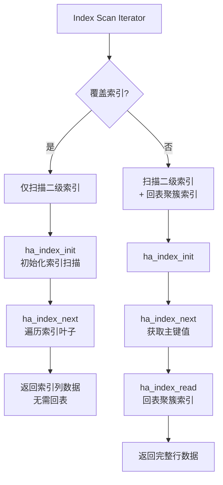

### 覆盖索引 vs 非覆盖索引的查询路径对比

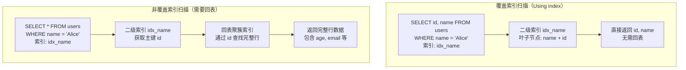

### 回表的代价

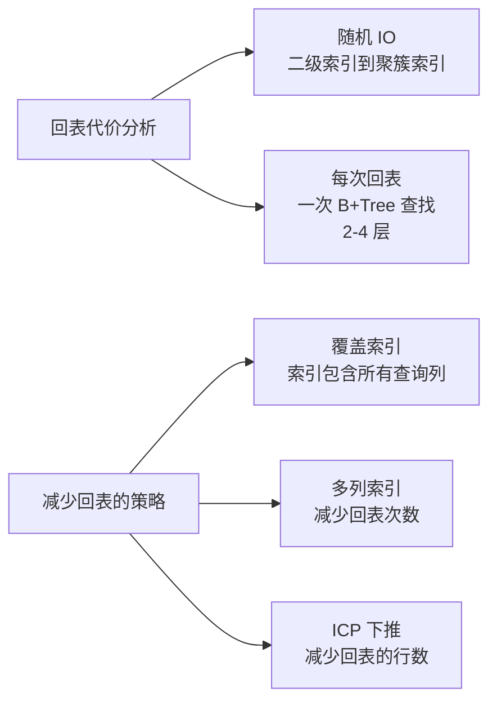

## Sort Iterator

MySQL 的排序操作使用 `sort_buffer`（内存缓冲区），当内存不足时使用临时文件。

### Using filesort 的两种排序策略

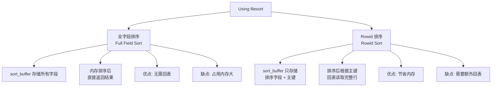

### 全字段排序流程

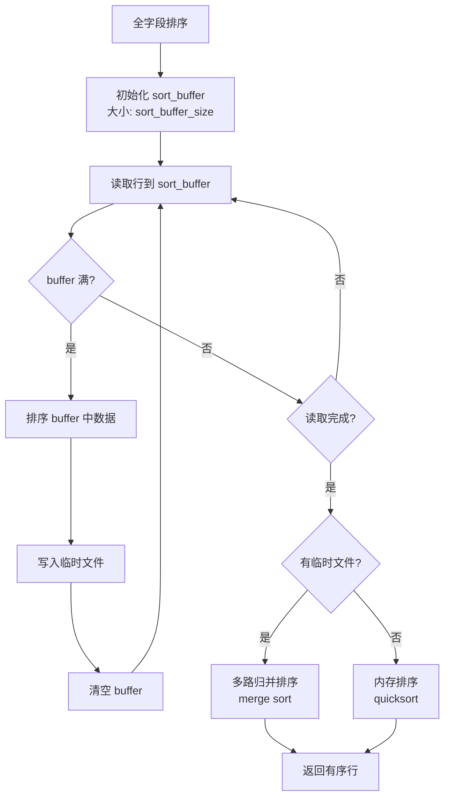

### Rowid 排序流程

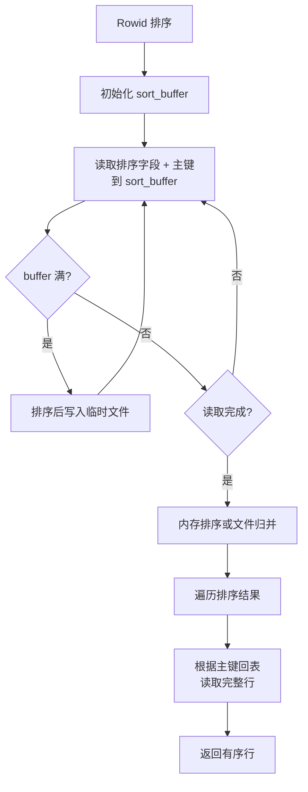

### 两种排序策略的选择

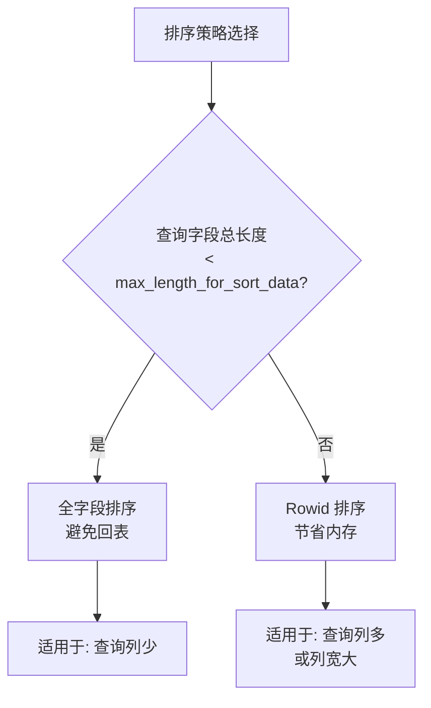

**关键参数**：

- `sort_buffer_size`：排序缓冲区大小（默认 256KB）
- `max_length_for_sort_data`：超过此值时使用 Rowid 排序（默认 1024 字节）

## Join Iterator

MySQL 的 Join 执行依赖 Join Buffer，主要实现 Block Nested Loop Join 和 Batched Key Access Join。

### Join 执行流程

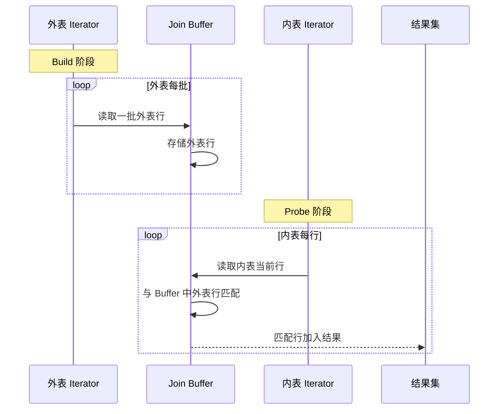

### Join Buffer 管理

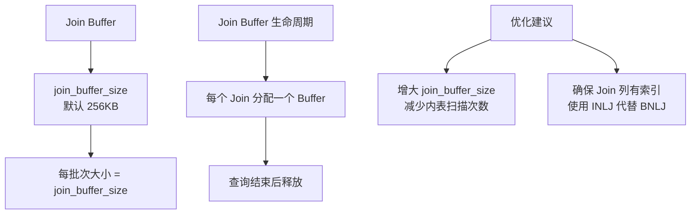

## Aggregation Iterator

聚合操作分为 `Stream Aggregation`（流式聚合）和 `Hash Aggregation`（哈希聚合）。

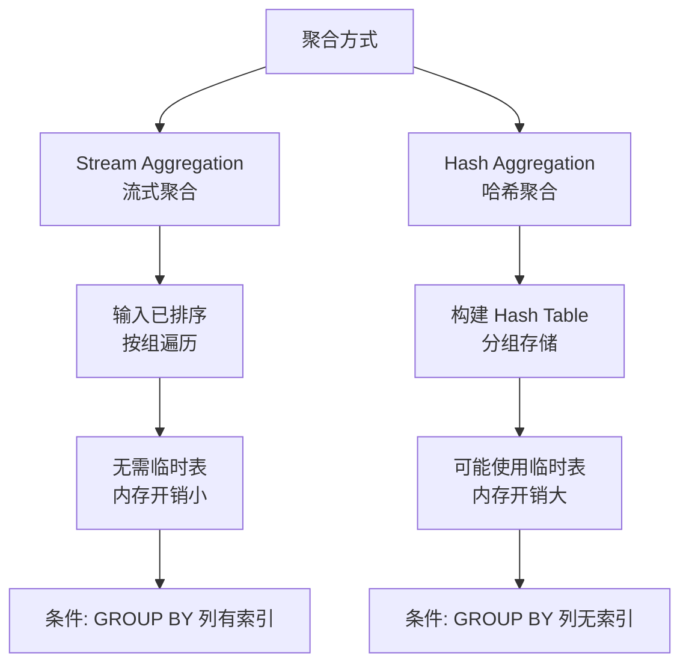

### Stream Aggregation 流程

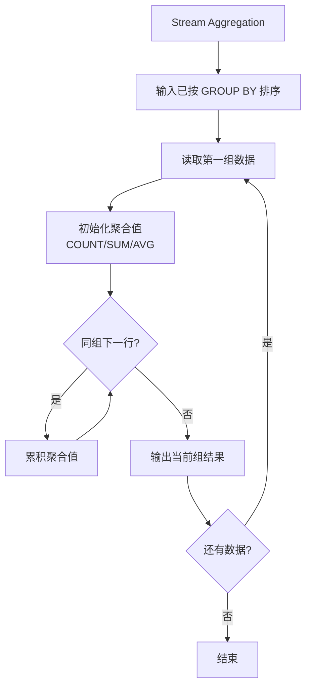

### Hash Aggregation 流程

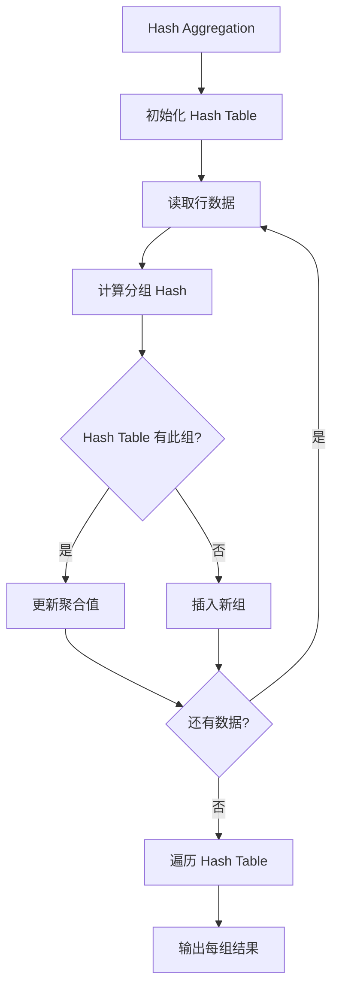

## Using temporary 临时表

MySQL 在以下情况使用临时表：

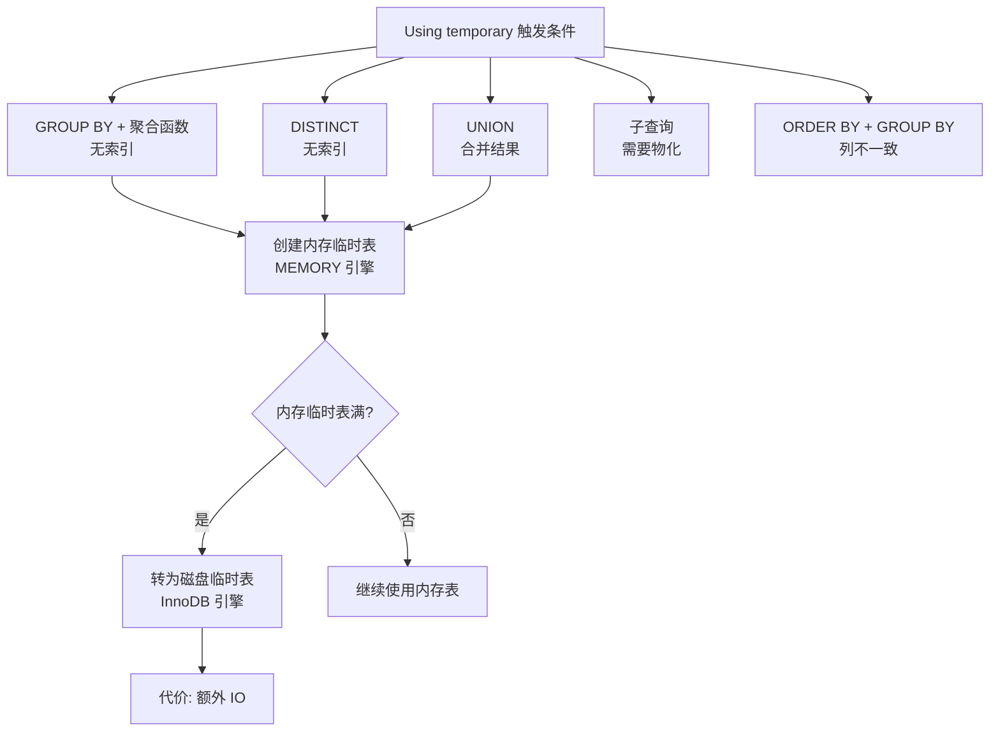

### 临时表的类型

| 类型 | 存储位置 | 适用场景 | 限制 |
|------|----------|----------|------|
| 内存临时表 | MEMORY 引擎 | 小数据量临时结果 | 不支持 BLOB/TEXT |
| 磁盘临时表 | InnoDB 引擎 | 大数据量或 BLOB/TEXT | 额外 IO 开销 |

## ICP（Index Condition Pushdown）

ICP 将 WHERE 条件中与索引相关的部分下推到存储引擎，减少回表次数。

### ICP 下推前后的执行流程对比

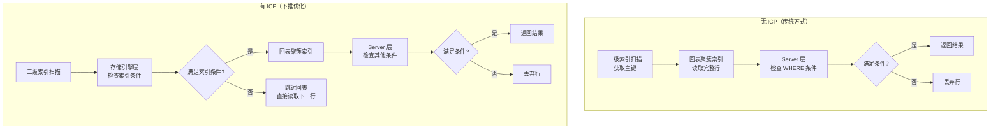

### ICP 适用场景

```sql
-- 场景：复合索引 (zipcode, lastname, firstname)
SELECT * FROM people
WHERE zipcode = '95054' AND lastname LIKE '%etrunia%' AND address LIKE '%Main Street%';

-- 无 ICP：zipcode 索引扫描后，每一行都回表，再在 Server 层过滤
-- 有 ICP：zipcode 索引扫描时，在存储引擎层过滤 lastname LIKE '%etrunia%'
--         只有满足条件的行才回表，减少回表次数
```

**ICP 的限制**：

1. 只适用于二级索引，不适用于聚簇索引（聚簇索引已包含完整行，无需下推）
2. 只适用于等值条件、范围条件、LIKE（非前缀匹配除外）
3. 子查询条件不下推
4. 存储函数不下推

## MRR（Multi-Range Read）

MRR 针对二级索引的范围扫描，通过先排序主键再回表，将随机 IO 转为顺序 IO。

### MRR 的回表优化流程


### MRR 执行流程

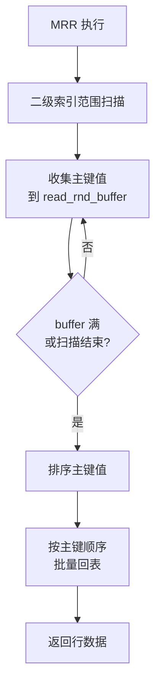

**MRR 的收益**：

1. 减少随机 IO：将离散的主键排序后顺序回表
2. 减少页面访问次数：同一页面只读取一次
3. 提升 Buffer Pool 命中率：顺序访问更易命中缓存

**MRR 的限制**：

1. 只适用于二级索引范围扫描
2. 需要额外的 `read_rnd_buffer` 内存
3. 不适用于主键范围扫描（主键范围扫描本身就是顺序的）

### MRR 配置参数

```sql
-- 启用 MRR（默认开启）
SET optimizer_switch = 'mrr=on';

-- 启用 MRR + 排序（默认关闭，需要显式开启）
SET optimizer_switch = 'mrr=on,mrr_cost_based=off';

-- 查看 MRR 使用情况
EXPLAIN SELECT * FROM orders WHERE user_id > 1000;
-- Extra: Using MRR
```

## Batched Key Access（BKA）

BKA 是 MRR 的扩展，用于 Join 场景，将 Join Buffer 中的主键排序后批量回表。

```mermaid
flowchart TD
    A[BKA Join] --> B[读取 Join Buffer<br/>中所有外表主键]
    B --> C[排序主键]
    C --> D[批量回表内表<br/>顺序 IO]
    D --> E[匹配 Join 条件]
    E --> F[返回结果行]
```

## 执行器与 PG 的对比

| 维度 | MySQL | PostgreSQL |
|------|-------|------------|
| 执行模型 | Iterator 模型（Read 接口） | Volcano 火山模型（ExecProcNode） |
| 存储引擎接口 | handler 接口（多引擎支持） | AM 接口（表访问方法） |
| 排序实现 | sort_buffer + filesort | tuplesort（内存/磁盘混合） |
| Join 实现 | BNLJ/INLJ/Hash Join | NLJ/Hash Join/Merge Join |
| 聚合实现 | Stream/Hash 聚合 | Hash/Sort 聚合 |
| 条件下推 | ICP（Index Condition Pushdown） | 无直接对应 |
| 顺序化回表 | MRR（Multi-Range Read） | 无直接对应 |
| 批量访问 | BKA（Batched Key Access） | 无直接对应 |

## 要点总结

- MySQL 执行器采用**迭代器模型**，通过 `handler` 接口与存储引擎交互
- **Using filesort** 有两种策略：**全字段排序**（省回表）和 **Rowid 排序**（省内存）
- **Using temporary** 在 GROUP BY、DISTINCT、UNION、子查询时使用，内存临时表满后转为磁盘临时表
- **ICP（Index Condition Pushdown）** 将 WHERE 条件中与索引相关的部分下推到存储引擎，减少回表次数
- **MRR（Multi-Range Read）** 对二级索引范围扫描，先排序主键再回表，将随机 IO 转为顺序 IO
- MySQL 执行器特有的优化（ICP、MRR、BKA）是 PG 没有的，这些优化针对二级索引回表场景

## 思考题

1. MySQL 的 `sort_buffer_size` 设置过大或过小各有什么问题？如何选择合适的大小？
2. ICP 和 MRR 都是为了减少回表开销，但它们的优化思路不同。分析两者的差异与适用场景。
3. MySQL 为什么选择在 Server 层实现 ICP，而不是在存储引擎层直接执行全部 WHERE 条件？
4. 对于大表排序（超过 `sort_buffer_size`），MySQL 使用临时文件排序。如何避免大表排序导致的性能问题？